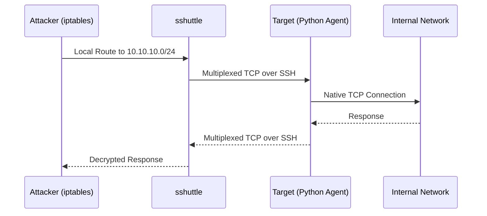

# 🚀 sshuttle: The Poor Man's VPN

`sshuttle` is an incredibly powerful tool that creates a transparent proxy server forwarding over an SSH connection. It is often referred to as the "Poor Man's VPN".

Unlike Proxychains, sshuttle does **not** rely on `LD_PRELOAD`. Instead, it uses your local `iptables` or `pf` firewall rules to intercept traffic meant for specific subnets and routes it through an SSH tunnel to the target machine.

## 1. How It Works

1. You run `sshuttle` on your local attack machine.
2. It SSHs into the compromised target.
3. It uploads a small, temporary Python script to the target and executes it.
4. It manipulates your local IP routing tables to intercept packets destined for the target subnets you specified.
5. These packets are sent over the SSH connection to the Python script on the target, which injects them into the internal network.



!!! IMPORTANT
    **Requirements:** The target machine **must** have a Python interpreter (`python2` or `python3`) installed, and you must have SSH access to the target.

---

## 2. Basic Usage

The most common way to run `sshuttle` is by providing the remote user/host and the internal subnets you want to route.

```bash
# Route the 10.10.10.0/24 and 10.10.20.0/24 subnets through the target
sshuttle -r user@10.10.5.5 10.10.10.0/24 10.10.20.0/24
```

**Example Output:**
```text
client: Connected.
client_loop: send disconnect: Broken pipe
client: fatal: server died with error code 255
# (If it fails, it usually prints the above)

# Successful connection:
client: Connected.
# (It will just hang here, meaning the tunnel is active. You can now use another terminal to access the internal subnets)
```

### Auto-Routing (The `0/0` Trick)

If you want to route *everything* (except your connection to the SSH server itself) through the target, you can use `0/0` (equivalent to `0.0.0.0/0`):

```bash
sshuttle -r root@10.10.5.5 0/0
```
*Note: This will route your general internet traffic through the target as well, which might be slow and poor OPSEC.*

---

## 3. Advanced Routing

### Excluding Subnets (`-x`)

If you want to route all traffic EXCEPT specific subnets (like your VPN connection to HackTheBox), use the `-x` flag:

```bash
# Route everything except HTB's 10.10.14.0/24 network
sshuttle -r user@10.10.5.5 0/0 -x 10.10.14.0/24
```

### DNS Resolution (`--dns`)

By default, DNS queries stay on your local machine. If you need to resolve internal DNS names (e.g., Active Directory computer names), you can force DNS queries through the tunnel:

```bash
sshuttle -r user@10.10.5.5 --dns 10.10.10.0/24
```
*This modifies your local `/etc/resolv.conf` temporarily.*

### Using a Specific Private Key

If you are using key-based authentication instead of a password:

```bash
sshuttle -r user@10.10.5.5 -e "ssh -i /path/to/id_rsa" 10.10.10.0/24
```

---

## 4. Limitations & Comparisons

### sshuttle vs Proxychains
*   **Pros:** Native routing. No `LD_PRELOAD`. Works with statically compiled binaries (like Go tools). Faster because it avoids TCP-over-TCP meltdown (it multiplexes payload data over SSH natively).
*   **Cons:** Requires Python on the target. Requires SSH access (which means you need credentials or a key, not just an uploaded binary like Chisel). 

### ICMP & UDP
Like Proxychains, `sshuttle` primarily handles TCP traffic. While there are experimental branches for UDP support, standard `sshuttle` drops ICMP (ping) and UDP. 

For full Layer 3 support (including ICMP/UDP), use **Ligolo-ng**.
