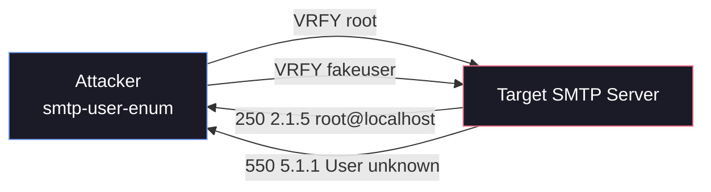

# 📧 SMTP Footprinting & Enumeration

SMTP (Simple Mail Transfer Protocol) footprinting is a critical reconnaissance phase when assessing an organization's external or internal infrastructure. By interacting with SMTP services (typically on ports 25, 465, or 587), attackers can identify the mail server software, its exact version, and often enumerate valid OS-level user accounts or email addresses.

Misconfigured SMTP servers can inadvertently leak sensitive information, which serves as a foundation for subsequent attacks like password spraying, brute-forcing, or targeted phishing.

---

## 1. Banner Grabbing & Manual Interaction

The first step in SMTP enumeration is identifying the underlying software (e.g., Postfix, Sendmail, Microsoft Exchange). This is easily accomplished through banner grabbing.

### Using Netcat / Ncat
You can connect directly to the SMTP port using `nc` (Netcat) or `ncat`.

```bash
nc -nv 10.10.10.25 25
```

**Expected Output:**
```text
(UNKNOWN) [10.10.10.25] 25 (smtp) open
220 mail.megacorp.local ESMTP Postfix (Ubuntu)
```
*The banner above immediately reveals that the target is running Postfix on an Ubuntu system.*

### Manual User Enumeration
Once connected, you can manually issue SMTP commands to verify if a user exists. The three primary commands used for this are `VRFY`, `EXPN`, and `RCPT TO`.

1. **VRFY (Verify):** Asks the server to confirm if a specific username is valid.
   ```text
   VRFY root
   250 2.1.5 root@localhost
   ```
2. **EXPN (Expand):** Attempts to reveal the members of a mailing list, but can also verify single users.
   ```text
   EXPN admin
   250 2.1.5 admin@localhost
   ```
3. **RCPT TO:** Used to test if the server accepts a specific recipient. This requires starting a mail transaction first.
   ```text
   HELO attacker.local
   MAIL FROM:<test@attacker.local>
   RCPT TO:<admin>
   250 2.1.5 Ok
   ```

*Note: Many modern, hardened servers disable `VRFY` and `EXPN`. `RCPT TO` is often the most reliable manual method.*

---

## 2. Automated Enumeration Tools

Instead of manually typing commands, penetration testers rely on automated tools to scan massive wordlists against the target.

### smtp-user-enum
`smtp-user-enum` is a classic command-line tool used by penetration testers and red teamers to identify valid OS-level user accounts on target mail servers. It operates by interacting with the SMTP service (typically port 25) and analyzing the server's responses to specific SMTP commands.

If a server is misconfigured or lacks proper hardening, an attacker can use this tool to rapidly build a list of valid usernames, which can then be used in subsequent password spraying or brute-force attacks.

#### How It Works

The tool connects to the SMTP port and systematically feeds a list of potential usernames to the server using one of three SMTP commands: `VRFY`, `EXPN`, or `RCPT TO`.

Depending on the server's configuration, it will return different status codes (e.g., `250 OK`, `252 Cannot VRFY user`, or `550 User unknown`). `smtp-user-enum` parses these responses to determine if the username exists.



#### Basic Usage & Syntax

The basic syntax requires specifying a method, a username (or list of usernames), and a target host.

```bash
smtp-user-enum [options] (-u username | -U file-of-usernames) (-t host | -T file-of-targets)
```

**Key Options**

| Flag | Description | Example |
| :--- | :--- | :--- |
| `-M` | Method to use (`VRFY`, `EXPN`, `RCPT`) | `-M RCPT` |
| `-u` | Single username to test | `-u admin` |
| `-U` | File containing a list of usernames | `-U users.txt` |
| `-t` | Single target IP or hostname | `-t 10.10.10.25` |
| `-T` | File containing a list of target IPs | `-T targets.txt` |
| `-m` | Maximum concurrent processes (Default: 5) | `-m 15` |
| `-D` | Append a domain to usernames (e.g., user@domain) | `-D example.com` |
| `-p` | Specify a custom port (Default: 25) | `-p 2525` |
| `-w` | Wait time in seconds per query | `-w 2` |

!!! tip
      Many modern SMTP servers employ rate limiting or tarpitting (deliberately slowing down responses) to thwart brute-force attacks. If you don't use the `-w` flag to introduce a wait time between queries, the server may drop your connection, permanently ban your IP address (via Fail2Ban), or simply drop your requests. A value like `-w 2` (wait 2 seconds) is highly recommended for stable and stealthy enumeration.

#### Practical Examples

**Example 1: Verifying a Single User (VRFY)**
If you just want to check if a default account like `root` or `admin` exists:

```bash
smtp-user-enum -M VRFY -u root -t 10.10.10.50
```

**Expected Output:**
```text
Starting smtp-user-enum v1.2 ( http://pentestmonkey.net/tools/smtp-user-enum )

 ----------------------------------------------------------
|                   Scan Information                       |
 ----------------------------------------------------------
...
10.10.10.50: root exists
...
```

**Example 2: Bulk Enumeration with a Wordlist (RCPT TO)**
This is the most common real-world scenario. You have a wordlist (`names.txt`) and want to test it against a target, bypassing disabled `VRFY` commands by using `RCPT TO`. We also increase the threads to `10` for speed.

```bash
smtp-user-enum -M RCPT -U names.txt -t 10.10.10.50 -m 10
```

**Example 3: Guessing Full Email Addresses**
Sometimes a server requires the full email address format rather than just the OS username. Use the `-D` flag to automatically append the domain.

```bash
smtp-user-enum -M VRFY -U names.txt -t 10.10.10.50 -D megacorp.local
```
*(This will test `admin@megacorp.local`, `root@megacorp.local`, etc.)*

### Nmap Scripting Engine (NSE)
Nmap provides excellent built-in scripts for both version detection and enumeration.

**Service & Version Detection:**
```bash
nmap -sV -p 25,465,587 10.10.10.25
```

**Checking Supported Commands:**
```bash
nmap --script smtp-commands -p 25 10.10.10.25
```
*This script reveals which commands (like `VRFY` or `EXPN`) are explicitly supported by the server.*

**Automated User Enumeration:**
```bash
nmap --script smtp-enum-users -p 25 10.10.10.25
```
*By default, this script uses `VRFY`, `EXPN`, and `RCPT` methods to find valid users.*

### Metasploit Framework
Metasploit includes a reliable auxiliary module for SMTP enumeration.

```bash
msfconsole
use auxiliary/scanner/smtp/smtp_enum
set RHOSTS 10.10.10.25
set USER_FILE /usr/share/wordlists/seclists/Usernames/Names/names.txt
run
```

---

## 3. Advanced Testing with Swaks

**Swaks** (Swiss Army Knife for SMTP) is an incredibly powerful, scriptable tool designed for deep SMTP transaction testing. It is far superior to standard `netcat` when dealing with modern mail servers that require authentication or TLS (STARTTLS).

**Basic Connection Test:**
```bash
swaks --to user@example.com --server 10.10.10.25
```

**Testing STARTTLS:**
If the server enforces encryption, standard plaintext tools might fail. Swaks handles this seamlessly:
```bash
swaks --to user@example.com --server 10.10.10.25 --tls
```

**Testing Authentication Capabilities:**
```bash
swaks --to user@example.com --server 10.10.10.25 --auth
```

Swaks allows you to script complex mail delivery scenarios and can be configured to stop the SMTP dialog at specific stages (e.g., terminating right after the `RCPT TO` command) to test for user existence without actually sending an email.

---

## 4. Limitations & Defensive Countermeasures

### Attacker Limitations
1. **Catch-All Configurations:** If a server is configured as a "catch-all" (accepting all incoming mail regardless of the user prefix), enumeration tools will report every user in the wordlist as valid.
2. **Rate Limiting / Fail2Ban:** Aggressive scanning can trigger intrusion prevention systems, resulting in an IP ban. Tools like `smtp-user-enum` allow for throttling (e.g., using the `-w` flag).
3. **NDR Bouncing:** Modern Exchange environments may return a generic `250 OK` for all `RCPT TO` requests during the initial transaction, only to drop or bounce the email later (Non-Delivery Report), defeating real-time enumeration.

### Defensive Mitigations

If you are defending a network, implement the following:

- **Disable VRFY and EXPN:** In Postfix, ensure `disable_vrfy_command = yes` is set in `main.cf`.
- **Implement Rate Limiting:** Prevent rapid, sequential connections from a single IP.
- **Tarpitting:** Introduce intentional delays for excessive requests or invalid recipients to ruin the feasibility of brute-force enumeration.
- **Require Authentication & Encryption:** Enforce STARTTLS/SMTPS and robust authentication mechanisms before revealing any directory information.
