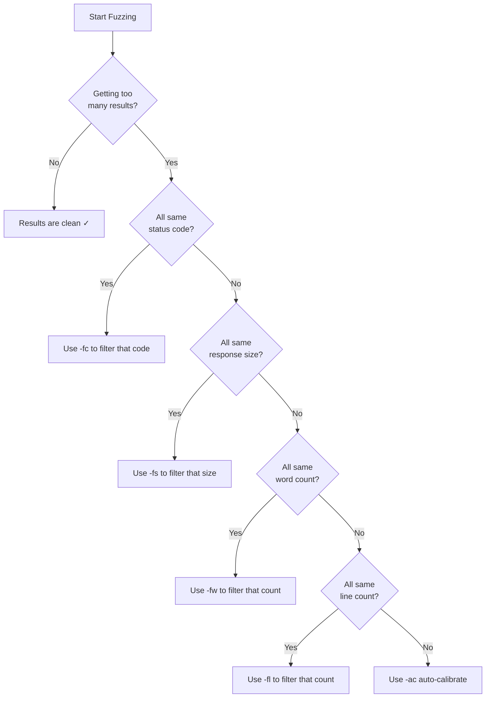

# Ffuf Cheatsheet

A consolidated quick reference for all ffuf commands and techniques covered in this series.

---

## Directory Fuzzing

```shell
# Basic directory discovery
ffuf -w /usr/share/seclists/Discovery/Web-Content/directory-list-2.3-small.txt:FUZZ \
     -u http://SERVER_IP:PORT/FUZZ

# With status code filter
ffuf -w /usr/share/seclists/Discovery/Web-Content/directory-list-2.3-small.txt:FUZZ \
     -u http://SERVER_IP:PORT/FUZZ -fc 404

# With response size filter (after checking baseline)
ffuf -w /usr/share/seclists/Discovery/Web-Content/directory-list-2.3-small.txt:FUZZ \
     -u http://SERVER_IP:PORT/FUZZ -fs 4242

# Auto-calibrate filtering
ffuf -w /usr/share/seclists/Discovery/Web-Content/directory-list-2.3-small.txt:FUZZ \
     -u http://SERVER_IP:PORT/FUZZ -ac

# Fast with increased threads
ffuf -w /usr/share/seclists/Discovery/Web-Content/directory-list-2.3-small.txt:FUZZ \
     -u http://SERVER_IP:PORT/FUZZ -fc 404 -t 100
```

---

## Extension Fuzzing

```shell
# Discover extensions on a known directory (recommended first step)
ffuf -w /usr/share/seclists/Discovery/Web-Content/web-extensions.txt:FUZZ \
     -u http://SERVER_IP:PORT/blog/indexFUZZ

# Append extensions to wordlist entries
ffuf -w /usr/share/seclists/Discovery/Web-Content/directory-list-2.3-small.txt:FUZZ \
     -u http://SERVER_IP:PORT/blog/FUZZ -e .php,.html,.txt

# Multi-keyword: filename × extension
ffuf -w /usr/share/seclists/Discovery/Web-Content/common.txt:FILE \
     -w /usr/share/seclists/Discovery/Web-Content/web-extensions.txt:EXT \
     -u http://SERVER_IP:PORT/FILE.EXT -fc 404

# Backup file extensions
ffuf -w /tmp/backup-ext.txt:FUZZ \
     -u http://SERVER_IP:PORT/admin/config.phpFUZZ
```

---

## Page Fuzzing

```shell
# Find pages within a directory (known extension)
ffuf -w /usr/share/seclists/Discovery/Web-Content/directory-list-2.3-small.txt:FUZZ \
     -u http://SERVER_IP:PORT/blog/FUZZ.php -fc 404

# Quick check with common filenames
ffuf -w /usr/share/seclists/Discovery/Web-Content/common.txt:FUZZ \
     -u http://SERVER_IP:PORT/admin/FUZZ.php -fc 404

# Multi-extension page fuzzing
ffuf -w /usr/share/seclists/Discovery/Web-Content/directory-list-2.3-small.txt:FUZZ \
     -u http://SERVER_IP:PORT/FUZZ -e .php,.html,.txt -fc 404

# Quick-hits (common sensitive files)
ffuf -w /usr/share/seclists/Discovery/Web-Content/quickhits.txt:FUZZ \
     -u http://SERVER_IP:PORT/FUZZ -fc 404
```

---

## Recursive Fuzzing

```shell
# Recursive with depth limit (recommended)
ffuf -w /usr/share/seclists/Discovery/Web-Content/common.txt:FUZZ \
     -u http://SERVER_IP:PORT/FUZZ -recursion -recursion-depth 2 -e .php -fc 404

# Recursive with auto-calibrate
ffuf -w /usr/share/seclists/Discovery/Web-Content/common.txt:FUZZ \
     -u http://SERVER_IP:PORT/FUZZ -recursion -recursion-depth 2 -e .php -ac -t 100

# Recursive with output
ffuf -w /usr/share/seclists/Discovery/Web-Content/common.txt:FUZZ \
     -u http://SERVER_IP:PORT/FUZZ -recursion -recursion-depth 2 \
     -e .php -fc 404 -o recursive.json -of json -v
```

---

## Subdomain Fuzzing (DNS)

```shell
# Basic subdomain enumeration
ffuf -w /usr/share/seclists/Discovery/DNS/subdomains-top1million-5000.txt:FUZZ \
     -u http://FUZZ.target.com

# With size filter (wildcard DNS)
ffuf -w /usr/share/seclists/Discovery/DNS/subdomains-top1million-5000.txt:FUZZ \
     -u http://FUZZ.target.com -fs 986

# Larger wordlist for thorough coverage
ffuf -w /usr/share/seclists/Discovery/DNS/subdomains-top1million-20000.txt:FUZZ \
     -u http://FUZZ.target.com -fs 986 -t 100
```

---

## VHost Fuzzing

```shell
# Basic vhost discovery
ffuf -w /usr/share/seclists/Discovery/DNS/subdomains-top1million-5000.txt:FUZZ \
     -u http://target.com -H "Host: FUZZ.target.com" -fs 986

# Against IP directly
ffuf -w /usr/share/seclists/Discovery/DNS/subdomains-top1million-5000.txt:FUZZ \
     -u http://10.10.10.5 -H "Host: FUZZ.target.com" -fs 986

# With word count filter (more stable than size)
ffuf -w /usr/share/seclists/Discovery/DNS/subdomains-top1million-5000.txt:FUZZ \
     -u http://10.10.10.5 -H "Host: FUZZ.target.com" -fw 423

# HTTPS with vhost fuzzing
ffuf -w /usr/share/seclists/Discovery/DNS/subdomains-top1million-5000.txt:FUZZ \
     -u https://target.com -H "Host: FUZZ.target.com" -fs 986
```

---

## Parameter Fuzzing — GET

```shell
# Discover hidden GET parameters
ffuf -w /usr/share/seclists/Discovery/Web-Content/burp-parameter-names.txt:FUZZ \
     -u http://SERVER_IP:PORT/admin/admin.php?FUZZ=key -fs 2453

# Filter empty responses
ffuf -w /usr/share/seclists/Discovery/Web-Content/burp-parameter-names.txt:FUZZ \
     -u http://SERVER_IP:PORT/page.php?FUZZ=value -fs 0

# Find additional params (one already known)
ffuf -w /usr/share/seclists/Discovery/Web-Content/burp-parameter-names.txt:FUZZ \
     -u "http://SERVER_IP:PORT/page.php?id=1&FUZZ=test" -fs 3841
```

---

## Parameter Fuzzing — POST

```shell
# Form-encoded POST parameter discovery
ffuf -w /usr/share/seclists/Discovery/Web-Content/burp-parameter-names.txt:FUZZ \
     -u http://SERVER_IP:PORT/admin/admin.php -X POST \
     -d "FUZZ=key" -H "Content-Type: application/x-www-form-urlencoded" -fs 0

# JSON POST parameter discovery
ffuf -w /usr/share/seclists/Discovery/Web-Content/burp-parameter-names.txt:FUZZ \
     -u http://SERVER_IP:PORT/api/endpoint -X POST \
     -d '{"FUZZ":"value"}' -H "Content-Type: application/json" -fs 0

# With authentication
ffuf -w /usr/share/seclists/Discovery/Web-Content/burp-parameter-names.txt:FUZZ \
     -u http://SERVER_IP:PORT/admin/admin.php -X POST \
     -d "FUZZ=key" -H "Content-Type: application/x-www-form-urlencoded" \
     -H "Cookie: session=abc123" -fs 0

# PUT method
ffuf -w /usr/share/seclists/Discovery/Web-Content/burp-parameter-names.txt:FUZZ \
     -u http://SERVER_IP:PORT/api/resource/1 -X PUT \
     -d '{"FUZZ":"value"}' -H "Content-Type: application/json" -fs 0
```

---

## Value Fuzzing

```shell
# Numeric ID enumeration (IDOR)
seq 1 1000 > /tmp/ids.txt
ffuf -w /tmp/ids.txt:FUZZ \
     -u "http://SERVER_IP:PORT/api/user?id=FUZZ" -fs 0

# POST value fuzzing
ffuf -w /tmp/ids.txt:FUZZ \
     -u http://SERVER_IP:PORT/admin/admin.php -X POST \
     -d "id=FUZZ" -H "Content-Type: application/x-www-form-urlencoded" -fs 768

# LFI payload fuzzing
ffuf -w /usr/share/seclists/Fuzzing/LFI/LFI-Jhaddix.txt:FUZZ \
     -u "http://SERVER_IP:PORT/page.php?file=FUZZ" -fs 2453

# SQLi detection (match errors)
ffuf -w /usr/share/seclists/Fuzzing/SQLi/Generic-SQLi.txt:FUZZ \
     -u "http://SERVER_IP:PORT/search?q=FUZZ" -mc 500

# Login brute-force (single user)
ffuf -w /usr/share/seclists/Passwords/Common-Credentials/10k-most-common.txt:FUZZ \
     -u http://SERVER_IP:PORT/login.php -X POST \
     -d "user=admin&pass=FUZZ" -H "Content-Type: application/x-www-form-urlencoded" -fc 200

# Multi-position (user × password)
ffuf -w /usr/share/seclists/Usernames/top-usernames-shortlist.txt:USER \
     -w /usr/share/seclists/Passwords/Common-Credentials/10k-most-common.txt:PASS \
     -u http://SERVER_IP:PORT/login.php -X POST \
     -d "username=USER&password=PASS" \
     -H "Content-Type: application/x-www-form-urlencoded" -fc 200

# Role/privilege value fuzzing
ffuf -w /tmp/roles.txt:FUZZ \
     -u http://SERVER_IP:PORT/api/user/1 -X PUT \
     -d '{"role":"FUZZ"}' -H "Content-Type: application/json" -fs 156
```

---

## Flag Reference

### Output Control

| Flag | Purpose | Example |
|---|---|---|
| `-v` | Verbose (show URL + redirect) | `-v` |
| `-o` | Output file | `-o results.json` |
| `-of` | Output format | `-of json` / `csv` / `md` / `html` |
| `-ic` | Ignore wordlist comments | `-ic` |

### Request Configuration

| Flag | Purpose | Example |
|---|---|---|
| `-w` | Wordlist (`:KEYWORD`) | `-w list.txt:FUZZ` |
| `-u` | Target URL | `-u http://target/FUZZ` |
| `-X` | HTTP method | `-X POST` |
| `-d` | POST body data | `-d "key=FUZZ"` |
| `-H` | Custom header | `-H "Host: FUZZ.target.com"` |
| `-e` | Extensions to append | `-e .php,.html` |
| `-recursion` | Recursive mode | `-recursion` |
| `-recursion-depth` | Max depth | `-recursion-depth 2` |
| `-timeout` | HTTP timeout (seconds) | `-timeout 10` |

### Performance

| Flag | Purpose | Example |
|---|---|---|
| `-t` | Threads (default 40) | `-t 100` |
| `-rate` | Max requests/sec | `-rate 500` |

### Filtering (Remove Results)

| Flag | Purpose | Example |
|---|---|---|
| `-fc` | Filter by status code | `-fc 404,403` |
| `-fs` | Filter by response size | `-fs 4242` |
| `-fw` | Filter by word count | `-fw 12` |
| `-fl` | Filter by line count | `-fl 10` |
| `-ac` | Auto-calibrate filtering | `-ac` |

### Matching (Show Only)

| Flag | Purpose | Example |
|---|---|---|
| `-mc` | Match by status code | `-mc 200,301` |
| `-ms` | Match by response size | `-ms 1234` |
| `-mw` | Match by word count | `-mw 50` |
| `-ml` | Match by line count | `-ml 20` |

---

## Common Wordlist Paths

| Wordlist | Path | Entries |
|---|---|---|
| Directories (small) | `/usr/share/seclists/Discovery/Web-Content/directory-list-2.3-small.txt` | ~87k |
| Directories (medium) | `/usr/share/seclists/Discovery/Web-Content/directory-list-2.3-medium.txt` | ~220k |
| Common filenames | `/usr/share/seclists/Discovery/Web-Content/common.txt` | ~4.7k |
| Quick-hits | `/usr/share/seclists/Discovery/Web-Content/quickhits.txt` | ~2.5k |
| Web extensions | `/usr/share/seclists/Discovery/Web-Content/web-extensions.txt` | ~40 |
| Raft dirs | `/usr/share/seclists/Discovery/Web-Content/raft-medium-directories.txt` | ~30k |
| Raft files | `/usr/share/seclists/Discovery/Web-Content/raft-medium-files.txt` | ~17k |
| Subdomains (5k) | `/usr/share/seclists/Discovery/DNS/subdomains-top1million-5000.txt` | ~5k |
| Subdomains (20k) | `/usr/share/seclists/Discovery/DNS/subdomains-top1million-20000.txt` | ~20k |
| Parameter names | `/usr/share/seclists/Discovery/Web-Content/burp-parameter-names.txt` | ~6.5k |
| LFI payloads | `/usr/share/seclists/Fuzzing/LFI/LFI-Jhaddix.txt` | ~929 |
| SQLi payloads | `/usr/share/seclists/Fuzzing/SQLi/Generic-SQLi.txt` | ~267 |
| Common passwords | `/usr/share/seclists/Passwords/Common-Credentials/10k-most-common.txt` | ~10k |
| Usernames | `/usr/share/seclists/Usernames/top-usernames-shortlist.txt` | ~17 |

---

## Filter Strategy Decision Tree



### Quick Decision Guide

| Symptom | Solution |
|---|---|
| Everything returns 200 (custom 404 page) | Check size → `-fs <size>` |
| Wildcard DNS (all subdomains resolve) | Check default response size → `-fs <size>` |
| Want ONLY 200s | `-mc 200` |
| Want to exclude 403s | `-fc 403` |
| Size varies slightly between requests | Use `-fw` (word count is more stable) |
| Not sure what to filter | Use `-ac` (auto-calibrate) |
| Looking for errors (SQLi) | `-mc 500` |
| Looking for redirects (auth bypass) | `-mc 302` |

---

## Curl Equivalents Quick Reference

| Ffuf Command | Curl Equivalent |
|---|---|
| `-u http://target/path` | `curl http://target/path` |
| `-X POST` | `curl -X POST` |
| `-d "key=value"` | `curl -d "key=value"` |
| `-H "Header: value"` | `curl -H "Header: value"` |
| `-H "Content-Type: application/json" -d '{}'` | `curl -H "Content-Type: application/json" -d '{}'` |
| `-H "Cookie: session=abc"` | `curl -H "Cookie: session=abc"` or `curl -b "session=abc"` |

---

## Methodology Workflow (Full Sequence)

```shell
# 1. Directory Fuzzing
ffuf -w /usr/share/seclists/Discovery/Web-Content/directory-list-2.3-small.txt:FUZZ \
     -u http://SERVER_IP:PORT/FUZZ -fc 404 -t 100

# 2. Extension Fuzzing (on discovered directories)
ffuf -w /usr/share/seclists/Discovery/Web-Content/web-extensions.txt:FUZZ \
     -u http://SERVER_IP:PORT/blog/indexFUZZ

# 3. Page Fuzzing (with confirmed extension)
ffuf -w /usr/share/seclists/Discovery/Web-Content/directory-list-2.3-small.txt:FUZZ \
     -u http://SERVER_IP:PORT/blog/FUZZ.php -fc 404

# 4. Recursive Fuzzing
ffuf -w /usr/share/seclists/Discovery/Web-Content/common.txt:FUZZ \
     -u http://SERVER_IP:PORT/FUZZ -recursion -recursion-depth 2 -e .php -fc 404 -t 100

# 5. Subdomain Fuzzing
ffuf -w /usr/share/seclists/Discovery/DNS/subdomains-top1million-5000.txt:FUZZ \
     -u http://FUZZ.target.com -fs 986

# 6. VHost Fuzzing
ffuf -w /usr/share/seclists/Discovery/DNS/subdomains-top1million-5000.txt:FUZZ \
     -u http://target.com -H "Host: FUZZ.target.com" -fs 986

# 7. GET Parameter Fuzzing
ffuf -w /usr/share/seclists/Discovery/Web-Content/burp-parameter-names.txt:FUZZ \
     -u http://SERVER_IP:PORT/admin/admin.php?FUZZ=key -fs 2453

# 8. POST Parameter Fuzzing
ffuf -w /usr/share/seclists/Discovery/Web-Content/burp-parameter-names.txt:FUZZ \
     -u http://SERVER_IP:PORT/admin/admin.php -X POST \
     -d "FUZZ=key" -H "Content-Type: application/x-www-form-urlencoded" -fs 0

# 9. Value Fuzzing
ffuf -w /tmp/ids.txt:FUZZ \
     -u http://SERVER_IP:PORT/admin/admin.php -X POST \
     -d "id=FUZZ" -H "Content-Type: application/x-www-form-urlencoded" -fs 768
```

---

## Pro Tips

!!! tip "Exam Speed Run"
    1. Start recursive (`common.txt`, depth 2, `-e .php`) while you enumerate manually
    2. Check `/etc/hosts` entries for the box — vhosts are common exam targets
    3. Always note response sizes when browsing — makes filtering instant
    4. Save everything to JSON (`-o`) — you can grep it later without re-running

!!! tip "Output Parsing"
    ```shell
    # Extract URLs from JSON output
    cat results.json | jq -r '.results[].url'

    # Extract just the FUZZ values
    cat results.json | jq -r '.results[].input.FUZZ'

    # Sort by response size (find outliers)
    cat results.json | jq -r '.results[] | "\(.length) \(.url)"' | sort -n
    ```
