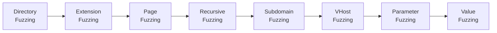

# Attacking Web Applications with Ffuf

## What Is Ffuf?

**Ffuf** (Fuzz Faster U Fool) is a fast, flexible web fuzzer written in Go. It accepts one or more wordlists and injects each entry at positions you mark with the **`FUZZ`** keyword — in the URL path, query string, headers, POST body, or anywhere else in the HTTP request. Its speed (multithreaded, compiled binary) and filtering power make it the go-to tool for OSCP/CPTS-level web enumeration.

Unlike tools that are locked into a single fuzzing mode (e.g., directory brute-forcing only), ffuf is a generic HTTP fuzzer. You define *where* the payload goes and *how* to identify hits. That flexibility is what makes it a core exam tool.

---

## Installation

```shell
# Kali / Parrot (pre-installed)
which ffuf

# Manual install (latest)
go install github.com/ffuf/ffuf/v2@latest

# Verify
ffuf -V
```

!!! tip "Pre-installed on exam VMs"
    Both OSCP (Kali) and CPTS (PwnBox) ship with ffuf already in `$PATH`. You shouldn't need to install it during an exam — but verify the version if a flag you need isn't available.

---

## Core Syntax

Every ffuf command follows the same pattern:

```shell
ffuf -w <wordlist>:FUZZ -u http://target/FUZZ
```

The **`FUZZ`** keyword is a placeholder that ffuf replaces with each line from the wordlist. You can place it anywhere in the request:

| Position | Example |
|---|---|
| URL path | `-u http://10.10.10.5/FUZZ` |
| File extension | `-u http://10.10.10.5/indexFUZZ` |
| Subdomain | `-u http://FUZZ.target.com` |
| Host header | `-H "Host: FUZZ.target.com"` |
| GET parameter name | `-u http://10.10.10.5/page?FUZZ=value` |
| POST body | `-d "FUZZ=value"` |
| Parameter value | `-u http://10.10.10.5/page?id=FUZZ` |

You can also use **multiple keywords** (e.g., `W1`, `W2`) for multi-position fuzzing:

```shell
ffuf -w users.txt:W1 -w passwords.txt:W2 -u http://10.10.10.5/login -d "user=W1&pass=W2"
```

---

## Common Flags Reference

| Flag | Purpose | Example |
|---|---|---|
| `-w` | Wordlist (`:KEYWORD` to name it) | `-w list.txt:FUZZ` |
| `-u` | Target URL | `-u http://10.10.10.5/FUZZ` |
| `-t` | Threads (default 40) | `-t 100` |
| `-rate` | Max requests/second | `-rate 500` |
| `-fc` | Filter by HTTP status code | `-fc 404,403` |
| `-fs` | Filter by response size (bytes) | `-fs 4242` |
| `-fw` | Filter by word count | `-fw 12` |
| `-fl` | Filter by line count | `-fl 10` |
| `-mc` | Match by HTTP status code | `-mc 200,301` |
| `-ms` | Match by response size | `-ms 1234` |
| `-mw` | Match by word count | `-mw 50` |
| `-ml` | Match by line count | `-ml 20` |
| `-e` | Extensions to append | `-e .php,.html,.txt` |
| `-recursion` | Enable recursive fuzzing | `-recursion` |
| `-recursion-depth` | Max recursion depth | `-recursion-depth 2` |
| `-H` | Custom header | `-H "Host: FUZZ.target.com"` |
| `-X` | HTTP method | `-X POST` |
| `-d` | POST data body | `-d "key=FUZZ"` |
| `-v` | Verbose (show full URL + redirect) | `-v` |
| `-o` | Output file | `-o results.json` |
| `-of` | Output format (json, csv, md, html) | `-of json` |
| `-ic` | Ignore wordlist comments | `-ic` |
| `-timeout` | HTTP timeout in seconds | `-timeout 10` |
| `-ac` | Auto-calibrate filtering | `-ac` |

---

## Methodology

The fuzzing workflow follows a logical escalation from broad discovery to targeted exploitation:



Each phase builds on the previous:

1. **Directory Fuzzing** — Find top-level directories on the target
2. **Extension Fuzzing** — Determine what tech stack / file types the server uses
3. **Page Fuzzing** — Combine directories + extensions to find actual pages
4. **Recursive Fuzzing** — Automatically spider nested directories
5. **Subdomain Fuzzing** — Discover DNS-resolvable subdomains
6. **VHost Fuzzing** — Find virtual hosts that don't have DNS entries
7. **Parameter Fuzzing** — Discover hidden GET/POST parameters on known pages
8. **Value Fuzzing** — Brute-force parameter values for exploitation

---

## Series Navigation

| # | Page | What You'll Learn |
|---|---|---|
| 1 | [Directory Fuzzing](directory-fuzzing.md) | Finding top-level directories, filtering false positives |
| 2 | [Extension Fuzzing](extension-fuzzing.md) | Identifying the web technology stack |
| 3 | [Page Fuzzing](page-fuzzing.md) | Discovering actual files within directories |
| 4 | [Recursive Fuzzing](recursive-fuzzing.md) | Automated deep-dive into nested paths |
| 5 | [Subdomain Fuzzing](subdomain-fuzzing.md) | DNS-based subdomain enumeration |
| 6 | [VHost Fuzzing](vhost-fuzzing.md) | Virtual host discovery via Host header |
| 7 | [Parameter Fuzzing — GET](parameter-fuzzing-get.md) | Finding hidden query parameters |
| 8 | [Parameter Fuzzing — POST](parameter-fuzzing-post.md) | POST parameter discovery + curl equivalents |
| 9 | [Value Fuzzing](value-fuzzing.md) | Brute-forcing parameter values |
| 10 | [Cheatsheet](cheatsheet.md) | Consolidated quick reference |

---

## References

- [Ffuf GitHub Repository](https://github.com/ffuf/ffuf)
- [SecLists — Discovery Wordlists](https://github.com/danielmiessler/SecLists)
- [Ffuf Documentation Wiki](https://github.com/ffuf/ffuf/wiki)
