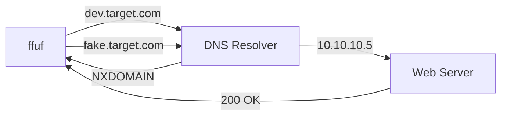

# Subdomain Fuzzing (DNS)

## Why Subdomain Fuzzing?

Organizations often expose more attack surface through subdomains than through directory paths. A company might have `mail.target.com`, `dev.target.com`, `staging.target.com`, `api.target.com`, `jenkins.target.com` — each potentially running different applications with different security postures.

Subdomain fuzzing brute-forces DNS records to discover these hidden assets. Unlike directory fuzzing (which tests URL paths against one server), subdomain fuzzing queries the DNS resolver for each candidate hostname.

---

## How It Works

When you fuzz subdomains, ffuf sends an HTTP request to each candidate subdomain. If the subdomain has a valid DNS record that resolves to an IP, you get a response. If it doesn't resolve, the connection fails.



---

## Basic Subdomain Fuzzing Command

```shell
ffuf -w /usr/share/seclists/Discovery/DNS/subdomains-top1million-5000.txt:FUZZ \
     -u http://FUZZ.target.com
```

This replaces `FUZZ` with each line in the wordlist, making requests to:

- `http://www.target.com`
- `http://mail.target.com`
- `http://dev.target.com`
- `http://api.target.com`
- ...

---

## Choosing the Right Wordlist

| Wordlist | Entries | Use Case |
|---|---|---|
| `subdomains-top1million-5000.txt` | 4,989 | Quick first pass |
| `subdomains-top1million-20000.txt` | 19,966 | Standard engagement |
| `subdomains-top1million-110000.txt` | 114,441 | Thorough scan |
| `dns-Jhaddix.txt` | ~2.2M | Bug bounty (slow but comprehensive) |
| `bitquark-subdomains-top100000.txt` | 100,000 | Good alternative |

All located under `/usr/share/seclists/Discovery/DNS/`.

!!! tip "Start Small"
    The top-5000 list catches the vast majority of common subdomain names. Only escalate to larger lists if you suspect the target has non-standard naming (internal tools, project codenames).

---

## Practical Walkthrough

### Step 1: Run the Initial Scan

```shell
ffuf -w /usr/share/seclists/Discovery/DNS/subdomains-top1million-5000.txt:FUZZ \
     -u http://FUZZ.academy.htb

________________________________________________

 :: Method           : GET
 :: URL              : http://FUZZ.academy.htb
 :: Wordlist         : FUZZ: /usr/share/seclists/Discovery/DNS/subdomains-top1million-5000.txt
 :: Threads          : 40
________________________________________________

www                     [Status: 200, Size: 986, Words: 423, Lines: 32, Duration: 44ms]
test                    [Status: 200, Size: 986, Words: 423, Lines: 32, Duration: 43ms]
admin                   [Status: 200, Size: 986, Words: 423, Lines: 32, Duration: 45ms]
mail                    [Status: 200, Size: 986, Words: 423, Lines: 32, Duration: 42ms]
portal                  [Status: 200, Size: 986, Words: 423, Lines: 32, Duration: 44ms]
dev                     [Status: 200, Size: 10458, Words: 2145, Lines: 189, Duration: 48ms]
```

### Step 2: Identify the Problem

Notice that most results have the **same size** (986 bytes). This is a wildcard DNS record — the server responds to ANY subdomain with a default page. Only `dev` has a different size (10458), meaning it serves unique content.

### Step 3: Filter the Noise

```shell
ffuf -w /usr/share/seclists/Discovery/DNS/subdomains-top1million-5000.txt:FUZZ \
     -u http://FUZZ.academy.htb -fs 986

________________________________________________

dev                     [Status: 200, Size: 10458, Words: 2145, Lines: 189, Duration: 48ms]
```

Now you have a real result: `dev.academy.htb`.

---

## Dealing with Wildcard DNS

Many domains use wildcard DNS records (`*.target.com → IP`) which makes every subdomain "resolve." The key is to **filter by response size, word count, or line count** since the wildcard page has a consistent fingerprint.

```shell
# Method 1: Check the wildcard response
curl -s http://thisdoesnotexist123.target.com | wc -c
# Output: 986

# Method 2: Use auto-calibration
ffuf -w /usr/share/seclists/Discovery/DNS/subdomains-top1million-5000.txt:FUZZ \
     -u http://FUZZ.target.com -ac
```

!!! warning "Auto-Calibration Isn't Always Perfect"
    `-ac` works well when the wildcard response is static. If the default page includes dynamic content (timestamps, random tokens), the size may vary slightly. In that case, use `-fw` (word count) which is usually more stable than byte size.

---

## Verification with DNS Tools

Once you find subdomains, verify them with DNS tools:

```shell
# Verify DNS resolution
dig dev.academy.htb

# Quick nslookup
nslookup dev.academy.htb

# Check what IP it resolves to
host dev.academy.htb
```

This confirms:
- The subdomain actually resolves (not just a webserver catchall)
- What IP address it points to (same server or different?)
- Whether CNAME/A records exist

---

## Lab Environment Setup

In exam/lab scenarios, targets often don't have real DNS. You need to add them to `/etc/hosts`:

```shell
# Add discovered subdomains to /etc/hosts
echo "10.10.10.5 academy.htb dev.academy.htb admin.academy.htb" | sudo tee -a /etc/hosts
```

!!! info "/etc/hosts Format"
    Each line maps an IP to one or more hostnames. You can put multiple hostnames on one line:
    ```
    10.10.10.5    academy.htb dev.academy.htb admin.academy.htb
    10.10.10.5    test.academy.htb staging.academy.htb
    ```

### Workflow for Lab Environments

```shell
# 1. Add the base domain
echo "10.10.10.5 academy.htb" | sudo tee -a /etc/hosts

# 2. Fuzz for subdomains
ffuf -w /usr/share/seclists/Discovery/DNS/subdomains-top1million-5000.txt:FUZZ \
     -u http://FUZZ.academy.htb -fs 986

# 3. Add discovered subdomains
echo "10.10.10.5 dev.academy.htb" | sudo tee -a /etc/hosts

# 4. Browse to the discovered subdomain
curl http://dev.academy.htb
```

---

## DNS vs. VHost Fuzzing

| Aspect | Subdomain (DNS) Fuzzing | VHost Fuzzing |
|---|---|---|
| **Mechanism** | Changes the hostname in the URL | Changes the `Host` header |
| **Requires DNS** | Yes (or `/etc/hosts`) | No — works against an IP directly |
| **Discovers** | Subdomains with DNS records | Virtual hosts on the same IP |
| **Catches** | Public/resolvable subdomains | Internal/non-DNS-registered vhosts |
| **When to use** | First — for public targets | After — for targets behind a single IP |

!!! tip "Use Both"
    Subdomain fuzzing finds what's publicly resolvable. VHost fuzzing (next page) finds what the web server is configured to serve but doesn't have a DNS entry. Always do both.

---

## Combining with Other Subdomain Tools

Ffuf is fast but DNS-only. Combine with other tools for comprehensive coverage:

```shell
# Passive enumeration (no direct contact)
subfinder -d target.com -o subdomains.txt

# Certificate transparency logs
curl -s "https://crt.sh/?q=%.target.com&output=json" | jq -r '.[].name_value' | sort -u

# DNS brute-force (alternative to ffuf)
gobuster dns -d target.com -w /usr/share/seclists/Discovery/DNS/subdomains-top1million-5000.txt

# Merge results and deduplicate
cat subdomains-*.txt | sort -u > all-subdomains.txt
```

---

!!! success "Revision Recap"
    - Subdomain fuzzing discovers hidden assets by testing DNS-resolvable hostnames
    - Basic pattern: `ffuf -w dns-wordlist:FUZZ -u http://FUZZ.target.com`
    - **Wildcard DNS** is the main challenge — filter with `-fs` or `-ac`
    - Start with `subdomains-top1million-5000.txt` (fast, catches most common names)
    - Verify findings with `dig`/`nslookup`/`host`
    - In lab environments, add discovered subdomains to `/etc/hosts`
    - Subdomain fuzzing only finds DNS-resolvable hosts — use **VHost fuzzing** to catch the rest

---

➡️ **Next:** [VHost Fuzzing](vhost-fuzzing.md) — discover virtual hosts without DNS entries
