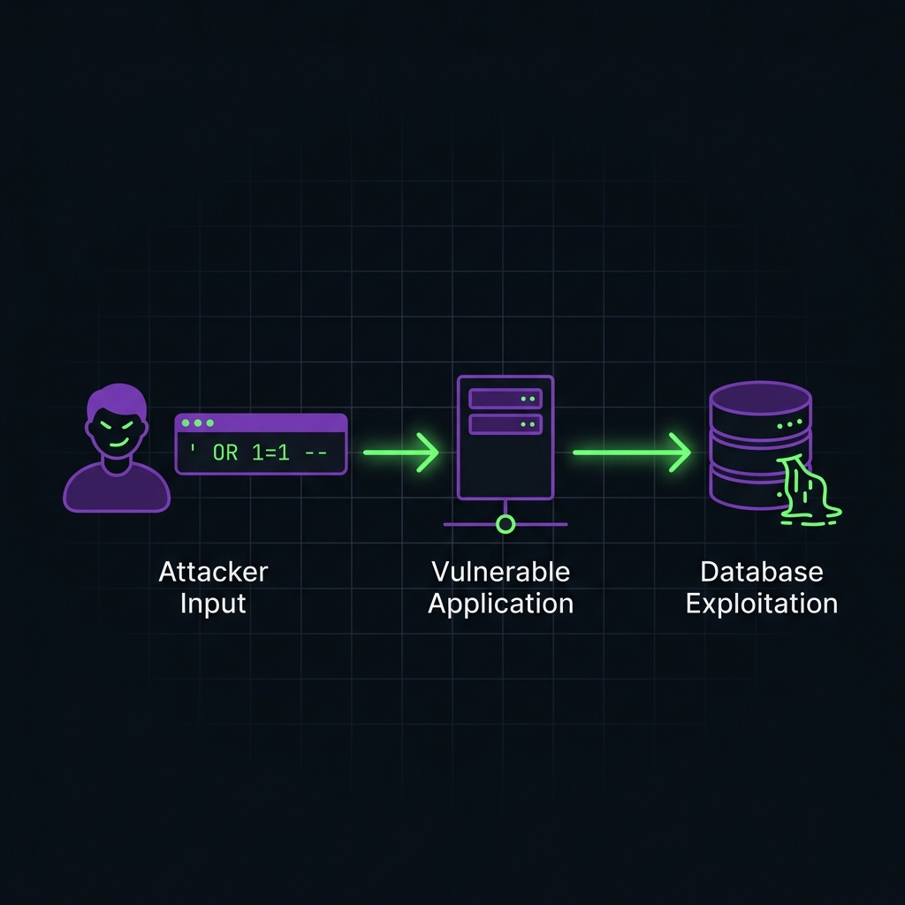
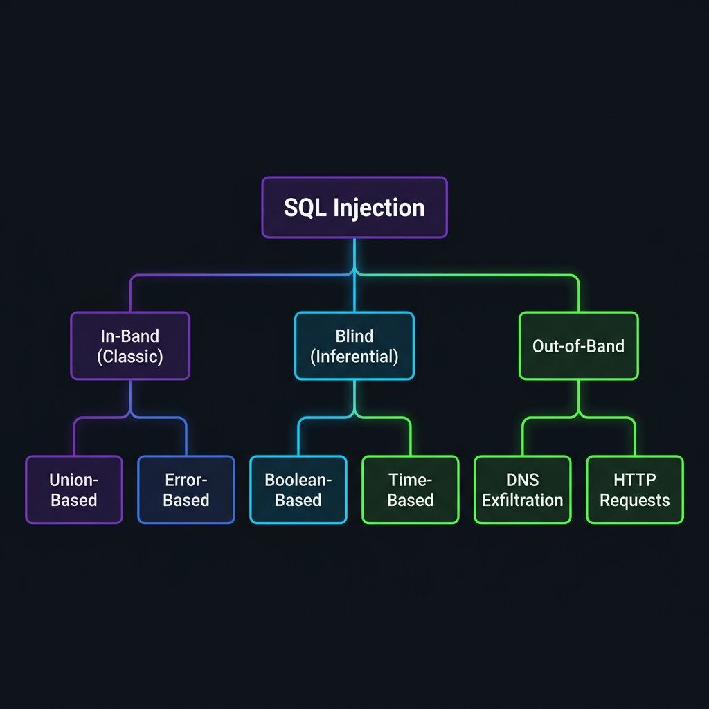

# SQL Injection — Overview

!!! danger "OWASP Top 10 — A03:2021 Injection"

    SQL Injection (SQLi) has been a fixture on the OWASP Top 10 since its inception. It remains one of the most critical and prevalent web application vulnerabilities in existence. A single successful SQLi attack can compromise an entire database, exfiltrate millions of records, modify or destroy data, bypass authentication, and in some cases lead to full operating system compromise.



---

## What Is SQL Injection?

**SQL Injection** occurs when an attacker is able to insert or "inject" a malicious SQL query into the input data that the application passes to its back-end database. When the application blindly trusts user-supplied input and concatenates it directly into SQL statements without proper sanitization, the attacker can manipulate the database query's logic to:

- **Bypass authentication** — log in as any user without knowing the password
- **Exfiltrate data** — read sensitive data such as credentials, credit cards, PII
- **Modify or delete data** — alter records, drop tables, or corrupt data integrity
- **Execute administrative operations** — shut down the DBMS, create new users
- **Read/write files on the OS** — using database features like `LOAD_FILE()` or `INTO OUTFILE`
- **Execute OS commands** — achieve Remote Code Execution (RCE) via `xp_cmdshell` (MSSQL), UDFs (MySQL), etc.

### The Root Cause

The fundamental problem is **mixing code (SQL) with data (user input)** in the same channel:

```sql title="Vulnerable Query — String Concatenation"
-- The application builds this query:
SELECT * FROM users WHERE username = '" + userInput + "' AND password = '" + passInput + "'"
```

When a user submits `admin` and `password123`, the query becomes:

```sql title="Legitimate Query"
SELECT * FROM users WHERE username = 'admin' AND password = 'password123'
```

But when an attacker submits `' OR 1=1 --` as the username:

```sql title="Injected Query — Authentication Bypass"
SELECT * FROM users WHERE username = '' OR 1=1 --' AND password = ''
```

The `OR 1=1` condition is always true, and the `--` comments out the rest of the query. The database returns **all rows** from the `users` table, and the application logs the attacker in as the first user (often `admin`).

---

## Types of SQL Injection

SQL Injection attacks are classified based on **how the attacker retrieves data** from the database. Understanding the taxonomy is critical for choosing the right exploitation technique.



### 1. In-Band SQLi (Classic)

The attacker uses the **same communication channel** to both inject the payload and retrieve results. This is the most common and easiest to exploit.

- **Union-Based**: Leverages the `UNION SQL` operator to combine the results of the attacker's injected query with the results of the original query, displaying exfiltrated data directly in the application's response.
- **Error-Based**: Forces the database to generate error messages that **leak information** about the database structure and data within the error output.

### 2. Blind SQLi (Inferential)

The attacker **cannot see the query output** directly in the application's response. Instead, the attacker infers information by observing the application's **behavior** — either a change in page content or a measurable time delay.

- **Boolean-Based**: The attacker sends a payload that causes the application to return a **different response** depending on whether the injected condition evaluates to `TRUE` or `FALSE`.
- **Time-Based**: When the application gives **no visible difference** between true and false responses, the attacker measures the **response time** to infer truth.

### 3. Out-of-Band SQLi

The attacker forces the database to make an **external network request** (DNS lookup, HTTP request) to an attacker-controlled server, carrying the exfiltrated data. This is useful when in-band and blind techniques fail.

---

## Real-World Impact

| Year | Incident | Records Exposed | Attack Vector |
|---|---|---|---|
| 2008 | **Heartland Payment Systems** | 134 million credit cards | SQL Injection |
| 2011 | **Sony PlayStation Network** | 77 million accounts | SQL Injection |
| 2012 | **LinkedIn** | 6.5 million password hashes | SQL Injection |
| 2014 | **TalkTalk** | 157,000 customer records | SQL Injection |
| 2015 | **VTech** | 6.4 million children's profiles | SQL Injection |
| 2019 | **Fortnite** | 200 million accounts (potential) | SQL Injection |

---

## References

- [OWASP SQL Injection](https://owasp.org/www-community/attacks/SQL_Injection)
- [PortSwigger SQL Injection Labs](https://portswigger.net/web-security/sql-injection)
- [HackTricks — SQL Injection](https://book.hacktricks.wiki/en/pentesting-web/sql-injection/index.html)
- [PayloadsAllTheThings — SQL Injection](https://github.com/swisskyrepo/PayloadsAllTheThings/tree/master/SQL%20Injection)
- [PentestMonkey — SQL Injection Cheatsheets](https://pentestmonkey.net/category/cheat-sheet/sql-injection)
