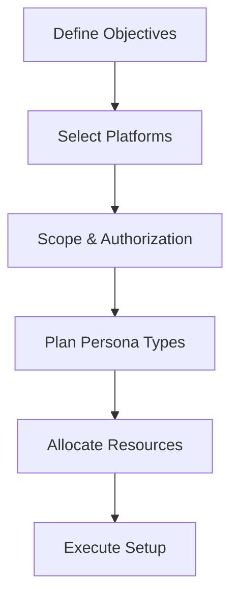
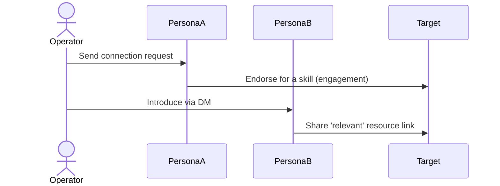

In red-teaming and penetration testing, **sock puppets** are fictitious online personae used to mask the tester’s real identity and simulate adversary social-engineering tactics. By blending seamlessly into target environments—social media platforms, internal forums, or industry-specific networks—they provide access to information and human responses that purely technical means cannot reach.

---

## Objectives

- **Assess Human Vulnerabilities** through tailored phishing or pretexting campaigns.  
- **Test Security Controls** such as email filters, monitoring, and identity verification.  
- **Gather Covert Intelligence** from closed groups or restricted channels.  
- **Simulate Real-World Attacks** like targeted spear-phishing or multi-persona impersonation.  

---

## Planning & Scoping

Before building any sock puppet, define clear **engagement parameters** and obtain written authorization outlining allowed tactics and targets. Determine which platforms (LinkedIn, Facebook, Slack workspaces, etc.) your personas must infiltrate based on the target’s digital footprint. Establish success criteria—for example, click-through rates on phishing links or depth of forum information extracted.

---

## Persona Crafting

1. **Identity Blueprint**  
   - Generate realistic names and demographics using tools like [Fake Name Generator](https://www.fakenamegenerator.com/).  
   - Align age, occupation, and interests to the platform’s typical user base.

2. **Profile Imagery**  
   - Use AI-generated faces from [ThisPersonDoesNotExist.com](https://thispersondoesnotexist.com) to avoid reverse-image detection.  
   - Scrub image metadata before upload.

3. **Backstory & Consistency**  
   - Draft a multi-paragraph bio outlining education, career history, and hobbies.  
   - Seed early posts or interactions that reflect those interests (forum comments, retweets).

---

## Account Setup & Enrichment

- **Email Addresses**: Register through privacy-focused providers (ProtonMail, Tutanota) without phone verification.  
- **Phone Verification**: Obtain burner SIMs (e.g., Mint Mobile trial) with a VPN-spoofed location.  
- **Social Graph Building**:  
  - Connect with peripheral users first (industry alumni groups, open forums).  
  - Gradually add high-value targets once the account appears seasoned.  
- **Cross-Platform Consistency**: Use the same backstory across LinkedIn, Twitter, and GitHub for cohesion.

---

## Operational Security (OPSEC)

- **Isolated Environments**: Run all sock-puppet work inside dedicated VMs or separate hardware to prevent bleed-over.  
- **Network Anonymity**: Always use reputable VPNs or proxy chains matching your persona’s claimed locale.  
- **Artifact Sanitization**: Regularly clear cookies, local storage, and cached credentials.  
- **Logging & Documentation**: Keep encrypted logs of interactions, credentials, and IP rotations for post-engagement review.

---

## Deployment & Infiltration Techniques

### Spear-Phishing via Trusted Persona  
Use a puppet posing as a recruiter or partner to send personalized invitations and follow-ups, leveraging prior reconnaissance to reference shared connections or projects.

### Closed-Group Recon  
After joining invite-only forums, observe discussion threads for keywords, then chime in with helpful commentary to build rapport.

---

## Advanced Multi-Persona Attacks

In **Multi-Persona Impersonation (MPI)**, multiple sock puppets interact publicly to simulate an organic conversation, increasing credibility before a final malicious action (e.g., payload delivery). Rotate each persona’s IP and device fingerprint via proxy pools to reduce correlation risk. Stagger login times and activity patterns to mimic realistic behavior across time zones.

---

## Real-World Examples

### Example 1: TA453 Multi-Persona Impersonation (September 2022)  
In mid-2022, the Iran-aligned group TA453 deployed **Multi-Persona Impersonation** on email threads, CC’ing multiple fake personas to exploit social proof and lure targets into malicious OneDrive links containing credential-harvesting macros citeturn0search0 citeturn0search3.

### Example 2: XZ Utils Supply-Chain Tampering (April 2022)  
Attackers used sock-puppet developer accounts on GitHub to submit benign-looking code updates to **XZ Utils**, later embedding a backdoor (“XZ Trojan”) that executed on Linux systems relying on the library citeturn0search4 citeturn0search6.

### Example 3: Facebook Catfishing Campaign (2021–2022)  
Multiple sock-puppet profiles on Facebook posed as industry professionals to befriend U.S. military and defense personnel, sharing malware-laden links before Facebook’s takedown, illustrating long-term credential theft efforts citeturn0search1 citeturn0search3.

### Example 4: Lazarus Group LinkedIn Recruiting Scam (February 2025)  
North Korea’s Lazarus Group crafted fake LinkedIn recruiter profiles offering crypto-related job roles, harvesting CVs or GitHub links, then delivering obfuscated scripts that dynamically loaded info-stealing malware targeting developer environments citeturn1search0 citeturn1search3.

### Example 5: Ghost Network Inflating GitHub Repository Popularity  
A clandestine network of over 3,000 sock-puppet GitHub accounts (“Stargazer Goblin”) automated stars and forks to boost malicious repositories’ visibility, distributing Windows malware through community trust mechanisms citeturn0news75 citeturn1search6.

---

## Detection & Mitigation

Blue teams can flag sock puppets by correlating:  
- **Writing Patterns**: Stylometry and writing inconsistencies.  
- **Behavioral Anomalies**: Unrealistic activity bursts or connection patterns.  
- **Technical Indicators**: Shared IPs, OS fingerprints, or reused profile images.  

Implement AI-driven detection tools to cluster suspicious accounts by behavioral similarity and alert on potential sock-puppet networks.

---

## Ethical & Legal Considerations

- **Written Consent**: Always operate under signed agreements detailing scope and methods.  
- **Privacy Compliance**: Avoid harvesting personal data beyond engagement parameters.  
- **Transparency & Reporting**: Document each step so findings can be independently verified.  
- **Scope Adherence**: Do not extend personas beyond the engagement or for real-world fraud.

---

## Useful References:

 - [Creating an Effective Sock Puppet for OSINT Investigations – Introduction](https://web.archive.org/web/20210125191016/https://jakecreps.com/2018/11/02/sock-puppets/)
 - [The Art Of The Sock](https://www.secjuice.com/the-art-of-the-sock-osint-humint/)
 - [Reddit - My process for setting up anonymous sockpuppet accounts](https://www.reddit.com/r/OSINT/comments/dp70jr/my_process_for_setting_up_anonymous_sockpuppet/)
 - [Fake Name Generator](https://www.fakenamegenerator.com/)
 - [This Person Does not Exist](https://www.thispersondoesnotexist.com/)
 - [Privacy.com](https://privacy.com/)

---

## Conclusion

By meticulously planning, crafting authentic personae, maintaining strict OPSEC, employing layered infiltration tactics, and learning from real-world breaches, red teams can simulate sophisticated adversaries, expose human-centric vulnerabilities, and strengthen organizational security postures.

