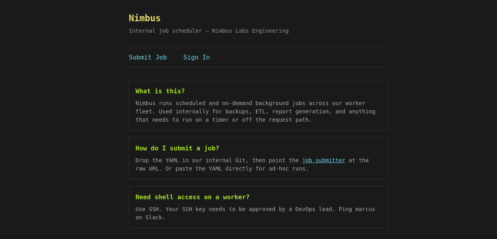

```shell
nmap -sC -sV -T4 -oA reports/nimbus_ 10.129.19.103
```

```
ost is up (0.22s latency).
Not shown: 998 closed tcp ports (reset)
PORT   STATE SERVICE VERSION
22/tcp open  ssh     OpenSSH 9.6p1 Ubuntu 3ubuntu13.16 (Ubuntu Linux; protocol 2.0)
| ssh-hostkey: 
|   256 eb:ab:8f:be:99:02:0b:3e:c4:1c:83:b2:66:2f:17:13 (ECDSA)
|_  256 c1:69:ab:84:f3:88:8b:b3:8a:ae:e2:28:35:54:35:0b (ED25519)
80/tcp open  http    nginx 1.24.0 (Ubuntu)
|_http-title: Did not follow redirect to http://nimbus.htb/
|_http-server-header: nginx/1.24.0 (Ubuntu)
Service Info: OS: Linux; CPE: cpe:/o:linux:linux_kernel
```

```shell
┌──(kali㉿kali)-[~/htb/nimbus]
└─$ curl -I http://10.129.19.103                         
HTTP/1.1 301 Moved Permanently
Server: nginx/1.24.0 (Ubuntu)
Date: Sun, 21 Jun 2026 07:29:11 GMT
Content-Type: text/html
Content-Length: 178
Connection: keep-alive
Location: http://nimbus.htb/
```

```shell
┌──(kali㉿kali)-[~/htb/nimbus]
└─$ echo "10.129.19.103   nimbus.htb" | sudo tee /etc/hosts
[sudo] password for kali: 
10.129.19.103   nimbus.htb

```




