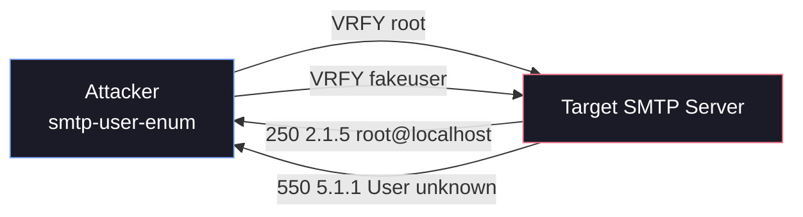

# 📧 Email Services Footprinting (SMTP, POP3, IMAP)

Footprinting email services is a critical reconnaissance phase when assessing an organization's external or internal infrastructure. By interacting with email protocols, attackers can identify mail server software, exact versions, supported authentication mechanisms, and often enumerate valid OS-level user accounts or email addresses.

Misconfigured mail servers can inadvertently leak sensitive information, which serves as a foundation for subsequent attacks like password spraying, brute-forcing, or targeted phishing.

This guide covers enumeration for the three primary email protocols:
- **SMTP** (Ports 25, 465, 587) - Sending mail
- **IMAP** (Ports 143, 993) - Receiving/syncing mail
- **POP3** (Ports 110, 995) - Receiving mail

---

## 1. SMTP Footprinting & Enumeration

### Banner Grabbing & Manual Interaction
The first step is identifying the underlying software (e.g., Postfix, Sendmail, Microsoft Exchange).

**Using Netcat:**
```bash
nc -nv 10.10.10.25 25
```
*Expected Output:*
```text
(UNKNOWN) [10.10.10.25] 25 (smtp) open
220 mail.megacorp.local ESMTP Postfix (Ubuntu)
```

**Manual User Enumeration:**
Once connected, you can manually issue SMTP commands to verify if a user exists.
1. **VRFY (Verify):** Asks the server to confirm if a specific username is valid (`VRFY root`).
2. **EXPN (Expand):** Attempts to reveal members of a mailing list (`EXPN admin`).
3. **RCPT TO:** Used to test if the server accepts a specific recipient (`RCPT TO:<admin>`). Requires sending `HELO` and `MAIL FROM` first.

### smtp-user-enum
`smtp-user-enum` is a classic command-line tool used by penetration testers to identify valid OS-level user accounts by iterating through a wordlist using the aforementioned commands.

#### How It Works
The tool connects to the SMTP port and systematically feeds a list of potential usernames. Depending on the server's configuration, it will return different status codes (e.g., `250 OK`, `252 Cannot VRFY user`, or `550 User unknown`). `smtp-user-enum` parses these to determine if the username exists.



#### Basic Usage & Syntax
```bash
smtp-user-enum [options] (-u username | -U file-of-usernames) (-t host | -T file-of-targets)
```

**Key Options**

| Flag | Description | Example |
| :--- | :--- | :--- |
| `-M` | Method to use (`VRFY`, `EXPN`, `RCPT`) | `-M RCPT` |
| `-u` | Single username to test | `-u admin` |
| `-U` | File containing a list of usernames | `-U users.txt` |
| `-t` | Single target IP or hostname | `-t 10.10.10.25` |
| `-m` | Maximum concurrent processes | `-m 15` |
| `-D` | Append a domain to usernames | `-D example.com` |

#### Practical Examples
**Example 1: Bulk Enumeration with a Wordlist (RCPT TO)**
This is the most common real-world scenario, bypassing disabled `VRFY` commands by using `RCPT TO`.
```bash
smtp-user-enum -M RCPT -U names.txt -t 10.10.10.50 -m 10
```

**Example 2: Guessing Full Email Addresses**
Use the `-D` flag to automatically append the domain.
```bash
smtp-user-enum -M VRFY -U names.txt -t 10.10.10.50 -D megacorp.local
```

### Nmap Scripting Engine (NSE)
**Service & Version Detection:**
```bash
nmap -sV -p 25,465,587 10.10.10.25
```

**Checking Supported Commands:**
```bash
nmap --script smtp-commands -p 25 10.10.10.25
```

**Automated User Enumeration:**
```bash
nmap --script smtp-enum-users -p 25 10.10.10.25
```

### Advanced Testing with Swaks
**Swaks** (Swiss Army Knife for SMTP) is incredibly powerful for deep SMTP transaction testing, far superior to `netcat` when dealing with TLS or authentication.

**Testing STARTTLS:**
```bash
swaks --to user@example.com --server 10.10.10.25 --tls
```

**Testing Authentication Capabilities:**
```bash
swaks --to user@example.com --server 10.10.10.25 --auth
```

---

## 2. IMAP & POP3 Footprinting

While SMTP is used for sending, IMAP and POP3 are used for retrieving mail. These services are prime targets for banner grabbing, identifying supported authentication mechanisms, and brute-force attacks.

### Banner Grabbing & Capabilities

**Using Netcat (Plaintext Ports):**
```bash
# POP3 (Port 110)
nc -nv 10.10.10.25 110
# Wait for banner, then type: CAPA

# IMAP (Port 143)
nc -nv 10.10.10.25 143
# Wait for banner, then type: a1 CAPABILITY
```
*The capabilities list reveals supported authentication methods (e.g., `AUTH=PLAIN`, `AUTH=LOGIN`, `CRAM-MD5`).*

**Using OpenSSL (Encrypted Ports):**
Modern servers heavily rely on SSL/TLS over ports 993 (IMAPS) and 995 (POP3S). `netcat` won't work here; you must use `openssl`.

```bash
# IMAP over SSL (Port 993)
openssl s_client -connect 10.10.10.25:993 -crlf

# POP3 over SSL (Port 995)
openssl s_client -connect 10.10.10.25:995 -crlf
```

### Automated Discovery (Nmap)

**Version and Capability Detection:**
```bash
nmap -sV -sC -p 110,143,993,995 10.10.10.25
```

**Targeted Scripts:**
```bash
nmap -p143,993 --script imap-capabilities <target>
nmap -p110,995 --script pop3-capabilities <target>
```

### Authentication & Brute-Forcing

Because IMAP and POP3 are authentication-focused, they are frequently targeted for password spraying or brute-forcing if no rate limiting is applied.

**Using Hydra:**
```bash
# Brute-force IMAP
hydra -L users.txt -P passwords.txt <target> imap

# Brute-force POP3
hydra -L users.txt -P passwords.txt <target> pop3
```

**Using Metasploit:**
```bash
msfconsole
use auxiliary/scanner/imap/imap_login
use auxiliary/scanner/pop3/pop3_login
set RHOSTS 10.10.10.25
set USER_FILE users.txt
set PASS_FILE passwords.txt
run
```

---

## 3. Limitations & Defensive Countermeasures

### Attacker Limitations
1. **Catch-All Configurations (SMTP):** If a server accepts all incoming mail regardless of the user prefix, enumeration tools will report every user in the wordlist as valid.
2. **Rate Limiting / Fail2Ban:** Aggressive scanning or brute-forcing will trigger intrusion prevention systems, resulting in an IP ban.
3. **NDR Bouncing:** Exchange environments may return a generic `250 OK` for all `RCPT TO` requests, only to bounce the email later (Non-Delivery Report).

### Defensive Mitigations
- **Disable VRFY and EXPN:** Ensure these are disabled in your MTA (e.g., Postfix `disable_vrfy_command = yes`).
- **Implement Rate Limiting:** Prevent rapid, sequential connections or login attempts from a single IP.
- **Tarpitting:** Introduce intentional delays for excessive requests or invalid recipients.
- **Require Strong Authentication & Encryption:** Enforce STARTTLS/SMTPS, IMAPS, and POP3S. Disable plaintext authentication mechanisms (`AUTH PLAIN` over non-TLS connections).
