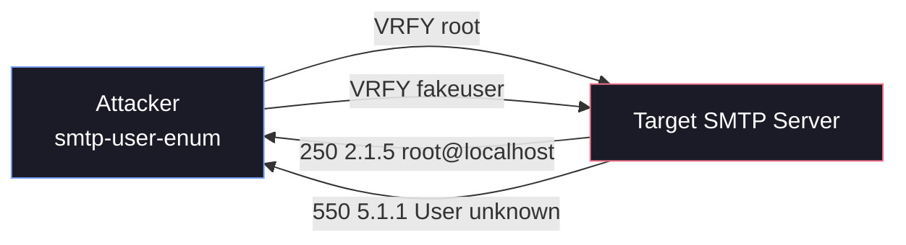

# 📧 smtp-user-enum: SMTP User Enumeration

`smtp-user-enum` is a classic command-line tool used by penetration testers and red teamers to identify valid OS-level user accounts on target mail servers. It operates by interacting with the SMTP service (typically port 25) and analyzing the server's responses to specific SMTP commands.

If a server is misconfigured or lacks proper hardening, an attacker can use this tool to rapidly build a list of valid usernames, which can then be used in subsequent password spraying or brute-force attacks.

## 1. How It Works

The tool connects to the SMTP port and systematically feeds a list of potential usernames to the server using one of three SMTP commands: `VRFY`, `EXPN`, or `RCPT TO`.

Depending on the server's configuration, it will return different status codes (e.g., `250 OK`, `252 Cannot VRFY user`, or `550 User unknown`). `smtp-user-enum` parses these responses to determine if the username exists.



## 2. The Three Enumeration Methods

`smtp-user-enum` supports three distinct methods, specified using the `-M` flag. 

### VRFY (Verify)
The `VRFY` command is explicitly designed to verify if a user mailbox exists.
- **Usage:** `-M VRFY` (This is the default mode)
- **Status:** Often disabled on modern, hardened mail servers due to the obvious security implications.

### EXPN (Expand)
The `EXPN` command asks the server to expand a mailing list or alias. If you provide a valid username instead of an alias, some servers will still return the user's information.
- **Usage:** `-M EXPN`
- **Status:** Also frequently disabled on modern servers.

### RCPT TO (Recipient To)
This is the most reliable method against modern servers. It mimics the behavior of sending an actual email. The tool initiates a mail transaction (`MAIL FROM`) and then attempts to set the recipient (`RCPT TO`). If the server rejects the `RCPT TO` command, the user likely doesn't exist.
- **Usage:** `-M RCPT`
- **Status:** Often works even when `VRFY` and `EXPN` are disabled, though some servers implement "catch-all" configurations or delay validation to defeat this technique.

## 3. Basic Usage & Syntax

The basic syntax requires specifying a method, a username (or list of usernames), and a target host.

```bash
smtp-user-enum [options] (-u username | -U file-of-usernames) (-t host | -T file-of-targets)
```

### Key Options

| Flag | Description | Example |
| :--- | :--- | :--- |
| `-M` | Method to use (`VRFY`, `EXPN`, `RCPT`) | `-M RCPT` |
| `-u` | Single username to test | `-u admin` |
| `-U` | File containing a list of usernames | `-U users.txt` |
| `-t` | Single target IP or hostname | `-t 10.10.10.25` |
| `-T` | File containing a list of target IPs | `-T targets.txt` |
| `-m` | Maximum concurrent processes (Default: 5) | `-m 15` |
| `-D` | Append a domain to usernames (e.g., user@domain) | `-D example.com` |
| `-p` | Specify a custom port (Default: 25) | `-p 2525` |
| `-w` | Wait time in seconds per query | `-w 2` |

## 4. Practical Examples

### Example 1: Verifying a Single User (VRFY)
If you just want to check if a default account like `root` or `admin` exists:

```bash
smtp-user-enum -M VRFY -u root -t 10.10.10.50
```

**Expected Output:**
```text
Starting smtp-user-enum v1.2 ( http://pentestmonkey.net/tools/smtp-user-enum )

 ----------------------------------------------------------
|                   Scan Information                       |
 ----------------------------------------------------------
...
10.10.10.50: root exists
...
```

### Example 2: Bulk Enumeration with a Wordlist (RCPT TO)
This is the most common real-world scenario. You have a wordlist (`names.txt`) and want to test it against a target, bypassing disabled `VRFY` commands by using `RCPT TO`. We also increase the threads to `10` for speed.

```bash
smtp-user-enum -M RCPT -U names.txt -t 10.10.10.50 -m 10
```

### Example 3: Guessing Full Email Addresses
Sometimes a server requires the full email address format rather than just the OS username. Use the `-D` flag to automatically append the domain.

```bash
smtp-user-enum -M VRFY -U names.txt -t 10.10.10.50 -D megacorp.local
```
*(This will test `admin@megacorp.local`, `root@megacorp.local`, etc.)*

## 5. Alternatives & Limitations

### Limitations
1. **Catch-All Servers:** If the SMTP server is configured to accept all incoming mail regardless of whether the user exists (a "catch-all" address), `smtp-user-enum` will report *every* user in your wordlist as valid.
2. **Rate Limiting:** Aggressive scanning can trigger fail2ban or similar intrusion prevention systems, temporarily banning your IP. Use the `-w` flag or throttle your connections if needed.
3. **Hardened Servers:** Modern Exchange or Postfix configurations often reject all enumeration attempts by returning a generic `250 OK` for the initial transaction and bouncing the email later (NDR).

### Alternative Tools
If `smtp-user-enum` isn't available or you prefer other frameworks:

- **Nmap:** 
  ```bash
  nmap -p 25 --script smtp-enum-users <target>
  ```
- **Metasploit:**
  ```bash
  use auxiliary/scanner/smtp/smtp_enum
  set RHOSTS <target>
  set USER_FILE <path_to_wordlist>
  run
  ```

## 6. Defensive Countermeasures

If you are defending a network, you should disable these features unless explicitly required:

- **Disable VRFY and EXPN:** In Postfix, ensure `disable_vrfy_command = yes` is set in `main.cf`.
- **Implement Catch-All or Tarpitting:** Configure the server to return consistent responses for both valid and invalid users, or introduce intentional delays (tarpitting) for excessive requests to ruin the feasibility of brute-force enumeration.
