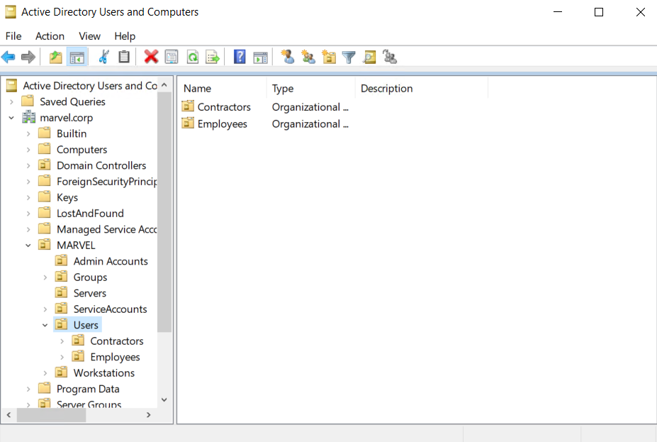

## Active Directory Overview

`Active Directory ( AD )` is a directory service for Windows network environments. It is a distributed, hierarchical structure that allows for centralized management of an organization’s resources, including users, computers, groups, network devices and file shares, group policies, servers and workstations, and trusts. AD provides authentication and authorization functions within a Windows domain environment. It was first shipped with Windows Server 2000; it has come under increasing attack in recent years. Designed to be backward-compatible, and many features are arguably not “secure by default,” and it can be easily misconfigured.

This can be leveraged to move laterally and vertically within a network and gain unauthorized access. AD is essentially a large database accessible to all users within the domain, regardless of their privilege level. A basic AD user account with no added privileges can be used to enumerate the majority of objects contained within AD, including but not limited to:

 - Domain Computers
 - Domain Users
 - Domain Group Information
 - Default Domain Policy
 - Domain Functional Levels
 - Password Policy
 - Group Policy Objects (GPOs)
 - Kerberos Delegation
 - Domain Trusts
 - Access Control Lists (ACLs)

This data will paint a clear picture of the overall security posture of an Active Directory environment. It can be used to quickly identify misconfigurations, overly permissive policies, and other ways of escalating privileges within an AD environment. Many attacks exist that merely leverage AD misconfigurations, bad practices, or poor administration, such as:

 - Kerberoasting / ASREPRoasting
 - NTLM Relaying
 - Network traffic poisoning
 - Password spraying
 - Kerberos delegation abuse
 - Domain trust abuse
 - Credential theft
 - Object control

Hardening Active Directory, along with a strong patching and configuration management policy, and proper network segmentation should be prioritized. If an environment is tightly managed and an adversary can gain a foothold and bypass EDR or other protections, proper management of AD can prevent them from escalating privileges, moving laterally, and getting
to the crown jewels. Proper controls will help slow down an attacker and potentially force them to become noisier and risk detection.

## Active Directory Structure

Active Directory is arranged in a hierarchical tree structure, with a forest at the top containing one or more domains, which can themselves contain nested subdomains. A forest is the security boundary within which all objects are under administrative control. A forest may contain multiple domains, and a domain may contain further child or sub-domains. A domain is a structure within which contained objects (users, computers, and groups) are accessible. Objects are the most basic unit of data in AD.

It contains many built-in `Organizational Units` ( `OU` s), such as “Domain Controllers,”, “Users,” and “Computers,” and new `OU` s can be created as required. OU s may contain objects and sub-OUs, allowing for assignment of different group policies.

We can see this structure graphically by opening `Active Directory Users and Computers` on a Domain Controller. In our lab domain `marvel.corp` , we see various OUs such as Admin Accounts, Groups, Users, Servers, Service Accounts, Users, Workstations , etc. Many of these OUs have OUs nested within them, such as the Employees and Contractors OU under Users . This helps maintain a clear and coherent structure within Active Directory, which is especially important as we add Group Policy Objects (GPOs) to enforce settings throughout the domain.

Understanding the structure of Active Directory is paramount to perform proper enumeration and uncover the flaws and misconfigurations that sometimes have gone missed in an environment for many years.

## Why Enumerate AD?

As penetration testers, enumeration is one of, if not the most important, skills we must master. When starting an assessment in a new network gaining a comprehensive inventory of the environment is extremely important. The information gathered during this phase will inform our later attacks and even post-exploitation. Given the prevalence of AD in corporate networks, we will likely find ourselves in AD environments regularly, and therefore, it is important to hone our enumeration process. There are many tools and techniques to help with AD enumeration, which we will cover in-depth in this module and subsequent modules; however, before using these tools, it is important to understand the reason for performing detailed AD enumeration.

Whether we perform a penetration test or targeted AD assessment, we can always go above and beyond and provide our clients with extra value by giving them a detailed picture of their AD strengths and weaknesses. Corporate environments go through many changes over the years, adding and removing employees and hosts, installing software and applications that require changes in AD, or corporate policies that require GPO changes. These changes can introduce security flaws through misconfiguration, and it is our job as assessors to find these flaws, exploit them, and help our clients fix them.

## Getting Started

Once we have a foothold in an AD environment, we should start by gathering several key pieces of information, including but not limited to:

 - The domain functional level
 - The domain password policy
 - A full inventory of AD users
 - A full inventory of AD computers
 - A full inventory of AD groups and memberships
 - Domain trust relationships
 - Object ACLs
 - Group Policy Objects (GPO) information
 - Remote access rights

With this information in hand, we can look for any "quick wins" such as our current user or the entire Domain Users group having RDP and/or local administrator access to one or more hosts. This is common in large environments for many reasons, one being the
improper use of jump hosts and another being Citrix server Remote Desktop Services (RDS) misconfigurations. We should also check what rights our current user has in the domain. Are they a member of any privileged groups? Do they have any special rights delegated? Do they have any control over another domain object such as a user, computer, or GPO?

The enumeration process is iterative. As we move through the AD environment, compromising hosts and users, we will need to perform additional enumeration to see if we have gained any further access to help us reach our goal.

## Rights and Privileges in AD

AD contains many groups that grant their members powerful rights and privileges. Many of these can be abused to escalate privileges within a domain and ultimately gain Domain Admin or SYSTEM privileges on a Domain Controller (DC). Some of these groups are listed below.

